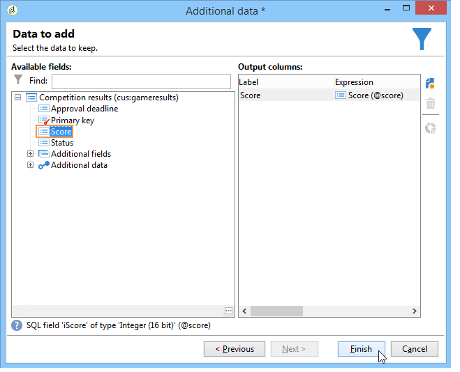
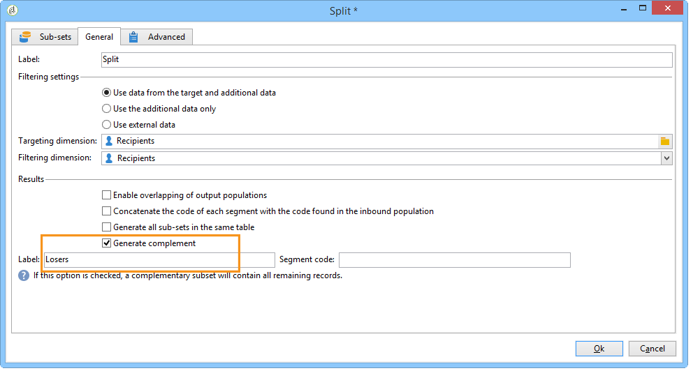

# 데이터 강화{#enriching-data}

## 데이터 강화 기본 정보 {#about-enriching-data}

이 사용 사례에서는 타기팅 워크플로우에서 **[!UICONTROL Enrichment]** 활동을 사용할 수 있는 방법을 자세히 설명합니다. **[!UICONTROL Enrichment]** 활동 사용에 대한 자세한 내용은 [데이터 보강](enrichment.md)을 참조하세요.

사용자 지정 날짜를 사용하여 전자 메일 게재를 보강하는 방법에 대한 사용 사례는 [이 섹션](email-enrichment-with-custom-date-fields.md)에서도 확인할 수 있습니다.

마케팅 데이터베이스의 연락처에게는 웹 애플리케이션을 통해 대회 참가 초대장이 전송됩니다. 대회 결과는 **[!UICONTROL Competition results]** 테이블에서 복구됩니다. 이 테이블은 연락처 테이블(**[!UICONTROL Recipients]**)에 연결되어 있습니다. **[!UICONTROL Competition results]** 테이블에는 다음 필드가 포함되어 있습니다.

* 경쟁업체 이름(@game)
* 체험판 번호(@trial)
* 점수(@score)

**[!UICONTROL Recipients]** 테이블에 있는 연락처를 **[!UICONTROL Competition results]** 테이블의 여러 줄에 연결할 수 있습니다. 이 두 테이블 간의 관계는 1-n 형식입니다. 다음은 수신자에 대한 결과 로그의 예입니다.

이 사용 사례의 목적은 가장 높은 점수에 따라 최신 대회에 참가한 사람에게 개인화된 게재를 보내는 것입니다. 가장 높은 점수를 받은 수상자는 1등, 두 번째로 높은 점수를 받은 수상자는 위로금을 받고, 그 외의 모든 수상자는 다음 번에 더 좋은 행운을 기원하는 메시지를 받습니다.

이 사용 사례를 설정하기 위해 다음과 같은 타겟팅 워크플로우를 만들었습니다.

워크플로우를 만들려면 다음 단계를 적용합니다.

1. 두 개의 **[!UICONTROL Query]** 활동과 하나의 **[!UICONTROL Intersection]** 활동이 추가되어 마지막으로 대회에 참가한 새 구독자를 타겟팅합니다.
1. **[!UICONTROL Enrichment]** 활동은 **[!UICONTROL Competition results]** 테이블에 저장된 데이터를 추가하는 데 사용됩니다. 게재 개인화를 수행할 **[!UICONTROL Score]** 필드가 워크플로우의 작업 테이블에 추가됩니다.
1. **[!UICONTROL Split]** 형식 활동은 점수를 기반으로 받는 사람 하위 집합을 만드는 데 사용됩니다.
1. 각 하위 집합에 대해 **[!UICONTROL Delivery]** 활동이 추가됩니다.

## 1단계: 타깃팅 {#step-1--targeting}

첫 번째 쿼리는 지난 6개월 내에 데이터베이스에 추가된 수신자를 타겟팅하는 데 사용됩니다.

두 번째 쿼리는 마지막 대회에 참가한 수신자를 타겟팅하는 데 사용됩니다.

그런 다음 지난 6개월 내에 데이터베이스에 추가된 수신자와 마지막 경쟁에 참여한 수신자를 타겟팅하기 위해 **[!UICONTROL Intersection]** 유형 활동이 추가됩니다.

## 2단계: 데이터 보강 {#step-2--enrichment}

이 예제에서는 **[!UICONTROL Competition results]** 테이블에 저장된 **[!UICONTROL Score]** 필드에 따라 게재를 개인화하는 방법을 알아봅니다. 이 테이블은 수신자 테이블과 1-n 유형 관계입니다. **[!UICONTROL Enrichment]** 활동은 필터링 차원에 연결된 테이블의 데이터를 워크플로우의 작업 테이블에 추가하는 데 사용됩니다.

1. 데이터 보강 활동의 편집 화면에서 **[!UICONTROL Add data]**&#x200B;을(를) 선택한 다음 **[!UICONTROL Data linked to the filtering dimension]**&#x200B;을(를) 선택하고 **[!UICONTROL Next]**&#x200B;을(를) 클릭합니다.

   

1. **[!UICONTROL Data linked to the filtering dimension]** 옵션을 선택하고 **[!UICONTROL Competition results]** 테이블을 선택한 다음 **[!UICONTROL Next]**&#x200B;을(를) 클릭합니다.

   

1. ID와 레이블을 입력하고 **[!UICONTROL Data collected]** 필드에서 **[!UICONTROL Limit the line count]** 옵션을 선택합니다. **[!UICONTROL Lines to retrieve]** 필드에서 &#39;1&#39;을 값으로 선택합니다. 데이터 보강 활동은 각 받는 사람에 대해 **[!UICONTROL Competition results]** 테이블의 한 줄을 워크플로의 작업 테이블에 추가합니다. **[!UICONTROL Next]**&#x200B;를 클릭합니다.

   

1. 이 예제에서는 수신자의 가장 높은 점수를 복구하려고 하지만, 마지막 대회에서만 복구하려고 합니다. 이렇게 하려면 **[!UICONTROL Competition name]** 필드에 필터를 추가하여 이전 대회와 관련된 모든 줄을 제외합니다. **[!UICONTROL Next]**&#x200B;를 클릭합니다.

   

1. **[!UICONTROL Sort]** 화면으로 이동하여 **[!UICONTROL Add]** 단추를 클릭하고 **[!UICONTROL Score]** 필드를 선택한 다음 **[!UICONTROL descending]** 열의 확인란을 선택하여 **[!UICONTROL Score]** 필드의 항목을 내림차순으로 정렬합니다. 각 수신자에 대해 데이터 보강 활동은 마지막 게임의 가장 높은 점수와 일치하는 라인을 추가합니다. **[!UICONTROL Next]**&#x200B;를 클릭합니다.

   

1. **[!UICONTROL Data to add]** 창에서 **[!UICONTROL Score]** 필드를 두 번 클릭합니다. 데이터 보강 활동은 각 받는 사람에 대해 **[!UICONTROL Score]** 필드만 추가합니다. **[!UICONTROL Finish]**&#x200B;를 클릭합니다.

   

데이터 보강 활동의 인바운드 전환을 마우스 오른쪽 단추로 클릭하고 **[!UICONTROL Display the target]**&#x200B;을(를) 선택합니다. 작업 표에는 다음 데이터가 포함되어 있습니다.

연결된 스키마는 다음과 같습니다.

데이터 보강 활동의 아웃바운드 전환 시 이 작업을 갱신합니다. 수신자 점수와 연계된 데이터가 추가된 것을 알 수 있다. 각 수신자의 최고 점수가 복구되었습니다.

일치하는 스키마도 보강되었습니다.

## 3단계: 분할 및 게재 {#step-3--split-and-delivery}

점수를 기준으로 수신자를 정렬하려면 데이터 보강 후 **[!UICONTROL Split]** 활동이 추가됩니다.

1. 점수가 가장 높은 받는 사람을 포함하도록 첫 번째(**우승자**) 하위 집합이 정의되었습니다. 이렇게 하려면 레코드 수 제한을 정의하고 점수에 내림차순 정렬을 적용한 다음 레코드 수를 1로 제한합니다.

   

1. 두 번째(**두 번째**) 하위 집합에는 두 번째로 높은 점수를 받은 수신자가 포함됩니다. 구성은 첫 번째 하위 집합과 동일합니다.

   

1. 세 번째(**패자**) 하위 집합에는 다른 모든 수신자가 포함됩니다. **[!UICONTROL General]** 탭으로 이동하여 **[!UICONTROL Generate complement]** 상자를 선택하여 두 개의 최고 점수를 달성하지 못한 모든 수신자를 타겟팅합니다.

   

1. 각 하위 집합에 대해 서로 다른 게재 템플릿을 사용하여 **[!UICONTROL Delivery]** 형식 활동을 추가합니다.

   
