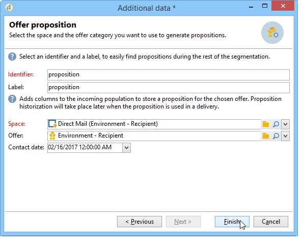

# 보강{#enrichment}


다음 **[!UICONTROL Enrichment]** 활동을 사용하면 프로필 목록에 정보를 추가하고 기존 표에 대한 링크를 추가할 수 있습니다(새 조인 만들기). 데이터베이스에 프로필이 있는 조정 기준도 정의할 수 있습니다.


## 정의 {#definitions}

데이터 보강 활동을 사용하려면 데이터를 추가할 때 사용할 수 있는 다양한 옵션에 익숙해야 합니다.


다음 **[!UICONTROL Data linked to the filtering dimension]** 옵션을 사용하면 다음에 액세스할 수 있습니다.

* 필터링 차원의 데이터: 작업 테이블 데이터에 액세스
* 필터링 차원에 연결된 데이터: 작업 테이블에 연결된 데이터에 액세스


다음 **[!UICONTROL A link]** 옵션을 사용하면 데이터베이스의 모든 테이블에 조인을 만들 수 있습니다.


링크에는 네 가지 유형이 있습니다.

* **[!UICONTROL Define a collection]**: 테이블 사이에 1-N 카디널리티가 있는 링크를 정의할 수 있습니다.
* **[!UICONTROL Define a link whose target is still available]**: 테이블 간에 1-1 카디널리티가 있는 링크를 정의할 수 있습니다. 조인 조건은 대상 테이블의 단일 레코드로 정의해야 합니다.
* **[!UICONTROL Define a link whose target does not necessarily exist in the base]**: 테이블 간에 0-1 카디널리티가 있는 링크를 정의할 수 있습니다. 조인 조건은 0 또는 1(최대)로 정의해야 합니다. 대상 테이블에 기록합니다.

  이 옵션은 **[!UICONTROL Simple Join]** 를 통해 액세스할 수 있는 탭 **[!UICONTROL Edit additional data]** 링크 **[!UICONTROL Enrichment]** 활동.

* **[!UICONTROL Define a link by searching for a reference among several options]**: 이 유형의 링크는 고유 레코드에 대한 조정을 정의합니다. Adobe Campaign은 고유 레코드에 대한 참조를 저장하기 위해 대상 테이블에 외래 키를 추가하여 대상 테이블에 대한 링크를 만듭니다.

  이 옵션은 **[!UICONTROL Reconciliation and deduplication]** 를 통해 액세스할 수 있는 탭 **[!UICONTROL Edit additional data]** 링크 **[!UICONTROL Enrichment]** 활동.

해당 컨텍스트에서 데이터 보강 활동의 운영에 대해 자세히 설명하는 사용 사례는 다음 섹션에서도 사용할 수 있습니다.

* [사용자 지정 날짜 필드를 사용한 전자 메일 강화](email-enrichment-with-custom-date-fields.md).
* [데이터 강화](enrich-data.md)
* [요약 목록 만들기](create-a-summary-list.md)

## 정보 추가 {#adding-information}

사용 **[!UICONTROL Enrichment]** 작업 테이블에 열을 추가하는 활동: 이 활동은 쿼리 활동을 보완하는 데 사용할 수 있습니다.

추가 열의 구성에 대해서는 다음에서 자세히 설명합니다. [데이터 추가 중](query.md#adding-data).

다음 **[!UICONTROL Primary set]** 필드를 사용하면 인바운드 전환을 선택할 수 있습니다. 이 활동의 작업 테이블 데이터가 보강됩니다.

다음을 클릭합니다. **[!UICONTROL Add data]** 연결할 데이터 유형을 선택하고 추가하십시오. 제공되는 데이터 유형 목록은 플랫폼에 설치된 모듈 및 옵션에 따라 다릅니다. 최소 구성에서는 항상 필터링 차원에 연결된 데이터와 링크를 추가할 수 있습니다.


아래 예에서 아웃바운드 전환은 타겟팅된 프로필의 나이에 대한 정보로 보강됩니다.


데이터 보강 활동의 인바운드 전환을 마우스 오른쪽 단추로 클릭하여 데이터 보강 단계 전에 데이터를 조회합니다.


작업 테이블에는 다음 데이터와 관련 스키마가 포함되어 있습니다.


데이터 보강 단계 출력에서 이 작업을 반복합니다.


프로필 나이 관련 데이터가 추가되었음을 알 수 있습니다.


일치하는 스키마도 보강되었습니다.

## 추가 데이터 관리 {#managing-additional-data}

선택 취소 **[!UICONTROL Keep all additional data from the main set]** 이전에 정의한 추가 데이터를 유지하지 않으려면 옵션을 선택합니다. 이 경우 데이터 보강 활동에서 선택한 추가 열만 송신 작업 표에 추가됩니다. 활동 업스트림에 추가된 추가 정보는 저장되지 않습니다.


데이터 보강 단계 출력의 데이터 및 스키마는 다음과 같습니다.


## 링크 만들기 {#creating-a-link}

데이터 보강 활동을 사용하여 작업 데이터와 Adobe Campaign 데이터베이스 간에 링크를 만들 수 있습니다. 이 링크는 인바운드 데이터 간의 워크플로우에 대한 로컬 링크입니다.

예를 들어, 계정 번호, 국가 및 수신자의 이메일이 포함된 파일의 데이터를 로드하는 경우 해당 프로필에서 이 정보를 업데이트하려면 국가 테이블에 대한 링크를 만들어야 합니다.

그렇게 하려면 다음 단계를 적용합니다.

1. 다음 유형의 파일을 수집하고 로드합니다.

   ```
   Account number;Country;Email
   18D65;FRANCE;agnes@gmail.com
   243PP;RUSSIA;paul@gmail.com
   55H87;CROATIA;dave@gmail.com
   56U81;USA;susan@gmail.com
   853PI;ITALY;anna@gmail.com
   890LP;FRANCE;robert@gmail.com
   83TY2;SWITZERLAND;mike@gmail.com
   ```

1. 데이터 보강 활동을 편집하고 **데이터 추가...** 국가 테이블로 조인을 만드는 링크입니다.

   

1. 다음 항목 선택 **[!UICONTROL Link definition]** 옵션을 클릭하고 **[!UICONTROL Next]** 단추를 클릭합니다. 만들 링크의 유형을 지정합니다. 이 예제에서는 파일 수신자의 국가를 데이터베이스의 전용 테이블에 있는 사용 가능한 국가 목록에 있는 국가와 조정하려고 합니다. **[!UICONTROL Define a link by searching for a reference among several options]** 옵션을 선택합니다. 에서 국가 테이블을 선택합니다. **[!UICONTROL Target schema]** 필드.

   

1. 마지막으로 소스 파일 값을 데이터베이스의 값과 연결할 필드를 선택합니다.

   

이 데이터 보강 활동의 출력에서 임시 스키마에는 국가 테이블에 대한 링크가 포함됩니다.


## 데이터 조정 {#data-reconciliation}

데이터 보강 활동은 데이터베이스에 데이터가 로드된 후를 포함하여 데이터 조정을 구성하는 데 사용할 수 있습니다. 이 경우 **[!UICONTROL Reconciliation]** 탭에서는 Adobe Campaign 데이터베이스의 데이터와 작업 테이블의 데이터 간의 연결을 정의할 수 있습니다.

다음 항목 선택 **[!UICONTROL Identify the targeting document based on work data]** 옵션을 선택하고 링크를 생성할 스키마를 지정하고 가입 조건을 정의합니다. 이렇게 하려면 작업 데이터에서 조정할 필드를 선택합니다(**[!UICONTROL Source expression]**) 및 타겟팅 차원(**[!UICONTROL Destination expression]**).

하나 이상의 조정 기준을 사용할 수 있습니다.


여러 조인 조건이 지정된 경우 데이터를 함께 연결할 수 있도록 모두 를 확인해야 합니다.

## 오퍼 제안 삽입 {#inserting-an-offer-proposition}

데이터 보강 활동을 통해 게재 수신자를 위한 오퍼 또는 오퍼에 대한 링크를 추가할 수 있습니다.

데이터 보강 활동에 대한 자세한 내용은 다음을 참조하십시오 [섹션](enrichment.md).

예를 들어 게재 전에 수신자 쿼리에 대한 데이터를 보강할 수 있습니다.


쿼리를 구성한 후(이 참조) [섹션](query.md)):

1. 데이터 보강 활동을 추가하고 엽니다.
1. **[!UICONTROL Enrichment]** 탭에서 **[!UICONTROL Add data]**&#x200B;를 선택합니다.
1. 선택 **[!UICONTROL An offer proposition]** 추가할 데이터 형식에서 을 참조하십시오.

   

1. 추가할 제안에 대한 레이블과 식별자를 지정합니다.
1. 오퍼 선택을 지정합니다. 다음과 같은 두 가지 옵션이 있습니다.

   * **[!UICONTROL Search for the best offer in a category]**: 이 옵션을 선택하고 오퍼 엔진 호출 매개 변수(오퍼 공간, 카테고리 또는 테마, 연락 날짜, 유지할 오퍼 수)를 지정합니다. 엔진은 이러한 매개 변수에 따라 추가할 오퍼를 자동으로 계산합니다. 다음 중 하나를 완료하는 것이 좋습니다. **[!UICONTROL Category]** 또는 **[!UICONTROL Theme]** 필드입니다. 두 필드를 동시에 사용하는 것이 아닙니다.

     

   * **[!UICONTROL A predefined offer]**: 이 옵션을 선택하고 오퍼 공간, 특정 오퍼 및 연락 날짜를 지정하여 오퍼 엔진을 호출하지 않고 추가하려는 오퍼를 직접 구성합니다.

     

1. 그런 다음 선택한 채널에 해당하는 게재 활동을 구성합니다. 을(를) 참조하십시오 [크로스 채널 게재](cross-channel-deliveries.md).

   미리 보기에 사용할 수 있는 제안 수는 게재에서 직접 수행하는 가능한 구성이 아니라 데이터 보강 활동에서 수행되는 구성에 따라 다릅니다.

오퍼 제안을 지정하려면 오퍼에 대한 링크를 참조하도록 선택할 수도 있습니다. 자세한 정보는 다음 섹션을 참조하십시오 [오퍼에 대한 링크 참조](#referencing-a-link-to-an-offer).

## 오퍼에 대한 링크 참조 {#referencing-a-link-to-an-offer}

데이터 보강 활동에서 오퍼에 대한 링크를 참조할 수도 있습니다.

방법은 다음과 같습니다.

1. 선택 **[!UICONTROL Add data]** 의 활동 **[!UICONTROL Enrichment]** 탭.
1. 추가할 데이터 유형을 선택하는 창에서 다음을 선택합니다. **[!UICONTROL A link]**.
1. 설정하려는 링크 유형과 대상을 선택합니다. 이 경우 타겟은 오퍼 스키마입니다.

   

1. 데이터 보강 활동의 인바운드 테이블 데이터(여기서 수신자 테이블)와 오퍼 테이블 간의 조인을 지정합니다. 예를 들어 오퍼 코드를 수신자에게 연결할 수 있습니다.

   

1. 그런 다음 선택한 채널에 해당하는 게재 활동을 구성합니다. 을(를) 참조하십시오 [크로스 채널 게재](cross-channel-deliveries.md).

   >[!NOTE]
   >
   >미리보기에 사용할 수 있는 제안의 수는 게재에서 수행되는 구성에 따라 달라집니다.

## 오퍼 순위 및 가중치 저장 {#storing-offer-rankings-and-weights}

기본적으로 **데이터 보강** 활동은 오퍼를 게재하는 데 사용되며, 등급 및 가중치는 제안 테이블에 저장되지 않습니다.

다음 **[!UICONTROL Offer engine]** 활동은 기본적으로 이 정보를 저장합니다.

그러나 이 정보는 다음과 같이 저장할 수 있습니다.

1. 쿼리 후 게재 활동 전에 수행한 데이터 보강 활동에서 오퍼 엔진에 대한 호출을 만듭니다.
1. 활동의 기본 창에서 다음을 선택합니다. **[!UICONTROL Edit additional data...]**.

   

1. 추가 **[!UICONTROL @rank]** 등급 및 열 **[!UICONTROL @weight]** 오퍼 가중치에 대해.

   

1. 추가를 확인하고 워크플로우를 저장합니다.

게재는 오퍼의 순위 및 가중치를 자동으로 저장합니다. 이 정보는 게재의 **[!UICONTROL Offers]** 탭.
