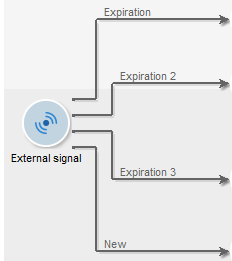

# 외부 신호{#external-signal}

다음 **외부 신호** 활동을 사용하면 워크플로우의 작업 세트를 예약으로 실행할 수 있습니다.

외부 신호 작업이 활성화되면 무한정 또는 지정된 기간이 끝날 때까지 일시 중지됩니다. 이 전환은 SOAP 호출에 의해 활성화됩니다 **PostEvent(sessionToken, workflowId, 활동, 전환, 매개 변수, complete).** 다음 **[!UICONTROL complete]** 매개 변수를 사용하면 작업을 완료할 수 있으므로 후속 호출에 응답하지 않습니다.

PostEvent 함수에 대한 자세한 내용은 SOAP 호출에 대한 온라인 설명서를 참조하십시오.

신호를 받지 못할 경우 이벤트를 정의하기 위해 이 활동을 구성할 수 있습니다. 이렇게 하려면 활동을 편집하고 **[!UICONTROL Expiration]** 탭. 을(를) 클릭합니다. **[!UICONTROL Insert]** 이벤트를 만들고 구성하는 버튼을 클릭합니다.

만료 구성에 대해서는 [만료](define-approvals.md).

다음 **지연** 필드를 사용하면 원하는 단위로 만료 지연을 지정할 수 있습니다. 자세한 내용은 [대기](wait.md).

각 행은 만료 유형을 나타내며 전환과 일치합니다.

