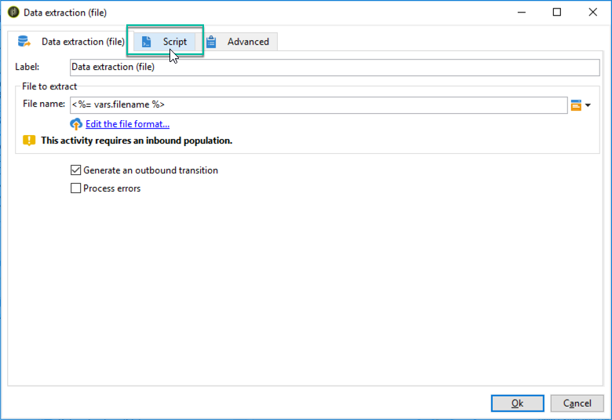

# 데이터 추출(파일){#extraction-file}

**[!UICONTROL Data extraction (file)]** 활동을 사용하여 외부 파일의 워크플로 테이블에서 데이터를 추출할 수 있습니다.

>[!CAUTION]
>
>이 활동에는 항상 추출할 데이터가 포함된 인바운드 전환이 있어야 합니다.

데이터 추출을 구성하려면 다음 단계를 적용합니다.

1. 출력 파일의 이름을 지정합니다. 이 이름에는 필드 오른쪽의 개인화 버튼을 통해 삽입된 변수를 포함할 수 있습니다.
1. 추출할 데이터를 선택하려면 **[!UICONTROL Edit the file format...]**&#x200B;을(를) 클릭하십시오.

   

   **[!UICONTROL Handle groupings (GROUP BY + HAVING)]** 옵션은 특정 구매 주문 유형, 10번 이상 주문한 고객 등 집계의 최종 결과를 필터링하기 위한 추가 단계를 추가합니다.

1. 필요한 경우 출력 파일에 계산 또는 처리 결과와 같은 새 열을 추가할 수 있습니다. 이렇게 하려면 **[!UICONTROL Add]** 아이콘을 클릭합니다.

   

   추가 행에서 **[!UICONTROL Edit expression]** 아이콘을 클릭하여 새 열의 내용을 정의합니다.

   

   그런 다음 선택 창에 액세스합니다. 데이터에 적용할 프로세스를 선택하려면 **[!UICONTROL Advanced selection]**&#x200B;을(를) 클릭하십시오.

   

   목록에서 원하는 공식을 선택합니다.

   

데이터 추출 중에 실행할 후 프로세스를 정의하여 파일을 압축하거나 암호화할 수 있습니다. 이렇게 하려면 활동의 **[!UICONTROL Script]** 탭에 원하는 명령을 추가해야 합니다.

## 집계 함수 목록 {#list-of-aggregate-functions}

다음은 사용 가능한 집계 함수 목록입니다.

* **[!UICONTROL Count]**(집계된 필드의 중복 값을 포함하여 집계될 필드의 null이 아닌 모든 값을 계산),

  집계할 필드의 서로 다른 값과 null이 아닌 값의 총 수를 계산하려면 **[!UICONTROL Distinct]**&#x200B;을(를) 사용합니다(중복 값은 계산 전에 제외됨).

* 숫자 필드 값의 합계를 계산하려면 **[!UICONTROL Sum]**,
* 필드의 최소값을 계산하려면 **[!UICONTROL Minimum value]**(숫자 또는 기타),
* 필드의 최대값을 계산하려면 **[!UICONTROL Maximum value]**(숫자 또는 기타),
* 숫자 필드 값의 평균을 계산하려면 **[!UICONTROL Average]**&#x200B;을(를) 사용하십시오.
