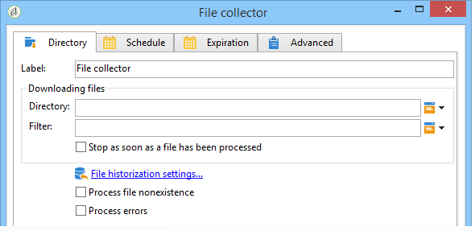

# 파일 수집기{#file-collector}

다음 **파일 수집기** 디렉토리에 하나 이상의 파일이 도착하는 것을 모니터링하고 수신된 각 파일에 대해 해당 전환을 활성화합니다. 각 이벤트에 대해 **[!UICONTROL filename]** 변수에는 받은 파일의 전체 이름이 들어 있습니다. 수집된 파일은 보관 목적으로 다른 디렉토리로 이동되며 한 번만 카운트되도록 합니다.

기본적으로 파일 수집기는 일정에 지정된 시간에 파일의 존재를 테스트하는 영구 작업입니다.

파일은 이 워크플로우를 담당하는 wfserver 모듈이 실행되는 서버에 있어야 합니다. 여러 wfserver 모듈이 단일 인스턴스에 배포된 경우 이러한 파일을 사용하는 활동의 친화성 또는 워크플로우의 전체 친화성을 지정해야 합니다.

## 속성 {#properties}

의 첫 번째 탭 **[!UICONTROL File collector]** 활동을 통해 소스 디렉토리를 선택하고 필요한 경우 수집된 파일을 필터링할 수 있습니다. 다른 탭은 [인바운드 전자 메일](inbound-emails.md) (**[!UICONTROL Schedule]** 및 **[!UICONTROL Expiry]** 탭).

1. **파일 다운로드 중**

   * **[!UICONTROL Directory]**

      다운로드할 파일이 들어 있는 디렉터리입니다. 이 디렉토리는 서버에서 미리 만들어야 합니다. 존재하지 않으면 오류가 발생합니다.

   * **[!UICONTROL Filter]**

      이 필터와 일치하는 파일만 고려합니다. 디렉토리의 다른 파일은 무시됩니다. 필터가 비어 있으면 디렉토리의 모든 파일이 고려됩니다. 필터 예: **&#42;.zip**, **가져오기&#42;.txt**.

   * **[!UICONTROL Stop as soon as a file has been processed]**

      이 옵션을 활성화하면 첫 번째 파일을 받은 후 작업이 종료됩니다. 여러 파일이 디렉토리에 있으면 하나만 고려됩니다. 이 옵션은 한 개의 이벤트만 전송하도록 보장합니다. 고려하는 파일은 목록의 첫 번째 파일이며 알파벳 순서로 표시됩니다.

      예약되지 않은 활동의 경우, 지정된 디렉토리에 필터와 일치하는 파일이 없으면 **[!UICONTROL Process file nonexistence]** 옵션을 활성화하지 않으면 오류가 발생합니다.

   * **[!UICONTROL Execution schedule]**

      의 매개 변수를 통해 파일 상태 확인 빈도를 결정합니다 **[!UICONTROL Schedule]** 탭.

1. **오류 처리**

   다음 두 가지 옵션을 사용할 수 있습니다.

   * **[!UICONTROL Process file nonexistence]**

      이 옵션은 지정된 디렉토리에 필터와 일치하는 파일이 없을 때마다 특수 전환을 시작합니다.

      작업이 예약되지 않은 경우 이 전환은 한 번만 활성화됩니다.

   * **[!UICONTROL Processing errors]**

      이 옵션을 사용하면 오류가 발생하면 활성화되도록 특수 전환이 나타납니다. 이 경우 워크플로우는 오류 상태로 변경되지 않고 계속 실행됩니다

      파일 시스템 오류(파일을 이동할 수 없음, 디렉토리에 액세스할 수 없음 등)를 고려한 오류

      이 옵션은 활동 구성과 관련된 오류(즉, 잘못된 값)를 처리하지 않습니다.

1. **내역**

   자세한 내용은 **[!UICONTROL File historization]** 여기에서 다음을 수행합니다. [웹 다운로드](web-download.md).

파일 처리 순서를 확인할 수 없습니다. 일련의 파일을 순차적으로 처리하려면 **[!UICONTROL Stop as soon as a file has been processed]** 옵션을 선택하고 루프를 만듭니다. 이 경우 파일은 알파벳순으로 처리됩니다. 다음 **[!UICONTROL Process file nonexistence]** 옵션을 사용하면 반복을 완료할 수 있습니다.

## 출력 매개 변수 {#output-parameters}

* 파일 이름: 전체 파일 이름입니다. 기록 디렉토리로 이동한 후 파일 이름입니다. 따라서 경로는 다르지만 이름이 같은 다른 파일이 이미 디렉토리에 있는 경우에도 이름이 다릅니다. 확장은 유지됩니다.
