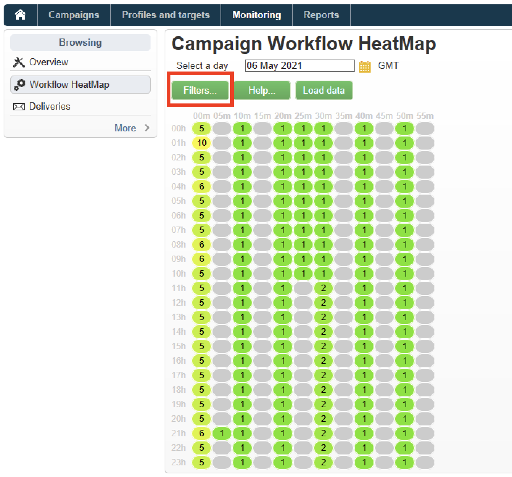
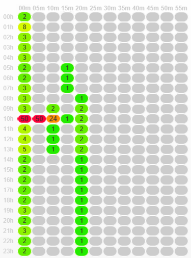

# 워크플로 히트맵 {#workflow-heatmap}

Campaign 워크플로우 HeatMap은 현재 실행 중인 모든 워크플로우를 색상으로 구분된 그래픽으로 표시합니다. **캠페인 관리자**&#x200B;만 사용할 수 있습니다.

## 워크플로우 히트맵 시작 {#about-the-workflow-heatmap}

워크플로우 HeatMap을 사용하면 동시 실행 워크플로우의 수에 대한 빠른 개요를 제공함으로써 Adobe Campaign 플랫폼 관리자가 인스턴스의 로드를 모니터링하고 그에 따라 워크플로우를 계획할 수 있습니다.

플랫폼 관리자는 더욱 정확하게 다음과 같은 이점을 얻을 수 있습니다.

* 동시 실행 워크플로 보기 및 이해
* 기간별로 워크플로를 필터링하여 문제가 발생할 수 있는 워크플로 확인
* 기간별로 활동을 필터링하여 문제가 발생할 수 있는 활동 확인
* 개별 워크플로 및 모든 관련 활동(해당 기간 포함)을 손쉽게 검색
* 워크플로우 유형별로 필터링: [기술 워크플로우](technical-workflows.md) 또는 [캠페인 워크플로우](campaign-workflows.md)
* 분석할 특정 워크플로 검색

>[!NOTE]
>
>**워크플로우 Heatmap** 외에도 워크플로우 집합의 상태를 모니터링하고 감독자에게 반복 메시지를 보낼 수 있는 워크플로우를 만들 수 있습니다. 자세한 내용은 [전용 섹션](workflow-supervision.md)을 참조하세요.

워크플로우 히트맵을 사용하려면 [워크플로우](about-workflows.md), [활동](activities.md) 및 [워크플로우 모범 사례](workflow-best-practices.md) 개념을 잘 이해해야 합니다.

## 워크플로우 열 지도 사용자 정의 {#using-the-heatmap}

>[!NOTE]
>
>워크플로우 HeatMap에 데이터가 표시되지 않으면 **[!UICONTROL Load data]** 단추를 클릭하십시오.

1. **[!UICONTROL Monitoring]**(으)로 이동하여 **[!UICONTROL Workflow HeatMap]** 링크를 클릭하여 **[!UICONTROL Campaign Workflow HeatMap]** 페이지를 표시합니다.

   

1. 달력을 클릭하여 날짜를 선택합니다.

   기본적으로 페이지에는 현재 날짜의 워크플로우 활동이 표시됩니다. 원하는 날짜를 선택하고 변경할 수 있습니다.

   >[!NOTE]
   > 
   >기본적으로 워크플로우 히트맵 시간대는 현재 관리자 사용자에 대해 정의된 시간대입니다. 예를 들어 함께 작업 중인 마케팅 사용자와 동일한 영역에 있지 않은 경우 변경할 수 있습니다.

1. **[!UICONTROL Filters]** 버튼을 클릭합니다.

   

1. 슬라이더를 사용하여 최소 지속 시간을 0초에서 1시간으로 설정합니다. 이를 통해 특정 시간(초 또는 분) 이상 실행 중인 워크플로우만 검색할 수 있습니다.

   

1. **[!UICONTROL Workflows]** 드롭다운 목록에서 특정 워크플로를 선택할 수도 있습니다.

   

   >[!NOTE]
   >
   >**[!UICONTROL Min duration]** 필터가 적용되었습니다. 특정 워크플로우를 찾을 수 없는 경우 모든 워크플로우가 목록에 표시되도록 최소 기간을 0으로 재설정합니다.

1. **[!UICONTROL Workflow type]**&#x200B;을(를) 필터링할 수도 있습니다.

   * **[!UICONTROL Technical]**: [기본 제공 기술 워크플로우](technical-workflows.md) 및 [데이터 관리 워크플로우](targeting-workflows.md#data-management)만 표시됩니다.
   * **[!UICONTROL Marketing]**: 마케팅 캠페인에 연결된 워크플로([캠페인 워크플로](campaign-workflows.md))만 표시됩니다.

1. 이름으로 특정 워크플로를 검색하려면 **[!UICONTROL Workflow name filter]** 필드도 사용하십시오.

1. 사이에 일부 워크플로우를 편집한 경우 **[!UICONTROL Reload data]** 단추를 클릭하여 그리드에 표시된 데이터를 새로 고칩니다.

## 워크플로우 히트맵 해석 {#reading-the-heatmap}

캠페인 워크플로우 히트맵은 왼쪽 위에서 오른쪽 아래로 자연스럽게 읽을 수 있는 그리드로, 녹색에서 빨간색으로 구분된 범위가 있는 &quot;핫 존&quot;을 찾을 수 있습니다.

* 더 어두운 빨간색 셀은 많은 수의 워크플로우가 동시에 실행되는 기간에 해당합니다.
* 회색 셀은 실행 중인 워크플로우가 없을 때 기간에 해당합니다.

색상 코드가 적용되는 방법과 HeatMap을 탐색하는 방법을 알아보려면 **[!UICONTROL Help]** 단추를 클릭하십시오.

각 행은 하루의 한 시간을 나타내고 각 셀은 해당 시간의 5분을 나타냅니다.

격자는 이러한 각 5분 기간에 대해 동시에 실행되는 모든 워크플로우를 표시합니다.

아래 예에서 오전 8시부터 오전 8시 5분 사이에 세 개의 워크플로우가 실행 중입니다(개별 기간에 관계 없음).

1. 색상이 지정된 셀을 눌러 이 기간 동안 실행되는 모든 동시 작업 과정의 세부 정보를 표시합니다.

   

   각 워크플로우에 대해 포함된 모든 활동이 해당 기간과 함께 나열됩니다.

1. 워크플로우 ID 또는 이름을 클릭하여 워크플로우를 직접 엽니다.
1. **[!UICONTROL Campaign Workflow HeatMap]** 보기로 돌아가려면 **[!UICONTROL Home]** 단추를 클릭합니다.

## 사용 사례: 히트맵을 사용하여 작업 수행 {#use-cases--using-the-heatmap-to-take-actions}

캠페인 워크플로우 히트맵을 유용하게 사용할 수 있는 두 가지 주요 사례가 있습니다.

### 동시 실행 워크플로우의 수 감소 {#reducing-the-number-of-concurrent-workflows}

Campaign 관리자는 워크플로우 HeatMap을 통해 인스턴스의 로드를 이해하고 적시에 기존 또는 새 워크플로우를 계획할 수 있습니다.

1. **[!UICONTROL Campaign Workflow HeatMap]** 보기에서 **[!UICONTROL Filters]** 단추를 클릭합니다.
1. 지속 시간을 몇 초 또는 몇 분으로 설정합니다.
1. 기간 필터를 늘려 중요하지 않은 가장 짧은 워크플로를 제외합니다.

   

1. 결과를 탐색하여 인스턴스의 로드를 이해하고 적절한 조치를 취합니다.

   * 성능 문제가 발생하고 그리드에 하나 이상의 빨간색 셀이 표시되면 여러 워크플로우의 시작 시간을 변경하는 것이 좋습니다. 마케팅 사용자에게 바쁜(&quot;핫&quot;) 기간에서 사용 가능한 시간 슬롯으로 수동 워크플로우를 이동하도록 요청합니다. 이는 하루 종일 안정적인 활동 수준을 유지해야 한다.
   * 정점을 피하고 인스턴스가 오버로드되는 것을 방지하려면 새 워크플로우를 계획하기 전에 HeatMap을 살펴보고 최적의 시간을 선택하십시오. 새 워크플로우를 시작하려면 그리드에서 회색 또는 녹색 셀에 해당하는 시간 슬롯을 고려하십시오.

### 성능에 영향을 주는 오래 실행되는 워크플로 찾기 {#finding-long-running-workflows-that-impact-performance}

Campaign 관리자는 워크플로우 HeatMap을 사용하여 활동을 느리게 할 수 있는 가장 긴 워크플로우를 찾을 수 있습니다.

1. **[!UICONTROL Campaign Workflow HeatMap]** 보기에서 **[!UICONTROL Filters]** 단추를 클릭합니다.
1. 기간을 1시간으로 설정합니다.

   

1. **[!UICONTROL Min duration]** 필터를 줄여 더 많은 결과를 포함하십시오.
1. 결과를 탐색하여 서버 및 데이터베이스 리소스(CPU, RAM, 네트워크, IOPS 등)에 더 많은 영향을 미칠 수 있는 가장 긴 워크플로우를 찾아보십시오.
1. 적절한 조치를 취합니다.

   * 마케팅 사용자에게 처리 시간을 줄이기 위해 가장 긴 워크플로우를 분할하도록 권고합니다.
   * 특정 워크플로우 및 특정 활동(JavaScript, 가져오기, 내보내기 등)에 대해 심층적인 분석을 시작하여 문제를 분리하고 보다 쉽게 해결할 수 있습니다.

## HeatMap을 사용하여 워크플로우 계획 개선 {#example--using-the-heatmap-to-improve-workflow-planning}

아래 예제는 Adobe Campaign Workflow HeatMap 사용 시 계획을 보다 효율적으로 수립하고 성능을 향상시키는 방법을 보여 줍니다.

이 경우 많은 사용자가 워크플로우 성능에 대해 불만을 제기하고 있습니다. 활동이 느려지는 것이 무엇인지, 문제를 해결하는 방법은 무엇인지 확인해야 한다.

1. **[!UICONTROL Monitoring]**(으)로 이동하여 **[!UICONTROL Workflows]** 링크를 클릭하여 **[!UICONTROL Campaign Workflow HeatMap]** 페이지를 표시합니다.
1. **[!UICONTROL Min duration]** 필터를 5분으로 설정합니다.
1. **[!UICONTROL Workflow type]** 필터를 **[!UICONTROL Marketing]**(으)로 설정합니다.
1. HeatMap 그리드에서 다음을 확인합니다.

   

   * 오전 10시에 50개의 오래 지속되는(5분 이상) 캠페인 워크플로우가 실행됩니다.
   * 대부분의 경우 보류 중 상태입니다(기본적으로 동시성 제한은 20으로 설정됨).
   * 보류 중인 워크플로우는 매일 수동으로 다시 시작해야 합니다.
   * 성능이 낮습니다.

1. 오전 10시부터 50개의 워크플로우를 시작하지 않고 나머지 하루 동안 워크플로우의 시작 시간을 균등하게 분배합니다.
1. **[!UICONTROL Campaign Workflow HeatMap]** 페이지로 돌아가서 **[!UICONTROL Reload data]** 단추를 클릭합니다.
1. 이제 다음을 확인하십시오.

   

   * 18개의 오래 지속되는 캠페인 워크플로우만 오전 10시에 계속 실행됩니다.
   * 더 이상 워크플로가 보류 상태가 아닙니다(동시성 한도가 여전히 20으로 설정됨).
   * 워크플로우 시작 시간은 하루 전체에 고르게 분산됩니다.
   * 더 이상 성능 문제에 대해 불만을 제기하는 사용자가 없습니다.
