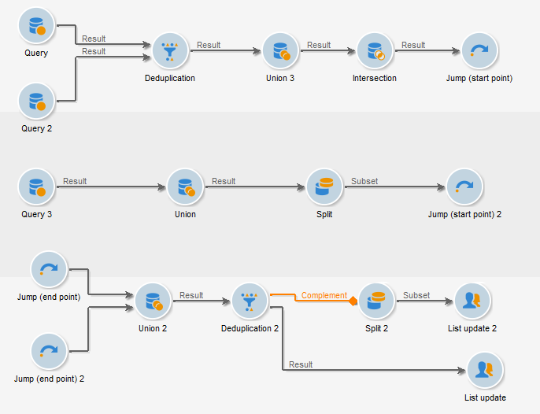

# 이동(시작점 및 끝점){#jump-start-point-and-end-point}

**[!UICONTROL Jump]** -유형 그래픽 객체는 복잡한 다이어그램, 특히 교차 전환이 있는 다이어그램의 가독성을 향상시키는 데 사용됩니다.

점프는 화살표가 없는 전환입니다.

다음 예제와 같이 한 활동에서 다른 활동으로 이동합니다.

각 &quot;시작점&quot; 유형 전환에 대해 &quot;끝점&quot; 유형 전환을 배치해야 합니다.

동일한 워크플로우에서 여러 개의 시작점 및 끝점 점프를 삽입할 수 있습니다. 매개 변수에 입력해야 하는 숫자로 식별됩니다.

다이어그램의 가독성을 높이기 위해 점프와 연관된 이미지를 변경하여 관련 숫자를 표시할 수 있습니다. 다음을 참조하십시오 [활동 이미지 변경](change-activity-images.md).
