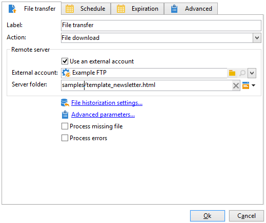

# 게재 콘텐츠 로드{#loading-delivery-content}

게재 콘텐츠를 Amazon S3, FTP 또는 SFTP 서버에 있는 HTML 파일에서 사용할 수 있는 경우 이 콘텐츠를 Adobe Campaign 게재에 쉽게 로드할 수 있습니다.

방법은 다음과 같습니다.

1. Adobe Campaign과 컨텐츠 파일을 호스팅하는 (S)FTP 서버 간의 연결을 아직 정의하지 않은 경우에서 새 S3, FTP 또는 SFTP 외부 계정을 만듭니다. **[!UICONTROL Administration]** > **[!UICONTROL Platform]** > **[!UICONTROL External Accounts]**. 이 외부 계정에서 S3 또는 (S)FTP 서버에 대한 연결을 설정하는 데 사용되는 주소와 자격 증명을 지정합니다.

   다음은 S3 외부 계정의 예입니다.

   

1. 새 워크플로우 만들기(예: 부터) **[!UICONTROL Profiles and Targets]** > **[!UICONTROL Jobs]** > **[!UICONTROL Targeting workflows]**.
1. 추가 **[!UICONTROL File transfer]** 활동을 워크플로우에 추가하고, 다음을 지정하여 구성

   * S3 또는 (S)FTP 서버에 연결하는 데 사용할 외부 계정입니다.
   * S3 또는 (S)FTP 서버에 있는 파일의 경로입니다.

   

1. 추가 **[!UICONTROL Delivery]** 활동을 만들고 의 아웃바운드 전환에 연결 **[!UICONTROL File transfer]** 활동. 다음과 같이 구성합니다.

   * 게재: 필요에 따라 시스템에서 이미 생성된 특정 게재 또는 기존 템플릿을 기반으로 하는 새 게재가 될 수 있습니다.
   * 수신자: 이 예제에서는 타겟이 게재 자체에 지정된 것으로 간주됩니다.
   * 컨텐츠: 이전 활동에서 컨텐츠를 가져온 경우에도 다음을 선택합니다. **[!UICONTROL Specified in the delivery]**. 원격 서버에 있는 파일에서 직접 콘텐츠를 가져오기 때문에 워크플로우에서 처리할 때 해당 콘텐츠에 대한 식별자가 없으며 인바운드 이벤트에서 온 것으로 식별할 수 없습니다.
   * 수행할 작업: 선택 **[!UICONTROL Save]** 게재를 저장하고 다음에서 액세스할 수 있습니다. **[!UICONTROL Campaign management]** > **[!UICONTROL Deliveries]** 워크플로우가 실행되면

   

1. 다음에서 **[!UICONTROL Script]** 의 탭 **[!UICONTROL Delivery]** 활동에서 다음 명령을 추가하여 가져온 파일의 콘텐츠를 게재에 로드합니다.

   ```
   delivery.content.md.source=loadFile(vars.filename)
   ```

   

1. 워크플로우를 저장하고 실행합니다. 로드된 콘텐츠가 있는 새 게재가 아래에 만들어집니다. **[!UICONTROL Campaign management]** > **[!UICONTROL Deliveries]**.

