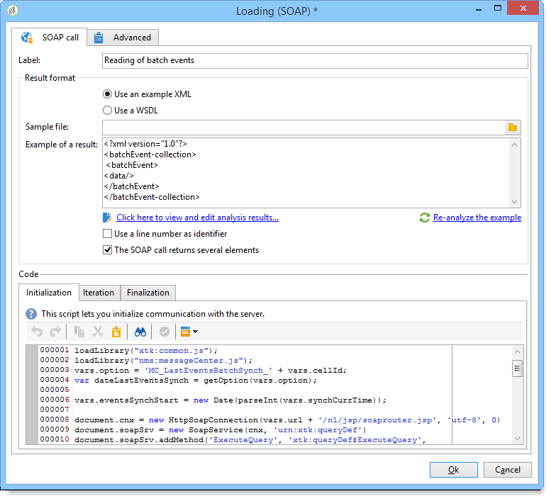

# 로딩(SOAP){#loading-soap}

>[!CAUTION]
>
>다음 **로드 중(SOAP)** 활동은 다음을 보유한 경우에만 사용할 수 있습니다. **FDA(Federated Data Access)** 모듈이 설치되었습니다. 사용권 계약을 확인하십시오.

다음 **로드 중(SOAP)** 활동은 다음에 사용됩니다. **데이터 로드(RDBMS)** 외부 데이터베이스에서 FDA를 통해 직접 데이터를 수집할 수 없는 경우 활동.

작업은 다음과 같습니다.

1. XML 예제를 사용하거나 WSDL을 사용하여 중에서 선택합니다.

   다음 예제는 메시지 센터 모듈의 기술 워크플로우에서 가져온 것입니다.

   

1. XML 예제의 경우 샘플 파일을 선택합니다. 파일을 분석하여 결과 예제를 설정합니다.

   WSDL의 경우 일치하는 액세스 URL을 입력한 다음 골격 코드를 생성합니다. 선택한 서비스 및 호출이 자동으로 업데이트되어 표시됩니다.

   

1. 선택 **[!UICONTROL Click here to view and edit analysis results]** 식별된 각 열을 지정합니다.

   

   예제를 업데이트하려면 다음을 선택합니다. **[!UICONTROL Re-analyze the example]**.

1. 줄 번호를 식별자로 사용하거나 SOAP 호출이 여러 요소를 반환하도록 지정할 수 있습니다.
1. 기능에 따라 다음 탭 스크립트를 입력합니다.

   * **[!UICONTROL Initialization]**: SOAP 연결을 설정합니다.
   * **[!UICONTROL Iteration]**: SOAP 서비스에 대한 호출을 수행합니다. 이 함수에 대한 반환은 예제 또는 WSDL의 설명과 호환되는 XML 개체여야 합니다.

      이 탭의 코드는 null XML 개체가 반환될 때까지 Adobe Campaign에서 루프에서 호출됩니다.

   * **[!UICONTROL Finalization]**: 연결을 닫거나 처리 중에 생성된 다른 리소스를 해제합니다.
