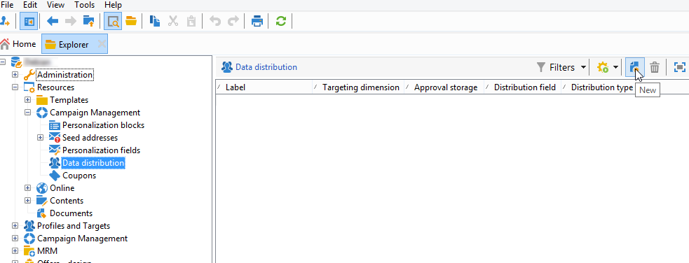
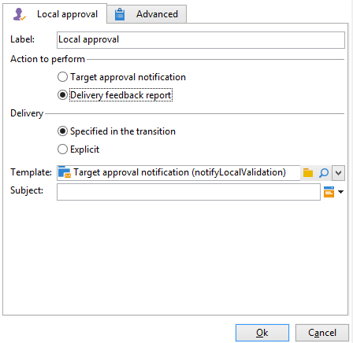

# 로컬 승인 활동 사용{#using-the-local-approval-activity}

다음 **[!UICONTROL Local approval]** 타겟팅 워크플로우에 통합된 활동을 사용하면 게재를 보내기 전에 수신자 승인 프로세스를 설정할 수 있습니다.

>[!CAUTION]
>
>이 기능을 사용하려면 캠페인 옵션인 분산 마케팅 모듈을 구매해야 합니다. 사용권 계약을 확인하십시오.

이 사용 사례를 설정하기 위해 다음 타겟팅 워크플로우를 만들었습니다.

로컬 승인 프로세스의 주요 단계는 다음과 같습니다.

1. 타겟팅으로 인한 모집단은 **[!UICONTROL Split]** 데이터 배포 모델을 사용하여 활동을 입력합니다.

   

1. 다음 **[!UICONTROL Local approval]** 그런 다음 활동을 인계받아 각 로컬 감독자에게 알림 이메일을 보냅니다. 활동은 각 지역 관리자가 자신에게 할당된 수신자를 승인할 때까지 보류됩니다.

1. 승인 기한이 되면 워크플로우가 다시 시작됩니다. 이 예에서 **[!UICONTROL Delivery]** 활동이 시작되고 게재가 승인된 타겟으로 전송됩니다.

   >[!NOTE]
   >
   >마감일이 되면 승인되지 않은 수신자는 타겟팅에서 제외됩니다.

   

1. 며칠 뒤, 두 번째 **[!UICONTROL Local approval]** 유형 활동은 연락처가 수행하는 작업(클릭, 열기 등)에 대한 요약을 사용하여 각 로컬 감독자에게 알림 이메일을 보냅니다.

## 1단계: 데이터 배포 템플릿 만들기 {#step-1--creating-the-data-distribution-template-}

데이터 배포 템플릿을 사용하면 각 값을 로컬 감독자에게 할당할 수 있을 뿐 아니라 데이터 그룹을 기반으로 타겟팅한 모집단을 제한할 수 있습니다. 이 예에서는 **[!UICONTROL Email address domain]** 필드를 배포 필드로 지정하고 각 로컬 감독자에게 도메인을 지정합니다.

데이터 배포 템플릿 만들기에 대한 자세한 내용은 [데이터 배포당 하위 집합 레코드 수 제한](split.md#limiting-the-number-of-subset-records-per-data-distribution).

1. 데이터 배포 템플릿을 만들려면 다음 위치로 이동합니다. **[!UICONTROL Resources > Campaign management > Data distribution]** 노드 및 **[!UICONTROL New]**.

   

1. **[!UICONTROL General]** 탭을 선택합니다. 

   

1. 을(를) 입력합니다. **[!UICONTROL Label]** 그리고 **[!UICONTROL Distribution context]**. 이 예제에서는 **[!UICONTROL Recipient]** 타겟팅 스키마 및 **[!UICONTROL Email domain]** 필드를 배포 필드로 사용할 수 있습니다. 수신자 목록은 도메인별로 분류됩니다.
1. 에서 **[!UICONTROL Distribution type]** 필드에서 target 제한 값이 **[!UICONTROL Distribution]** 탭. 여기, 우리는 **[!UICONTROL Percentage]**.
1. 에서 **[!UICONTROL Approval storage]** 필드에서는 사용 중인 타깃팅 스키마와 일치하는 승인을 위한 저장소 스키마를 입력합니다. 여기서는 기본 스토리지 스키마를 사용합니다. **[!UICONTROL Local approval of recipients]**.
1. 그런 다음 **[!UICONTROL Advanced parameters]** 링크를 클릭합니다.

   

1. 유지 **[!UICONTROL Approve the targeted messages]** 승인할 수신자 목록에서 모든 수신자를 미리 선택하도록 옵션을 선택했습니다.
1. 에서 **[!UICONTROL Delivery label]** 필드, 기본 표현식(게재의 계산 문자열)을 그대로 두었습니다. 게재의 표준 레이블은 피드백 알림에 사용됩니다.
1. 에서 **[!UICONTROL Grouping field]** 섹션, 우리는 **[!UICONTROL Gender]** 필드를 승인 및 피드백 알림에 수신자를 표시하는 그룹화 필드입니다.
1. 에서 **[!UICONTROL Edit targeted messages]** 섹션, 우리는 **[!UICONTROL Edit recipients]** 웹 애플리케이션 및 **[!UICONTROL recipientId]** 매개 변수. 승인 및 피드백 알림에서 수신자는 클릭 가능하고 웹 애플리케이션의 URL을 가리킵니다. 추가 URL 매개 변수는 **[!UICONTROL recipientId]**.
1. 그런 다음 **[!UICONTROL Distribution]** 탭. 각 도메인에 대해 다음 필드를 입력합니다.

   

   * **[!UICONTROL Value]**: 도메인 이름의 값을 입력합니다.
   * **[!UICONTROL Percentage / Fixed]**: 각 도메인에 대해 최대값을 입력합니다. 게재를 보낼 수신자 수입니다. 이 예에서는 게재를 도메인당 10%로 제한하려고 합니다.
   * **[!UICONTROL Label]**: 승인 및 피드백 알림에 표시할 도메인의 레이블을 입력합니다.
   * **[!UICONTROL Group or operator]**: 도메인에 할당된 연산자 또는 연산자 그룹을 선택합니다.

      >[!CAUTION]
      >
      >연산자에게 적절한 권한이 할당되었는지 확인합니다.

## 2단계: 타겟팅 워크플로우 만들기 {#step-2--creating-the-targeting-workflow}

이 사용 사례를 설정하기 위해 다음 타겟팅 워크플로우를 만들었습니다.

다음 활동이 추가되었습니다.

* 2 **[!UICONTROL Query]** 활동,
* 1개 **[!UICONTROL Intersection]** 활동,
* 1개 **[!UICONTROL Split]** 활동,
* 1개 **[!UICONTROL Local approval]** 활동,
* 1개 **[!UICONTROL Delivery]** 활동,
* 1개 **[!UICONTROL Wait]** 활동,
* 1초 **[!UICONTROL Local approval]** 활동,
* 1개 **[!UICONTROL End]** 활동.

### 쿼리, 교차 및 분할 {#queries--intersection-and-split}

업스트림 타깃팅은 두 개의 쿼리, 하나의 교집합 및 하나의 분할로 구성됩니다. 타겟팅으로 인한 모집단은 **[!UICONTROL Split]** 데이터 배포 템플릿을 사용하는 활동.

분할 활동 구성에 대한 자세한 내용은 [분할](split.md). 데이터 배포 템플릿 만들기에 대해서는 [데이터 배포당 하위 집합 레코드 수 제한](split.md#limiting-the-number-of-subset-records-per-data-distribution).

쿼리에서 모집단을 제한하지 않으려면 **[!UICONTROL Query]**, **[!UICONTROL Intersection]**, 및 **[!UICONTROL Split]** 활동. 이 경우 첫 번째 위치에서 데이터 배포 템플릿을 완료합니다 **[!UICONTROL Local approval]** 활동.

1. 에서 **[!UICONTROL Record count limitation]** 섹션에서 **[!UICONTROL Limit the selected records]** 옵션을 선택하고 **[!UICONTROL Edit]** 링크를 클릭합니다.

   

1. 을(를) 선택합니다 **[!UICONTROL Keep only the first records after sorting]** 옵션을 선택하고 **[!UICONTROL Next]**.

   

1. 에서 **[!UICONTROL Sort columns]** 섹션에서 정렬을 적용할 필드를 추가합니다. 여기에서는 **[!UICONTROL Email]** 필드. **[!UICONTROL Next]**&#x200B;를 클릭합니다.

   

1. 을(를) 선택합니다 **[!UICONTROL By data distribution]** 선택 사항에서 이전에 만든 배포 템플릿을 선택합니다(참조: [1단계: 데이터 배포 템플릿 만들기](#step-1--creating-the-data-distribution-template-)) 를 클릭하고 를 클릭합니다. **[!UICONTROL Finish]**.

   

배포 템플릿에서 모집단을 워크플로우에 표시된 값과 일치하는 그룹핑 값당 10%로 제한하도록 선택했습니다(입력으로 340, 출력으로서 34).

### 승인 알림 {#approval-notification}

다음 **[!UICONTROL Local approval]** 활동을 통해 각 로컬 감독자에게 알림을 보낼 수 있습니다.

구성에 대한 자세한 내용은 **[!UICONTROL Local approval]** 활동, [로컬 승인](local-approval.md).

다음 필드를 입력해야 합니다.

1. **[!UICONTROL Action to execute]** 섹션에서 **[!UICONTROL Target approval notification]** 옵션을 선택합니다.
1. **[!UICONTROL Distribution context]** 섹션에서 **[!UICONTROL Specified in the transition]** 옵션을 선택합니다.

   타겟팅된 모집단을 제한하지 않으려면 **[!UICONTROL Explicit]** 여기에서 옵션을 선택하고 이전에 **[!UICONTROL Data distribution]** 필드.

1. 에서 **[!UICONTROL Notification]** 섹션에서 게재 템플릿 및 알림 이메일에 사용할 제목을 선택합니다. 여기서는 기본 템플릿을 선택했습니다. **[!UICONTROL Local approval notification]**.
1. 에서 **[!UICONTROL Approval schedule]** 섹션을 통해 기본 승인 기한(3일)을 유지하고 미리 알림을 추가했습니다. 배송은 승인 시작 3일 후에 떠날 것입니다. 승인 기한이 지나면, 승인되지 않은 수신자는 타겟팅으로 고려하지 않습니다.

알림 이메일은 **[!UICONTROL Local approval]** 활동을 지역 감독자에게 보냅니다.

### 대기 {#wait}

대기 활동을 통해 게재 피드백 알림을 전송할 두 번째 로컬 승인 활동의 시작을 연기할 수 있습니다. 에서 **[!UICONTROL Duration]** 필드, 우리는 **[!UICONTROL 5d]** 값(5일). 게재 전송 후 5일 동안 수신자가 수행한 작업은 피드백 알림에 포함됩니다.

### 피드백 알림 {#feedback-notification}

두 번째 **[!UICONTROL Local approval]** 활동을 통해 각 로컬 감독자에게 게재 피드백 알림을 보낼 수 있습니다.

다음 필드를 입력해야 합니다.

1. 에서 **[!UICONTROL Action to execute]** 섹션, **[!UICONTROL Delivery feedback report]**.
1. 에서 **[!UICONTROL Delivery]** 섹션, **[!UICONTROL Specified in the transition]**.
1. 에서 **[!UICONTROL Notification]** 섹션에서 게재 템플릿 및 알림 이메일에 사용할 제목을 선택합니다.

대기 활동에 구성된 최종 기한에 도달하면 두 번째 **[!UICONTROL Local approval]** 유형 활동은 각 로컬 감독자에게 다음의 알림 이메일을 보냅니다.

### 관리자의 승인 추적 {#approval-tracking-by-the-administrator}

로컬 승인 활동이 시작될 때마다 승인 작업이 만들어집니다. 관리자는 이러한 각 승인 작업을 제어할 수 있습니다.

캠페인의 타겟팅 워크플로우로 이동하고 **[!UICONTROL Local approval tasks]** 탭.

로컬 승인 작업 목록은 **[!UICONTROL Approval tasks]** 데이터 배포 템플릿의 탭입니다.

모니터링할 작업을 선택하고 **[!UICONTROL Detail]** 버튼을 클릭합니다. 다음 **[!UICONTROL General]** 로컬 승인 작업의 탭에서 작업에 대한 정보를 볼 수 있습니다. 필요한 경우 승인 및 미리 알림 날짜를 변경할 수 있습니다.

이 탭에는 다음 정보가 표시됩니다.

* 작업 레이블 및 해당 ID
* 사용된 배포 템플릿
* 타겟팅된 메시지 수
* 연결된 워크플로우 및 캠페인
* 작업 일정

다음 **[!UICONTROL Distribution]** 작업의 탭에서는 승인 로그, 상태, 타겟팅된 메시지 수, 승인 날짜 및 게재를 승인한 운영자를 볼 수 있습니다.

승인 로그를 선택하고 **[!UICONTROL Detail]** 추가 정보를 표시하는 단추입니다. 다음 **[!UICONTROL General]** 로컬 승인 로그의 탭에서 일반 로그 정보를 볼 수 있습니다. 승인 상태를 변경할 수도 있습니다.

이 탭에는 다음 정보가 표시됩니다.

* 연결된 승인 작업
* 승인 상태(**[!UICONTROL Approved]** 또는 **[!UICONTROL Pending]**)
* 사용된 배포 템플릿
* 승인을 받은 지역 감독관 및 승인 일자
* 타겟팅되고 승인된 메시지 수

다음 **[!UICONTROL Targeted]** 승인 로그의 탭에는 타겟팅된 수신자 목록과 승인 상태가 표시됩니다. 필요한 경우 이 상태를 변경할 수 있습니다.

