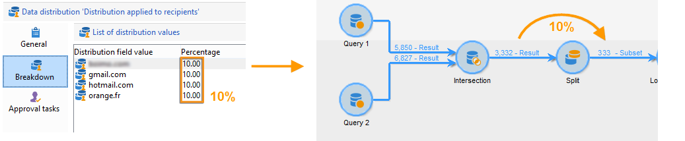
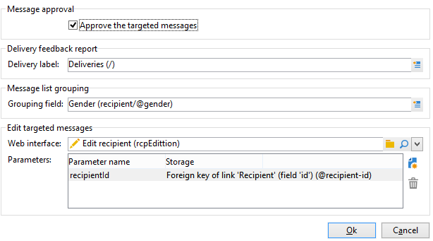
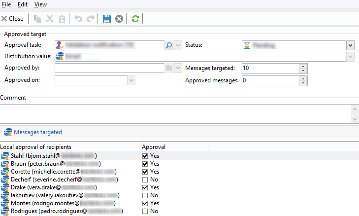

# 로컬 승인 활동 사용{#using-the-local-approval-activity}

**[!UICONTROL Local approval]** 활동을 타깃팅 워크플로우에 통합하면 게재를 보내기 전에 받는 사람 승인 프로세스를 설정할 수 있습니다.

>[!CAUTION]
>
>이 기능을 사용하려면 Campaign 옵션인 분산 마케팅 모듈을 구매해야 합니다. 사용권 계약을 확인하십시오.

이 사용 사례를 설정하기 위해 다음과 같은 타겟팅 워크플로우를 만들었습니다.

로컬 승인 프로세스의 주요 단계는 다음과 같습니다.

1. 데이터 배포 모델을 사용하는 **[!UICONTROL Split]** 형식 활동 덕분에 타깃팅으로 인한 모집단을 제한할 수 있습니다.

   

1. 그러면 **[!UICONTROL Local approval]** 활동이 이 역할을 인수하여 각 로컬 감독자에게 알림 전자 메일을 보냅니다. 각 지역 감독자가 자신에게 할당된 수신자를 승인할 때까지 활동이 보류됩니다.

1. 승인 기한에 도달하면 워크플로우가 다시 시작됩니다. 이 예제에서는 **[!UICONTROL Delivery]** 활동이 시작되고 게재가 승인된 대상으로 전송됩니다.

   >[!NOTE]
   >
   >기한에 도달하면 승인되지 않은 수신자는 타겟팅에서 제외됩니다.

   

1. 며칠 후 두 번째 **[!UICONTROL Local approval]** 유형 활동은 각 로컬 감독자에게 연락처(클릭, 열기 등)가 수행한 작업의 요약을 알리는 알림 이메일을 보냅니다.

## 1단계: 데이터 배포 템플릿 만들기 {#step-1--creating-the-data-distribution-template-}

데이터 배포 템플릿을 사용하면 각 값을 로컬 감독자에게 지정할 수 있도록 하면서 데이터 그룹화에 따라 타겟팅으로 인한 모집단을 제한할 수 있습니다. 이 예제에서는 **[!UICONTROL Email address domain]** 필드를 배포 필드로 정의하고 각 로컬 감독자에게 도메인을 할당했습니다

데이터 배포 템플릿을 만드는 방법에 대한 자세한 내용은 [데이터 배포당 하위 집합 레코드 수 제한](split.md#limiting-the-number-of-subset-records-per-data-distribution)을 참조하세요.

1. 데이터 배포 템플릿을 만들려면 **[!UICONTROL Resources > Campaign management > Data distribution]** 노드로 이동하여 **[!UICONTROL New]**&#x200B;을(를) 클릭합니다.

   

1. **[!UICONTROL General]** 탭을 선택합니다. 

   

1. **[!UICONTROL Label]** 및 **[!UICONTROL Distribution context]**&#x200B;을(를) 입력하십시오. 이 예제에서는 **[!UICONTROL Recipient]** 타깃팅 스키마와 **[!UICONTROL Email domain]** 필드를 배포 필드로 선택했습니다. 수신자 목록은 도메인별로 분류됩니다.
1. **[!UICONTROL Distribution type]** 필드에서 **[!UICONTROL Distribution]** 탭에서 대상 제한 값을 표시할 방법을 선택합니다. 여기에서 **[!UICONTROL Percentage]**&#x200B;을(를) 선택했습니다.
1. **[!UICONTROL Approval storage]** 필드에 사용 중인 대상 스키마와 일치하는 승인의 저장소 스키마를 입력합니다. 여기에서는 기본 저장소 스키마 **[!UICONTROL Local approval of recipients]**&#x200B;을(를) 사용합니다.
1. **[!UICONTROL Advanced parameters]** 링크를 클릭합니다.

   

1. 승인할 수신자 목록에서 모든 수신자가 미리 선택되도록 **[!UICONTROL Approve the targeted messages]** 옵션을 선택된 상태로 유지합니다.
1. **[!UICONTROL Delivery label]** 필드에 기본 식(게재의 계산 문자열)을 남겼습니다. 게재의 표준 레이블은 피드백 알림에 사용됩니다.
1. **[!UICONTROL Grouping field]** 섹션에서 **[!UICONTROL Gender]** 필드를 승인 및 피드백 알림에 수신자를 표시하는 그룹화 필드로 선택했습니다.
1. **[!UICONTROL Edit targeted messages]** 섹션에서 **[!UICONTROL Edit recipients]** 웹 응용 프로그램과 **[!UICONTROL recipientId]** 매개 변수를 선택했습니다. 승인 및 피드백 알림에서 수신자는 클릭할 수 있고 웹 애플리케이션의 URL을 가리킵니다. 추가 URL 매개 변수는 **[!UICONTROL recipientId]**&#x200B;입니다.
1. **[!UICONTROL Distribution]** 탭을 클릭합니다. 각 도메인에 대해 다음 필드를 입력합니다.

   

   * **[!UICONTROL Value]**: 도메인 이름의 값을 입력하십시오.
   * **[!UICONTROL Percentage / Fixed]**: 각 도메인에 대해 최대값을 입력하십시오. 게재를 보낼 수신자 수입니다. 이 예제에서는 도메인당 게재를 10%로 제한하려고 합니다.
   * **[!UICONTROL Label]**: 승인 및 피드백 알림에 표시할 도메인의 레이블을 입력합니다.
   * **[!UICONTROL Group or operator]**: 도메인에 할당된 연산자 또는 연산자 그룹을 선택하십시오.

     >[!CAUTION]
     >
     >운영자에게 적절한 권한이 할당되었는지 확인합니다.

## 2단계: 타겟팅 워크플로우 만들기 {#step-2--creating-the-targeting-workflow}

이 사용 사례를 설정하기 위해 다음과 같은 타겟팅 워크플로우를 만들었습니다.

다음 활동이 추가되었습니다.

* 두 개의 **[!UICONTROL Query]** 활동,
* 1개의 **[!UICONTROL Intersection]** 활동,
* 1개의 **[!UICONTROL Split]** 활동,
* 1개의 **[!UICONTROL Local approval]** 활동,
* 1개의 **[!UICONTROL Delivery]** 활동,
* 1개의 **[!UICONTROL Wait]** 활동,
* 두 번째 **[!UICONTROL Local approval]** 활동,
* **[!UICONTROL End]** 활동 1개.

### 쿼리, 교차 및 분할 {#queries--intersection-and-split}

업스트림 타겟팅은 두 개의 쿼리, 하나의 교차 및 하나의 분할로 구성됩니다. 데이터 배포 템플릿을 사용하는 **[!UICONTROL Split]** 활동을 사용하여 타깃팅으로 인한 모집단을 제한할 수 있습니다.

분할 활동 구성에 대한 자세한 내용은 [분할](split.md)을 참조하세요. 데이터 배포 템플릿 만들기에 대한 자세한 내용은 [데이터 배포당 하위 집합 레코드 수 제한](split.md#limiting-the-number-of-subset-records-per-data-distribution)을 참조하십시오.

쿼리에서 모집단을 제한하지 않으려면 **[!UICONTROL Query]**, **[!UICONTROL Intersection]** 및 **[!UICONTROL Split]** 활동을 사용하지 않아도 됩니다. 이 경우 첫 번째 **[!UICONTROL Local approval]** 활동에서 데이터 배포 템플릿을 완료하십시오.

1. **[!UICONTROL Record count limitation]** 섹션에서 **[!UICONTROL Limit the selected records]** 옵션을 선택하고 **[!UICONTROL Edit]** 링크를 클릭합니다.

   

1. **[!UICONTROL Keep only the first records after sorting]** 옵션을 선택하고 **[!UICONTROL Next]**&#x200B;을(를) 클릭합니다.

   

1. **[!UICONTROL Sort columns]** 섹션에서 정렬이 적용되는 필드를 추가합니다. 여기에서 **[!UICONTROL Email]** 필드를 선택했습니다. **[!UICONTROL Next]**&#x200B;를 클릭합니다.

   

1. **[!UICONTROL By data distribution]** 옵션을 선택하고 이전에 만든 배포 템플릿을 선택한 다음([1단계: 데이터 배포 템플릿 만들기](#step-1--creating-the-data-distribution-template-) 참조) **[!UICONTROL Finish]**&#x200B;을(를) 클릭합니다.

   

배포 템플릿에서 그룹화 값당 10%로 모집단을 제한하도록 선택했습니다. 이는 워크플로우에 표시된 값(입력으로 340, 출력으로 34)과 일치합니다.

### 승인 알림 {#approval-notification}

**[!UICONTROL Local approval]** 활동을 통해 각 로컬 감독자에게 알림을 보낼 수 있습니다.

**[!UICONTROL Local approval]** 활동 구성에 대한 자세한 내용은 [로컬 승인](local-approval.md)을 참조하세요.

다음 필드를 입력해야 합니다.

1. **[!UICONTROL Action to execute]** 섹션에서 **[!UICONTROL Target approval notification]** 옵션을 선택합니다.
1. **[!UICONTROL Distribution context]** 섹션에서 **[!UICONTROL Specified in the transition]** 옵션을 선택합니다.

   대상 모집단을 제한하지 않으려면 여기에서 **[!UICONTROL Explicit]** 옵션을 선택하고 **[!UICONTROL Data distribution]** 필드에 이전에 만든 배포 템플릿을 입력하십시오.

1. **[!UICONTROL Notification]** 섹션에서 알림 전자 메일에 사용할 게재 템플릿과 제목을 선택합니다. 여기에서 기본 템플릿 **[!UICONTROL Local approval notification]**&#x200B;을(를) 선택했습니다.
1. **[!UICONTROL Approval schedule]** 섹션에서 기본 승인 기한(3일)을 유지하고 미리 알림을 추가했습니다. 배송은 승인 시작 후 3일 후에 출발합니다. 승인 기한에 도달하면 승인되지 않은 수신자는 타겟팅하여 고려되지 않습니다.

**[!UICONTROL Local approval]** 활동에서 로컬 감독자에게 알림 이메일을 보냅니다.

### 대기 {#wait}

대기 활동을 통해 게재 피드백 알림을 전송할 두 번째 로컬 승인 활동의 시작을 연기할 수 있습니다. **[!UICONTROL Duration]** 필드에 **[!UICONTROL 5d]** 값(5일)을 입력했습니다. 게재 전송 후 5일 동안 수신자가 수행한 작업은 피드백 알림에 포함됩니다.

### 피드백 알림 {#feedback-notification}

두 번째 **[!UICONTROL Local approval]** 활동을 통해 각 로컬 감독자에게 게재 피드백 알림을 보낼 수 있습니다.

다음 필드를 입력해야 합니다.

1. **[!UICONTROL Action to execute]** 섹션에서 **[!UICONTROL Delivery feedback report]**&#x200B;을(를) 선택합니다.
1. **[!UICONTROL Delivery]** 섹션에서 **[!UICONTROL Specified in the transition]**&#x200B;을(를) 선택합니다.
1. **[!UICONTROL Notification]** 섹션에서 알림 전자 메일에 사용할 게재 템플릿과 제목을 선택합니다.

대기 활동에 구성된 기한에 도달하면 두 번째 **[!UICONTROL Local approval]** 유형 활동에서 각 로컬 감독자에게 다음 알림 이메일을 보냅니다.

### 관리자에 의한 승인 추적 {#approval-tracking-by-the-administrator}

로컬 승인 활동이 시작될 때마다 승인 작업이 생성됩니다. 관리자는 이러한 각 승인 작업을 제어할 수 있습니다.

캠페인의 타겟팅 워크플로우로 이동하여 **[!UICONTROL Local approval tasks]** 탭을 클릭합니다.

로컬 승인 작업 목록은 데이터 배포 템플릿의 **[!UICONTROL Approval tasks]** 탭을 통해서도 액세스할 수 있습니다.

모니터링할 작업을 선택하고 **[!UICONTROL Detail]** 단추를 클릭합니다. 로컬 승인 작업의 **[!UICONTROL General]** 탭에서 작업에 대한 정보를 볼 수 있습니다. 필요한 경우 승인 및 미리 알림 날짜를 변경할 수 있습니다.

이 탭에는 다음 정보가 표시됩니다.

* 작업 레이블 및 ID
* 사용된 배포 템플릿
* 타겟팅된 메시지 수
* 연결된 워크플로우 및 캠페인
* 작업 일정

작업의 **[!UICONTROL Distribution]** 탭에서는 게재를 승인한 운영자뿐만 아니라 승인 로그, 상태, 타겟팅된 메시지 수, 승인 날짜도 볼 수 있습니다.

승인 로그를 선택하고 **[!UICONTROL Detail]** 단추를 클릭하여 자세한 정보를 표시합니다. 로컬 승인 로그의 **[!UICONTROL General]** 탭에서는 일반 로그 정보를 볼 수 있습니다. 승인 상태를 변경할 수도 있습니다.

이 탭에는 다음 정보가 표시됩니다.

* 연결된 승인 작업
* 승인 상태(**[!UICONTROL Approved]** 또는 **[!UICONTROL Pending]**)
* 사용된 배포 템플릿
* 승인한 현지 감독 및 승인 일자
* 타겟팅되고 승인된 메시지 수

승인 로그의 **[!UICONTROL Targeted]** 탭에 타겟팅된 수신자 목록과 승인 상태가 표시됩니다. 필요한 경우 이 상태를 변경할 수 있습니다.

