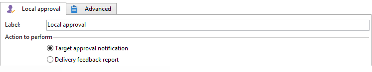

# 로컬 승인{#local-approval}

타겟팅 워크플로우에 통합되는 경우 **[!UICONTROL Local approval]** 활동을 사용하면 게재를 보내기 전에 수신자 승인 프로세스를 설정할 수 있습니다.

>[!CAUTION]
>
>이 활동을 사용하려면 Campaign 옵션인 분산 마케팅 모듈을 구입해야 합니다. 사용권 계약을 확인하십시오.

예: **[!UICONTROL Local approval]** 배포 템플릿이 있는 활동은 다음을 참조하십시오. [로컬 승인 활동 사용](local-approval-activity.md).

활동 및 의 레이블을 입력하여 시작하십시오. **[!UICONTROL Action to execute]** 필드:

* 다음 항목 선택 **[!UICONTROL Target approval notification]** 로컬 관리자에게 할당된 수신자를 승인하도록 요청하면서 게재 전에 로컬 감독자에게 알림 이메일을 보내는 옵션.

* **증분 쿼리**: 쿼리를 수행하고 실행 계획을 세울 수 있습니다. 다음을 참조하십시오. [증분 쿼리](incremental-query.md) 섹션.

  

## 대상 승인 미리 알림 {#target-approval-notification}

이 경우 **[!UICONTROL Local approval]** 활동은 업스트림 타겟팅과 게재 사이에 배치됩니다.

대상 승인을 위한 알림의 경우 입력할 필드는 다음과 같습니다.

* **[!UICONTROL Distribution context]**: 다음을 선택합니다. **[!UICONTROL Specified in the transition]** 옵션을 사용 중인 경우 **[!UICONTROL Split]** 활동을 입력하여 타깃팅된 모집단을 제한합니다. 이 경우 분배 템플릿은 분할 활동에 입력됩니다. 대상 모집단을 제한하지 않는 경우 **[!UICONTROL Explicit]** 여기에 옵션을 설정하고 **[!UICONTROL Data distribution]** 필드.

  데이터 배포 템플릿 만들기에 대한 자세한 내용은 [데이터 배포당 하위 집합 레코드 수 제한](split.md#limiting-the-number-of-subset-records-per-data-distribution).

* **[!UICONTROL Approval management]**

   * 게재 템플릿과 이메일 알림에 사용할 제목을 선택합니다. 기본 템플릿을 사용할 수 있습니다. **[!UICONTROL Local approval notification]**. 승인 및 피드백 알림에서 수신자 목록 위에 표시되는 설명을 추가할 수도 있습니다.
   * 다음을 지정합니다. **[!UICONTROL Approval type]** 승인 기한(승인 시작부터 날짜 또는 기한)에 해당합니다. 이 날짜에는 워크플로우가 다시 시작되며 승인되지 않은 수신자는 타겟팅에서 고려되지 않습니다. 알림이 전송되면 로컬 감독자가 해당 연락처를 승인할 수 있도록 활동이 큐에 대기합니다.

     >[!NOTE]
     >
     >기본적으로 승인 프로세스가 시작되면 3일 동안 활동이 보류됩니다.

     로컬 감독자에게 기한이 다가오고 있음을 알리는 하나 이상의 미리 알림을 추가할 수도 있습니다. 이렇게 하려면 **[!UICONTROL Add a reminder]** 링크를 클릭합니다.

* **[!UICONTROL Complementary set]**: **[!UICONTROL Generate complement]** 옵션을 사용하면 승인되지 않은 모든 대상을 포함하는 두 번째 세트를 생성할 수 있습니다.

  >[!NOTE]
  >
  >이 옵션은 기본적으로 비활성화되어 있습니다.

## 게재 피드백 보고서 {#delivery-feedback-report}

이 경우 **[!UICONTROL Local approval]** 활동은 게재 후에 배치됩니다.

게재 피드백 보고서의 경우 다음 필드를 입력해야 합니다.

* 다음 항목 선택 **[!UICONTROL Specified in the transition]** 이전 활동 중에 게재를 입력한 경우 옵션입니다. 선택 **[!UICONTROL Explicit]** 로컬 승인 활동에서 게재를 지정합니다.
* 게재 템플릿과 알림 이메일의 오브젝트를 선택합니다. 기본 템플릿이 있습니다. **[!UICONTROL Local approval notification]**.

## 예: 워크플로우 게재 승인 {#example--approving-a-workflow-delivery}

이 예에서는 워크플로우 게재에 대한 승인 프로세스를 설정하는 방법을 보여 줍니다. 게재 워크플로우 만들기에 대한 자세한 내용은 [예: 게재 워크플로우](delivery.md#example--delivery-workflow) 섹션.

연산자는 두 가지 방법 중 하나로 게재를 승인할 수 있습니다. 이메일 메시지에 연결된 웹 페이지를 사용하거나 클라이언트 콘솔을 통해 말입니다.

* 웹 승인

  관리자 그룹의 운영자에게 전송된 전자 메일을 통해 게재 대상을 승인할 수 있습니다. 메시지는 정의된 텍스트를 사용하고 JavaScript 표현식은 계산된 값(이 경우, &#39;574&#39;)으로 대체됩니다.

  게재를 승인하려면 관련 링크를 클릭하고 Adobe Campaign 클라이언트 콘솔에 로그온합니다.

  

  선택하고 다음을 클릭합니다. **[!UICONTROL Submit]** 단추를 클릭합니다.

  

* 클라이언트 콘솔을 통한 승인

  트리 구조에서 **[!UICONTROL Administration > Production > Objects created automatically > Approvals pending]** 노드에는 현재 연결된 운영자가 승인할 작업 목록이 포함되어 있습니다. 목록에 한 줄이 표시됩니다. 응답하려면 이 줄을 두 번 클릭하십시오. 다음 창이 표시됩니다.

선택 **예**&#x200B;을 클릭한 다음 을 클릭합니다 **[!UICONTROL Approve]**. 응답이 기록되었음을 알리는 메시지가 표시됩니다.

워크플로우 화면으로 돌아갑니다. 10초 정도 지나면 다음과 같이 다이어그램이 표시됩니다.

워크플로우가 **[!UICONTROL Delivery control]** 작업: 이 경우 이전에 만든 게재를 시작하는 것을 의미합니다. 워크플로우가 오류 없이 완료되었습니다.
