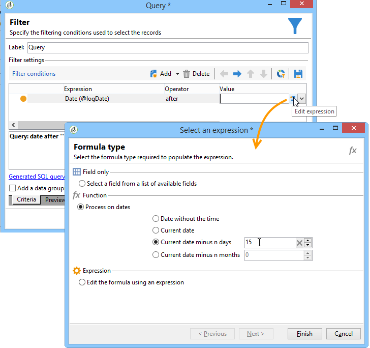

# 쿼리 게재 정보 {#querying-delivery-information}

## 특정 게재에 대한 클릭 수 {#number-of-clicks-for-a-specific-delivery}

이 예제에서는 특정 게재에 대한 클릭 수를 복구하려고 합니다. 이러한 클릭은 지정된 기간 동안 받은 수신자 추적 로그 덕분에 기록됩니다. 수신자는 이메일 주소를 통해 식별됩니다. 이 쿼리는 **[!UICONTROL Recipient tracking logs]** 테이블.

* 어떤 테이블을 선택해야 합니까?

  수신자 로그 추적 테이블(**[!UICONTROL nms:trackingLogRcp]**)

* 출력 열에 대해 선택할 필드입니까?

  기본 키(개수 포함) 및 이메일

* 정보는 어떤 기준을 기반으로 필터링됩니까?

  게재 레이블의 특정 기간 및 요소

이 예를 수행하려면 다음 단계를 적용합니다.

1. 를 엽니다. **[!UICONTROL Generic query editor]** 및 선택 **[!UICONTROL Recipient tracking logs]** 스키마.

   

1. 다음에서 **[!UICONTROL Data to extract]** 창에서 정보를 수집할 집계를 만들려고 합니다. 이렇게 하려면 기본 키(기본 키 위에 있음)를 추가합니다 **[!UICONTROL Recipient tracking logs]** element): 추적 로그 수는 이에 대해 수행됩니다. **[!UICONTROL Primary key]** 필드. 편집된 표현식은 다음과 같습니다. **[!UICONTROL x=count(primary key)]**. 다양한 추적 로그의 합계를 단일 이메일 주소에 연결합니다.

   방법은 다음과 같습니다.

   * 다음을 클릭합니다. **[!UICONTROL Add]** 아이콘 의 오른쪽 **[!UICONTROL Output columns]** 필드. 다음에서 **[!UICONTROL Formula type]** 창에서 **[!UICONTROL Edit the formula using an expression]** 옵션 및 클릭 **[!UICONTROL Next]**. 다음에서 **[!UICONTROL Field to select]** 창에서 다음을 클릭: **[!UICONTROL Advanced selection]**.

     

   * 다음에서 **[!UICONTROL Formula type]** 창에서 집계 함수에서 프로세스를 실행합니다. 이 프로세스는 기본 키 수가 됩니다.

     선택 **[!UICONTROL Process on an aggregate function]** 다음에서 **[!UICONTROL Aggregate]** 섹션 및 클릭 **[!UICONTROL Count]**.

     

     **[!UICONTROL Next]**&#x200B;를 클릭합니다.

   * 다음 항목 선택 **[!UICONTROL Primary key (@id)]** 필드. 다음 **[!UICONTROL count (primary key)]** 출력 열이 구성되었습니다.

     

1. 출력 열에 표시할 다른 필드를 선택합니다. 다음에서 **[!UICONTROL Available fields]** 열, 열기 **[!UICONTROL Recipient]** 노드 및 선택 **[!UICONTROL Email]**. 다음 확인: **[!UICONTROL Group]** 상자 위치: **[!UICONTROL Yes]** 전자 메일 주소별로 추적 로그를 그룹화하려면 이 그룹은 각 로그를 수신자에게 연결합니다.

   

1. 가장 활동적인 수신자(가장 많은 추적 로그 포함)가 먼저 표시되도록 열 정렬을 구성합니다. 확인 **[!UICONTROL Yes]** 다음에서 **[!UICONTROL Descending sort]** 열.

   

1. 그런 다음 관심 있는 로그, 즉 2주 미만이고 판매 관련 게재와 관련된 로그를 필터링해야 합니다.

   방법은 다음과 같습니다.

   * 데이터 필터링을 구성합니다. 이렇게 하려면 다음을 선택합니다. **[!UICONTROL Filter conditions]** 그런 다음 을 클릭합니다. **[!UICONTROL Next]**.

     

   * 특정 게재에 대해 지정된 기간 동안 추적 로그를 복구합니다. 현재 날짜의 2주 전과 현재 날짜의 전날 사이에서 검색 기간을 설정하는 두 개의 날짜 조건과 특정 게재로 검색을 제한하는 다른 조건, 이렇게 세 가지 필터링 조건이 필요합니다.

     다음에서 **[!UICONTROL Target element]** 창에서 추적 로그를 고려할 시작 날짜를 구성합니다. **[!UICONTROL Add]**&#x200B;을(를) 클릭합니다. 조건 줄이 표시됩니다. 편집 **[!UICONTROL Expression]** 열을 클릭합니다. **[!UICONTROL Edit expression]** 함수. 다음에서 **[!UICONTROL Field to select]** 창, 선택 **[!UICONTROL Date (@logDate)]**.

     

     다음 항목 선택 **[!UICONTROL greater than]** 연산자. 다음에서 **[!UICONTROL Value]** 열, 클릭 **[!UICONTROL Edit expression]**, 및 **[!UICONTROL Formula type]** 창, 선택 **[!UICONTROL Process on dates]**. 마지막으로 **[!UICONTROL Current date minus n days]**, &quot;15&quot;를 입력합니다.

     **[!UICONTROL Finish]**&#x200B;를 클릭합니다.

     

   * 추적 로그 검색 종료 날짜를 선택하려면 다음을 클릭하여 두 번째 조건을 만듭니다. **[!UICONTROL Add]**. 다음에서 **[!UICONTROL Expression]** 열, 선택 **[!UICONTROL Date (@logDate)]** 다시.

     다음 항목 선택 **[!UICONTROL less than]** 연산자. 다음에서 **[!UICONTROL Value]** 열, 클릭 **[!UICONTROL Edit expression]**. 날짜 처리를 위해 **[!UICONTROL Formula type]** 창에서 &quot;1&quot;을 입력합니다. **[!UICONTROL Current date minus n days]**.

     **[!UICONTROL Finish]**&#x200B;를 클릭합니다.

     

     이제 쿼리와 관련된 세 번째 필터 조건, 즉 게재 레이블을 구성하려고 합니다.

   * 다음을 클릭합니다. **[!UICONTROL Add]** 다른 필터링 조건을 만드는 함수입니다. 다음에서 **[!UICONTROL Expression]** 열, 클릭 **[!UICONTROL Edit expression]**. 다음에서 **[!UICONTROL Field to select]** 창, 선택 **[!UICONTROL Label]** 다음에서 **[!UICONTROL Delivery]** 노드.

     **[!UICONTROL Finish]**&#x200B;를 클릭합니다.

     

     &quot;sales&quot;라는 단어가 포함된 게재를 찾습니다. 정확한 레이블이 기억나지 않으므로 다음을 선택할 수 있습니다. **[!UICONTROL contains]** 연산자를 입력하고 다음에 &quot;sales&quot;를 입력합니다. **[!UICONTROL Value]** 열.

     

1. 클릭 **[!UICONTROL Next]** 다음 위치에 도달할 때까지 **[!UICONTROL Data preview]** 창: 여기서는 서식이 필요하지 않습니다.
1. 다음에서 **[!UICONTROL Data preview]** 창에서 다음을 클릭: **[!UICONTROL Start the preview of the data]** 게재 수신자별 추적 로그 수를 확인하려면

   결과는 내림차순으로 표시됩니다.

   

   사용자의 가장 높은 로그 수는 이 게재에 대해 6입니다. 5명의 다른 사용자가 게재 이메일을 열거나 이메일에 있는 링크 중 하나를 클릭했습니다.

## 게재를 열지 않은 수신자 {#recipients-who-did-not-open-any-delivery}

이 예제에서는 지난 7일 동안 이메일을 열지 않은 수신자를 필터링하려고 합니다.

이 예제를 만들려면 다음 단계를 적용합니다.

1. 드래그 앤 드롭 **[!UICONTROL Query]** 워크플로우의 활동을 열고 활동을 엽니다.
1. 클릭 **[!UICONTROL Edit query]** 및 target 및 필터링 차원을 다음으로 설정 **[!UICONTROL Recipients]**.

   

1. 선택 **[!UICONTROL Filtering conditions]** 그런 다음 을 클릭합니다. **[!UICONTROL Next]**.
1. 다음을 클릭합니다. **[!UICONTROL Add]** 단추 및 선택 **[!UICONTROL Tracking logs]**.
1. 설정 **[!UICONTROL Operator]** / **[!UICONTROL Tracking logs]** 표현식 대상 **[!UICONTROL Do not exist such as]**.

   

1. 다른 표현식을 추가합니다. 선택 **[!UICONTROL Type]** 다음에서 **[!UICONTROL URL]** 범주.
1. 그런 다음 를 설정합니다. **[!UICONTROL Operator]** 끝 **[!UICONTROL equal to]** 및 **[!UICONTROL Value]** 끝 **[!UICONTROL Open]**.

   

1. 다른 표현식 추가 및 선택 **[!UICONTROL Date]**. **[!UICONTROL Operator]** 을 로 설정해야 합니다. **[!UICONTROL on or after]**.

   

1. 최근 7일 값을 설정하려면 **[!UICONTROL Edit expression]** 의 단추 **[!UICONTROL Value]** 필드.
1. 다음에서 **[!UICONTROL Function]** 범주, 선택 **[!UICONTROL Current date minus n days]** 타깃팅할 일 수를 추가합니다. 여기에서는 지난 7일을 타겟팅하려고 합니다.

   

아웃바운드 전환에는 지난 7일 동안 이메일을 열지 않은 수신자가 포함됩니다.

반대로 하나 이상의 이메일을 연 수신자를 필터링하려면 쿼리를 다음과 같이 해야 합니다. 이 경우 다음을 참고하십시오. **[!UICONTROL Filtering dimension]** 을 로 설정해야 합니다. **[!UICONTROL Tracking logs (Recipients)]**.

## 게재를 연 수신자 {#recipients-who-have-opened-a-delivery}

다음 예제에서는 지난 2주 내에 게재를 연 프로필을 타겟팅하는 방법을 보여 줍니다.

1. 게재를 연 프로필을 타겟팅하려면 추적 로그를 사용해야 합니다. 연결된 테이블에 저장됩니다. 의 드롭다운 목록에서 이 테이블을 선택하여 시작합니다. **[!UICONTROL Filtering dimension]** 아래 표시된 필드:

   

1. 필터링 조건과 관련하여 **[!UICONTROL Edit expression]** 추적 로그의 하위 트리 구조에 표시되는 기준의 아이콘. 다음 항목 선택 **[!UICONTROL Date]** 필드.

   

   클릭 **[!UICONTROL Finish]** 선택 내용을 확인합니다.

   2주 미만의 추적 로그만 복구하려면 **[!UICONTROL Greater than]** 연산자.

   

   그런 다음 **[!UICONTROL Edit expression]** 아이콘 **[!UICONTROL Value]** 열을 사용하여 적용할 계산 공식을 정의합니다. 다음 항목 선택 **[!UICONTROL Current date minus n days]** 공식을 입력하고 관련 필드에 15를 입력합니다.

   

   다음을 클릭합니다. **[!UICONTROL Finish]** 공식 창의 단추입니다. 필터링 창에서 다음을 클릭합니다. **[!UICONTROL Preview]** 탭하여 타깃팅 기준을 확인합니다.

   

## 게재 후 수신자 동작 필터링 {#filtering-recipients--behavior-folllowing-a-delivery}

워크플로우에서 **[!UICONTROL Query]** 및 **[!UICONTROL Split]** 상자에서는 이전 게재 이후의 동작을 선택할 수 있습니다. 이 선택은 다음을 통해 수행됩니다. **[!UICONTROL Delivery recipient]** 필터.

* 예제의 목표

  게재 워크플로우에서는 첫 번째 이메일 커뮤니케이션을 추적하는 여러 가지 방법이 있습니다. 이러한 유형의 작업에는 **[!UICONTROL Split]** 상자.

* 컨텍스트

  &quot;여름 스포츠 오퍼&quot; 게재가 전송됩니다. 배송 후 4일이 지나면 다른 두 건의 배송이 전송됩니다. 그 중 하나가 &#39;수상 스포츠 오퍼&#39;이고, 다른 하나는 첫 번째 &#39;여름 스포츠 오퍼&#39; 배송의 후속 오퍼다.

  첫 번째 게재에서 &quot;수상 스포츠&quot; 링크를 클릭한 수신자에게 &quot;수상 스포츠 오퍼&quot; 게재가 전송됩니다. 이러한 클릭은 수신자가 주제에 관심이 있음을 보여 줍니다. 비슷한 제안을 하도록 그들을 조종하는 것은 타당하다. 단, &#39;여름 스포츠 오퍼&#39;를 클릭하지 않은 수신자는 동일한 콘텐츠를 다시 받게 된다.

다음 단계는 를 구성하는 방법을 보여 줍니다 **[!UICONTROL Split]** 두 가지 동작을 통합하여 상자를 만듭니다.

1. 삽입 **[!UICONTROL Split]** 을 워크플로에 추가합니다. 이 상자에서는 첫 번째 게재의 수신자를 다음 두 개의 게재로 분류합니다. 첫 번째 게재 중 수신자 동작에 연결된 필터링 조건을 기반으로 분류가 수행됩니다.

   

1. 를 엽니다. **[!UICONTROL Split]** 상자. 다음에서 **[!UICONTROL General]** 탭에서 레이블을 입력합니다. **동작을 기준으로 분할** 예.

   

1. 다음에서 **[!UICONTROL Subsets]** 탭에서 첫 번째 분할 분기를 정의합니다. 예를 들어 **클릭됨** 이 분기의 레이블입니다.
1. 다음 항목 선택 **[!UICONTROL Add a filtering condition on the incoming population]** 옵션을 선택합니다. **[!UICONTROL Edit]**&#x200B;를 클릭합니다.
1. 다음에서 **[!UICONTROL Targeting and filtering dimension]** 창에서 두 번 클릭 **[!UICONTROL Recipients of a delivery]** 필터.

   

1. 다음에서 **[!UICONTROL Target element]** 창에서 이 분기에 적용할 동작을 선택합니다. **[!UICONTROL Recipients having clicked (email)]**.

   아래에서 **[!UICONTROL Delivery specified by the transition]** 옵션을 선택합니다. 이 기능은 첫 번째 게재 중에 타겟팅된 사용자를 자동으로 복구합니다.

   이것은 &quot;수상 스포츠 오퍼&quot; 게재입니다.

   

1. 두 번째 분기를 정의합니다. 이 분기에는 첫 번째 게재와 동일한 내용의 후속 이메일이 포함됩니다. 로 이동 **[!UICONTROL Subsets]** tab 키를 누른 다음 클릭 **[!UICONTROL Add]** 만들어 보십시오.

   

1. 다른 하위 탭이 표시됩니다. 이름을 로 지정합니다.**클릭하지 않음**&quot;.
1. **[!UICONTROL Add a filtering condition for the incoming population]**&#x200B;을(를) 클릭합니다. 그 다음 **[!UICONTROL Edit...]**&#x200B;을(를) 클릭합니다.

   

1. 클릭 **[!UICONTROL Delivery recipients]** 다음에서 **[!UICONTROL Targeting and filtering dimension]** 창.
1. 다음에서 **[!UICONTROL Target element]** 창에서 **[!UICONTROL Recipients who did not click (email)]** 비헤이비어 다음 항목 선택 **[!UICONTROL Delivery specified by the transition]** 마지막 분기에 표시된 옵션입니다.

   다음 **[!UICONTROL Split]** 이제 상자가 완전히 구성되었습니다.

   

다음은 기본적으로 구성된 다양한 구성 요소 목록입니다.

* **[!UICONTROL All recipients]**
* **[!UICONTROL Recipients of successfully sent messages,]**
* **[!UICONTROL Recipients who opened or clicked (email),]**
* **[!UICONTROL Recipients who clicked (email),]**
* **[!UICONTROL Recipients of a failed message,]**
* **[!UICONTROL Recipients who didn't open or click (email),]**
* **[!UICONTROL Recipients who didn't click (email).]**

  
