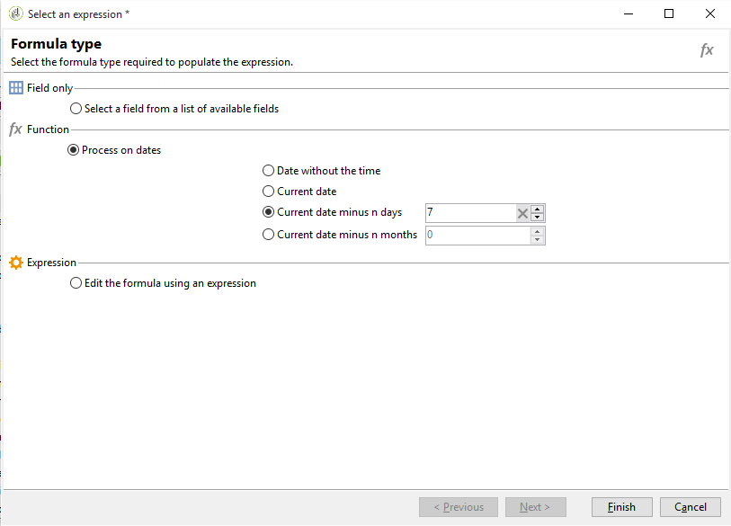

# 쿼리 게재 정보 {#querying-delivery-information}

## 특정 게재를 위한 클릭 수 {#number-of-clicks-for-a-specific-delivery}

이 예제에서는 특정 게재를 위한 클릭 수를 복구하려고 합니다. 이러한 클릭은 주어진 기간에 걸쳐 수행한 수신자 추적 로그 덕분에 기록됩니다. 수신자는 이메일 주소를 통해 식별됩니다. 이 쿼리는 **[!UICONTROL Recipient tracking logs]** 테이블.

* 어떤 테이블을 선택해야 합니까?

   받는 사람 로그 추적 테이블(**[!UICONTROL nms:trackingLogRcp]**)

* 출력 열에 대해 선택할 필드?

   기본 키(개수 포함) 및 이메일

* 어떤 기준으로 정보를 필터링합니까?

   게재 레이블의 특정 기간 및 요소

이 예제를 수행하려면 다음 단계를 수행합니다.

1. 를 엽니다. **[!UICONTROL Generic query editor]** 을(를) 선택하고 을(를) 선택합니다. **[!UICONTROL Recipient tracking logs]** 스키마.

   

1. 에서 **[!UICONTROL Data to extract]** 창의 정보를 수집하기 위한 합계를 만들고자 합니다. 이렇게 하려면 기본 키(기본 키 위에 있음)를 추가합니다 **[!UICONTROL Recipient tracking logs]** element): 추적 로그 수는 이에 대해 수행됩니다 **[!UICONTROL Primary key]** 필드. 편집된 표현식은 **[!UICONTROL x=count(primary key)]**. 다양한 추적 로그 합계를 단일 이메일 주소에 연결합니다.

   방법은 다음과 같습니다.

   * 을(를) 클릭합니다. **[!UICONTROL Add]** 아이콘 을 클릭합니다. **[!UICONTROL Output columns]** 필드. 에서 **[!UICONTROL Formula type]** 창에서 **[!UICONTROL Edit the formula using an expression]** 옵션을 선택하고 **[!UICONTROL Next]**. 에서 **[!UICONTROL Field to select]** 창 **[!UICONTROL Advanced selection]**.

      

   * 에서 **[!UICONTROL Formula type]** 창의 합계 함수에서 프로세스를 실행합니다. 이 프로세스는 기본 키 개수입니다.

      선택 **[!UICONTROL Process on an aggregate function]** 에서 **[!UICONTROL Aggregate]** 섹션을 클릭하고 **[!UICONTROL Count]**.

      

      **[!UICONTROL Next]**&#x200B;를 클릭합니다.

   * 을(를) 선택합니다 **[!UICONTROL Primary key (@id)]** 필드. 다음 **[!UICONTROL count (primary key)]** 출력 열이 구성되어 있습니다.

      

1. 출력 열에 표시할 다른 필드를 선택합니다. 에서 **[!UICONTROL Available fields]** 열을 열고 **[!UICONTROL Recipient]** 노드 및 **[!UICONTROL Email]**. 을(를) 확인합니다. **[!UICONTROL Group]** 상자에 **[!UICONTROL Yes]** 추적 로그를 이메일 주소로 그룹화하려면: 이 그룹은 각 로그를 수신자에게 연결합니다.

   

1. 가장 활성 상태인 수신자(대부분의 추적 로그 포함)가 먼저 표시되도록 열 정렬을 구성합니다. 확인 **[!UICONTROL Yes]** 에서 **[!UICONTROL Descending sort]** 열.

   

1. 그런 다음 관심 있는 로그(즉, 2주 미만 및 판매 관련 게재와 관련된 로그)를 필터링해야 합니다.

   방법은 다음과 같습니다.

   * 데이터 필터링을 구성합니다. 이렇게 하려면 을(를) 선택합니다. **[!UICONTROL Filter conditions]** 을 클릭한 다음 **[!UICONTROL Next]**.

      

   * 특정 게재를 위해 주어진 기간 동안 추적 로그를 복구합니다. 다음 세 가지 필터링 조건이 필요합니다. 현재 날짜보다 2주 전에 검색 기간을 설정하고 현재 날짜보다 이전 날짜 사이에 검색 기간을 설정하는 두 가지 날짜 조건 및 검색을 특정 게재로 제한하는 다른 조건.

      에서 **[!UICONTROL Target element]** 창에서 추적 로그를 고려할 날짜부터 날짜를 구성합니다. **[!UICONTROL Add]**&#x200B;을(를) 클릭합니다. 조건 선이 표시됩니다. 편집 **[!UICONTROL Expression]** 열을 클릭하여 **[!UICONTROL Edit expression]** 함수 위에 있어야 합니다. 에서 **[!UICONTROL Field to select]** 창, **[!UICONTROL Date (@logDate)]**.

      

      을(를) 선택합니다 **[!UICONTROL greater than]** 연산자를 사용할 수 있습니다. 에서 **[!UICONTROL Value]** 열, **[!UICONTROL Edit expression]**, 및에서 **[!UICONTROL Formula type]** 창, 선택 **[!UICONTROL Process on dates]**. 마지막으로, **[!UICONTROL Current date minus n days]**&#x200B;를 입력하고 &quot;15&quot;를 입력합니다.

      **[!UICONTROL Finish]**&#x200B;를 클릭합니다.

      

   * 추적 로그 검색 종료 날짜를 선택하려면 를 클릭하여 두 번째 조건을 만듭니다 **[!UICONTROL Add]**. 에서 **[!UICONTROL Expression]** 열, 선택 **[!UICONTROL Date (@logDate)]** 다시 한 번

      을(를) 선택합니다 **[!UICONTROL less than]** 연산자를 사용할 수 있습니다. 에서 **[!UICONTROL Value]** 열, **[!UICONTROL Edit expression]**. 날짜 처리를 위해 **[!UICONTROL Formula type]** 창에 &quot;1&quot;을 입력합니다. **[!UICONTROL Current date minus n days]**.

      **[!UICONTROL Finish]**&#x200B;를 클릭합니다.

      

      이제 세 번째 필터 조건(예: 쿼리가 관여하는 게재 레이블)을 구성하려고 합니다.

   * 을(를) 클릭합니다. **[!UICONTROL Add]** 다른 필터링 조건을 만드는 함수입니다. 에서 **[!UICONTROL Expression]** 열, **[!UICONTROL Edit expression]**. 에서 **[!UICONTROL Field to select]** 창, **[!UICONTROL Label]** 에서 **[!UICONTROL Delivery]** 노드 아래에 있어야 합니다.

      **[!UICONTROL Finish]**&#x200B;를 클릭합니다.

      

      &quot;sales&quot;라는 단어가 포함된 게재를 찾습니다. 정확한 레이블을 기억하지 않으므로 **[!UICONTROL contains]** 연산자를 입력하고 **[!UICONTROL Value]** 열.

      

1. 클릭 **[!UICONTROL Next]** 당신이 **[!UICONTROL Data preview]** 창: 여기에 서식을 지정할 필요가 없습니다.
1. 에서 **[!UICONTROL Data preview]** 창 **[!UICONTROL Start the preview of the data]** 각 게재 수신자에 대한 추적 로그 수를 확인합니다.

   결과는 내림차순으로 표시됩니다.

   

   사용자에 대한 가장 많은 로그 수는 이 게재에 대해 6개입니다. 5명의 다른 사용자가 게재 이메일을 열거나 이메일에 있는 링크 중 하나를 클릭합니다.

## 게재를 열지 않은 수신자 {#recipients-who-did-not-open-any-delivery}

이 예제에서는 지난 7일 동안 이메일을 열지 않은 수신자를 필터링하려고 합니다.

이 예제를 만들려면 다음 단계를 적용합니다.

1. 끌어서 놓기 **[!UICONTROL Query]** 활동 을 워크플로우에서 열고 활동을 엽니다.
1. 클릭 **[!UICONTROL Edit query]** 타겟과 필터링 차원을 **[!UICONTROL Recipients]**.

   

1. 선택 **[!UICONTROL Filtering conditions]** 을 클릭한 다음 **[!UICONTROL Next]**.
1. 을(를) 클릭합니다. **[!UICONTROL Add]** 단추를 누르고 선택합니다. **[!UICONTROL Tracking logs]**.
1. 설정 **[!UICONTROL Operator]** 의 **[!UICONTROL Tracking logs]** 표현식 **[!UICONTROL Do not exist such as]**.

   

1. 다른 표현식을 추가합니다. 선택 **[!UICONTROL Type]** 에서 **[!UICONTROL URL]** 카테고리.
1. 그런 다음 **[!UICONTROL Operator]** to **[!UICONTROL equal to]** 및 **[!UICONTROL Value]** to **[!UICONTROL Open]**.

   

1. 다른 표현식을 추가하고 을(를) 선택합니다 **[!UICONTROL Date]**. **[!UICONTROL Operator]** 는 로 설정되어야 합니다. **[!UICONTROL on or after]**.

   

1. 최근 7일 동안 값을 설정하려면 **[!UICONTROL Edit expression]** 단추 **[!UICONTROL Value]** 필드.
1. 에서 **[!UICONTROL Function]** 카테고리, 선택 **[!UICONTROL Current date minus n days]** 타겟팅할 일 수를 추가합니다. 여기에서는 지난 7일을 타겟팅하려고 합니다

   

아웃바운드 전환에는 지난 7일 동안 이메일을 열지 않은 수신자가 포함됩니다.

반대로 하나 이상의 이메일을 연 수신자를 필터링하려면 다음과 같이 쿼리를 필터링해야 합니다. 이 경우 **[!UICONTROL Filtering dimension]** 는 로 설정되어야 합니다. **[!UICONTROL Tracking logs (Recipients)]**.

## 게재를 연 수신자 {#recipients-who-have-opened-a-delivery}

다음 예제에서는 지난 2주 내에 게재를 연 프로필을 타겟팅하는 방법을 보여줍니다.

1. 게재를 연 프로필을 타겟팅하려면 추적 로그를 사용해야 합니다. 연결된 테이블에 저장됩니다. 먼저 페이지의 드롭다운 목록에서 이 테이블을 선택하여 **[!UICONTROL Filtering dimension]** 아래와 같이 필드가 표시됩니다.

   

1. 필터링 조건을 보려면 **[!UICONTROL Edit expression]** 추적 로그의 하위 트리 구조에 표시된 기준의 아이콘입니다. 을(를) 선택합니다 **[!UICONTROL Date]** 필드.

   

   클릭 **[!UICONTROL Finish]** 을 클릭하여 선택 항목을 확인합니다.

   2주 미만의 추적 로그만 복구하려면 **[!UICONTROL Greater than]** 연산자를 사용할 수 있습니다.

   

   그런 다음 **[!UICONTROL Edit expression]** 아이콘( **[!UICONTROL Value]** 열을 사용하여 적용할 계산 공식을 정의합니다. 을(를) 선택합니다 **[!UICONTROL Current date minus n days]** 공식을 입력하고 관련 필드에 15를 입력합니다.

   

   을(를) 클릭합니다. **[!UICONTROL Finish]** 수식 창의 단추입니다. 필터링 창에서 **[!UICONTROL Preview]** 탭을 클릭하여 타깃팅 기준을 확인합니다.

   

## 게재 후 수신자 동작 필터링 {#filtering-recipients--behavior-folllowing-a-delivery}

워크플로우에서 **[!UICONTROL Query]** 및 **[!UICONTROL Split]** 상자에서는 이전 게재 이후 동작을 선택할 수 있습니다. 이 선택 사항은 **[!UICONTROL Delivery recipient]** 필터.

* 예제의 목적

   게재 워크플로우에서는 첫 번째 이메일 통신을 수행하는 방법에는 여러 가지가 있습니다. 이 유형의 작업에는 **[!UICONTROL Split]** 상자.

* 컨텍스트

   여름 스포츠 오퍼 게재가 전송됩니다. 게재 4일 후, 다른 2개의 게재가 전송됩니다. 그 중 하나는 &quot;수상 스포츠 오퍼&quot;이고, 다른 하나는 첫 번째 &quot;여름 스포츠 오퍼&quot;에 대한 후속 상품이다.

   &quot;Watersports 오퍼&quot; 게재는 첫 번째 게재에서 &quot;Watersports&quot; 링크를 클릭한 수신자에게 전송됩니다. 이러한 클릭은 수신자가 주제에 관심이 있음을 보여줍니다. 그들을 유사한 제안으로 유도하는 것이 타당하다. 그러나 &quot;여름 스포츠 오퍼&quot;를 클릭하지 않은 수신자는 동일한 콘텐츠를 다시 받게 됩니다.

다음 단계는 을 구성하는 방법을 보여 줍니다 **[!UICONTROL Split]** 두 개의 다른 동작을 통합하여 표시할 수 있습니다.

1. 를 삽입합니다. **[!UICONTROL Split]** 상자에 스크롤 막대가 표시되지 않던 문제를 수정했습니다. 이 상자는 첫 번째 게재의 수신자를 다음 두 게재로 분류합니다. 분류는 첫 번째 게재 중 수신자 동작에 연결된 필터링 조건을 기반으로 합니다.

   

1. 를 엽니다. **[!UICONTROL Split]** 상자. 에서 **[!UICONTROL General]** 탭에서 레이블을 입력합니다. **동작에 따라 분할** 예를 들어,

   

1. 에서 **[!UICONTROL Subsets]** 탭에서 첫 번째 분할 분기를 정의합니다. 예를 들어, **클릭됨** 이 분기의 레이블입니다.
1. 을(를) 선택합니다 **[!UICONTROL Add a filtering condition on the incoming population]** 선택 사항입니다. **[!UICONTROL Edit]**&#x200B;를 클릭합니다.
1. 에서 **[!UICONTROL Targeting and filtering dimension]** 창을 두 번 클릭합니다 **[!UICONTROL Recipients of a delivery]** 필터.

   

1. 에서 **[!UICONTROL Target element]** 창의 이 분기에 적용할 동작을 선택합니다. **[!UICONTROL Recipients having clicked (email)]**.

   아래에서 을(를) 선택합니다 **[!UICONTROL Delivery specified by the transition]** 선택 사항입니다. 이 기능은 첫 번째 게재 동안 타겟팅된 사람을 자동으로 복구합니다.

   &quot;수상 스포츠 오퍼&quot; 배달입니다.

   

1. 두 번째 분기를 정의합니다. 이 분기에는 첫 번째 게재와 동일한 컨텐츠가 있는 후속 이메일이 포함됩니다. 로 이동합니다. **[!UICONTROL Subsets]** 탭을 클릭하고 **[!UICONTROL Add]** 만들 수 있습니다.

   

1. 다른 하위 탭이 표시됩니다. 이름을 &quot;**클릭하지 않음**&quot;.
1. **[!UICONTROL Add a filtering condition for the incoming population]**&#x200B;을(를) 클릭합니다. 그 다음 **[!UICONTROL Edit...]**&#x200B;을(를) 클릭합니다.

   

1. 클릭 **[!UICONTROL Delivery recipients]** 에서 **[!UICONTROL Targeting and filtering dimension]** 창을 엽니다.
1. 에서 **[!UICONTROL Target element]** 창에서 **[!UICONTROL Recipients who did not click (email)]** 비헤이비어. 을(를) 선택합니다 **[!UICONTROL Delivery specified by the transition]** 마지막 분기에 대해 표시된 옵션.

   다음 **[!UICONTROL Split]** 이제 상자가 완전히 구성되었습니다.

   

다음은 기본적으로 구성된 다양한 구성 요소 목록입니다.

* **[!UICONTROL All recipients]**
* **[!UICONTROL Recipients of successfully sent messages,]**
* **[!UICONTROL Recipients who opened or clicked (email),]**
* **[!UICONTROL Recipients who clicked (email),]**
* **[!UICONTROL Recipients of a failed message,]**
* **[!UICONTROL Recipients who didn't open or click (email),]**
* **[!UICONTROL Recipients who didn't click (email).]**

   
