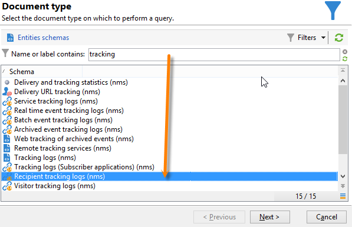
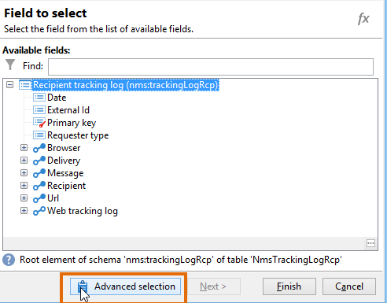

# 쿼리 게재 정보 {#querying-delivery-information}

## 특정 게재에 대한 클릭 수 {#number-of-clicks-for-a-specific-delivery}

이 예제에서는 특정 게재에 대한 클릭 수를 복구하려고 합니다. 이러한 클릭은 지정된 기간 동안 받은 수신자 추적 로그 덕분에 기록됩니다. 수신자는 이메일 주소를 통해 식별됩니다. 이 쿼리는 **[!UICONTROL Recipient tracking logs]** 테이블을 사용합니다.

* 어떤 테이블을 선택해야 합니까?

  받는 사람 로그 추적 테이블(**[!UICONTROL nms:trackingLogRcp]**)

* 출력 열에 대해 선택할 필드입니까?

  기본 키(개수 포함) 및 이메일

* 정보는 어떤 기준을 기반으로 필터링됩니까?

  게재 레이블의 특정 기간 및 요소

이 예를 수행하려면 다음 단계를 적용합니다.

1. **[!UICONTROL Generic query editor]**&#x200B;을(를) 열고 **[!UICONTROL Recipient tracking logs]** 스키마를 선택합니다.

   

1. **[!UICONTROL Data to extract]** 창에서 정보를 수집할 집계를 만들려고 합니다. 이렇게 하려면 기본 키(기본 **[!UICONTROL Recipient tracking logs]** 요소 위에 있음)를 추가합니다. 추적 로그 수는 이 **[!UICONTROL Primary key]** 필드에서 수행됩니다. 편집된 식은 **[!UICONTROL x=count(primary key)]**&#x200B;이(가) 됩니다. 다양한 추적 로그의 합계를 단일 이메일 주소에 연결합니다.

   방법은 다음과 같습니다.

   * **[!UICONTROL Output columns]** 필드 오른쪽에 있는 **[!UICONTROL Add]** 아이콘을 클릭합니다. **[!UICONTROL Formula type]** 창에서 **[!UICONTROL Edit the formula using an expression]** 옵션을 선택하고 **[!UICONTROL Next]**&#x200B;을(를) 클릭합니다. **[!UICONTROL Field to select]** 창에서 **[!UICONTROL Advanced selection]**&#x200B;을(를) 클릭합니다.

     

   * **[!UICONTROL Formula type]** 창에서 집계 함수에서 프로세스를 실행합니다. 이 프로세스는 기본 키 수가 됩니다.

     **[!UICONTROL Aggregate]** 섹션에서 **[!UICONTROL Process on an aggregate function]**&#x200B;을(를) 선택하고 **[!UICONTROL Count]**&#x200B;을(를) 클릭합니다.

     

     **[!UICONTROL Next]**&#x200B;를 클릭합니다.

   * **[!UICONTROL Primary key (@id)]** 필드를 선택합니다. **[!UICONTROL count (primary key)]** 출력 열이 구성되어 있습니다.

     

1. 출력 열에 표시할 다른 필드를 선택합니다. **[!UICONTROL Available fields]** 열에서 **[!UICONTROL Recipient]** 노드를 열고 **[!UICONTROL Email]**&#x200B;을(를) 선택합니다. 전자 메일 주소로 추적 로그를 그룹화하려면 **[!UICONTROL Yes]**&#x200B;의 **[!UICONTROL Group]** 상자를 선택하십시오. 이 그룹은 각 로그를 수신자에게 연결합니다.

   

1. 가장 활동적인 수신자(가장 많은 추적 로그 포함)가 먼저 표시되도록 열 정렬을 구성합니다. **[!UICONTROL Descending sort]** 열에서 **[!UICONTROL Yes]**&#x200B;을(를) 확인합니다.

   

1. 그런 다음 관심 있는 로그, 즉 2주 미만이고 판매 관련 게재와 관련된 로그를 필터링해야 합니다.

   방법은 다음과 같습니다.

   * 데이터 필터링을 구성합니다. 이렇게 하려면 **[!UICONTROL Filter conditions]**&#x200B;을(를) 선택한 다음 **[!UICONTROL Next]**&#x200B;을(를) 클릭합니다.

     

   * 특정 게재에 대해 지정된 기간 동안 추적 로그를 복구합니다. 현재 날짜의 2주 전과 현재 날짜의 전날 사이에서 검색 기간을 설정하는 두 개의 날짜 조건과 특정 게재로 검색을 제한하는 다른 조건, 이렇게 세 가지 필터링 조건이 필요합니다.

     **[!UICONTROL Target element]** 창에서 추적 로그를 고려할 시작 날짜를 구성합니다. **[!UICONTROL Add]**&#x200B;을(를) 클릭합니다. 조건 줄이 표시됩니다. **[!UICONTROL Edit expression]** 함수를 클릭하여 **[!UICONTROL Expression]** 열을 편집합니다. **[!UICONTROL Field to select]** 창에서 **[!UICONTROL Date (@logDate)]**&#x200B;을(를) 선택합니다.

     

     **[!UICONTROL greater than]** 연산자를 선택하십시오. **[!UICONTROL Value]** 열에서 **[!UICONTROL Edit expression]**&#x200B;을(를) 클릭하고 **[!UICONTROL Formula type]** 창에서 **[!UICONTROL Process on dates]**&#x200B;을(를) 선택합니다. 마지막으로 **[!UICONTROL Current date minus n days]**&#x200B;에서 &quot;15&quot;를 입력하십시오.

     **[!UICONTROL Finish]**&#x200B;를 클릭합니다.

     

   * 추적 로그 검색 종료 날짜를 선택하려면 **[!UICONTROL Add]**&#x200B;을(를) 클릭하여 두 번째 조건을 만드십시오. **[!UICONTROL Expression]** 열에서 **[!UICONTROL Date (@logDate)]**&#x200B;을(를) 다시 선택합니다.

     **[!UICONTROL less than]** 연산자를 선택하십시오. **[!UICONTROL Value]** 열에서 **[!UICONTROL Edit expression]**&#x200B;을(를) 클릭합니다. 날짜 처리를 위해 **[!UICONTROL Formula type]** 창으로 이동하여 **[!UICONTROL Current date minus n days]**&#x200B;에 &quot;1&quot;을(를) 입력하십시오.

     **[!UICONTROL Finish]**&#x200B;를 클릭합니다.

     

     이제 쿼리와 관련된 세 번째 필터 조건, 즉 게재 레이블을 구성하려고 합니다.

   * 다른 필터링 조건을 만들려면 **[!UICONTROL Add]** 함수를 클릭하십시오. **[!UICONTROL Expression]** 열에서 **[!UICONTROL Edit expression]**&#x200B;을(를) 클릭합니다. **[!UICONTROL Field to select]** 창의 **[!UICONTROL Delivery]** 노드에서 **[!UICONTROL Label]**&#x200B;을(를) 선택합니다.

     **[!UICONTROL Finish]**&#x200B;를 클릭합니다.

     

     &quot;sales&quot;라는 단어가 포함된 게재를 찾습니다. 정확한 레이블이 기억나지 않으므로 **[!UICONTROL contains]** 연산자를 선택하고 **[!UICONTROL Value]** 열에 &quot;sales&quot;를 입력할 수 있습니다.

     

1. **[!UICONTROL Data preview]** 창으로 이동할 때까지 **[!UICONTROL Next]**&#x200B;을(를) 클릭합니다. 여기에는 서식이 필요하지 않습니다.
1. **[!UICONTROL Data preview]** 창에서 **[!UICONTROL Start the preview of the data]**&#x200B;을(를) 클릭하여 각 게재 수신자에 대한 추적 로그 수를 확인합니다.

   결과는 내림차순으로 표시됩니다.

   

   사용자의 가장 높은 로그 수는 이 게재에 대해 6입니다. 5명의 다른 사용자가 게재 이메일을 열거나 이메일에 있는 링크 중 하나를 클릭했습니다.

## 게재를 열지 않은 수신자 {#recipients-who-did-not-open-any-delivery}

이 예제에서는 지난 7일 동안 이메일을 열지 않은 수신자를 필터링하려고 합니다.

이 예제를 만들려면 다음 단계를 적용합니다.

1. 워크플로우에서 **[!UICONTROL Query]** 활동을 끌어다 놓고 활동을 엽니다.
1. **[!UICONTROL Edit query]**&#x200B;을(를) 클릭하고 대상 및 필터링 차원을 **[!UICONTROL Recipients]**(으)로 설정합니다.

   

1. **[!UICONTROL Filtering conditions]**&#x200B;을(를) 선택한 다음 **[!UICONTROL Next]**&#x200B;을(를) 클릭합니다.
1. **[!UICONTROL Add]** 단추를 클릭하고 **[!UICONTROL Tracking logs]**&#x200B;을(를) 선택합니다.
1. **[!UICONTROL Tracking logs]** 식의 **[!UICONTROL Operator]**&#x200B;을(를) **[!UICONTROL Do not exist such as]**(으)로 설정합니다.

   

1. 다른 표현식을 추가합니다. **[!UICONTROL URL]** 범주에서 **[!UICONTROL Type]**&#x200B;을(를) 선택합니다.
1. **[!UICONTROL Operator]**&#x200B;을(를) **[!UICONTROL equal to]**(으)로 설정하고 **[!UICONTROL Value]**&#x200B;을(를) **[!UICONTROL Open]**(으)로 설정합니다.

   

1. 다른 식을 추가하고 **[!UICONTROL Date]**&#x200B;을(를) 선택합니다. **[!UICONTROL Operator]**&#x200B;을(를) **[!UICONTROL on or after]**(으)로 설정해야 합니다.

   

1. 최근 7일 값을 설정하려면 **[!UICONTROL Value]** 필드의 **[!UICONTROL Edit expression]** 단추를 클릭합니다.
1. **[!UICONTROL Function]** 범주에서 **[!UICONTROL Current date minus n days]**&#x200B;을(를) 선택하고 타깃팅할 일수를 추가합니다. 여기에서는 지난 7일을 타겟팅하려고 합니다.

   

아웃바운드 전환에는 지난 7일 동안 이메일을 열지 않은 수신자가 포함됩니다.

반대로 하나 이상의 이메일을 연 수신자를 필터링하려면 쿼리를 다음과 같이 해야 합니다. 이 경우 **[!UICONTROL Filtering dimension]**&#x200B;을(를) **[!UICONTROL Tracking logs (Recipients)]**(으)로 설정해야 합니다.

## 게재를 연 수신자 {#recipients-who-have-opened-a-delivery}

다음 예제에서는 지난 2주 내에 게재를 연 프로필을 타겟팅하는 방법을 보여 줍니다.

1. 게재를 연 프로필을 타겟팅하려면 추적 로그를 사용해야 합니다. 연결된 테이블에 저장됩니다. **[!UICONTROL Filtering dimension]** 필드의 드롭다운 목록에서 아래와 같이 이 테이블을 선택하여 시작합니다.

   

1. 필터링 조건과 관련하여 추적 로그의 하위 트리 구조에 표시된 기준의 **[!UICONTROL Edit expression]** 아이콘을 클릭합니다. **[!UICONTROL Date]** 필드를 선택합니다.

   

   선택을 확인하려면 **[!UICONTROL Finish]**&#x200B;을(를) 클릭합니다.

   2주 미만의 추적 로그만 복구하려면 **[!UICONTROL Greater than]** 연산자를 선택하십시오.

   

   그런 다음 **[!UICONTROL Value]** 열의 **[!UICONTROL Edit expression]** 아이콘을 클릭하여 적용할 계산 공식을 정의합니다. **[!UICONTROL Current date minus n days]** 수식을 선택하고 관련 필드에 15를 입력합니다.

   

   수식 창의 **[!UICONTROL Finish]** 단추를 클릭합니다. 필터링 창에서 **[!UICONTROL Preview]** 탭을 클릭하여 타깃팅 기준을 확인합니다.

   

## 게재 후 수신자 동작 필터링 {#filtering-recipients--behavior-folllowing-a-delivery}

워크플로우에서 **[!UICONTROL Query]** 및 **[!UICONTROL Split]** 상자를 사용하면 이전 게재 이후의 동작을 선택할 수 있습니다. 이 선택은 **[!UICONTROL Delivery recipient]** 필터를 통해 수행됩니다.

* 예제의 목표

  게재 워크플로우에서는 첫 번째 이메일 커뮤니케이션을 추적하는 여러 가지 방법이 있습니다. 이 유형의 작업에는 **[!UICONTROL Split]** 상자를 사용하는 작업이 포함됩니다.

* 컨텍스트

  &quot;여름 스포츠 오퍼&quot; 게재가 전송됩니다. 배송 후 4일이 지나면 다른 두 건의 배송이 전송됩니다. 그 중 하나가 &#39;수상 스포츠 오퍼&#39;이고, 다른 하나는 첫 번째 &#39;여름 스포츠 오퍼&#39; 배송의 후속 오퍼다.

  첫 번째 게재에서 &quot;수상 스포츠&quot; 링크를 클릭한 수신자에게 &quot;수상 스포츠 오퍼&quot; 게재가 전송됩니다. 이러한 클릭은 수신자가 주제에 관심이 있음을 보여 줍니다. 비슷한 제안을 하도록 그들을 조종하는 것은 타당하다. 단, &#39;여름 스포츠 오퍼&#39;를 클릭하지 않은 수신자는 동일한 콘텐츠를 다시 받게 된다.

다음 단계에서는 서로 다른 두 동작을 통합하여 **[!UICONTROL Split]** 상자를 구성하는 방법을 보여 줍니다.

1. 워크플로우에 **[!UICONTROL Split]** 상자를 삽입합니다. 이 상자에서는 첫 번째 게재의 수신자를 다음 두 개의 게재로 분류합니다. 첫 번째 게재 중 수신자 동작에 연결된 필터링 조건을 기반으로 분류가 수행됩니다.

   

1. **[!UICONTROL Split]** 상자를 엽니다. **[!UICONTROL General]** 탭에서 레이블: **동작을 기준으로 분할**&#x200B;을(를) 입력합니다.

   

1. **[!UICONTROL Subsets]** 탭에서 첫 번째 분할 분기를 정의합니다. 예를 들어 이 분기의 **클릭됨** 레이블을 입력합니다.
1. **[!UICONTROL Add a filtering condition on the incoming population]** 옵션을 선택하십시오. **[!UICONTROL Edit]**&#x200B;를 클릭합니다.
1. **[!UICONTROL Targeting and filtering dimension]** 창에서 **[!UICONTROL Recipients of a delivery]** 필터를 두 번 클릭합니다.

   

1. **[!UICONTROL Target element]** 창에서 이 분기에 적용할 동작을 선택하십시오. **[!UICONTROL Recipients having clicked (email)]**.

   아래에서 **[!UICONTROL Delivery specified by the transition]** 옵션을 선택하십시오. 이 기능은 첫 번째 게재 중에 타겟팅된 사용자를 자동으로 복구합니다.

   이것은 &quot;수상 스포츠 오퍼&quot; 게재입니다.

   

1. 두 번째 분기를 정의합니다. 이 분기에는 첫 번째 게재와 동일한 내용의 후속 이메일이 포함됩니다. **[!UICONTROL Subsets]** 탭으로 이동하여 **[!UICONTROL Add]**&#x200B;을(를) 클릭하여 만듭니다.

   

1. 다른 하위 탭이 표시됩니다. 이름을 &quot;**클릭하지 않음**&quot;으로 지정합니다.
1. **[!UICONTROL Add a filtering condition for the incoming population]**&#x200B;을(를) 클릭합니다. 그 다음 **[!UICONTROL Edit...]**&#x200B;을(를) 클릭합니다.

   

1. **[!UICONTROL Targeting and filtering dimension]** 창에서 **[!UICONTROL Delivery recipients]**&#x200B;을(를) 클릭합니다.
1. **[!UICONTROL Target element]** 창에서 **[!UICONTROL Recipients who did not click (email)]** 동작을 선택합니다. 마지막 분기에 표시된 대로 **[!UICONTROL Delivery specified by the transition]** 옵션을 선택합니다.

   이제 **[!UICONTROL Split]** 상자가 완전히 구성되었습니다.

   

다음은 기본적으로 구성된 다양한 구성 요소 목록입니다.

* **[!UICONTROL All recipients]**
* **[!UICONTROL Recipients of successfully sent messages,]**
* **[!UICONTROL Recipients who opened or clicked (email),]**
* **[!UICONTROL Recipients who clicked (email),]**
* **[!UICONTROL Recipients of a failed message,]**
* **[!UICONTROL Recipients who didn't open or click (email),]**
* **[!UICONTROL Recipients who didn't click (email).]**

  
