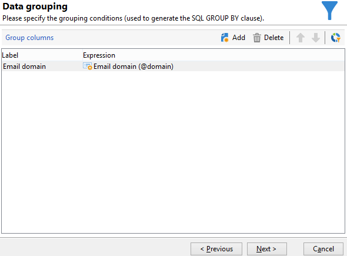
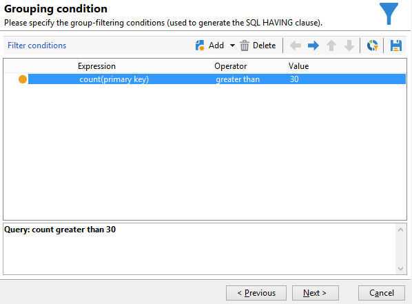

# 그룹 관리를 사용한 쿼리 {#querying-using-grouping-management}

이 예제에서는 쿼리를 실행하여 이전 게재 동안 30번 이상 타겟팅된 모든 이메일 도메인을 검색하려고 합니다.

* 어떤 테이블을 선택해야 합니까?

   수신자 테이블(nms:recipient)

* 출력 열에서 선택할 필드?

   이메일 도메인 및 기본 키(개수 포함)

* 데이터 그룹화?

   기본 키가 30개를 초과하는 이메일 도메인을 기반으로 합니다. 이 작업은 **[!UICONTROL Group by + Having]** 선택 사항입니다. **[!UICONTROL Group by + Having]** 데이터를 그룹화(&quot;그룹화 기준&quot;)하고 그룹화된(&quot;포함&quot;)를 선택할 수 있습니다.

이 예제를 만들려면 다음 단계를 적용합니다.

1. 를 엽니다. **[!UICONTROL Generic query editor]** 수신자 테이블(**nms:recipient**).

   

1. 에서 **[!UICONTROL Data to extract]** 창에서 **[!UICONTROL Email domain]** 및 **[!UICONTROL Primary key]** 필드. 에서 카운트 실행 **[!UICONTROL Primary key]** 필드.

   기본 키 카운트에 대한 자세한 내용은 를 참조하십시오.

1. 을(를) 확인합니다. **[!UICONTROL Handle groupings (GROUP BY + HAVING)]** 상자.

   

1. 에서 **[!UICONTROL Sorting]** 창의 전자 메일 도메인을 내림차순으로 정렬하십시오. 이렇게 하려면 다음을 확인하십시오 **[!UICONTROL Yes]** 에서 **[!UICONTROL Descending sort]** 열. **[!UICONTROL Next]**&#x200B;를 클릭합니다.

   

1. **[!UICONTROL Data filtering]**&#x200B;에서 **[!UICONTROL Filtering conditions]**&#x200B;을(를) 선택합니다. 로 이동합니다. **[!UICONTROL Target elements]** 을(를) 클릭하고 **[!UICONTROL Next]**.
1. 에서 **[!UICONTROL Data grouping]** 창에서 **[!UICONTROL Email domain]** 를 클릭합니다. **[!UICONTROL Add]**.

   이 데이터 그룹 창은 **[!UICONTROL Handle groupings (GROUP BY + HAVING]**) 상자를 선택했습니다.

   

1. 에서 **[!UICONTROL Grouping condition]** 창의 경우 30번 이상 타겟팅된 이메일 도메인만 결과로 반환되도록 하기 때문에 기본 키 카운트가 30보다 큰 것으로 표시됩니다.

   이 창은 **[!UICONTROL Manage groupings (GROUP BY + HAVING)]** 상자를 선택했습니다. 여기서 그룹화 결과가 필터링됩니다(HAVING).

   

1. 에서 **[!UICONTROL Data formatting]** 창 **[!UICONTROL Next]**: 여기에 서식을 지정할 필요가 없습니다.
1. 데이터 미리 보기 창에서 **[!UICONTROL Launch data preview]**: 여기서는 30번 이상 타겟팅된 세 개의 다른 이메일 도메인이 반환됩니다.

   
