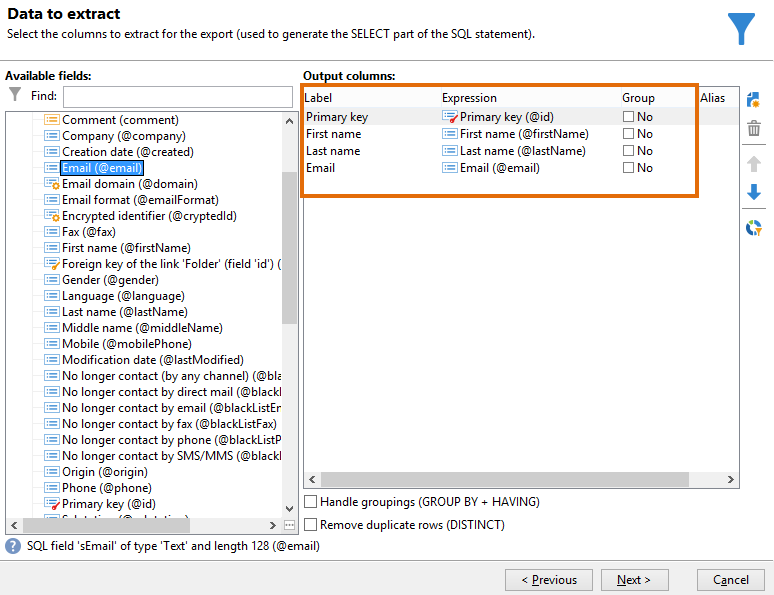

# 다대다 관계를 사용하여 쿼리 {#querying-using-a-many-to-many-relationship}


이 예제에서는 지난 7일 동안 연락을 하지 않은 수신자를 복구하려고 합니다. 이 쿼리는 모든 게재와 관련이 있습니다.

이 예에서는 컬렉션 요소(또는 주황색 노드) 선택과 관련된 필터를 구성하는 방법도 보여 줍니다. 컬렉션 요소는 다음에서 사용할 수 있습니다. **[!UICONTROL Field to select]** 창.

* 어떤 테이블을 선택해야 합니까?

  수신자 테이블 (**nms:recipient**)

* 출력 열에 대해 선택할 필드

  기본 키, 성, 이름 및 이메일

* 정보가 필터링되는 기준

  오늘 7일 전까지 거슬러 올라가는 수신자의 게재 로그 기준

다음 단계를 적용합니다.

1. 일반 쿼리 편집기를 열고 수신자 테이블을 선택합니다 **[!UICONTROL (nms:recipient)]**.
1. 다음에서 **[!UICONTROL Data to extract]** 창, 선택 **[!UICONTROL Primary key]**, **[!UICONTROL First name]**, **[!UICONTROL Last name]** 및 **[!UICONTROL Email]**.

   

1. 정렬 창에서 이름을 알파벳순으로 정렬합니다.

   

1. 다음에서 **[!UICONTROL Data filtering]** 창, 선택 **[!UICONTROL Filtering conditions]**.
1. 다음에서 **[!UICONTROL Target element]** 지난 7일 동안 추적 로그가 없는 프로필을 추출하기 위한 필터링 조건은 두 단계로 구성됩니다. 선택해야 하는 요소는 다대다 링크입니다.

   * 다음을 선택하여 시작 **[!UICONTROL Recipient delivery logs (broadlog)]** 첫 번째 요소의 컬렉션 요소(주황색 노드) **[!UICONTROL Value]** 열.

     

     다음을 선택합니다. **[!UICONTROL do not exist as]** 연산자. 이 행에서 두 번째 값을 선택할 필요는 없습니다.

   * 두 번째 필터링 조건의 콘텐츠는 첫 번째 필터링 조건에 따라 달라집니다. 여기, **[!UICONTROL Event date]** 필드는 다음에서 직접 제공됩니다. **[!UICONTROL Recipient delivery logs]** 이 테이블에 대한 링크가 있으므로 테이블을 편집하십시오.

     

     선택 **[!UICONTROL Event date]** (으)로 **[!UICONTROL greater than or equal to]** 연산자. 다음 항목 선택 **[!UICONTROL DaysAgo (7)]** 값. 이렇게 하려면 다음을 클릭하십시오. **[!UICONTROL Edit expression]** 다음에서 **[!UICONTROL Value]** 필드. 다음에서 **[!UICONTROL Formula type]** 창, 선택 **[!UICONTROL Process on dates]** 및 **[!UICONTROL Current date minus n days]**, 값으로 &quot;7&quot;을 제공합니다.

     

     필터 조건이 구성되었습니다.

     

1. 다음에서 **[!UICONTROL Data formatting]** 창에서는 성을 대문자로 바꿉니다. 다음을 클릭합니다. **[!UICONTROL Last name]** 줄 입력 **[!UICONTROL Transformation]** 열 및 선택 **[!UICONTROL Switch to upper case]** 을 클릭하여 제품에서 사용할 수 있습니다.

   

1. 사용 **[!UICONTROL Add a calculated field]** 함수를 사용하여 데이터 미리 보기 창에 열을 삽입합니다.

   이 예제에서는 수신자의 이름과 성이 포함된 계산된 필드를 단일 열에 추가합니다. 다음을 클릭합니다. **[!UICONTROL Add a calculated field]** 함수. 다음에서 **[!UICONTROL Export calculated field definition]** 창에서 레이블 및 내부 이름을 입력하고 **[!UICONTROL JavaScript Expression]** 유형. 그런 다음 다음 다음 표현식을 입력합니다.

   ```
   var rep = source._firstName+" - "+source._lastName
   return rep
   ```

   

   **[!UICONTROL OK]**&#x200B;을(를) 클릭합니다. 다음 **[!UICONTROL Data formatting]** 창이 구성되었습니다.

   계산된 필드를 추가하는 방법에 대한 자세한 내용은 이 섹션 을 참조하십시오.

1. 결과는 다음에 표시됩니다. **[!UICONTROL Data preview]** 창. 지난 7일 동안 연락을 하지 않은 수신자는 알파벳순으로 표시됩니다. 이름은 대문자로 표시되고 이름과 성이 있는 열이 생성됩니다.

   
