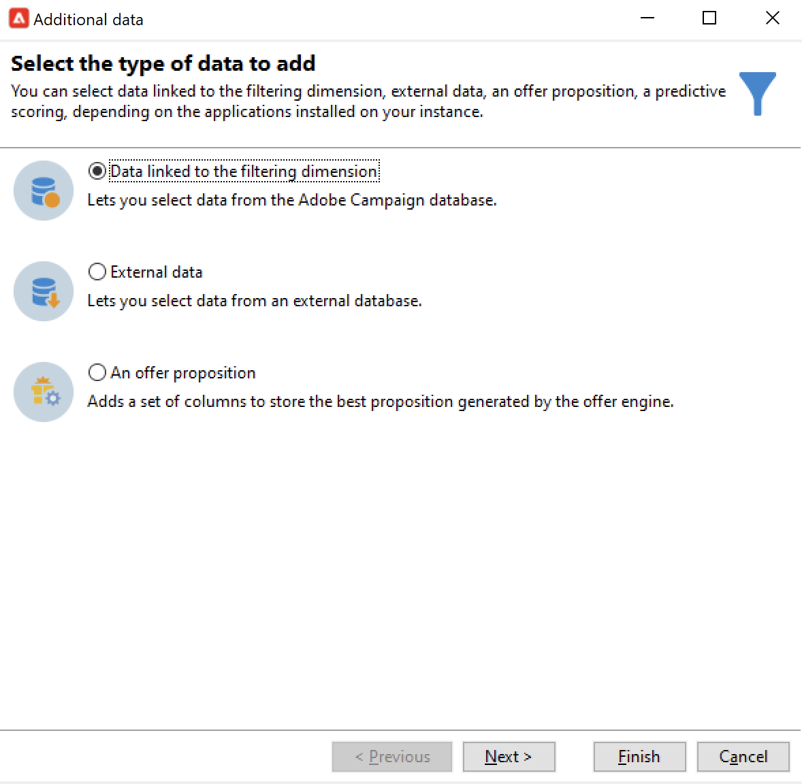
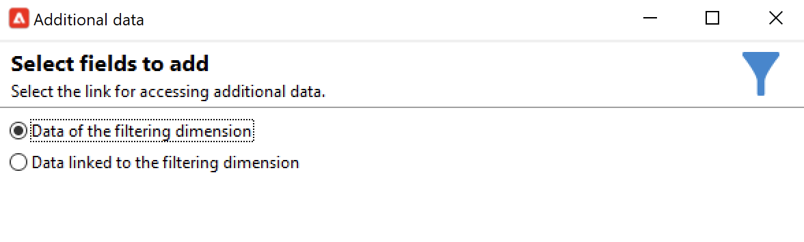

# 쿼리{#query}

## 쿼리 만들기 {#creating-a-query}

쿼리를 사용하면 기준에 따라 대상을 선택할 수 있습니다. 쿼리 결과에 세그먼트 코드를 연결하고 추가 데이터를 삽입할 수 있습니다.
쿼리 샘플에 대한 자세한 내용은 다음을 참조하십시오 [이 섹션](querying-recipient-table.md).

추가 데이터 사용 및 관리에 대한 자세한 내용은 [데이터 추가](#adding-data).

다음 **[!UICONTROL Edit query...]** 링크를 통해 다음과 같은 방법으로 모집단에 대한 타겟팅 유형, 제한 및 선택 기준을 정의할 수 있습니다.

1. 타겟팅 및 필터링 차원을 선택합니다. 기본적으로 수신자로부터 대상이 선택됩니다. 제한 필터 목록은 게재 타깃팅에 사용되는 필터와 동일합니다.

   타겟팅 차원은 작업 중인 요소 유형(예: 작업의 타겟팅된 모집단)과 일치합니다.

   필터링 차원을 사용하면 이러한 요소를 수집할 수 있습니다. 예를 들어 타겟팅된 사람과 관련된 정보(계약, 전체 및 최종 결제 등)가

   자세한 내용은 [차원 타겟팅 및 필터링](targeting-workflows.md#targeting-and-filtering-dimensions).

   

   쿼리는 필요한 경우 을(를) 선택하여 인바운드 전환의 데이터를 기반으로 할 수 있습니다 **[!UICONTROL Temporary schema]** 타겟팅 및 필터링 차원을 선택할 때

   

1. 마법사를 사용하여 모집단을 정의합니다. 입력할 필드는 대상 유형에 따라 다를 수 있습니다. 를 사용하여 현재 기준으로 타겟팅된 모집단을 미리 볼 수 있습니다. **[!UICONTROL Preview]** 탭.

   

1. 선택한 경우 **[!UICONTROL Filtering conditions]** 1단계에서 또는 **[!UICONTROL Filters]** > **[!UICONTROL Advanced filter...]** 옵션을 선택한 경우 나중에 필터링 기준을 수동으로 추가해야 합니다.

   해당 상자를 선택하여 데이터 그룹 조건을 추가할 수도 있습니다. 이렇게 하려면 필터링 차원이 쿼리의 타겟팅 차원과 달라야 합니다. 그룹화에 대한 자세한 내용은 다음을 참조하십시오 [섹션](query-grouping-management.md).

   표현식 빌더를 사용하여 논리 옵션 AND, OR 및 EXCEPT와 결합하여 기준을 더 추가할 수도 있습니다.

   나중에 다시 사용하려면 필터를 저장하십시오.

## 데이터 추가 {#adding-data}

추가 열을 사용하면 타겟팅된 모집단에 대한 추가 정보(예: 계약 번호, 뉴스레터 구독 또는 원본)를 수집할 수 있습니다. 이 데이터는 Adobe Campaign 데이터베이스 또는 외부 데이터베이스에 저장할 수 있습니다.

다음 **[!UICONTROL Add data...]** 링크를 사용하면 수집할 추가 데이터를 선택할 수 있습니다.

추가할 데이터 유형을 선택하여 시작합니다.

* 선택 **[!UICONTROL Data linked to the filtering dimension]** Adobe Campaign 데이터베이스에서 데이터를 선택하려면 다음을 수행하십시오.
* 선택 **[!UICONTROL External data]** 외부 데이터베이스에서 데이터를 추가하려면 다음을 수행하십시오. 이 옵션은 **페더레이션 데이터 액세스** 선택 사항입니다. 자세한 내용은 [외부 데이터베이스 액세스(FDA)](accessing-an-external-database--fda-.md).
* 을(를) 선택합니다 **[!UICONTROL An offer proposition]** 오퍼 엔진에서 생성된 최상의 제안을 저장할 수 있는 열 세트를 추가하는 옵션. 이 옵션은 **상호 작용** 모듈.

플랫폼에 선택적 모듈이 설치되어 있지 않으면 이 스테이지가 표시되지 않습니다. 다음 단계로 넘어가셔야 합니다.

Adobe Campaign 데이터베이스에서 데이터를 추가하려면 다음을 수행하십시오.

1. 추가할 데이터 유형을 선택합니다. 필터링 차원에 속하는 데이터 또는 연결된 테이블에 저장된 데이터일 수 있습니다.

   

1. 데이터가 쿼리의 필터링 차원에 속하는 경우 사용 가능한 필드 목록에서 해당 데이터를 선택하여 출력 열에 표시하면 됩니다.

   

   다음을 추가할 수 있습니다.

   * 타겟팅된 모집단이나 합계에서 수집한 데이터(지난 달 내 보류 중인 구매 수, 평균 수신 금액 등)를 기반으로 계산된 필드입니다. 예를 보려면 다음 위치로 이동하십시오. [데이터 선택](targeting-workflows.md#selecting-data).
   * 를 사용하여 만든 새 필드 **[!UICONTROL Add]** 출력 열 목록 오른쪽에 있는 단추.

      계약 목록, 최근 5개 납품 등과 같은 정보 수집을 추가할 수도 있습니다. 컬렉션은 동일한 프로필에 대해 여러 값을 가질 수 있는 필드(1-N 관계)와 일치합니다. 자세한 내용은 [추가 데이터 편집](targeting-workflows.md#editing-additional-data).

타겟팅된 모집단에 연결된 정보 컬렉션을 추가하려면

1. 마법사의 첫 번째 단계에서 **[!UICONTROL Data linked to the filtering dimension]** 옵션:
1. 수집할 정보가 포함된 테이블을 선택하고 **[!UICONTROL Next]**.

   

1. 필요한 경우, **[!UICONTROL Data collected]** 필드. 기본적으로 컬렉션의 모든 행은 복구된 다음 다음 단계에서 지정한 조건에 따라 필터링됩니다.

   * 컬렉션의 단일 요소가 이 컬렉션에 대한 필터링 조건과 일치하는 경우 **[!UICONTROL Single row]** 에서 **[!UICONTROL Data collected]** 필드.

      >[!IMPORTANT]
      >
      >이 모드는 수집 요소를 직접 고려하여 생성된 SQL 쿼리를 최적화합니다.
      >
      >초기 조건이 준수하지 않으면 결과 결함이 발생할 수 있습니다(누락 또는 중첩 라인).

   * 여러 줄을 복구하도록 선택하는 경우(**[!UICONTROL Limit the line count]**) 수집할 라인 수를 지정할 수 있습니다.
   * 수집된 열에 합계(예: 선언된 실패 수, 사이트의 평균 비용 등)가 포함되어 있는 경우 다음을 사용할 수 있습니다 **[!UICONTROL Aggregates]** 값.

   

1. 컬렉션의 하위 선택을 지정합니다.

   

1. 을(를) 선택한 경우 **[!UICONTROL Limit the line count]** 옵션을 선택하면 수집된 데이터를 필터링할 순서를 정의합니다. 수집한 라인 수가 유지하도록 지정한 라인 수보다 많으면 필터링 순서를 사용하여 유지할 라인을 지정할 수 있습니다.

## 예: 단순 수신자 속성에 대한 타겟팅 {#example--targeting-on-simple-recipient-attributes}

다음 예에서는 18세에서 30세 사이의 남자 및 프랑스에 거주하는 남성을 확인하려고 합니다. 이 쿼리는 예를 들어 독점 오퍼를 만드는 워크플로우에서 사용됩니다.

>[!NOTE]
>
>추가 쿼리 샘플은 [이 섹션](querying-recipient-table.md).

1. 쿼리의 이름을 지정한 다음 **[!UICONTROL Edit query...]** 링크를 클릭합니다.
1. 선택 **[!UICONTROL Filtering conditions]** 을 클릭합니다.
1. 제안된 대상에 대해 다른 기준을 입력합니다. 여기서는 AND 옵션을 사용하여 기준을 결합합니다. 선택 내용에 포함되려면 수신자는 다음 네 가지 조건을 충족해야 합니다.

   * 제목이 &quot;Mr&quot;인 수신자(또한 **성별** 필드 및 선택 **남성** 로서의).
   * 30세 미만의 수신자
   * 18세 이상 수신자
   * 프랑스에 살고 있는 수신자.

   

   기준 조합과 일치하는 SQL을 볼 수 있습니다.

   

1. 관련 탭에서 쿼리와 일치하는 수신자를 미리 보고 기준이 올바른지 확인할 수 있습니다.

   

1. 나중에 을(를) 클릭하여 다시 사용할 수 있도록 필터를 저장합니다 **[!UICONTROL Finish]** > **[!UICONTROL OK]**.
1. 다른 활동을 추가하여 워크플로우를 계속 편집합니다. 쿼리 단계가 시작되고 이전 쿼리 단계가 완료되면 찾은 수신자 수가 표시됩니다. 마우스 팝업 메뉴( 전환 > 마우스 오른쪽 클릭)를 사용하여 세부 정보를 표시할 수 있습니다 **[!UICONTROL Display the target...]**).

   

## 출력 매개 변수 {#output-parameters}

* tableName
* 스키마
* recCount

이 세 값 집합은 쿼리의 타겟팅된 모집단을 식별합니다. **[!UICONTROL tableName]** 는 대상 식별자를 기록하는 테이블의 이름입니다. **[!UICONTROL schema]** 는 모집단의 스키마(일반적으로 nms:recipient)이며 **[!UICONTROL recCount]** 는 테이블에 있는 요소의 수입니다.

이 값은 작업 테이블의 스키마입니다. 이 매개 변수는 **[!UICONTROL tableName]** 및 **[!UICONTROL schema]**.

## 쿼리 최적화 {#optimizing-queries}

아래 섹션에서는 Adobe Campaign에서 실행되는 쿼리를 최적화하여 데이터베이스의 작업 로드를 제한하고 사용자 경험을 개선하는 우수 사례를 제공합니다.

### 조인 및 인덱스 {#joins-and-indexes}

* 효율적인 쿼리는 인덱스를 사용합니다.
* 모든 조인에 인덱스를 사용합니다.
* 스키마에 링크를 정의하면 조인 조건이 결정됩니다. 연결된 테이블에는 기본 키에 고유한 인덱스가 있어야 하며 조인은 이 필드에 있어야 합니다.
* 문자열 필드 대신 숫자 필드에 키를 정의하여 조인을 수행합니다.
* 외부 조인을 수행하지 마십시오. 가능하면 항상 Zero ID 레코드를 사용하여 외부 조인 기능을 수행합니다.
* 조인에 올바른 데이터 유형을 사용합니다.

   다음을 확인합니다. `where` 절은 필드와 같은 형식입니다.

   일반적인 실수: `iBlacklist='3'` 여기서 `iBlacklist` 는 숫자 필드이며 `3` 텍스트 값을 나타냅니다.

   쿼리의 실행 계획이 무엇인지 확인합니다. 특히 매분마다 실행되는 실시간 쿼리 또는 거의 실시간 쿼리에 대해서는 전체 테이블 검사를 사용하지 마십시오.

### 함수 {#functions}

* 와 같은 기능에 주의하십시오 `Lower(...)`. Lower 함수를 사용하면 색인이 사용되지 않습니다.
* &quot;like&quot; 명령 또는 &quot;upper&quot; 또는 &quot;lower&quot; 지침을 사용하여 쿼리를 신중하게 확인합니다. 데이터베이스 필드가 아닌 사용자 입력에 &quot;Upper&quot;를 적용합니다.

### 차원 필터링 {#filtering-dimensions}

&quot;exists like&quot; 연산자를 사용하는 대신 쿼리의 필터링 차원을 사용합니다.

쿼리에서 필터의 &quot;exists like&quot; 조건은 효율적이지 않습니다. 이는 SQL의 하위 쿼리와 같습니다.

`select iRecipientId from nmsRecipient where iRecipientId IN (select iRecipientId from nmsBroadLog where (...))`

가장 좋은 방법은 대신 쿼리의 필터링 차원을 사용하는 것입니다.

SQL의 필터링 차원에 해당하는 것은 내부 결합입니다.

`select iRecipientId from nmsRecipient INNER JOIN nmsBroadLog ON (...)`

차원 필터링에 대한 자세한 내용은 [이 섹션](build-a-workflow.md#targeting-and-filtering-dimensions).

### 아키텍처 {#architecture}

* 프로덕션 플랫폼과 유사한 볼륨, 매개 변수 및 아키텍처를 사용하여 개발 플랫폼을 구축합니다.
* 개발 및 프로덕션 환경에 동일한 값을 사용합니다. 가능한 한 다음을 수행하십시오.

   * 운영 체제,
   * 버전,
   * 데이터,
   * 애플리케이션,
   * 볼륨.

   >[!NOTE]
   >
   >개발 환경에서 작동하는 기능은 데이터가 다른 프로덕션 환경에서 작동하지 않을 수 있습니다. 위험을 예상하고 솔루션을 준비하기 위해 주요 차이점을 파악하도록 노력하십시오.

* 대상 볼륨과 일치하는 구성을 만듭니다. 큰 볼륨에는 특정 구성이 필요합니다. 100,000명의 수신자에 대해 작동된 구성은 10,000명의 수신자에게 작동하지 않을 수 있습니다.

   라이브로 전환될 때 시스템이 어떻게 확장되는지 고려하십시오. 작은 규모로 작동한다고 큰 볼륨과 어울리는 것은 아니다. 테스트에서는 프로덕션의 볼륨과 비슷한 볼륨을 사용해야 합니다. 또한 최대 시간, 최대 일 및 프로젝트 수명 동안 볼륨(호출 수, 데이터베이스 크기)의 변경 효과를 평가해야 합니다.
