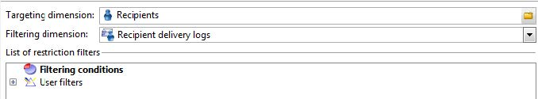

# 쿼리{#query}

## 쿼리 만들기 {#creating-a-query}

쿼리를 사용하면 기준에 따라 대상을 선택할 수 있습니다. 쿼리 결과에 세그먼트 코드를 연결하고 추가 데이터를 삽입할 수 있습니다.
쿼리 샘플에 대한 자세한 내용은 다음을 참조하십시오 [이 섹션](querying-recipient-table.md).

추가 데이터 사용 및 관리에 대한 자세한 내용은 [데이터 추가](#adding-data).

다음 **[!UICONTROL Edit query...]** 링크를 사용하면 다음과 같은 방법으로 모집단에 대한 타겟팅 유형, 제한 및 선택 기준을 정의할 수 있습니다.

1. 타겟팅 및 필터링 차원을 선택합니다. 기본적으로 대상은 수신자 중에서 선택됩니다. 제한 필터 목록은 게재 타깃팅에 사용된 제한 필터와 동일합니다.

   타겟팅 차원은 작업 중인 요소 유형(예: 작업에 의해 타겟팅된 모집단)과 일치합니다.

   필터링 차원을 사용하면 이러한 요소(예: 타겟팅된 사용자와 관련된 정보(계약, 전체 및 최종 결제 등)를 수집할 수 있습니다.

   자세한 내용은 다음을 참조하십시오. [차원 타겟팅 및 필터링](targeting-workflows.md#targeting-and-filtering-dimensions).

   

   필요한 경우 를 선택하여 인바운드 전환의 데이터를 기반으로 쿼리를 작성할 수 있습니다. **[!UICONTROL Temporary schema]** 타겟팅 및 필터링 차원을 선택할 때.

   

1. 마법사를 사용하여 모집단을 정의합니다. 입력할 필드는 대상 유형에 따라 다를 수 있습니다. 다음을 사용하여 현재 기준으로 타겟팅된 모집단을 미리 볼 수 있습니다. **[!UICONTROL Preview]** 탭.

   

1. 을(를) 선택한 경우 **[!UICONTROL Filtering conditions]** 1단계에서 또는 **[!UICONTROL Filters]** > **[!UICONTROL Advanced filter...]** 옵션을 선택하면 나중에 필터링 기준을 수동으로 추가해야 합니다.

   해당 상자를 선택하여 데이터 그룹화 조건을 추가할 수도 있습니다. 이렇게 하려면 필터링 차원이 쿼리의 타겟팅 차원과 달라야 합니다. 그룹화에 대한 자세한 내용은 다음을 참조하십시오. [섹션](query-grouping-management.md).

   표현식 빌더를 사용하여 논리 옵션 AND, OR 및 EXCEPT와 결합하여 더 많은 기준을 추가할 수도 있습니다.

   나중에 다시 사용하려면 필터를 저장하십시오.

## 데이터 추가 {#adding-data}

추가 열을 사용하면 계약 번호, 뉴스레터 구독 또는 출처와 같은 타겟팅된 모집단에 대한 추가 정보를 수집할 수 있습니다. 이 데이터는 Adobe Campaign 데이터베이스 또는 외부 데이터베이스에 저장할 수 있습니다.

다음 **[!UICONTROL Add data...]** 링크를 통해 수집할 추가 데이터를 선택할 수 있습니다.

추가할 데이터 유형을 선택하여 시작합니다.

* 선택 **[!UICONTROL Data linked to the filtering dimension]** Adobe Campaign 데이터베이스의 데이터를 선택합니다.
* 선택 **[!UICONTROL External data]** 외부 데이터베이스에서 데이터를 추가합니다. 이 옵션은 를 구입한 경우에만 사용할 수 있습니다. **페더레이션 데이터 액세스** 옵션을 선택합니다. 자세한 내용은 다음을 참조하십시오. [외부 데이터베이스 액세스(FDA)](accessing-an-external-database--fda-.md).
* 다음 항목 선택 **[!UICONTROL An offer proposition]** 오퍼 엔진에서 생성된 최상의 제안을 저장할 수 있는 열 세트를 추가하는 옵션. 이 옵션은 를 구입한 경우에만 사용할 수 있습니다. **상호 작용** 모듈.

플랫폼에 선택적 모듈이 설치되어 있지 않으면 이 단계가 표시되지 않습니다. 다음 단계로 바로 이동합니다.

Adobe Campaign 데이터베이스에서 데이터를 추가하려면 다음을 수행합니다.

1. 추가할 데이터 유형을 선택합니다. 필터링 차원에 속하는 데이터이거나 연결된 테이블에 저장된 데이터일 수 있습니다.

   

1. 데이터가 쿼리의 필터링 차원에 속하는 경우 사용 가능한 필드 목록에서 해당 데이터를 선택하여 출력 열에 표시하면 됩니다.

   

   다음을 추가할 수 있습니다.

   * 대상 모집단 또는 집계(지난 달 내 보류 중인 구매 수, 평균 입고 금액 등)에서 얻은 데이터를 기반으로 계산된 필드. 예를 보려면 [데이터 선택](targeting-workflows.md#selecting-data).
   * 를 사용하여 생성된 새 필드 **[!UICONTROL Add]** 출력 열 목록 오른쪽에 있는 단추입니다.

     계약 목록, 최근 5회 게재 등 정보 컬렉션을 추가할 수도 있습니다. 컬렉션은 동일한 프로필(1-N 관계)에 대해 여러 값을 가질 수 있는 필드와 일치합니다. 자세한 내용은 다음을 참조하십시오. [추가 데이터 편집](targeting-workflows.md#editing-additional-data).

대상 모집단에 연결된 정보 컬렉션을 추가하려면 다음을 수행합니다.

1. 마법사의 첫 번째 단계에서 **[!UICONTROL Data linked to the filtering dimension]** 옵션:
1. 수집할 정보가 포함된 테이블을 선택하고 **[!UICONTROL Next]**.

   

1. 필요한 경우 의 값 중 하나를 선택하여 유지할 컬렉션의 요소 수를 지정합니다. **[!UICONTROL Data collected]** 필드. 기본적으로 컬렉션의 모든 행은 복구된 다음 다음 단계에서 지정된 조건에 따라 필터링됩니다.

   * 컬렉션의 단일 요소가 이 컬렉션의 필터링 조건과 일치하는 경우 을(를) 선택합니다 **[!UICONTROL Single row]** 다음에서 **[!UICONTROL Data collected]** 필드.

     >[!IMPORTANT]
     >
     >이 모드는 컬렉션 요소의 직접 연결 덕분에 생성된 SQL 쿼리를 최적화합니다.
     >
     >초기 조건을 준수하지 않을 경우 결과에 결함이 발생할 수 있습니다(누락되거나 겹치는 라인).

   * 여러 줄을 복구하도록 선택한 경우(**[!UICONTROL Limit the line count]**) 수집할 라인의 수를 지정할 수 있습니다.
   * 수집된 열에 선언된 실패 수, 사이트의 평균 비용 등과 같은 합계가 포함된 경우 다음을 사용할 수 있습니다. **[!UICONTROL Aggregates]** 값.

   

1. 컬렉션의 하위 선택 항목을 지정합니다.

   

1. 다음을 선택한 경우 **[!UICONTROL Limit the line count]** 옵션을 사용하여 수집된 데이터를 필터링할 순서를 정의합니다. 수집된 라인 수가 유지하도록 지정한 라인 수보다 많으면 필터링 순서를 통해 유지할 라인을 지정할 수 있습니다.

## 예: 단순 수신자 속성에 대한 타겟팅 {#example--targeting-on-simple-recipient-attributes}

다음 예에서 이 쿼리는 18세에서 30세 사이의 프랑스 거주 남성을 식별하려고 합니다. 이 쿼리는 예를 들어 독점 오퍼를 만드는 것을 목적으로 하는 워크플로우에서 사용됩니다.

>[!NOTE]
>
>추가 쿼리 샘플이에 나와 있습니다. [이 섹션](querying-recipient-table.md).

1. 쿼리 이름을 지정한 다음 **[!UICONTROL Edit query...]** 링크를 클릭합니다.
1. 선택 **[!UICONTROL Filtering conditions]** 사용 가능한 필터 유형 목록에서 을 참조하십시오.
1. 제안된 대상에 대해 다른 기준을 입력합니다. 여기에서는 AND 옵션을 사용하여 기준이 결합됩니다. 선택 항목에 포함되려면 수신자는 다음 네 가지 조건을 충족해야 합니다.

   * 제목이 &quot;Mr&quot;(다음을 사용하여 찾을 수 있음)인 수신자 **성별** 필드 및 선택 **남성** as a value).
   * 30세 미만의 수신자
   * 18세 이상의 수신자.
   * 프랑스에 사는 수신자.

   

   기준 조합과 일치하는 SQL을 볼 수 있습니다.

   

1. 관련 탭에서 쿼리와 일치하는 수신자를 미리 보고 기준이 올바른지 확인할 수 있습니다.

   

1. 나중에 를 클릭하여 다시 사용할 수 있도록 필터를 저장합니다. **[!UICONTROL Finish]** > **[!UICONTROL OK]**.
1. 워크플로우에 다른 활동을 추가하여 계속 편집할 수 있습니다. 시작한 후 이전 쿼리 단계가 완료되면 발견된 수신자 수가 표시됩니다. 마우스 팝업 메뉴( 전환 > 을 마우스 오른쪽 버튼으로 클릭)를 사용하여 자세한 내용을 표시할 수 있습니다 **[!UICONTROL Display the target...]**).

   

## 출력 매개 변수 {#output-parameters}

* tableName
* 스키마
* recCount

이 세 값 세트는 쿼리의 타겟팅된 모집단을 식별합니다. **[!UICONTROL tableName]** 는 대상 식별자를 기록하는 테이블의 이름입니다. **[!UICONTROL schema]** 모집단의 스키마(일반적으로 nms:recipient)이며, **[!UICONTROL recCount]** 는 테이블에 있는 요소의 수입니다.

이 값은 작업 테이블의 스키마입니다. 이 매개 변수는 다음과 같은 모든 전환에 유효합니다. **[!UICONTROL tableName]** 및 **[!UICONTROL schema]**.

## 쿼리 최적화 {#optimizing-queries}

아래 섹션에서는 Adobe Campaign에서 실행되는 쿼리를 최적화하여 데이터베이스의 워크로드를 제한하고 사용자 경험을 개선하는 모범 사례를 제공합니다.

### 조인 및 색인 {#joins-and-indexes}

* 효율적인 쿼리는 색인에 의존합니다.
* 모든 조인에 색인을 사용합니다.
* 스키마에 대한 링크를 정의하면 조인 조건이 결정됩니다. 연결된 테이블은 기본 키에 고유한 색인이 있어야 하며 조인은 이 필드에 있어야 합니다.
* 문자열 필드 대신 숫자 필드에 키를 정의하여 조인을 수행합니다.
* 외부 조인을 수행하지 마십시오. 가능하면 Zero ID 레코드를 사용하여 외부 조인 기능을 수행합니다.
* 조인에 올바른 데이터 유형을 사용하십시오.

  다음을 확인합니다. `where` 절은 필드와 같은 유형입니다.

  일반적인 실수는 다음과 같습니다. `iBlacklist='3'` 위치 `iBlacklist` 는 숫자 필드이고, `3` 텍스트 값을 나타냅니다.

  쿼리의 실행 계획을 알고 있어야 합니다. 특히 실시간 쿼리 또는 거의 실시간으로 매분 실행되는 쿼리의 경우 전체 테이블을 검사하지 마십시오.

### 함수 {#functions}

* 다음과 같은 기능에 주의하십시오. `Lower(...)`. Lower 함수를 사용하면 Index가 사용되지 않습니다.
* &quot;like&quot; 지침 또는 &quot;upper&quot; 또는 &quot;lower&quot; 지침을 사용하여 쿼리를 신중하게 확인합니다. 데이터베이스 필드가 아닌 사용자 입력에 &quot;Upper&quot;를 적용합니다.

### 차원 필터링 {#filtering-dimensions}

&quot;다음과 같이 존재함&quot; 연산자 대신 쿼리의 필터링 차원을 사용합니다.

쿼리에서 필터에 &quot;과 같이 존재함&quot; 조건은 효율적이지 않습니다. SQL의 하위 쿼리와 동일합니다.

`select iRecipientId from nmsRecipient where iRecipientId IN (select iRecipientId from nmsBroadLog where (...))`

가장 좋은 방법은 쿼리의 필터링 차원을 대신 사용하는 것입니다.

SQL의 필터링 차원과 동등한 기능은 내부 조인입니다.

`select iRecipientId from nmsRecipient INNER JOIN nmsBroadLog ON (...)`

차원 필터링에 대한 자세한 내용은 [이 섹션](build-a-workflow.md#targeting-and-filtering-dimensions).

### 아키텍처 {#architecture}

* 프로덕션 플랫폼과 유사한 볼륨, 매개변수 및 아키텍처를 사용하는 개발 플랫폼을 구축합니다.
* 개발 및 프로덕션 환경에 동일한 값을 사용합니다. 가능한 한 동일한 을 사용합니다.

   * 운영 체제,
   * 버전,
   * 데이터,
   * 애플리케이션,
   * 볼륨.

  >[!NOTE]
  >
  >개발 환경에서 작동하는 기능이 데이터가 다를 수 있는 프로덕션 환경에서는 작동하지 않을 수 있습니다. 리스크를 예측하고 해결책을 마련하기 위해 주요 차이점을 식별하도록 노력한다.

* 대상 볼륨과 일치하는 구성을 만듭니다. 대용량 볼륨에는 특정 구성이 필요합니다. 100,000명의 수신자에 대해 작동한 구성은 10,000,000명의 수신자에 대해 작동하지 않을 수 있습니다.

  시스템이 작동 중일 때 어떻게 확장되는지 고려합니다. 어떤 것이 소규모로 작동한다고 해서 더 많은 양과 적합할 것이라는 의미는 아니다. 테스트는 운영 볼륨의 볼륨과 유사한 볼륨을 사용하여 수행해야 합니다. 또한 피크 시간, 피크 일 및 프로젝트 수명 동안 볼륨(호출 수, 데이터베이스 크기) 변경의 영향도 평가해야 합니다.
