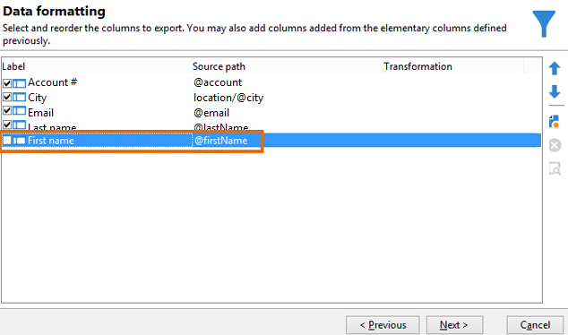

# 수신자 테이블 쿼리 {#querying-recipient-table}

이 예에서는 이메일 도메인이 &quot;orange.co.uk&quot;이고 런던에 살지 않는 수신자의 이름과 이메일을 복구하려고 합니다.

* 어떤 테이블을 선택해야 합니까?

   수신자 테이블(nms:recipient)

* 출력 열로 선택할 필드

   이메일, 이름, 도시 및 계정 번호

* 수신자의 필터링 조건은 무엇입니까?

   도시 및 이메일 도메인

* 정렬이 구성되어 있습니까?

   예, **[!UICONTROL Account number]** 및 **[!UICONTROL Last name]**

이 예제를 만들려면 다음 단계를 적용합니다.

1. 클릭 **[!UICONTROL Tools > Generic query editor...]** 그리고 **수신자** (**nms:recipient**) 테이블 위에 있어야 합니다. 그 다음 **[!UICONTROL Next]**&#x200B;을(를) 클릭합니다.
1. 선택: **[!UICONTROL Last name]**, **[!UICONTROL First name]**, **[!UICONTROL Email]**, **[!UICONTROL City]** 및 **[!UICONTROL Account number]**. 이러한 필드는 다음에 추가됩니다. **[!UICONTROL Output columns]**. 그 다음 **[!UICONTROL Next]**&#x200B;을(를) 클릭합니다.

   

1. 열을 정렬하여 올바른 순서로 표시합니다. 여기에서는 계좌 번호를 내림차순으로 정렬하고 이름을 알파벳순으로 정렬하려고 합니다. 그 다음 **[!UICONTROL Next]**&#x200B;을(를) 클릭합니다.

   

1. 에서 **[!UICONTROL Data filtering]** 창을 열고 검색을 세분화합니다. 선택 **[!UICONTROL Filtering conditions]** 을(를) 클릭합니다. **[!UICONTROL Next]**.
1. 다음 **[!UICONTROL Target element]** 창에서 필터 설정을 입력할 수 있습니다.

   다음 필터 조건을 정의합니다. 이메일 도메인이 &quot;orange.co.uk&quot;과 동일한 수신자. 이렇게 하려면 **이메일 도메인(@email)** 에서 **[!UICONTROL Expression]** 열, 선택 **같음** 에서 **[!UICONTROL Operator]** 열을 입력하고 다음에 &quot;orange.co.uk&quot;을 입력합니다. **[!UICONTROL Value]** 열.

   

1. 필요한 경우 **[!UICONTROL Distribution of values]** 잠재 고객의 이메일 도메인을 기반으로 배포를 보는 단추. 백분율은 데이터베이스의 각 이메일 도메인에 대해 사용할 수 있습니다. 필터가 적용되기 전까지 &quot;orange.co.uk&quot; 이외의 도메인이 표시됩니다.

   창의 아래쪽에 질의 요약이 표시됩니다. **전자 메일 도메인이 &#39;orange.co.uk&#39;과 같음**.

1. 을(를) 클릭합니다. **[!UICONTROL Preview]** 쿼리 결과를 얻으려면: orange.co.uk&quot; 전자 메일 도메인만 표시됩니다.

   

1. 이제 런던에 거주하지 않는 연락처를 찾기 위해 쿼리를 변경할 예정입니다.

   선택 **[!UICONTROL City (location/@city)]** 에서 **[!UICONTROL Expression]** column, **[!UICONTROL different from]** 연산자로 사용하고 을 입력합니다. **[!UICONTROL London]** 에서 **[!UICONTROL Value]** 열.

   

1. 이렇게 하면 **[!UICONTROL Data formatting]** 창을 엽니다. 열 순서를 확인합니다. &quot;구/군/시&quot; 열을 &quot;계정 번호&quot; 열 아래로 이동합니다.

   목록에서 제거하려면 &quot;이름&quot; 열을 선택 취소합니다.

   

1. 에서 **[!UICONTROL Data preview]** 창 **[!UICONTROL Start the preview of the data]**. 이 함수는 쿼리 결과를 계산합니다.

   다음 **[!UICONTROL Column results]** 탭에 쿼리 결과가 열에 표시됩니다.

   그 결과, 런던에 살지 않는 &quot;orange.co.uk&quot; 이메일 도메인이 있는 모든 수신자가 표시됩니다. 이전 단계에서 선택 취소되었으므로 &quot;이름&quot; 열이 표시되지 않습니다. 계좌 번호는 내림차순으로 정렬됩니다.

   

   다음 **[!UICONTROL XML result]** 탭에는 XML 형식의 결과가 표시됩니다.

   

   다음 **[!UICONTROL Generated QSL queries]** 탭에 쿼리 결과가 SQL 형식으로 표시됩니다.

   
