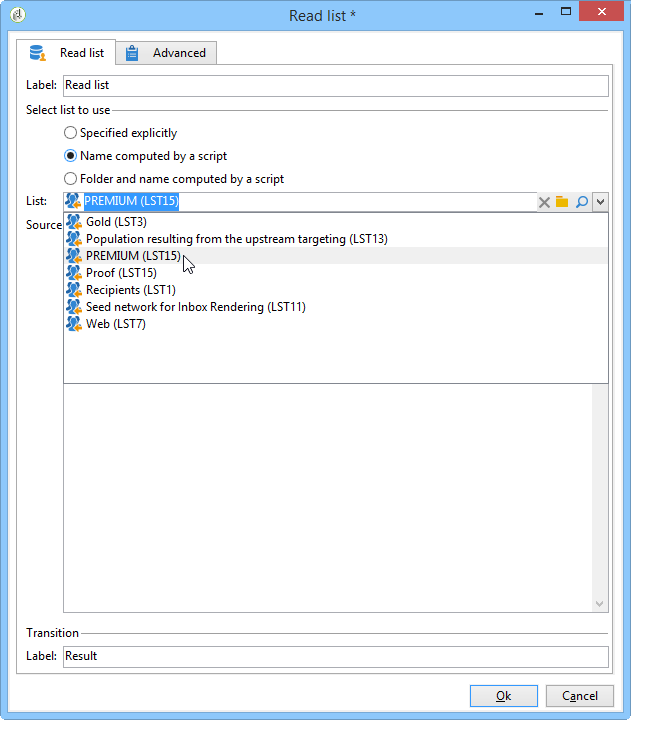

# 목록 읽기{#read-list}

워크플로우에서 처리된 데이터는 이전 세그먼테이션이나 파일 업로드 후 데이터를 미리 준비하거나 구조화한 목록에서 가져올 수 있습니다.

다음 **[!UICONTROL Read list]** 활동을 사용하면 워크플로우의 데이터와 같은 워크플로우 작업 테이블의 목록에서 데이터를 복사할 수 있습니다. 그런 다음 워크플로우 전체에서 액세스할 수 있습니다.

처리할 목록을 명시적으로 지정하거나, 스크립트로 계산하거나, 동적으로 현지화할 수 있습니다. 이는 **[!UICONTROL Read list]** 활동.

목록을 명시적으로 지정하지 않은 경우 해당 구조를 찾기 위해 템플릿으로 사용할 목록을 제공해야 합니다.

목록 선택이 구성되면 **[!UICONTROL Edit query]** 다음 워크플로우에 모집단 중 하나를 유지하는 옵션.

>[!CAUTION]
>
>목록 읽기 활동에서 필터를 만들려면 관련 목록이 &quot;파일&quot; 유형이어야 합니다.

목록은 를 통해 Adobe Campaign에서 직접 만들 수 있습니다 **[!UICONTROL Profiles and Targets > Lists]** 홈 페이지의 링크입니다. 을 사용하여 워크플로우에서 만들 수도 있습니다 **[!UICONTROL List update]** 활동.

**예: 보내기 주소 목록 제외**

다음 예제에서는 이메일 주소 목록을 사용하여 이메일 게재 타겟에서 제외할 수 있습니다.

에 포함된 프로필 **새 연락처** 폴더를 게재 작업의 타겟팅해야 합니다. 대상에서 제외할 이메일 주소는 외부 목록에 저장됩니다. 이 예에서는 제외에 이메일 주소에 대한 정보만 필요합니다.

1. 다음 **새 연락처** 폴더 선택 쿼리를 사용하면 선택한 프로필의 이메일 주소를 로드할 수 있습니다. 이렇게 하면 목록의 정보에 맞게 정렬할 수 있습니다.

   

1. 여기에서 목록은 **목록** 폴더 및 해당 레이블이 계산됩니다.

   

1. 기본 대상에서 외부 목록의 이메일 주소를 제외하려면 제외 활동을 구성하고 **새 연락처** 폴더에는 유지할 데이터가 포함되어 있습니다. 이 세트와 제외 활동에서 다른 인바운드 세트 간의 결합 데이터가 대상에서 삭제됩니다.

   

   제외 규칙은 편집 도구의 중앙 섹션에서 구성됩니다. 을(를) 클릭합니다. **[!UICONTROL Add]** 적용할 제외 유형을 정의하는 단추입니다.

   활동의 수신 전환 수에 따라 여러 제외를 정의할 수 있습니다.

1. 에서 **[!UICONTROL Exclusion set]** 필드에서 **[!UICONTROL Read list]** 활동: 이 활동의 데이터는 기본 집합에서 제외됩니다.

   이 예제에서는 조인에 대한 제외가 있습니다. 목록에 포함된 데이터는 이메일 주소가 포함된 필드를 통해 기본 세트의 데이터와 조정됩니다. 조인을 구성하려면 **[!UICONTROL Joins]** 에서 **[!UICONTROL Change dimension]** 필드.

   

1. 그런 다음 두 세트의 이메일 주소에 해당하는 필드(소스 및 대상)를 선택합니다. 열이 연결되고 이메일 주소가 가져온 주소 목록에 있는 수신자는 대상에서 제외됩니다.
