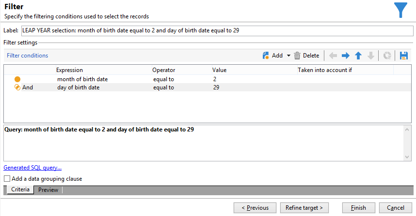

# 생일 이메일 보내기{#sending-a-birthday-email}

이 사용 사례에서는 생일 당일 수신자 목록에 반복 이메일 전송을 계획하는 방법을 제공합니다.

이 사용 사례를 설정하기 위해 다음과 같은 타겟팅 워크플로우를 만들었습니다.


이 (일일 실행) 워크플로우는 현재 날짜에 생일이 있는 모든 수신자를 선택합니다.

이렇게 하려면 캠페인을 만들고 [캠페인 워크플로우](campaign-workflows.md).

그런 다음 아래에 설명된 단계를 수행합니다.

## 생일이 다음과 같은 수신자 식별 {#identifying-recipients-whose-birthday-it-is}

구성 후 **[!UICONTROL Scheduler]** 워크플로우가 매일 시작되도록 활동에서 생년월일이 현재 날짜와 동일한 모든 수신자를 식별합니다.

그렇게 하려면 다음 단계를 적용합니다.

1. 드래그 앤 드롭 **[!UICONTROL Query]** 활동을 워크플로우에 추가하고 두 번 클릭합니다.
1. 다음을 클릭합니다. **쿼리 편집** 링크 및 선택 **[!UICONTROL Filtering conditions]**.

   

1. 의 첫 번째 셀을 클릭합니다. **[!UICONTROL Expression]** 열 및 클릭 **[!UICONTROL Edit expression]** 표현식 편집기를 엽니다.

   

1. 클릭 **[!UICONTROL Advanced selection]** 필터링 모드를 선택합니다.

   

1. 선택 **[!UICONTROL Edit the formula using an expression]** 및 클릭 **[!UICONTROL Next]** 표현식 편집기를 표시합니다.
1. 함수 목록에서 를 두 번 클릭합니다 **[!UICONTROL Day]**: 를 통해 액세스할 수 있습니다. **[!UICONTROL Date]** 노드. 이 함수는 매개 변수로 전달된 날짜에 해당하는 일을 나타내는 숫자를 반환합니다.

   

1. 사용 가능한 필드 목록에서 를 두 번 클릭합니다 **[!UICONTROL Birth date]**. 그런 다음 편집기의 상단 섹션에 다음 수식이 표시됩니다.

   ```
   Day(@birthDate)
   ```

   **[!UICONTROL Finish]**&#x200B;을(를) 클릭하여 확인합니다.

1. 쿼리 편집기에서 **[!UICONTROL Operator]** 열에서 선택 **[!UICONTROL equal to]**.

   

1. 그런 다음 두 번째 열의 첫 번째 셀(**[!UICONTROL Value]**), 클릭 **[!UICONTROL Edit expression]** 표현식 편집기를 엽니다.
1. 함수 목록에서 를 두 번 클릭합니다 **[!UICONTROL Day]**: 를 통해 액세스할 수 있습니다. **[!UICONTROL Date]** 노드.
1. 를 두 번 클릭합니다. **[!UICONTROL GetDate]** 현재 날짜를 검색하는 함수입니다.

   

   편집기의 상단 섹션에는 다음 수식이 표시됩니다.

   ```
   Day(GetDate())
   ```

   **[!UICONTROL Finish]**&#x200B;을(를) 클릭하여 확인합니다.

1. 이 절차를 반복하여 현재 달에 해당하는 출생월을 검색합니다. 이렇게 하려면 **[!UICONTROL Add]** 버튼을 누르고 3~10단계를 반복하여 교체 **[!UICONTROL Day]** 포함 **[!UICONTROL Month]**.

   전체 쿼리는 다음과 같습니다.

   

결과 연결 **[!UICONTROL Query]** 에 대한 활동 **[!UICONTROL Email delivery]** 활동: 생일에 모든 수신자 목록으로 이메일을 보냅니다.

## 2월 29일에 태어난 수신자 포함(선택 사항) {#including-recipients-born-on-february-29th--optional-}

2월 29일에 태어난 모든 수신자를 포함하려는 경우 이 사용 사례에서는 윤년이든 아니든 생일에 대한 수신자 목록에 반복 이메일을 보내는 방법을 제시합니다.

이 사용 사례의 주요 구현 단계는 다음과 같습니다.

* 수신자 선택
* 윤년인지 여부 선택
* 2월 29일에 태어난 수신자 선택

이 사용 사례를 설정하기 위해 다음과 같은 타겟팅 워크플로우를 만들었습니다.


올해 **윤년이 아님** 그리고 워크플로우가 3월 1일에 실행되므로 어제(2월 29일) 생일이 있었던 모든 수신자를 선택하고 수신자 목록에 추가해야 합니다. 다른 경우에는 추가 작업이 필요하지 않습니다.

### 1단계: 수신자 선택 {#step-1--selecting-the-recipients}

구성 후 **[!UICONTROL Scheduler]** 워크플로우가 매일 시작되도록 활동하여 기념일이 현재 일인 모든 수신자를 식별합니다.

>[!NOTE]
>
>당해 연도가 윤년이면 2월 29일에 출생한 수급자 전원이 자동 포함된다.


생일이 현재 날짜에 해당하는 수신자 선택은 [생일이 다음과 같은 수신자 식별](#identifying-recipients-whose-birthday-it-is) 섹션.

### 2단계: 윤년인지 여부 선택 {#step-2--select-whether-or-not-it-is-a-leap-year}

다음 **[!UICONTROL Test]** 활동을 통해 윤년인지 여부와 현재 날짜가 3월 1일인지를 확인할 수 있습니다.

테스트가 확인되면(연도가 윤년이 아님 - 2월 29일 없음 - 현재 날짜가 실제로 3월 1일) **[!UICONTROL True]** 전환이 활성화되며 2월 29일에 태어난 수신자가 3월 1일 게재에 추가됩니다. 그렇지 않으면 **[!UICONTROL False]** 전환이 활성화되었으며 현재 날짜에 태어난 수신자만 게재를 받습니다.

아래 코드를 복사하여 **[!UICONTROL Initialization script]** 의 섹션 **[!UICONTROL Advanced]** 탭.

```
function isLeapYear(iYear)
{
    if(iYear/4 == Math.floor(iYear/4))
    {
        if(iYear/100 != Math.floor(iYear/100))
        {
            // Divisible by 4 only -> Leap Year
            return 1;
        }
        else
        {
            if(iYear/400 == Math.floor(iYear/400))
            {
                // Divisible by 4, 100 and 400 -> Leap year
                return 1;
            }
        }
    }
    // all others: no leap year
    return 0;
}

// Return today's date and time
var currentTime = new Date()
// returns the month (from 0 to 11)
var month = currentTime.getMonth() + 1
// returns the day of the month (from 1 to 31)
var day = currentTime.getDate()
// returns the year (four digits)
var year = currentTime.getFullYear()

// is current year a leap year?
vars.currentIsALeapYear = isLeapYear(year);

// is current date the first of march?
if(month == 3 && day == 1) {
  // today is 1st of march
vars.firstOfMarch = 1;
}
```


에 다음 조건을 추가합니다. **[!UICONTROL Conditional forks]** 섹션:

```
vars.currentIsALeapYear == 0 && vars.firstOfMarch == 1
```


### 3단계: 2월 29일에 태어난 수신자 선택 {#step-3--select-any-recipients-born-on-february-29th}

만들기 **[!UICONTROL Fork]** 활동 및 아웃바운드 전환 중 하나를 **[!UICONTROL Query]** 활동.

이 질의에서는 생년월일이 2월 29일인 모든 수신자를 선택합니다.



결과를 와 결합 **[!UICONTROL Union]** 활동.

두 항목의 결과 연결 **[!UICONTROL Test]** 활동을 로 분기 **[!UICONTROL Email delivery]** 활동은 윤년이 아닌 해 2월 29일에 태어난 모든 수신자의 생일에 이메일을 보내는 활동입니다.

## 반복 게재 만들기 {#creating-a-recurring-delivery-in-a-targeting-workflow}

추가 **반복 게재** 활동은 보내려는 생일 이메일 템플릿을 기반으로 합니다.

>[!CAUTION]
>
>워크플로우를 실행하려면 Campaign 패키지와 관련된 기술 워크플로우를 시작해야 합니다. 자세한 내용은 [기술 워크플로우 목록](technical-workflows.md) 섹션.
>
>캠페인에 대해 승인 단계를 활성화한 경우 이러한 단계를 확인한 후에만 게재가 전송됩니다. 자세한 내용은 섹션을 참조하십시오.


