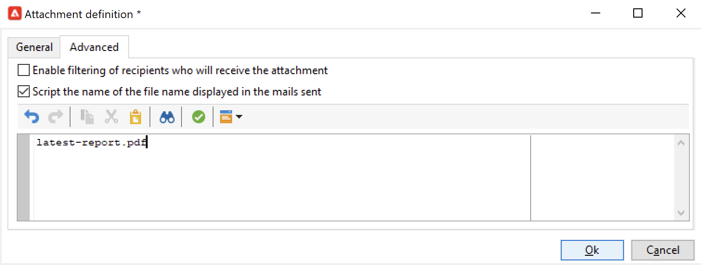

# 목록으로 보고서 보내기{#send-a-report-to-a-list}

이 사용 사례에서는 PDF 형식으로 기본 제공되는 월별 **[!UICONTROL Tracking indicators]** 보고서를 생성하는 방법과 이를 수신자 목록으로 보내는 방법을 자세히 설명합니다.


이 사용 사례의 주요 구현 단계는 다음과 같습니다.

* 이 보고서의 수신자 목록을 만듭니다. [자세히 알아보기](#step-1--create-the-recipient-list).
* 워크플로우가 실행될 때마다 새 게재를 만드는 게재 템플릿을 만듭니다. [자세히 알아보기](#step-2--create-the-delivery-template).
* PDF 형식으로 보고서를 생성하여 수신자 목록으로 전송하는 워크플로우를 만듭니다. [자세히 알아보기](#step-3--create-the-workflow)).

## 1단계: 수신자 목록 만들기 {#step-1--create-the-recipient-list}

타겟팅된 수신자 목록을 만들려면 아래 단계를 수행하십시오.

1. **[!UICONTROL Profiles and targets]** 탭으로 이동하여 **[!UICONTROL Lists]** 링크를 클릭합니다.
1. **[!UICONTROL Create]** 버튼을 클릭합니다.
1. **[!UICONTROL New list]**&#x200B;을(를) 선택하고 보고서를 보낼 받는 사람 목록을 새로 만드세요.

목록 만들기에 대한 자세한 내용은 [이 섹션](../../v8/audiences/create-audiences.md)을 참조하세요.

## 2단계: 게재 템플릿 만들기 {#step-2--create-the-delivery-template}

게재 템플릿을 만들려면 아래 단계를 수행하십시오.

1. Adobe Campaign 탐색기의 **[!UICONTROL Resources > Templates > Delivery templates]** 노드로 이동하여 **[!UICONTROL Email delivery]** 기본 제공 템플릿을 복제합니다.

   게재 템플릿 만들기에 대한 자세한 내용은 [이 섹션](../../v8/send/create-templates.md)을 참조하세요.

1. 템플릿 매개 변수(레이블, 대상(이전에 만든 수신자 목록), 제목 및 컨텐츠)를 입력합니다.

   워크플로우가 실행될 때마다 [3단계: 워크플로우 만들기](#step-3--creating-the-workflow)에 설명된 대로 **[!UICONTROL Tracking indicators]** 보고서가 업데이트됩니다.

1. 게재에 최신 버전의 보고서를 포함하려면 **[!UICONTROL Calculated attachment]**&#x200B;을(를) 추가해야 합니다.

   * **[!UICONTROL Attachments]** 링크를 클릭하고 **[!UICONTROL Add]** 단추 옆에 있는 화살표를 클릭합니다. **[!UICONTROL Calculated attachment...]**&#x200B;을(를) 선택합니다.

     

   * **[!UICONTROL Type]** 드롭다운 목록에서 최신 옵션 **[!UICONTROL File name is computed during delivery of each message (it may then depend on the recipient profile)]**&#x200B;을(를) 선택합니다.

     

     **[!UICONTROL Label]** 필드에 입력한 값이 최종 게재에 표시되지 않습니다.

   * 텍스트 영역에 파일의 액세스 경로와 이름을 입력합니다.

     

     >[!CAUTION]
     >
     >경로 및 이름은 [3단계: 워크플로우 만들기](#step-3--creating-the-workflow)에서 설명한 대로 워크플로우의 **[!UICONTROL JavaScript code]** 형식 활동에 입력한 것과 동일해야 합니다.

   * **[!UICONTROL Advanced]** 탭을 선택하고 **[!UICONTROL Script the name of the file name displayed in the mails sent]**&#x200B;을(를) 확인합니다. 텍스트 영역에 최종 게재에 있는 첨부 파일의 이름을 입력합니다.

     

## 3단계: 워크플로우 만들기 {#step-3--creating-the-workflow}

이 사용 사례에 대해 다음 워크플로우를 만듭니다.


세 가지 활동을 사용합니다.

* 한 달에 한 번 워크플로우를 실행하는 **[!UICONTROL Scheduler]** 활동,
* PDF 형식으로 보고서를 생성하는 **[!UICONTROL JavaScript code]** 활동
* 이전에 만든 게재 템플릿을 참조하는 **[!UICONTROL Delivery]** 활동.

이 워크플로우를 빌드하려면 아래 단계를 수행합니다.

1. Campaign 탐색기의 **[!UICONTROL Administration > Production > Technical workflows]** 노드로 이동하여 워크플로우를 저장할 새 폴더를 만드십시오.
1. 새 워크플로우를 만듭니다.

   

1. **[!UICONTROL Scheduler]** 형식 활동을 추가하여 시작하여 워크플로우가 그 달의 첫 번째 월요일에 실행되도록 구성하십시오.

   

   스케줄러 구성에 대한 자세한 내용은 [스케줄러](scheduler.md)를 참조하십시오.

1. 그런 다음 **[!UICONTROL JavaScript code]** 형식 활동을 추가합니다.

   

   편집 영역에 다음 코드를 입력합니다.

   ```sql
   var reportName = "indicators";
   var path = "/tmp/indicators.pdf";
   var exportFormat = "PDF";
   var reportURL = "<PUT THE URL OF THE REPORT HERE>";
   var _ctx = <ctx _context="global" _reportContext="deliveryFeedback" />
   var isAdhoc = 0;
   
   xtk.report.export(reportName, _ctx, exportFormat, path, isAdhoc);
   ```


   (다음 변수 사용)

   * **var reportName**: 보고서의 내부 이름을 큰따옴표로 입력하십시오. 이 경우 **추적 표시기** 보고서의 내부 이름은 &quot;deliveryFeedback&quot;입니다.
   * **var 경로**: 파일의 저장 경로(&quot;tmp&quot;), 파일에 지정할 이름(&quot;deliveryFeedback&quot;) 및 파일 확장명(&quot;.pdf&quot;)을 입력합니다. 이 경우 파일 이름으로 내부 이름을 사용했습니다. 값은 큰따옴표 사이여야 하며 &quot;+&quot; 문자로 구분해야 합니다.

     >[!CAUTION]
     >
     >파일을 서버에 저장해야 합니다. 자세한 [여기](#step-2--create-the-delivery-template))와 같이 계산된 첨부 파일에 대한 편집 창의 **[!UICONTROL General]** 탭에 있는 것과 동일한 경로와 이름을 입력해야 합니다.

   * **var exportFormat**: 파일의 내보내기 형식(&quot;PDF&quot;)을 입력하십시오.
   * **var _ctx**(컨텍스트): 이 경우 글로벌 컨텍스트에서 **[!UICONTROL Tracking indicators]** 보고서를 사용하고 있습니다.

1. 다음 옵션을 사용하여 **[!UICONTROL Delivery]** 활동을 추가하여 완료합니다.

   

   * **[!UICONTROL Delivery]**: **[!UICONTROL New, created from a template]**&#x200B;을(를) 선택하고 이전에 만든 게재 템플릿을 선택합니다.
   * **[!UICONTROL Recipients]** 및 **[!UICONTROL Content]** 필드에 대해 **[!UICONTROL Specified in the delivery]**&#x200B;을(를) 선택합니다.
   * **[!UICONTROL Action to perform]**: **[!UICONTROL Prepare and start]** 선택
   * **[!UICONTROL Generate an outbound transition]** 및 **[!UICONTROL Process errors]** 옵션을 선택 취소합니다.

1. 변경 사항을 저장하고 워크플로우를 시작합니다. 첨부된 보고서와 함께 이 달의 첫 번째 월요일에 수신자 목록으로 메시지가 전송됩니다.
