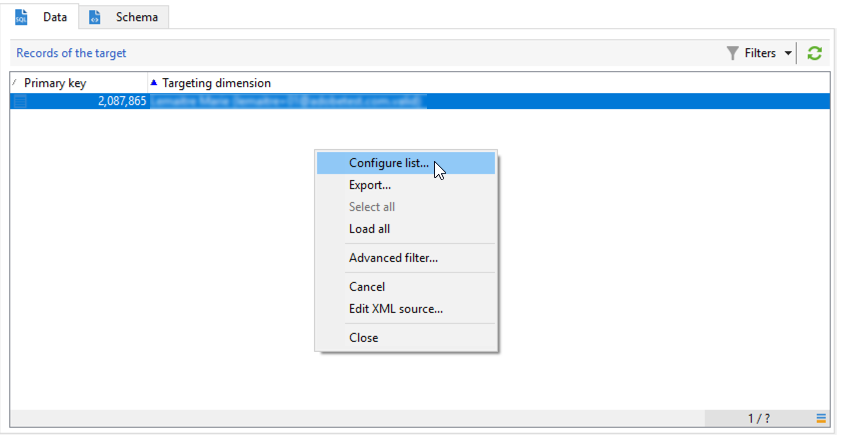

# 운영자에게 개인화된 경고 보내기{#sending-personalized-alerts-to-operators}


이 예에서는 뉴스레터를 열었지만 포함된 링크를 클릭하지 않은 프로필의 이름이 포함된 운영자에게 경고를 보내려고 합니다.

프로필의 이름과 성 필드는 **[!UICONTROL Recipients]** 타겟팅 차원 과 **[!UICONTROL Alert]** 활동이 **[!UICONTROL Operator]** 타겟팅 차원. 따라서 조정을 수행하고 이름과 성 필드를 검색하고 경고 활동에 표시할 두 타겟팅 차원 사이에 사용할 수 있는 필드가 없습니다.

프로세스는 다음과 같이 워크플로우를 구축하는 것입니다.

1. 다음 작업 **[!UICONTROL Query]** 활동을 target 데이터에 추가합니다.
1. 추가 **[!UICONTROL JavaScript code]** 활동을 워크플로우에 추가하여 쿼리의 모집단을 인스턴스 변수에 저장합니다.
1. 다음 작업 **[!UICONTROL Test]** 활동을 통해 모집단 수를 확인합니다.
1. 다음 중 하나를 사용합니다 **[!UICONTROL Alert]** 활동에 따라 연산자에게 경고를 보내는 활동 **[!UICONTROL Test]** 활동 결과.


## 인스턴스 변수에 모집단 저장 {#saving-the-population-to-the-instance-variable}

아래 코드를 **[!UICONTROL JavaScript code]** 활동.

```
var query = xtk.queryDef.create(  
    <queryDef schema="temp:query" operation="select">  
      <select>  
       <node expr="[target/recipient.@firstName]"/>  
       <node expr="[target/recipient.@lastName]"/>  
      </select>  
     </queryDef>  
  );  
  var items = query.ExecuteQuery();
```

Javascript 코드가 워크플로우 정보에 해당하는지 확인합니다.

* 다음 **[!UICONTROL queryDef schema]** 태그는 쿼리 활동에 사용되는 타겟팅 차원의 이름에 해당해야 합니다.
* 다음 **[!UICONTROL node expr]** 태그는 검색할 필드의 이름에 해당해야 합니다.


이러한 정보를 검색하려면 아래 단계를 수행하십시오.

1. 에서 아웃바운드 전환을 마우스 오른쪽 단추로 클릭합니다. **[!UICONTROL Query]** 활동을 선택한 다음 **[!UICONTROL Display the target]**.

   

1. 목록을 마우스 오른쪽 단추로 클릭하고 **[!UICONTROL Configure list]**.

   

1. 쿼리 타겟팅 차원 및 필드 이름이 목록에 표시됩니다.

   

## 모집단 수 테스트 {#testing-the-population-count}

아래 코드를 **[!UICONTROL Test]** 활동을 통해 타겟팅된 모집단에 하나 이상의 프로필이 포함되어 있는지 확인할 수 있습니다.

```
var.recCount>0
```


## 경고 설정 {#setting-up-the-alert}

모집단이 원하는 필드를 사용하여 인스턴스 변수에 추가되었으므로 이 정보를 **[!UICONTROL Alert]** 활동.

이렇게 하려면 를 **[!UICONTROL Source]** 탭 아래 코드:

```
<ul>
<%
var items = new XML(instance.vars.items)
for each (var item in items){
%>
<li><%= item.target.@firstName %> <%= item.target.@lastName %></li>
<%
} %></ul>
```

>[!NOTE]
>
>다음 **[!UICONTROL <%= item.target.recipient.@fieldName %>]** 명령을 사용하면 다음을 통해 인스턴스 변수에 저장된 필드 중 하나를 추가할 수 있습니다 **[!UICONTROL JavaScript code]** 활동.\
>JavaScript 코드에 삽입된 한 원하는 만큼 필드를 추가할 수 있습니다.


