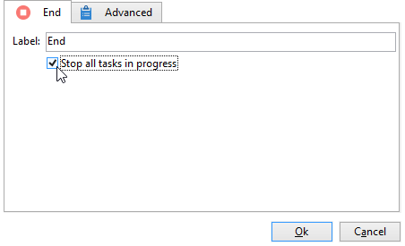

# 시작 및 종료{#start-and-end}

다음 **[!UICONTROL Start]** 및 **[!UICONTROL End]** 활동을 사용하면 워크플로우의 시작과 끝을 그래픽으로 표시할 수 있습니다. 이러한 활동은 영향을 주지 않으므로 선택 사항입니다.

* **[!UICONTROL Start]**

   워크플로우 실행은 인바운드 전환 및 시작 유형 활동 없이 활동으로 시작합니다.

   

* **[!UICONTROL End]**

   을 구성할 수 있습니다 **[!UICONTROL End]** 활동 을 클릭하여 진행 중인 모든 작업을 중단합니다. 이렇게 하려면 활동을 두 번 클릭하여 해당 속성을 표시하고 적절한 옵션을 선택합니다.

   

   최종 활동이 활성화되면 작업 테이블의 데이터가 자동으로 삭제됩니다. 이 작업이 필요하지 않고 불필요한 로드를 방지하기 위해 마지막 활동 출력에서 전환을 비활성화하도록 선택할 수 있습니다. 예를 들어 게재 출력에서 예약된 프로세스가 없는 경우, 아래에 표시된 대로 관련 옵션의 선택을 취소합니다.

   
