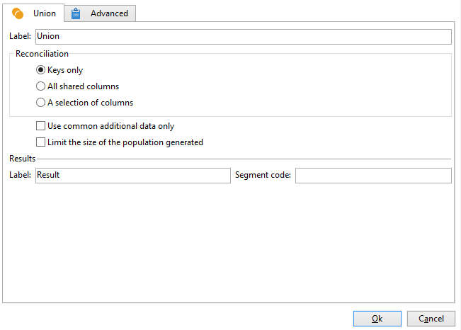

# 합집합{#union}

A **[!UICONTROL Union]** 여러 인바운드 활동의 결과를 하나의 타겟으로 그룹화합니다. 수신된 모든 결과와 함께 대상이 생성됩니다. 따라서 조합을 실행하려면 모든 이전 활동이 완료되어야 합니다.

>[!NOTE]
>
>구성 및 사용에 대한 자세한 내용은 **[!UICONTROL Union]** 활동. 참조: [이 페이지](targeting-workflows.md#combining-several-targets--union-).

## 결합 예 {#union-example}

다음 예제에서는 목록을 업데이트하기 위해 두 쿼리의 결과를 결합했습니다. 두 쿼리는 수신자를 타겟팅합니다. 따라서 결과는 동일한 표를 기반으로 합니다.

1. 삽입 **[!UICONTROL Union]** -두 쿼리 바로 뒤와 목록의 업데이트 유형 활동 앞에 활동을 입력한 다음 엽니다.
1. 레이블을 입력할 수 있습니다.
1. 다음 항목 선택 **[!UICONTROL Keys only]** 이 예제에서 쿼리로 인한 모집단은 일관된 데이터를 포함하므로 조정 방법을 사용합니다.
1. 쿼리에 대한 데이터를 더 추가한 경우 공유된 데이터만 유지하도록 결정할 수 있습니다.
1. 최종 모집단 크기를 제한하려면 다음을 확인합니다. **[!UICONTROL Limit size of generated population]** 옵션을 선택합니다.

   최대 수신자 수를 입력하고 모집단의 우선 순위를 선택하여 이 최종 수를 지정합니다.

1. 승인 **[!UICONTROL Union]** 활동을 구성한 다음 [목록 업데이트](list-update.md) 활동.
1. 워크플로우를 시작합니다. 결과 수가 표시되고 목록 업데이트 활동에 정의된 목록이 생성되거나 업데이트됩니다. 이 목록에는 두 쿼리 모두에 대한 수신자 집합 또는 해당하는 경우 이전 단계에서 정의된 숫자가 포함됩니다.

   

## 입력 매개 변수 {#input-parameters}

* tableName
* 스키마

각 인바운드 이벤트는 이러한 매개 변수로 정의된 대상을 지정해야 합니다.

## 출력 매개 변수 {#output-parameters}

* tableName
* 스키마
* recCount

이 세 값 세트는 유니온으로 인한 대상을 식별합니다. **[!UICONTROL tableName]** 는 대상 식별자를 기록하는 테이블의 이름입니다. **[!UICONTROL schema]** 모집단의 스키마(일반적으로 nms:recipient)이며, **[!UICONTROL recCount]** 는 테이블에 있는 요소의 수입니다.
