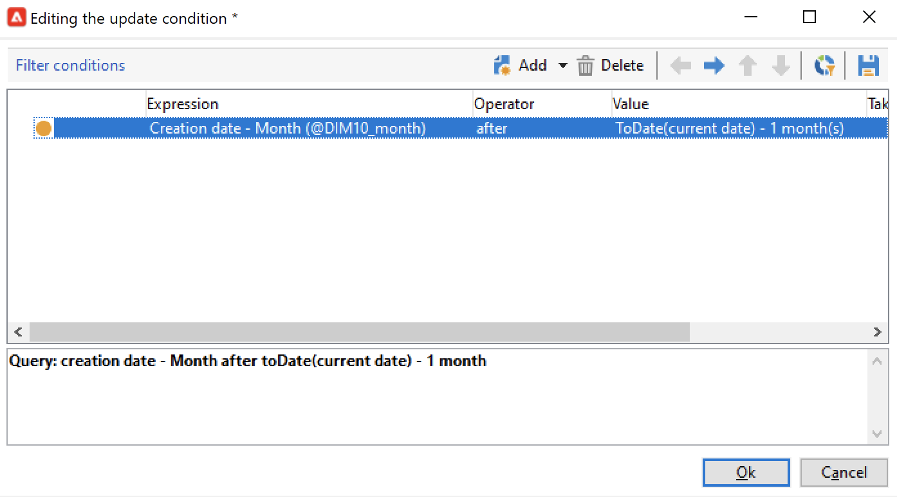

# 집계 업데이트{#update-aggregate}

보고용으로 [큐브](../../v8/reporting/gs-cubes.md)에 정의된 집계는 특정 활동으로 업데이트할 수 있습니다. 합계를 구성할 때 **[!UICONTROL Workflow]** 탭을 사용할 수 있습니다.

[이 섹션](../../v8/reporting/customize-cubes.md#calculate-and-use-aggregates)에서 큐브 및 합계에 대해 자세히 알아보세요.

집계를 업데이트하려면 **[!UICONTROL Update aggregate]** 활동을 편집하고 업데이트할 큐브와 집계를 선택하십시오.

**전체 업데이트** 또는 **부분 업데이트**&#x200B;를 구성할 수 있습니다.

기본적으로 각 계산 중에 전체 업데이트가 실행됩니다. 부분 업데이트를 활성화하려면 옵션을 선택하고 업데이트 조건을 정의합니다.

계산 업데이트 빈도를 설정하려면 **[!UICONTROL Scheduler]** 활동을 추가하는 것이 좋습니다.
