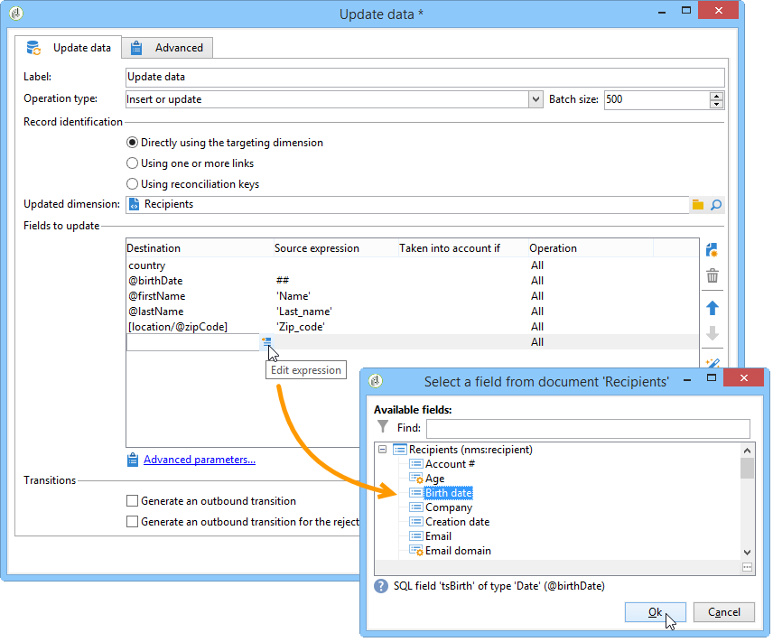

# 데이터 업데이트{#update-data}

**데이터 업데이트** 유형 활동은 데이터베이스의 필드를 일괄 업데이트합니다.

## 작업 유형 {#operation-type}

**[!UICONTROL Operation type]** 필드를 사용하면 데이터베이스의 데이터에 대해 수행할 프로세스를 선택할 수 있습니다.

* **[!UICONTROL Insert or update]**: 데이터를 추가하거나 이미 추가한 경우 업데이트합니다.
* **[!UICONTROL Insert]**: 데이터만 추가합니다.
* **[!UICONTROL Update]**: 데이터만 업데이트합니다.
* **[!UICONTROL Update and merge collections]**: 데이터를 업데이트하고 기본 레코드를 선택한 다음 이 기본 레코드의 중복에 연결된 요소를 연결합니다. 그런 다음 고아 첨부 요소를 만들지 않고 중복을 삭제할 수 있습니다.
* **[!UICONTROL Delete]**: 데이터를 삭제합니다.

**[!UICONTROL Batch size]** 필드를 사용하면 업데이트할 인바운드 전환 요소의 수를 선택할 수 있습니다. 예를 들어 500이라고 지정하면 처음 처리된 500개의 레코드가 업데이트됩니다.

## 레코드 식별 {#record-identification}

데이터베이스의 레코드를 식별하는 방법을 지정합니다.

* 데이터 항목이 기존 타겟팅 차원과 관련된 경우 **[!UICONTROL By directly using the targeting dimension]** 옵션을 선택하고 **[!UICONTROL Updated dimension]** 필드에서 선택합니다.

  **[!UICONTROL Edit this link]** 돋보기 단추를 사용하여 선택한 차원의 필드를 표시할 수 있습니다.

* 그렇지 않으면 데이터베이스의 데이터를 식별하거나 조정 키를 직접 사용할 수 있는 링크를 하나 이상 지정합니다.

## 업데이트할 필드 선택 {#selecting-the-fields-to-be-updated}

Adobe Campaign에서 업데이트할 필드를 자동으로 식별하려면 **[!UICONTROL Automatically associate fields with the same name]** 옵션을 사용하십시오.

**[!UICONTROL Insert]** 아이콘을 사용하여 업데이트할 데이터베이스 필드를 수동으로 선택할 수도 있습니다.

업데이트할 모든 필드를 선택하고 필요한 경우 업데이트를 수행할 항목에 따라 조건을 추가합니다. 이렇게 하려면 **[!UICONTROL Taken into account if]**&#x200B;열을 사용합니다. 조건이 순서대로 적용되며 목록의 순서에 따라 적용됩니다. 업데이트 순서를 변경하려면 오른쪽의 화살표를 사용합니다.

동일한 대상 필드를 여러 번 사용할 수 있습니다.

**[!UICONTROL Insert or update]** 작업 내에서 적용할 캠페인을 개별적으로 또는 각 필드에 대해 선택할 수 있습니다. 이렇게 하려면 **[!UICONTROL Operation]** 열에서 원하는 값을 선택합니다.

**[!UICONTROL modifiedDate]**, **[!UICONTROL modifiedBy]**, **[!UICONTROL createdDate]** 및 **[!UICONTROL createdBy]** 필드는 해당 관리 모드가 필드 업데이트 테이블에 특별히 구성되어 있지 않은 한 데이터 업데이트 중에 자동으로 업데이트됩니다.

레코드 업데이트는 하나 이상의 차이가 있는 레코드에 대해서만 수행됩니다. 값이 동일하면 업데이트가 수행되지 않습니다.

**[!UICONTROL Advanced parameters]** 링크를 사용하여 데이터 업데이트와 중복 관리를 처리할 추가 옵션을 지정할 수 있습니다. 다음을 수행할 수도 있습니다.

* **[!UICONTROL Disable automatic key management]**.
* **[!UICONTROL Disable audit]**.
* **[!UICONTROL Empty the destination value if the source value is empty (NULL)]**. 이 옵션은 기본적으로 자동으로 선택되어 있습니다.
* **[!UICONTROL Update all columns with matching names]**.
* **[!UICONTROL Enabled if]** 필드에 식을 사용하여 소스 요소를 고려하는 조건을 지정하십시오.
* 표현식을 사용하여 중복을 고려하는 조건을 지정합니다. **[!UICONTROL Ignore records which concern the same target]** 옵션을 선택하면 식 목록의 첫 번째 항목만 고려됩니다.

**[!UICONTROL Generate an outbound transition]**

실행 종료 시 활성화될 아웃바운드 전환을 만듭니다. 업데이트는 일반적으로 타겟팅 워크플로우 끝에 신호를 보내므로 옵션은 기본적으로 활성화되지 않습니다.

**[!UICONTROL Generate an outbound transition for the rejects]**

업데이트 후 올바르게 처리되지 않은 레코드(예: 중복이 있는 경우)가 들어 있는 아웃바운드 전환을 만듭니다. 업데이트는 일반적으로 타기팅 워크플로의 끝을 표시하므로 해당 옵션은 기본적으로 활성화되지 않습니다.

## 컬렉션 업데이트 및 병합 {#updating-and-merging-collections}

데이터 업데이트 및 컬렉션 병합을 사용하면 원하는 경우 하나 이상의 보조 레코드에서 데이터를 사용하여 레코드에 포함된 데이터를 업데이트할 수 있습니다. 이러한 업데이트는 규칙 세트에 의해 관리됩니다.

>[!NOTE]
>
>또한 이 옵션을 사용하면 워크플로우 작업 테이블(targetWorkflow), 게재(targetDelivery) 및 목록(targetList)에서 보조 레코드에 대한 참조를 처리할 수 있습니다. 필요한 경우 필드 및 컬렉션을 선택하는 목록에 이러한 링크가 표시됩니다.

1. **[!UICONTROL Update and merge collections]** 작업을 선택하십시오.

   

1. 링크의 우선 순위를 선택합니다. 이를 통해 기본 레코드를 식별할 수 있습니다. 사용 가능한 링크는 인바운드 전환에 따라 달라집니다.

   

1. 기본 레코드로 이동할 컬렉션과 업데이트할 필드를 선택합니다.

   하나 또는 여러 개의 보조 레코드가 식별되면 여기에 적용되는 규칙을 입력합니다. 이렇게 하려면 [식 빌더](../../v8/start/filter-conditions.md#list-of-functions)를 사용합니다. 예를 들어, 보관해야 하는 모든 레코드 중에서 가장 최근에 업데이트된 값임을 지정하여 를 들 수 있습니다.

   그런 다음 규칙에 고려할 조건을 입력합니다.

   마지막으로 수행할 업데이트 유형을 지정합니다. 예를 들어 데이터를 업데이트한 후 보조 레코드를 삭제하도록 선택할 수 있습니다.

   예를 들어 수신자에 대한 구독 목록과 같은 다른 데이터가 포함된 컬렉션의 병합을 구성할 수 있습니다. 규칙을 사용하여 보조 레코드 구독에서 새 구독 내역을 만들거나 구독 목록을 보조 레코드에서 기본 레코드로 이동할 수도 있습니다.

1. **[!UICONTROL Advanced parameters]** > **[!UICONTROL Duplicates]**&#x200B;을(를) 선택하여 보조 레코드를 처리할 순서를 지정하십시오.

   

정의된 규칙을 적용할 수 있는 경우 보조 레코드의 데이터는 기본 레코드와 연결됩니다. 선택한 업데이트 유형에 따라 보조 레코드를 삭제할 수 있습니다.

## 예: 데이터 보강 후 데이터 업데이트 {#example--update-data-following-an-enrichment}

[2단계: 요약 목록을 만드는 방법에 대해 자세히 설명하는 사용 사례의 &#39;구매&#39; 테이블에 보강된 데이터를 쓰는](create-a-summary-list.md#step-2--writing-enriched-data-to-the--purchases--table) 섹션은 보강 활동 후 데이터 업데이트의 예를 제공합니다.

## 입력 매개 변수 {#input-parameters}

* tableName
* 스키마

각 인바운드 이벤트는 이러한 매개 변수로 정의된 대상을 지정해야 합니다.
