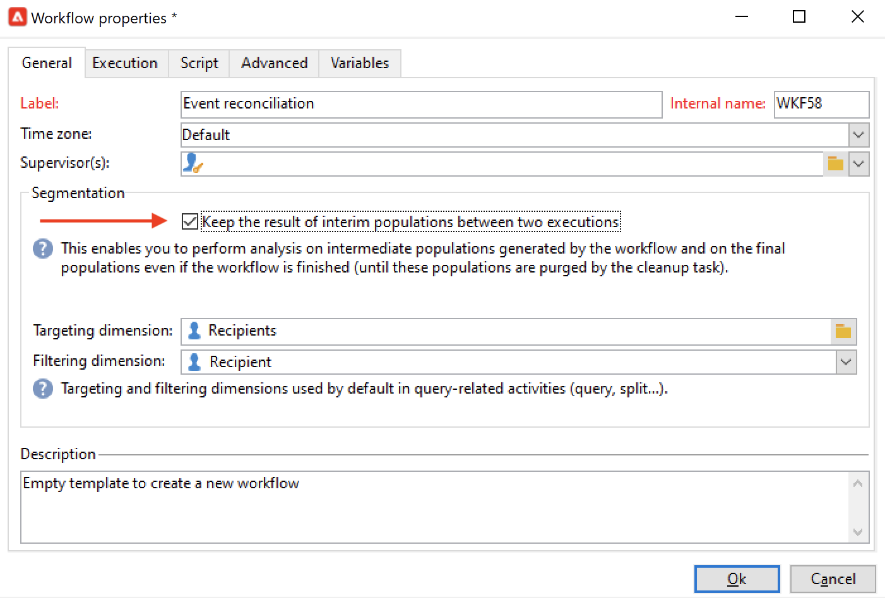

# 워크플로우 데이터 사용{#how-to-use-workflow-data}

워크플로우 활동을 사용하여 여러 작업을 수행할 수 있습니다. 아래 사용 샘플을 찾아 목록을 만들고, 구독을 관리하고, 워크플로우를 통해 메시지를 보내거나, 게재 및 대상자를 보강하여 데이터베이스를 업데이트합니다.

일련의 워크플로우 사용 사례는에서 사용할 수 있습니다. [이 섹션](workflow-use-cases.md).

## 데이터 수명 주기 {#data-life-cycle}

### 워크플로우 임시 작업 테이블 {#work-table}

워크플로우에서 한 활동에서 다른 활동으로 전송된 데이터는 임시 작업 표에 저장됩니다.

해당 전환을 마우스 오른쪽 버튼으로 클릭하여 이 데이터를 표시하고 분석할 수 있습니다.


이렇게 하려면 관련 메뉴를 선택합니다.

* **[!UICONTROL Display the target...]**

   이 메뉴는 대상 모집단에서 사용 가능한 데이터를 표시합니다.

   

   에서 작업 테이블의 구조에 액세스할 수 있습니다. **[!UICONTROL Schema]** 탭.

   

   이 작업에 대한 자세한 정보는 [이 섹션](monitor-workflow-execution.md#worktables-and-workflow-schema)을 참조하십시오.

* **[!UICONTROL Analyze target...]**

   이 메뉴를 사용하여 전환 데이터에 대한 통계 및 보고서를 작성할 수 있는 설명 분석 마법사에 액세스할 수 있습니다.

   자세한 내용은 다음을 참조하십시오. [Campaign Classic v7 설명서](https://experienceleague.adobe.com/docs/campaign-classic/using/reporting/analyzing-populations/about-descriptive-analysis.html){target="_blank"}.

워크플로우가 실행되면 대상 데이터가 제거됩니다. 마지막 작업 테이블만 액세스할 수 있습니다. 모든 작업 테이블에 액세스할 수 있도록 워크플로를 구성할 수 있습니다. 다음을 확인하십시오. **[!UICONTROL Keep the result of interim populations between two executions]** 옵션을 선택합니다.



>[!CAUTION]
>
>**프로덕션** 워크플로에서는 이 옵션을 체크해서는 **안 됩니다**. 이 옵션은 결과를 분석하는 데 사용되며 테스트 목적으로만 설계되었기 때문에 개발 또는 스테이징 환경에서만 사용해야 합니다.


### 대상 데이터 활용 {#target-data}

워크플로우 임시 작업 테이블에 저장된 데이터는 개인화 작업에 사용할 수 있습니다. 데이터는에서 사용할 수 있습니다 [개인화 필드](../../v8/send/personalization-fields.md).

예를 들어 게재 시 목록을 통해 수집된 데이터를 사용할 수 있습니다. 이렇게 하려면 다음 구문을 사용합니다.

```
%= targetData.FIELD %
```

**[!UICONTROL Target extension]** (targetData) 유형 개인화 요소는 타깃팅 워크플로우에 사용할 수 없습니다. 게재 대상은 워크플로우에 빌드되고 게재의 인바운드 전환에서 지정되어야 합니다.

다음 예제에서는 개인화된 이메일에 사용할 고객에 대한 정보 목록을 수집하고 있습니다. 다음 단계를 적용합니다.

1. 정보를 수집할 워크플로우를 만들고 데이터베이스에 이미 있는 데이터와 조정한 다음 게재를 시작합니다.

   

1. 이 예제에서 파일 콘텐츠는 다음과 같습니다.

   ```
   Music,First name,Last name,Account,CD/DVD,Card
   Pop,David,BLAIR,4323,CD,0
   Rock,Daniel,ARCARI,3222,DVD,1
   Disco,Uma,ALTON,0488,DVD,0
   Jazz,Paul,BOLES,6475,CD,1
   Jazz,David,BOUKHARI,0841,DVD,1
   [...]
   ```

   파일을 로드하려면 다음을 구성합니다. **[!UICONTROL Data loading (file)]** 활동은 다음과 같습니다.

   

1. 구성 **[!UICONTROL Enrichment]** 활동은 수집된 데이터를 Adobe Campaign 데이터베이스에 이미 있는 데이터와 조정합니다. 여기서 조정 키는 계정 번호입니다.

   

1. 그런 다음 을(를) 구성합니다 **[!UICONTROL Delivery]**: 템플릿을 기반으로 생성되며 수신자는 인바운드 전환에 의해 지정됩니다.

   

   >[!CAUTION]
   >
   >전환에 포함된 데이터만 게재를 개인화하는 데 사용할 수 있습니다. **targetData** 유형 개인화 필드는 의 인바운드 모집단에만 사용할 수 있습니다. **[!UICONTROL Delivery]** 활동.

1. 게재 템플릿에서 워크플로우에서 수집된 필드를 사용합니다.

   이렇게 하려면 를 삽입합니다. **[!UICONTROL Target extension]** 개인화 필드를 입력합니다.

   

   여기에서는 워크플로우에서 수집한 파일에 명시된 대로 고객이 좋아하는 음악 장르와 미디어 유형(CD 또는 DVD)을 삽입하려고 합니다.

   추가로, 우리는 충성도 카드 소지자, 즉 &#39;카드&#39; 값이 1인 수신자를 위한 쿠폰을 추가할 것입니다.

   

   **[!UICONTROL Target extension]** (targetData) 유형 데이터는 모든 개인화 필드와 동일한 특성을 사용하여 게재에 삽입됩니다. 제목, 링크 레이블 또는 링크 자체에서도 사용할 수 있습니다.


## 데이터베이스 업데이트 {#update-the-database}

수집된 모든 데이터는 데이터베이스 또는 게재를 업데이트하는 데 사용할 수 있습니다. 예를 들어 메시지 콘텐츠 개인화 가능성을 보강할 수 있습니다(메시지에 계약 수 포함, 지난해 평균 장바구니 지정 등). 또는 세부 모집단 타겟팅(계약 공동 소유자에게 메시지 보내기, 온라인 서비스 우수 구독자 1,000명 타겟팅 등) 이 데이터를 내보내거나 목록에 보관할 수도 있습니다.

### 목록 업데이트  {#list-updates}

두 가지 전용 활동을 사용하여 Adobe Campaign 데이터베이스 및 기존 목록의 데이터를 업데이트할 수 있습니다.

* 다음 **[!UICONTROL List update]** 활동을 사용하면 작업 테이블을 데이터 목록에 저장할 수 있습니다.

   기존 목록을 선택하거나 만들 수 있습니다. 이 경우 이름과 레코드 폴더가 계산됩니다.

   

   을(를) 참조하십시오 [목록 업데이트](list-update.md).

* 다음 **[!UICONTROL Update data]** 활동은 데이터베이스의 필드에 대한 대량 업데이트를 수행합니다.

   자세한 내용은 다음을 참조하십시오. [데이터 업데이트](update-data.md).

### 구독 관리 {#subscription-management}

워크플로우를 통해 정보 서비스에 수신자를 구독 및 구독 취소하는 방법에 대한 자세한 내용은 [구독 서비스](subscription-services.md).
