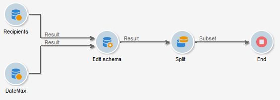

# 집계 사용{#using-aggregates}

이 사용 사례에서는 데이터베이스에 추가된 마지막 수신자를 자동으로 식별하는 방법을 자세히 설명합니다.

다음 프로세스를 사용하여 데이터베이스의 수신자 생성 날짜는 집계를 사용하여 수신자를 만든 마지막 알려진 날짜와 비교됩니다. 같은 날에 만든 모든 수신자도 선택됩니다.

다음을 수행하십시오. **생성 날짜 = 최대(생성 날짜)** 수신자에 대한 필터 를 입력합니다. 다음 단계를 수행하려면 워크플로우를 실행해야 합니다.

1. 기본 쿼리를 사용하여 데이터베이스 수신자를 검색합니다. 이 단계에 대한 자세한 내용은 [쿼리 만들기](query.md#creating-a-query).
1. 에서 생성된 결과를 사용하여 수신자가 마지막으로 알려진 날짜를 계산합니다. **최대(생성 날짜)** 집계 함수입니다.
1. 각 수신자를 집계 함수에 연결하면 동일한 스키마가 됩니다.
1. 편집한 스키마를 통해 집계를 사용하여 수신자를 필터링합니다.

## 1단계: 집계 결과 계산 {#step-1--calculating-the-aggregate-result}

1. 쿼리를 만듭니다. 여기에서 목표는 데이터베이스의 모든 받는 사람 중에서 마지막으로 알려진 생성 날짜를 계산하는 것입니다. 따라서 쿼리에 필터가 포함되어 있지 않습니다.
1. **[!UICONTROL Add data]**&#x200B;을(를) 선택합니다.
1. 열려 있는 창에서 **[!UICONTROL Data linked to the filtering dimension]** 그런 다음 **[!UICONTROL Filtering dimension data]**.
1. 에서 **[!UICONTROL Data to add]** 창의 최대 값을 계산하는 열을 추가합니다. **생성 날짜** 수신자 테이블의 필드. 표현식 편집기를 사용하거나 **max(@created)** 의 필드에 직접 액세스 **[!UICONTROL Expression]** 열. 그런 다음 **[!UICONTROL Finish]** 버튼을 클릭합니다.

   

1. **[!UICONTROL Edit additional data]**&#x200B;을(를) 클릭한 뒤 **[!UICONTROL Advanced parameters...]**&#x200B;을(를) 클릭합니다. **[!UICONTROL Disable automatic adding of the primary keys of the targeting dimension]** 옵션을 선택합니다.

   이 옵션을 사용하면 모든 수신자가 결과로 표시되지 않고 명시적으로 추가된 데이터가 유지되지 않습니다. 이 경우 수신자가 마지막으로 만든 날짜를 나타냅니다.

   **[!UICONTROL Remove duplicate rows (DISTINCT)]** 옵션을 선택된 상태로 두십시오.

## 2단계: 수신자와 집계 함수 결과 연결 {#step-2--linking-the-recipients-and-the-aggregation-function-result}

집계 함수 계산을 수행하는 질의에 수신자와 관련된 쿼리를 연결하려면 스키마 편집 활동을 사용해야 합니다.

1. 수신자에 대한 쿼리를 기본 세트로 정의합니다.
1. 에서 **[!UICONTROL Links]** 탭에서 새 링크를 추가하고 다음과 같이 열리는 창에 정보를 입력합니다.

   * 합계와 관련된 임시 스키마를 선택합니다. 이 스키마에 대한 데이터가 기본 집합의 멤버에 추가됩니다.
   * 선택 **[!UICONTROL Use a simple join]** 기본 집합의 모든 수신자에게 집계 결과를 연결합니다.
   * 마지막으로 링크가 **[!UICONTROL Type 11 simple link]**.

   

따라서 집계 결과는 모든 수신자에게 연결됩니다.

## 3단계: 집계를 사용하여 수신자를 필터링합니다. {#step-3--filtering-recipients-using-the-aggregate-}

링크가 설정되면 집계 결과와 수신자는 동일한 임시 스키마의 일부를 구성합니다. 따라서 스키마에 필터를 만들어 수신자의 생성 날짜와 집계 함수로 표시되는 마지막 알려진 생성 날짜를 비교할 수 있습니다. 이 필터는 분할 활동을 사용하여 수행됩니다.

1. 에서 **[!UICONTROL General]** 탭, 선택 **수신자** 타겟팅 차원 및 **스키마 편집** 을 필터링 차원(인바운드 전환 스키마 활동을 필터링하기 위한)으로 사용할 수 있습니다.
1. 에서 **[!UICONTROL subsets]** 탭, 선택 **[!UICONTROL Add a filtering condition on the inbound population]** 을 클릭한 다음 **[!UICONTROL Edit...]**.
1. 표현식 편집기를 사용하여 수신자의 생성 날짜와 집계에서 계산된 생성 날짜 사이에 같음 기준을 추가합니다.

   데이터베이스의 날짜 유형 필드는 일반적으로 밀리초 단위로 저장됩니다. 따라서 동일한 밀리초만 만든 수신자를 검색할 수 없도록 전체 날짜 동안 이러한 수를 확장해야 합니다.

   이렇게 하려면 **ToDate** 함수 호출을 확인할 수 있습니다.

   따라서 기준에 사용할 표현식은 다음과 같습니다.

   * **[!UICONTROL Expression]**: `toDate([target/@created])`.
   * **[!UICONTROL Value]**: `toDate([datemax/expr####])`인 경우 expr###은 집계 함수 쿼리에 지정된 집계를 참조합니다.

   

따라서 분할 활동의 결과는 마지막으로 알려진 생성 날짜와 동일한 날에 생성된 수신자에 관한 것이다.

그런 다음 목록 업데이트 또는 게재와 같은 다른 활동을 추가하여 워크플로우를 보강할 수 있습니다.
