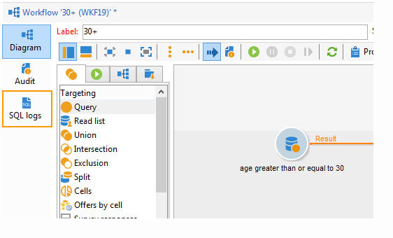

# 워크플로 속성{#workflow-properties}

## 실행 탭 {#execution-tab}

워크플로우에서 **[!UICONTROL Properties]** 창의 **[!UICONTROL Execution]** 탭은 세 개의 섹션으로 분류됩니다.

### 예약 {#scheduler}

이 섹션은 캠페인 워크플로우에만 표시됩니다.

* **[!UICONTROL Priority]**

  워크플로우 엔진은 이 필드에 정의된 우선순위 기준에 따라 실행될 워크플로우를 처리합니다. 예를 들어 우선 순위가 **[!UICONTROL Average]**&#x200B;인 모든 워크플로는 우선 순위가 **[!UICONTROL Low]**&#x200B;인 워크플로보다 먼저 실행됩니다.

* **[!UICONTROL Schedule execution for a time of low activity]**

  이 옵션은 워크플로우 시작을 덜 바쁜 기간으로 연기합니다. 데이터베이스 엔진의 리소스 측면에서 일부 워크플로우는 많은 비용이 소요될 수 있습니다. 활동이 적은 시간(예: 야간)에는 실행 일정을 예약하는 것이 좋습니다. 낮은 활동 기간은 **[!UICONTROL Processes on campaigns]** 기술 워크플로우에서 정의됩니다.

### 실행 {#execution}

* **[!UICONTROL Default affinity]**

  설치에 여러 워크플로 서버가 포함된 경우 이 필드를 사용하여 워크플로를 실행할 컴퓨터를 선택하십시오. 이 필드에 정의된 값이 어떤 서버에도 존재하지 않는 경우 워크플로는 보류 상태로 유지됩니다.

* **[!UICONTROL History in days]**

  데이터베이스의 작업 테이블은 실행 기록(작업, 이벤트, 로그)을 보관합니다. 여기에서 이 워크플로에 대해 보관할 일 수를 정의할 수 있습니다. 정리 프로세스는 하루에 한 번 가장 오래된 아카이브를 삭제합니다. 이 필드의 값이 0이면 아카이브가 삭제되지 않습니다.

* **[!UICONTROL Log SQL queries in the journal]**

  이 기능은 고급 사용자용으로 예약되어 있습니다. 타겟팅 활동(쿼리, 통합, 교차 등)을 포함하는 워크플로와 연계되어 있습니다. 이 옵션을 선택하면 워크플로 실행 중에 데이터베이스로 전송된 SQL 쿼리가 Adobe Campaign에 표시됩니다. 즉, 이를 분석하여 쿼리를 최적화하거나 문제를 진단할 수 있습니다.

  쿼리는 옵션이 활성화된 경우 워크플로우(캠페인 워크플로우 제외) 및 **[!UICONTROL Properties]** 활동에 추가된 **[!UICONTROL SQL logs]** 탭에 표시됩니다. **[!UICONTROL Audit]** 탭에는 SQL 쿼리도 포함됩니다.

  

* **[!UICONTROL Execute in the engine]**

  이 옵션은 디버깅에만 사용할 수 있으며 프로덕션에서는 사용할 수 없습니다. 활성화되면 워크플로우가 우선하며 이 워크플로우가 완료될 때까지 다른 모든 워크플로우가 중지됩니다.

### 오류 관리 {#error-management}

* **[!UICONTROL Troubleshooting]**

  이 필드를 사용하면 워크플로 작업에 오류가 있는 경우 수행할 작업을 정의할 수 있습니다. 다음 두 가지 옵션을 사용할 수 있습니다.

   * **[!UICONTROL Stop the process]**: 워크플로가 자동으로 일시 중지되었습니다. 워크플로 상태가 **[!UICONTROL Failed]**(으)로 변경됩니다. 문제가 해결되면 **[!UICONTROL Start]** 또는 **[!UICONTROL Restart]** 단추를 사용하여 워크플로우를 다시 시작하십시오.
   * **[!UICONTROL Ignore]**: 오류를 트리거한 작업의 상태가 **[!UICONTROL Failed]**(으)로 변경되지만 워크플로는 **[!UICONTROL Started]** 상태를 유지합니다. 이 구성은 반복 작업과 관련되어 있습니다. 분기에 스케줄러가 포함되어 있으면 다음에 워크플로가 실행될 때 정상적으로 시작됩니다.

* **[!UICONTROL Consecutive errors]**

  **[!UICONTROL In case of errors]** 필드에서 **[!UICONTROL Ignore]** 값을 선택하면 이 필드를 사용할 수 있습니다. 프로세스가 중지되기 전에 무시할 수 있는 오류 수를 지정할 수 있습니다. 이 수에 도달하면 워크플로 상태가 **[!UICONTROL Failed]**(으)로 변경됩니다. 이 필드의 값이 0인 경우 오류 수에 관계없이 워크플로가 중지되지 않습니다.

* **[!UICONTROL Template]**

  이 필드에서는 상태가 **[!UICONTROL Failed]**(으)로 변경될 때 워크플로 감독자에게 보낼 알림 템플릿을 선택할 수 있습니다.

  해당 운영자는 프로필에 이메일 주소가 있는 경우 이메일로 알림을 받게 됩니다. 워크플로 감독자를 정의하려면 속성의 **[!UICONTROL Supervisor(s)]** 필드(**[!UICONTROL General]** 탭)로 이동합니다.

  

  **[!UICONTROL Notification to a workflow supervisor]** 기본 템플릿에는 수신자가 로그인한 후 문제를 처리할 수 있도록 웹을 통해 Adobe Campaign 클라이언트 콘솔에 액세스하기 위한 링크가 포함되어 있습니다.

  개인화된 템플릿을 만들려면 **[!UICONTROL Administration>Campaign management>Technical deliveries and templates]**(으)로 이동하십시오.
