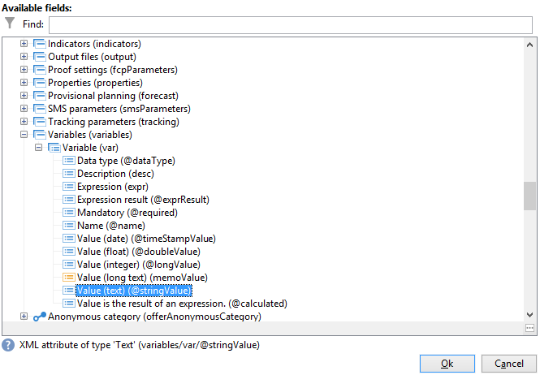

# 사용 사례: 워크플로우 관리{#supervising-workflows}

이 사용 사례에서는 &quot;일시 중지됨&quot;, &quot;중지됨&quot; 또는 &quot;오류 있음&quot;인 워크플로 세트의 상태를 모니터링할 수 있는 워크플로 만들기에 대해 자세히 설명합니다.

목적은 다음과 같습니다.

* 워크플로우를 사용하여 비즈니스 워크플로우 그룹을 모니터링합니다.
* &quot;게재&quot; 활동을 통해 감독자에게 메시지를 보냅니다.

워크플로 세트의 상태를 모니터링하려면 다음 단계를 수행해야 합니다.

1. 모니터링 워크플로우를 만듭니다.
1. JavaScript를 작성하여 워크플로우가 일시 중지, 중지 또는 오류가 발생하는지 확인합니다.
1. 만들기 **[!UICONTROL Test]** 활동.
1. 게재 템플릿을 준비합니다.

>[!NOTE]
>
>워크플로우 외에도 Campaign **워크플로우 Heatmap** 을(를) 통해 현재 실행 중인 워크플로를 세부적으로 분석할 수 있습니다. 자세한 내용은 [전용 섹션](heatmap.md).
>
>자세한 내용: **워크플로우 실행 모니터링**, 참조 [이 섹션](monitor-workflow-execution.md).

## 1단계: 모니터링 워크플로우 만들기 {#step-1--creating-the-monitoring-workflow}

모니터링할 워크플로 폴더는 **&quot;CustomWorkflows&quot;** 폴더에 저장된 폴더 **관리 > 프로덕션 > 기술 워크플로우** 노드. 이 폴더에는 일련의 비즈니스 워크플로우가 포함되어 있습니다.

다음 **워크플로우 모니터링** 는 기술 워크플로우 폴더의 루트에 저장됩니다. 사용된 레이블은 입니다. **&quot;모니터링&quot;**.

다음 스키마는 활동의 순서를 보여 줍니다.


이 워크플로우는 다음과 같이 구성됩니다.

* a **&quot;시작&quot;** 활동.
* a **&quot;JavaScript 코드&quot;** 비즈니스 워크플로우 폴더 분석을 담당하는 활동.
* a **&quot;Test&quot;** 활동을 통해 감독자에게 게재를 보내거나 워크플로우를 다시 시작합니다.
* a **&quot;게재&quot;** 활동은 메시지 레이아웃을 담당합니다.
* a **&quot;Wait&quot;** 워크플로우 반복 간의 리드 타임을 제어하는 활동입니다.

## 2단계: JavaScript 작성 {#step-2--writing-the-javascript}

JavaScript 코드의 첫 번째 부분은 **쿼리(queryDef)** 일시 중단&quot;(@state == 13), &quot;오류&quot;(@failed == 1) 또는 &quot;중지됨&quot;(@state == 20) 상태의 워크플로우를 식별할 수 있습니다.

다음 **내부 이름** 모니터링할 워크플로 폴더 중 은(는) 다음 조건에서 제공됩니다.

```
<condition boolOperator="AND" expr="[folder/@name] = 'Folder20'" internalId="1"/>
```

```
var strError = "";
var strPaused = "";
var strStop = "";

var queryWkfError = xtk.queryDef.create(
  <queryDef schema="xtk:workflow" operation="select">
    <select>
      <node expr="@internalName"/>
      <node expr="@state"/>
      <node expr="@label"/>
      <node expr="@failed"/>
      <node expr="@state"/>   
    </select>
    <where id="12837805386">
      <condition boolOperator="AND" expr="[folder/@name] = 'Folder20'" internalId="1"/>
        <condition boolOperator="AND" internalId="2">
          <condition boolOperator="OR" expr="@state = 20" internalId="3"/>
          <condition expr="@state = 13" internalId="4"/>
        </condition>  
    </where>
  </queryDef>
);
var ndWkfError = queryWkfError.ExecuteQuery(); 
```

JavaScript 코드의 두 번째 부분에서 다음 작업을 수행할 수 있습니다. **각 워크플로우에 대한 메시지 표시** 쿼리 중에 복구된 상태를 기반으로 합니다.

>[!NOTE]
>
>생성된 문자열은 워크플로우의 이벤트 변수에 로드되어야 합니다.

```
for each ( var wkf in ndWkfError.workflow ) 
{
  if ( wkf.@state == 13 )  // Status 13 = paused
  {
    if ( wkf.@failed == 1 )
      strError += "<li>Workflow '" + wkf.@internalName + "' with the label '" + wkf.@label + "'</li>";
    else
      strPaused += "<li>Workflow '" + wkf.@internalName + "' with the label '" + wkf.@label + "'</li>";
  }
  
  if ( wkf.@state == 20 )  // Status 20 = stop
    strStop += "<li>Workflow '" + wkf.@internalName + "' with the label '" + wkf.@label + "'</li>";
}

vars.strWorkflowError = strError;
vars.strWorkflowPaused = strPaused;
vars.strWorkflowStop = strStop;
```

## 3단계: &#39;테스트&#39; 활동 만들기 {#step-3--creating-the--test--activity}

테스트 활동을 통해 게재를 전송해야 하는지 또는 모니터링 워크플로우가 &quot;대기&quot; 활동을 기반으로 다른 주기를 실행해야 하는지 여부를 결정할 수 있습니다.

감독자에게 게재가 전송됩니다. **세 개의 이벤트 변수 &quot;vars.strWorkflowError&quot;, &quot;vars.strWorkflowPaused&quot; 또는 &quot;vars.strWorkflowStop&quot; 중 하나 이상이 비어 있지 않은 경우.**


정기적인 간격으로 모니터링 워크플로우를 다시 시작하도록 &quot;대기&quot; 활동을 구성할 수 있습니다. 이 사용 사례의 경우 **대기 시간은 1시간으로 설정됩니다.**.


## 4단계: 게재 준비 {#step-4--preparing-the-delivery}

게재 활동은 다음을 기반으로 합니다. **게재 템플릿** 에 저장됨 **리소스 > 템플릿 > 게재 템플릿** 노드.

이 템플릿에는 다음이 포함되어야 합니다.

* **감독자의 이메일 주소**.
* **HTML 컨텐츠** 개인화된 텍스트를 삽입할 수 있습니다.

  

  선언된 세 변수(WF_Stop, WF_Paused, WF_Error)는 세 워크플로우 이벤트 변수와 일치합니다.

  이러한 변수는 다음에서 선언해야 합니다 **변수** 게재 템플릿 속성 탭.

  복구하려면 **워크플로우 이벤트 변수의 콘텐츠**, JavaScript 코드에서 반환하는 값으로 초기화되는 게재와 관련된 변수를 선언해야 합니다.

  게재 템플릿에는 다음 콘텐츠가 있습니다.

  

템플릿을 만들고 승인했으면 다음을 구성해야 합니다 **게재** 활동 대상:

* 이전에 만든 게재 템플릿에 &quot;게재&quot; 활동을 연결합니다.
* 워크플로우의 이벤트 변수를 게재 템플릿과 관련된 변수에 연결합니다.

를 두 번 클릭합니다. **게재** 활동을 실행하고 다음 옵션을 선택합니다.

* 게재: 선택 **템플릿에서 새로 생성됨**&#x200B;을(를) 클릭하고 이전에 만든 게재 템플릿을 선택합니다.
* 의 경우 **수신자 및 콘텐츠** 필드, 선택 **게재에 지정됨**.
* 실행할 작업: 선택 **준비 및 시작**.
* 선택 취소 **프로세스 오류** 옵션을 선택합니다.

  

* 로 이동 **스크립트** 의 탭 **게재** 활동, 3개 추가 **문자열** 개인화 필드 메뉴를 통해 변수를 입력합니다.

  

  

  선언된 세 가지 변수는 다음과 같습니다.

  ```
  delivery.variables._var[0].stringValue = vars.strWorkflowError;
  delivery.variables._var[1].stringValue = vars.strWorkflowPaused;
  delivery.variables._var[2].stringValue = vars.strWorkflowStop; 
  ```

이 모니터링 워크플로우가 실행되면 수신자에게 요약을 보냅니다.
