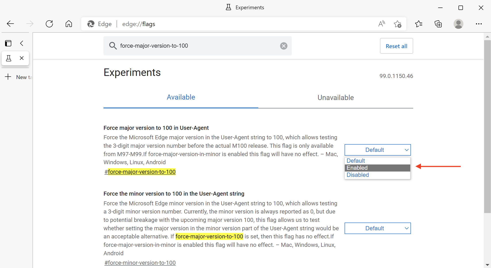

# 3자리 브라우저 버전이 Campaign 웹 구성 요소에 미치는 영향 {#version-100}

Google과 모질라는 Chrome과 Firefox가 예정된 3자리 버전 때문에 일부 웹 사이트를 중단할 수 있다고 경고하고 있습니다.

Chrome v100은에서 릴리스되도록 설정되어 있습니다. **2022년 3월 29일**, 및 의 Firefox v100 **2022년 5월 3일**.

Microsoft은 2022년 3월 이전에 Edge v100을 출시했습니다.

버전 번호를 2자리에서 3자리로 변경하면 이러한 변경에 대비하지 않은 웹 사이트를 방문할 때 몇 가지 문제가 발생할 수 있습니다. 일부 웹 페이지가 이러한 새 브라우저 버전에서 올바르게 표시되지 않을 수 있습니다.

주요 웹 사이트의 호환성은 사전에 테스트되었습니다. 이러한 버전이 출시되기 전에 수정할 수 없는 사이트 관련 문제가 있는 경우, 회사는 사이트에 영향을 주지 않도록 백업 계획을 준비해야 합니다.

웹 사이트의 잠재적 문제 또는 기능 손실은 브라우저가 방문 중인 웹 사이트로 전송하는 사용자 에이전트 문자열에서 기인합니다. 사용자 에이전트는 브라우저가 웹 사이트로 전송하여 사용 중인 브라우저와 버전 및 관련 기술을 사이트에 알리는 문자열입니다. 브라우저에서 웹 사이트에 요청을 보내면 요청한 콘텐츠를 검색하기 전에 사용자 에이전트 문자열로 식별됩니다. 사용자 에이전트 문자열의 데이터는 웹 사이트가 컨텐츠를 브라우저에 맞는 형식으로 전달하는 데 도움이 됩니다. 사용자 에이전트의 버전이 브라우저 버전 번호와 일치하도록 증가합니다. 2자리에서 3자리로 이동하면 문제가 발생할 수 있습니다.

## 영향을 받습니까?{#version-100-impact}

Adobe은 웹 양식 및 설문 조사를 포함한 Campaign 웹 애플리케이션을 테스트하여 이러한 새 브라우저 버전에서 정상적으로 작동하는지 확인할 것을 권장합니다.

이 권장 사항은 모든 웹 애플리케이션에 적용되며, 특히 JavaScript 코드를 포함한 경우에 적용됩니다.

모든 브라우저, 모바일 및 데스크톱을 확인해야 합니다.

## 테스트 방법{#version-100-test}

지금 버전을 100으로 보고하도록 브라우저를 구성한 다음 발생하는 문제를 보고하고 수정할 수 있습니다.

이러한 설정을 사용하면 브라우저가 v100임을 나타내는 새 사용자 에이전트 문자열을 웹 사이트로 보냅니다. 웹 양식에 문제가 발생하는 경우 브라우저 편집기에 대한 버그를 만들어야 합니다. 이러한 업데이트를 광범위하게 사용할 수 있으려면 먼저 이러한 웹 양식을 다시 빌드하는 것이 좋습니다.

### Firefox 100으로 테스트{#test-firefox-100}

Mozilla Firefox 100으로 웹 페이지를 테스트하려면 사용자 에이전트 문자열을 수동으로 변경하여 웹 앱에서 예정된 사용자 에이전트 변경을 시뮬레이션할 수 있습니다.

1. Firefox를 열고 를 입력합니다. `about:config` 주소 표시줄에서 enter 키를 누릅니다.
1. 검색 대상 `general.useragent.override`.
1. &#39;문자열&#39;을 선택한 다음 더하기(+) 기호를 클릭합니다.

   

1. 필드에 다음 텍스트를 입력합니다.

   ```
   Mozilla/5.0 (Windows NT 10.0; rv:100.0) Gecko/20100101 Firefox/100.0
   ```

1. 파란색 확인 표시 버튼을 클릭하여 설정을 저장합니다.
1. 브라우저를 닫았다가 다시 실행합니다.

사용자 에이전트를 기본값으로 되돌리려면 로 돌아가면 됩니다. `about:config` 및 검색 `general.useragent.override` 다시 설정합니다.  표시되는 경우 휴지통 아이콘을 클릭하여 설정을 삭제하고 브라우저를 다시 시작합니다.

### Chrome 100으로 테스트{#test-chrome-100}

자체 웹 앱에서 Google Chrome 100 사용자 에이전트를 테스트하려면 다음 단계를 사용하여 이 테스트를 활성화할 수 있습니다.

1. Chrome을 열고 를 입력합니다. `chrome://flags` 주소 표시줄에서 enter 키를 누릅니다.
1. 검색 `Force major version to 100 in User-Agent` 검색 필드에서 을 선택한 다음 아래와 같이 활성화합니다.

   

1. 브라우저를 다시 시작합니다.
1. 닫기 `chrome://flags` 탭.

사용자 에이전트를 다시 기본값으로 변경하려면 이 프로세스를 따르고 플래그 설정을 로 변경하십시오. `Default` 브라우저를 다시 시작합니다.


### Microsoft Edge 100으로 테스트{#test-ms-edge-100}

v97부터 사이트 소유자는 실험 플래그를 활성화하여 이 버전을 에뮬레이션할 수 있습니다  `#force-major-version-to-100` 위치: `edge://flags`.

1. Microsoft Edge를 열고 를 입력합니다. `edge://flags` 주소 표시줄에서 enter 키를 누릅니다.
1. 검색 대상 `force-major-version-to-100` 을 누르고 아래에 표시된 대로 활성화합니다.

   

1. 브라우저를 다시 시작합니다.
1. 닫기 `edge://flags` 탭.

사용자 에이전트를 다시 기본값으로 변경하려면 이 프로세스를 따르고 플래그 설정을 로 변경하십시오. `Default` 브라우저를 다시 시작합니다.
