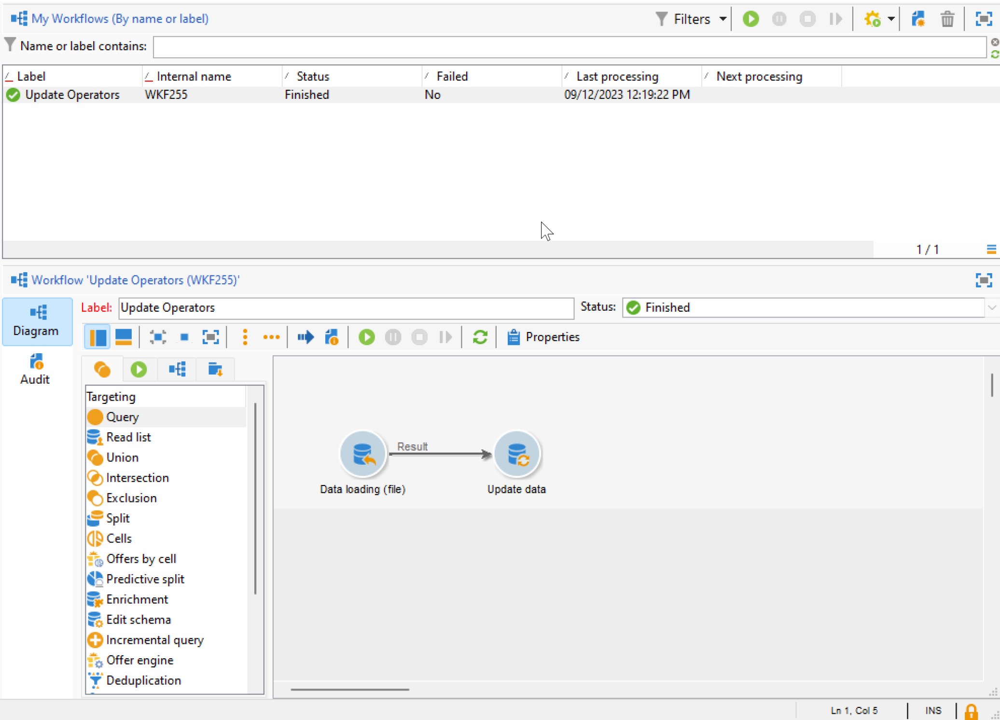
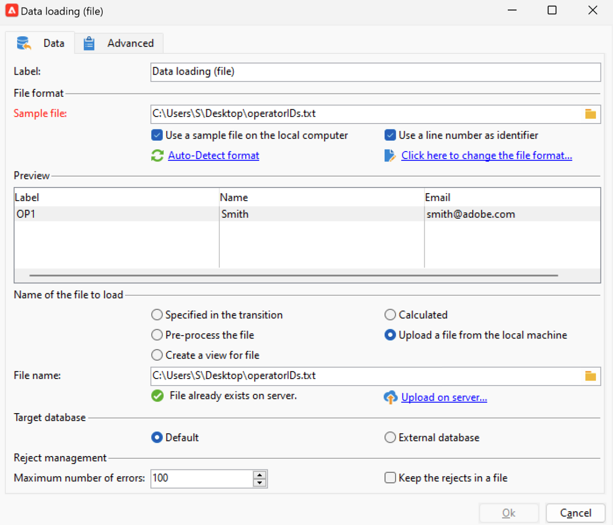

# 캠페인 운영자를 IMS(Identity Management System) Adobe으로 마이그레이션 {#migrate-users-to-ims}

Campaign v8.6부터 Campaign v8에 대한 인증 프로세스가 개선되고 있습니다. 모든 연산자는 [IMS(Identity Management System) Adobe](https://helpx.adobe.com/kr/enterprise/using/identity.html){target="_blank"} **전용**&#x200B;을 사용하여 Campaign에 연결합니다. 사용자/암호(즉, 기본 인증)와의 연결은 더 이상 허용되지 않습니다. Adobe Campaign v8.5.2에서 이 마이그레이션을 수행하여 Campaign v8.6으로 원활하게 마이그레이션할 수 있도록 하는 것이 좋습니다.

Campaign Classic v7 Managed Services 고객은 Campaign v8로 마이그레이션하는 경우 이 절차가 또한 적용됩니다.

이 문서에서는 Adobe Developer 콘솔에서 기술 연산자를 기술 계정으로 마이그레이션하는 데 필요한 단계에 대해 자세히 설명합니다.

## 변경 사항{#move-to-ims-changes}

Campaign v8을 사용하면 모든 일반 사용자가 이미 IMS(Identity Management System) Adobe을 통해 Adobe ID을 사용하여 Adobe Campaign 클라이언트 콘솔에 연결해야 합니다. 그러나 일부 이전 구성에서는 사용자/암호 연결을 계속 사용할 수 있었습니다. **Campaign v8.6.**&#x200B;을(를) 시작할 수 없습니다.

또한 보안 및 인증 프로세스를 강화하기 위한 노력의 일환으로 이제 Adobe Campaign 클라이언트 애플리케이션이 IMS 기술 계정 토큰을 사용하여 Campaign API를 직접 호출합니다. 기술 운영자에 대한 마이그레이션은 전용 문서에 자세히 설명되어 있습니다. [이 페이지](ims-migration.md)에서 확인할 수 있습니다.

이 변경 사항은 Campaign v8.5.2부터 적용되며 Campaign v8.6부터 **필수**&#x200B;입니다.

## 영향을 받습니까?{#migrate-ims-impacts}

조직의 운영자가 로그인/암호(예: )를 사용하여 Campaign 클라이언트 콘솔에 연결하는 경우 기본 인증)을 사용하는 경우 영향을 받게 되며 아래에 자세히 설명된 대로 이러한 연산자를 Adobe IMS로 마이그레이션해야 합니다.

[IMS(Adobe Identity Management System)로 마이그레이션](https://helpx.adobe.com/kr/enterprise/using/identity.html){target="_blank"}은(는) 다른 대부분의 Adobe Experience Cloud 솔루션과 앱이 이미 IMS에 있으므로 환경을 안전하고 표준화해야 하는 보안 필수 요소입니다.

## 마이그레이션 방법{#ims-migration-procedure}

### 필수 구성 요소{#ims-migration-prerequisites}

마이그레이션 프로세스를 시작하기 전에 Adobe 기술 팀이 기존 운영자 그룹과 IMS(Identity Management System) Adobe에 대한 명명된 권한을 마이그레이션할 수 있도록 Adobe 담당자(전환 관리자)에게 연락해야 합니다.

### 주요 단계 {#ims-migration-steps}

이 마이그레이션에 대한 주요 단계는 아래에 나와 있습니다.

1. Adobe은 환경을 Campaign v8.5.2로 업그레이드합니다.
1. 업그레이드 후에도 기본 사용자 또는 IMS와 같은 두 가지 방법을 사용하여 새 사용자를 만들 수 있습니다.
1. 내부 Campaign 관리자는 Campaign 클라이언트 콘솔의 모든 기본 사용자에게 고유한 이메일을 추가해야 하며, 이 작업이 완료되면 Adobe 전환 관리자에게 확인해야 합니다. 이 단계는 [이 섹션](#ims-migration-id)에 자세히 설명되어 있습니다.
1. Adobe과 협력하여 기술 전문가가 아닌 사용자(운영자) 및 제품 프로필에 대해 Adobe이 자동 마이그레이션을 실행할 수 있는 날짜를 확보하십시오. 이 단계에는 인스턴스에 대한 가동 중지 시간 없이 1시간 기간이 필요합니다.
1. 내부 Campaign 관리자가 이러한 변경 사항을 확인하고 승인을 제공합니다. 이 마이그레이션 후에는 더 이상 이 로그인 및 암호로 인증하는 연산자를 만들지 않아야 합니다.

이제 [이 기술 문서](ims-migration.md)에 설명된 대로 기술 연산자를 Adobe Developer Console으로 마이그레이션할 수 있습니다. Campaign API를 사용하는 경우 이 단계는 필수입니다.

이 마이그레이션이 완료되면 Adobe 전환 관리자에게 문의하십시오. Adobe은 마이그레이션을 완료로 표시하고 새로운 기본 사용자 생성 및 기본 사용자 로그인을 차단합니다. 그런 다음 환경을 보호하고 표준화합니다.

## FAQ(자주 묻는 질문) {#ims-migration-faq}

### 언제 마이그레이션을 시작할 수 있습니까? {#ims-migration-start}

[IMS(Adobe Identity Management System)](https://helpx.adobe.com/kr/enterprise/using/identity.html){target="_blank"}(으)로 마이그레이션하기 위한 필수 조건은 환경을 Campaign v8.5.2로 업그레이드하는 것입니다.

Campaign v8.5.2로 업그레이드한 후 프로덕션 환경을 위한 계획을 수립하면 스테이징 환경에서 IMS 마이그레이션을 시작할 수 있습니다.

### Campaign v8.5.2로 빌드 업그레이드 후 어떻게 됩니까? {#ims-migration-after-upgrade}

환경이 Campaign v8.5.2로 업그레이드되면 [IMS(Identity Management System) Adobe](https://helpx.adobe.com/kr/enterprise/using/identity.html){target="_blank"}(으)로 전환을 시작할 수 있습니다.

IMS 마이그레이션이 완료될 때까지 새 기본 사용자 생성이 계속 허용됩니다.

### 마이그레이션이 언제 완료됩니까? {#ims-migration-end}

IMS(Adobe Identity Management System)로의 최종 사용자 마이그레이션 및 기술 사용자 마이그레이션이 완료되면 Adobe이 마이그레이션을 완료로 표시하고 클라이언트 콘솔에서 Adobe 생성을 차단하며 기본 사용자 로그인을 비활성화할 수 있도록 전환 관리자에게 문의해야 합니다.

### 마이그레이션 후 사용자를 만드는 방법 {#ims-migration-native}

전체 IMS 마이그레이션이 완료되면 Adobe은 제한을 적용하여 새로운 기본 사용자 생성을 차단합니다. 이러한 제한 사항은 IMS 마이그레이션이 완료될 때까지 적용되지 않습니다.

신규 고객의 경우 - 처음부터 새로운 기본 사용자 생성이 허용되지 않습니다.

Campaign 관리자는 Adobe Admin Console 및 Campaign 클라이언트 콘솔을 통해 조직의 사용자에게 권한을 부여할 수 있습니다. 사용자가 Adobe ID으로 Adobe Campaign에 로그온합니다. 자세한 내용은 [이 설명서](../../v8/start/gs-permissions.md)를 참조하세요.

### 현재 기본 사용자의 이메일을 추가하는 방법 {#ims-migration-id}

Campaign 관리자는 클라이언트 콘솔에서 모든 기본 사용자에게 이메일 ID를 추가해야 합니다. 이렇게 하려면 아래 단계를 수행합니다.

1. 클라이언트 콘솔에 연결하고 **관리 > 액세스 관리 > 연산자**&#x200B;로 이동합니다.
1. 연산자 목록에서 업데이트할 연산자를 선택합니다.
1. 연산자 양식의 **연락처** 섹션에 연산자의 전자 메일을 입력합니다.
1. 변경 내용을 저장합니다.

워크플로우 감독자 또는 캠페인 관리자로서 워크플로우로 연산자를 대량으로 업데이트할 수도 있습니다.

+++워크플로우로 연산자를 업데이트하는 주요 단계

기본 연산자의 대량 업데이트를 수행하려면 다음 단계를 수행합니다.

1. 기본 인증 모드로 Campaign에 연결하는 모든 연산자를 CSV 파일로 추출할 워크플로우를 만듭니다. **쿼리** 활동 및 **데이터 추출(파일)** 활동을 사용하여 CSV 파일을 만드십시오. 각 연산자의 프로필 데이터를 기반으로 다음 열을 내보낼 수 있습니다. `Name, Label`.

   [이 페이지](../../automation/workflow/query.md)에서 **쿼리** 활동에 대해 자세히 알아보기

   [이 페이지](../../automation/workflow/extraction-file.md)에서 **데이터 추출(파일)** 활동에 대해 자세히 알아보기

1. 연산자의 이메일이 포함된 새 열로 CSV 파일을 업데이트합니다.

1. 워크플로우에서 **데이터 로드(파일)** 활동 및 **데이터 업데이트** 활동을 사용하여 업데이트된 데이터를 가져올 워크플로우를 만드십시오.

   {width="70%"}

1. **데이터 로드(파일)** 활동을 편집하고 아래 샘플에 따라 업데이트된 CSV 파일을 로드하도록 설정을 정의합니다.

   {width="70%"}

   [이 페이지](../../automation/workflow/data-loading-file.md)에서 **데이터 로드(파일)** 활동에 대해 자세히 알아보세요.

1. **데이터 업데이트** 활동을 편집하고 아래 샘플에 따라 설정을 정의합니다. **업데이트된 차원**&#x200B;이 `Operators (xtk)`(으)로 변경되었습니다.

   {width="70%"}

   [이 페이지](../../automation/workflow/update-data.md)에서 **데이터 업데이트** 활동에 대해 자세히 알아보기

1. 워크플로우를 실행하고 결과를 확인합니다. 운영자의 프로필에 이메일 주소를 추가했습니다.

   {width="70%"}

+++

### IMS를 통해 Campaign에 로그인하는 방법 {#ims-migration-log}

[이 섹션](../../v8/start/connect.md)에서 Adobe ID을 사용하여 Campaign에 연결하는 방법을 알아봅니다.

### 이 마이그레이션 도중 중단 시간이 발생합니까? {#ims-migration-downtime}

마이그레이션을 완료하려면(Adobe 및 제품 프로필 마이그레이션) 인스턴스(워크플로 등)에 대한 가동 중지 시간 없이 1시간 동안 마이그레이션이 필요합니다.

이 기간 동안 IMS로의 마이그레이션이 완료되면 모든 Campaign 사용자는 로그오프한 후 Adobe ID으로 다시 로그인해야 합니다.

### IMS 사용자 마이그레이션 중에 로그인한 사용자는 어떻게 됩니까? {#ims-migration-log-off}

Adobe은 마이그레이션 기간 동안 모든 사용자를 로그오프할 것을 강력히 권장합니다.

### 조직의 사용자가 이미 IMS를 사용하고 있습니다. IMS 마이그레이션을 수행해야 합니까?{#ims-migration-needed}

이 마이그레이션에는 최종 사용자 마이그레이션과 기술 사용자 마이그레이션(사용자 지정 코드의 API에 사용됨)의 두 가지 측면이 있습니다.

모든 사용자(Campaign 운영자)가 IMS에 있는 경우 이 마이그레이션을 수행할 필요가 없습니다. 하지만 사용자 지정 코드에서 사용했을 수 있는 기술 사용자를 계속 마이그레이션해야 합니다. [이 페이지](ims-migration.md)에서 자세히 알아보십시오.

이 마이그레이션이 완료되면 Adobe이 마이그레이션을 완료할 수 있도록 Adobe 전환 관리자에게 문의해야 합니다.

### 운영자의 인증 유형을 보는 방법

Campaign에서 연산자의 인증 유형을 보는 방법을 알아봅니다.

1. **탐색기**&#x200B;에서 **관리** `>` **액세스 관리** `>` **연산자**&#x200B;에 액세스합니다.

1. 머리글 행을 마우스 오른쪽 단추로 클릭하고 **목록 구성** 메뉴를 선택합니다.

   

1. **계정 사용 안 함** 및 **인증 유형**&#x200B;을(를) **출력 열**(으)로 추가하십시오.

   

이제 **연산자** 목록과 해당 **인증 유형**&#x200B;을 볼 수 있습니다.

## 유용한 링크 {#ims-useful-links}

* [기술 사용자를 Adobe Developer 콘솔로 마이그레이션](ims-migration.md)
* [Adobe Campaign v8에 연결하는 방법](../../v8/start/connect.md)
* [Adobe Campaign v8의 액세스 및 권한](../../v8/start/gs-permissions.md)
* [Adobe Campaign v8 릴리스 노트](../../v8/start/release-notes.md)
* [IMS(Identity Management System) Adobe은 무엇입니까](https://helpx.adobe.com/kr/enterprise/using/identity.html){target="_blank"}
