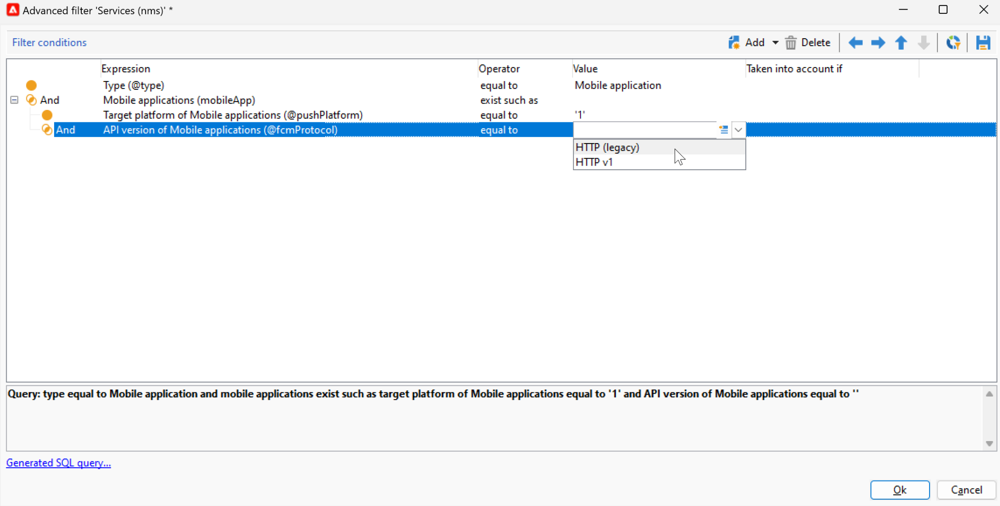

# 푸시 알림 채널 변경 사항 {#push-upgrade}

Campaign을 사용하여 iOs 및 Android 디바이스에서 푸시 알림을 전송할 수 있습니다. 이를 위해 Campaign은 모바일 애플리케이션 구독 서비스를 사용합니다.

Android FCM(Firebase Cloud Messaging) 서비스에 대한 몇 가지 중요한 변경 사항은 2024년에 릴리스되며, Adobe Campaign 구현에 영향을 줄 수 있습니다. 이 변경 사항을 지원하려면 Android 푸시 메시지에 대한 구독 서비스 구성을 업데이트해야 할 수 있습니다.

또한 Adobe은 보다 안전하고 확장 가능한 인증 기반 연결보다 토큰 기반 연결을 APNs로 이동하는 것이 좋습니다.

## Google Android FCM(Firebase Cloud Messaging) 서비스 {#fcm-push-upgrade}

### 변경 사항 {#fcm-changes}

서비스 개선을 위한 Google의 지속적인 노력의 일환으로 레거시 FCM API는에서 중단됩니다. **2024년 6월 20일**. 에서 Firebase Cloud Messaging HTTP 프로토콜에 대해 자세히 알아보기 [Google Firebase 설명서](https://firebase.google.com/docs/cloud-messaging/http-server-ref){target="_blank"}.

Adobe Campaign Classic v7 및 Adobe Campaign v8은 이미 푸시 알림 메시지를 보내기 위해 최신 API를 지원합니다. 그러나 일부 이전 구현은 여전히 이전 API에 의존합니다. 이러한 구현을 업데이트해야 합니다.

### 영향을 받습니까? {#fcm-impact}

현재 구현이 기존 API를 사용하여 FCM에 연결하는 구독 서비스를 지원하는 경우 영향을 받습니다. 서비스가 중단되지 않도록 하려면 최신 API로 전환해야 합니다. 이 경우 Adobe 팀이 연락을 드릴 것입니다.

영향을 받는지 확인하려면 다음을 필터링할 수 있습니다. **서비스 및 구독** 아래 필터에 따라:

* 활성 푸시 알림 서비스에서 **HTTP(기존)** API, 설정은 이 변경의 영향을 직접적으로 받습니다. 아래 설명된 대로 현재 구성을 검토하고 최신 API로 이동해야 합니다.

* 설정에서 **HTTP v1** Android 푸시 알림용 API라면 이미 을(를) 준수하고 있으므로 추가 작업이 필요하지 않습니다.

### 업데이트 방법 {#fcm-transition-procedure}

#### 필수 구성 요소 {#fcm-transition-prerequisites}

* Campaign Classic v7의 경우 20.3.1 릴리스에서 HTTP v1에 대한 지원이 추가되었습니다. 환경이 이전 버전에서 실행 중인 경우 HTTP v1로 전환하기 위한 전제 조건은 환경을 [최신 Campaign Classic 빌드](https://experienceleague.adobe.com/docs/campaign-classic/using/release-notes/latest-release.html){target="_blank"}. Campaign v8의 경우 HTTP v1은 모든 릴리스에서 지원되며 업그레이드할 필요가 없습니다.

* 모바일 애플리케이션을 HTTP v1로 이동하려면 Android Firebase 관리 SDK 서비스의 계정 JSON 파일이 필요합니다. 에서 이 파일을 가져오는 방법 알아보기 [Google Firebase 설명서](https://firebase.google.com/docs/admin/setup#initialize-sdk){target="_blank"}.

* 하이브리드, 호스팅 및 Managed Services 배포의 경우 아래 전환 절차 외에도 Adobe에 문의하여 실시간(RT) 실행 서버를 업데이트합니다. 중간 소싱 서버는 영향을 받지 않습니다.

* Campaign Classic v7 온-프레미스 사용자는 마케팅 및 실시간 실행 서버를 모두 업그레이드해야 합니다. 중간 소싱 서버는 영향을 받지 않습니다.

#### 전환 절차 {#fcm-transition-steps}

환경을 HTTP v1로 이동하려면 다음 단계를 수행합니다.

1. 내 목록 찾아보기 **서비스 및 구독**.
1. 다음을 사용하여 모든 모바일 애플리케이션 나열 **HTTP(기존)** API 버전.
1. 이러한 각 모바일 애플리케이션에 대해 **API 버전** 끝 **HTTP v1**.
1. 다음을 클릭합니다. **[!UICONTROL Load project json file to extract project details...]** JSON 키 파일을 직접 로드하는 링크.

   다음 세부 정보를 수동으로 입력할 수도 있습니다.

   * **[!UICONTROL Project Id]**
   * **[!UICONTROL Private Key]**
   * **[!UICONTROL Client Email]**

   

1. 클릭 **[!UICONTROL Test the connection]** 구성이 올바르고 마케팅 서버가 FCM에 액세스할 수 있는지 확인하려면 다음을 수행하십시오. 중간 소싱 배포의 경우 **[!UICONTROL Test connection]** 서버에 Android FCM(Firebase Cloud Messaging) 서비스에 대한 액세스 권한이 있는지 단추가 확인할 수 없습니다.
1. 옵션으로 다음을 사용하여 푸시 메시지 콘텐츠를 보강할 수 있습니다 **[!UICONTROL Application variables]** 필요한 경우. 이는 완전히 맞춤화가 가능하며 모바일 디바이스로 전송되는 메시지 페이로드의 일부입니다.
1. **[!UICONTROL Finish]**&#x200B;을(를) 클릭한 뒤 **[!UICONTROL Save]**&#x200B;을(를) 클릭합니다.

다음은 푸시 알림을 추가로 개인화할 FCM 페이로드 이름입니다. 이러한 옵션은 자세히 설명되어 있습니다 [여기](#fcm-apps).

| 메시지 유형 | 구성 가능한 메시지 요소(FCM 페이로드 이름) | 구성 가능한 옵션(FCM 페이로드 이름) |
|:-:|:-:|:-:|
| 데이터 메시지 | N/A | validate_only |
| 알림 메시지 | 제목, 본문, android_channel_id, 아이콘, 사운드, 태그, 색상, click_action, 이미지, 티커, 고정, 가시성, notification_priority, notification_count   | validate_only |

>[!NOTE]
>
>이러한 변경 사항이 모든 서버에 적용되면 Android 디바이스에 대한 모든 새로운 푸시 알림 게재는 HTTP v1 API를 사용합니다. 재시도 중, 진행 중 및 사용 중인 기존 푸시 게재는 여전히 HTTP(기존) API를 사용합니다.

### 내 Android 앱의 영향은 무엇입니까? {#fcm-apps}

Android 모바일 애플리케이션의 코드에는 특정 변경 사항이 필요하지 않으며 알림 동작은 변경되지 않아야 합니다.

그러나 HTTP v1을 사용하면 을 통해 푸시 알림을 추가로 개인화할 수 있습니다. **[!UICONTROL HTTPV1 additional options]**.

다음을 수행할 수 있습니다.

* 사용 **[!UICONTROL Ticker]** 알림의 티커 텍스트를 설정할 필드입니다.
* 사용 **[!UICONTROL Image]** 알림에 표시할 이미지의 URL을 설정하는 필드입니다.
* 사용 **[!UICONTROL Notification Count]** 애플리케이션 아이콘에 직접 표시할 읽지 않은 새 정보의 수를 설정하는 필드입니다.
* 설정 **[!UICONTROL Sticky]** 옵션을 false로 설정하여 사용자가 알림을 클릭할 때 알림이 자동으로 해제되도록 할 수 있습니다. true로 설정하면 사용자가 알림을 클릭할 때에도 알림이 계속 표시됩니다.
* 설정 **[!UICONTROL Notification Priority]** 알림 수준을 기본값, 최소, 낮음 또는 높음으로 설정합니다.
* 설정 **[!UICONTROL Visibility]** 공개, 비공개 또는 비밀에 대한 알림 수준.

자세한 내용은 **[!UICONTROL HTTP v1 additional options]** 이러한 필드를 채우는 방법은 다음을 참조하십시오. [FCM 설명서](https://firebase.google.com/docs/reference/fcm/rest/v1/projects.messages#androidnotification){target="_blank"}.

## Apple iOS APNs(푸시 알림 서비스) {#apns-push-upgrade}

### 변경 사항 {#ios-changes}

Apple에서 권장하는 대로 상태 비저장 인증 토큰을 사용하여 APNs(Apple 푸시 알림 서비스)와의 통신을 보호해야 합니다.

토큰 기반 인증은 APNs와 통신하는 상태 비저장 방법을 제공합니다. 상태 비저장 통신은 APNs가 공급자 서버와 관련된 인증서 또는 기타 정보를 조회할 필요가 없기 때문에 인증서 기반 통신보다 빠릅니다. 토큰 기반 인증을 사용하면 다음과 같은 다른 이점이 있습니다.

* 여러 공급자 서버에서 동일한 토큰을 사용할 수 있습니다.

* 하나의 토큰을 사용하여 회사의 모든 앱에 대한 알림을 배포할 수 있습니다.

에서 APNs에 대한 토큰 기반 연결에 대해 자세히 알아보십시오. [Apple 개발자 설명서](https://developer.apple.com/documentation/usernotifications/establishing-a-token-based-connection-to-apns){target="_blank"}.

Adobe Campaign Classic v7 및 Adobe Campaign v8은 토큰 기반 연결과 인증서 기반 연결을 모두 지원합니다. 구현이 인증서 기반 연결을 사용하는 경우 Adobe은 토큰 기반 연결로 업데이트할 것을 강력히 권장합니다.

### 영향을 받습니까? {#ios-impact}

현재 구현이 APNs에 연결하기 위해 인증서 기반 요청을 사용하는 경우 영향을 받습니다. 토큰 기반 연결로 전환하는 것이 좋습니다.

영향을 받는지 확인하려면 다음을 필터링할 수 있습니다. **서비스 및 구독** 아래 필터에 따라:

* 활성 푸시 알림 서비스에서 **인증서 기반 인증** 모드(.p12), 현재 구현을 검토하고 **토큰 기반 인증** 아래에 설명된 대로 모드(.p8)를 설정합니다.

* 설정에서 **토큰 기반 인증** iOS 푸시 알림에 대한 모드에서는 구현이 이미 최신 상태이며 추가 작업이 필요하지 않습니다.

### 업데이트 방법 {#ios-transition-procedure}

#### 필수 구성 요소 {#ios-transition-prerequisites}

* Campaign Classic v7의 경우 **토큰 기반 인증** 모드는 20.2 릴리스에 추가되었습니다. 환경이 이전 버전에서 실행 중인 경우 이 변경을 위한 전제 조건은 환경을 [최신 Campaign Classic 빌드](https://experienceleague.adobe.com/docs/campaign-classic/using/release-notes/latest-release.html){target="_blank"}. Campaign v8의 경우 **토큰 기반 인증** 모드는 모든 릴리스에서 지원되며 업그레이드가 필요하지 않습니다.

* 서버에서 사용하는 토큰을 생성하려면 APNs 인증 토큰 서명 키가 필요합니다. 에 설명된 대로 Apple 개발자 계정에서 이 키를 요청합니다. [Apple 개발자 설명서](https://developer.apple.com/documentation/usernotifications/establishing-a-token-based-connection-to-apns){target="_blank"}.

* 하이브리드, 호스팅 및 Managed Services 배포의 경우 아래 전환 절차 외에도 Adobe에 문의하여 실시간(RT) 실행 서버를 업데이트합니다. 중간 소싱 서버는 영향을 받지 않습니다.

* Campaign Classic v7 온-프레미스 사용자는 마케팅 및 실시간 실행 서버를 모두 업그레이드해야 합니다. 중간 소싱 서버는 영향을 받지 않습니다.

#### 전환 절차 {#ios-transition-steps}

iOS 모바일 애플리케이션을 토큰 기반 인증 모드로 이동하려면 다음 단계를 따르십시오.

1. 내 목록 찾아보기 **서비스 및 구독**.
1. 다음을 사용하여 모든 모바일 애플리케이션 나열 **인증서 기반 인증** 모드(.p12).
1. 이러한 각 모바일 애플리케이션을 편집하고 **인증서/개인 키** 탭.
1. 다음에서 **인증 모드** 드롭다운, 선택 **토큰 기반 인증** 모드(.p8).
1. APNs 연결 설정을 입력하십시오. **[!UICONTROL Key Id]**, **[!UICONTROL Team Id]** 및 **[!UICONTROL Bundle Id]** 그런 다음 를 클릭하여 p8 인증서를 선택합니다. **[!UICONTROL Enter the private key...]**.

   

1. 클릭 **[!UICONTROL Test the connection]** 구성이 올바르고 서버에서 APNs에 액세스할 수 있는지 확인합니다. 중간 소싱 배포의 경우 **[!UICONTROL Test connection]** 서버에서 APNs에 액세스할 수 있는지 확인할 수 없습니다.
1. 클릭 **[!UICONTROL Next]** 프로덕션 애플리케이션 구성을 시작하고 위에 설명된 것과 동일한 단계를 수행합니다.
1. **[!UICONTROL Finish]**&#x200B;을(를) 클릭한 뒤 **[!UICONTROL Save]**&#x200B;을(를) 클릭합니다.

이제 iOS 애플리케이션이 토큰 기반 인증 모드로 이동되었습니다.
