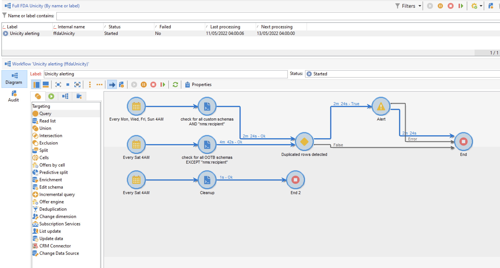
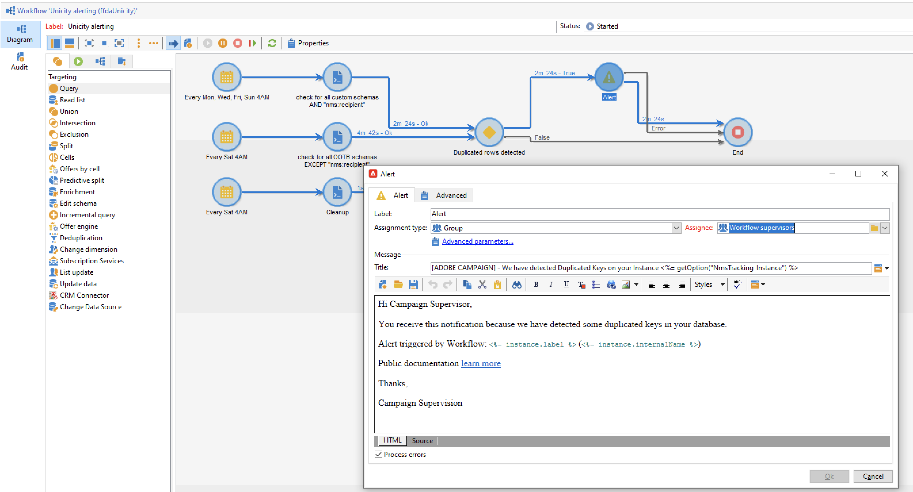

# 키 관리 및 독자성 {#key-management}

[엔터프라이즈(FFDA) 배포](enterprise-deployment.md)의 컨텍스트에서 기본 키는 UUID(Universally Unique Identifier)이며 문자열로 구성됩니다. 이 UUID를 만들려면 스키마의 기본 요소에 **true**(으)로 설정된 **autuuid** 및 **autopk** 특성이 있어야 합니다.

Adobe Campaign v8에서는 [!DNL Snowflake]을(를) 핵심 데이터베이스로 사용합니다. [!DNL Snowflake] 데이터베이스의 분산 아키텍처에서는 테이블 내에서 키 독자성을 보장하는 메커니즘을 제공하지 않습니다. 최종 사용자는 Adobe Campaign 데이터베이스 내에서 키 일관성을 담당합니다.

관계형 데이터베이스 일관성을 유지하려면 키, 특히 기본 키의 중복을 피해야 합니다. 기본 키의 중복으로 인해 **쿼리**, **조정**, **데이터 업데이트** 등과 같은 데이터 관리 워크플로 활동에 문제가 발생합니다. [!DNL Snowflake]개 테이블을 업데이트할 때 적절한 조정 기준을 정의하는 데 매우 중요합니다.

>[!CAUTION]
>
>중복 키는 UUID로 제한되지 않습니다. 사용자 지정 테이블에서 생성된 사용자 지정 키를 포함하여 ID를 사용하면에서 발생할 수 있습니다.

## 단일성 서비스{#unicity-service}

[단일성 서비스]는 사용자가 클라우드 데이터베이스 테이블 내에서 고유 키 제약 조건의 무결성을 유지 및 모니터링하는 데 도움이 되는 Cloud Database Manager 구성 요소입니다. 이를 통해 중복 키를 삽입할 위험을 줄일 수 있습니다.

[클라우드 데이터베이스]는 단일성 제약 조건을 적용하지 않으므로, [단일성 서비스]는 Adobe Campaign으로 데이터를 관리할 때 중복 항목을 삽입하는 위험을 줄여 줍니다.

### 단일성 워크플로{#unicity-wf}

[단일성 서비스]에는 단일성 제약 조건 및 중복이 검색되었을 때 경고를 모니터링하기 위한 전용 **[!UICONTROL Unicity alerting]** 기본 제공 워크플로가 포함되어 있습니다.

이 기술 워크플로우는 캠페인 탐색기의 **[!UICONTROL Administration > Production > Technical workflows > Full FFDA Unicity]** 노드에서 사용할 수 있습니다. **수정해서는 안 됩니다**.

이 워크플로우는 모든 사용자 지정 및 기본 제공 스키마를 확인하여 중복 행을 검색합니다.

**[!UICONTROL Unicity alerting]**(ffdaUnicity) 워크플로에서 일부 중복 키를 감지하면 스키마 이름, 키 유형, 영향을 받은 행 수 및 날짜를 포함하는 특정 **감사 유니시티** 테이블에 추가됩니다. **[!UICONTROL Administration > Audit > Key Unicity]** 노드에서 중복 키에 액세스할 수 있습니다.

데이터베이스 관리자는 SQL 활동을 사용하여 중복을 제거하거나 Adobe 고객 지원 센터에 자세한 지침을 문의할 수 있습니다.

### 경고{#unicity-wf-alerting}

중복 키가 검색되면 특정 알림이 **[!UICONTROL Workflow Supervisors]** 연산자 그룹으로 전송됩니다. **[!UICONTROL Unicity alerting]** 워크플로우의 **경고** 활동에서 이 경고의 내용과 대상을 변경할 수 있습니다.

## 추가 보호 기능{#duplicates-guardrails}

Campaign에는 [!DNL Snowflake] 데이터베이스에 중복 키가 삽입되지 않도록 하는 새 보호 기능 집합이 포함되어 있습니다.

>[!NOTE]
>
>이러한 보호 기능은 Campaign v8.3부터 사용할 수 있습니다. 버전을 확인하려면 [이 섹션](../start/compatibility-matrix.md#how-to-check-your-campaign-version-and-buildversion)을 참조하세요.

### 게재 준비{#remove-duplicates-delivery-preparation}

Adobe Campaign은 게재를 준비하는 동안 대상에서 복제된 UUID를 자동으로 제거합니다. 이 메커니즘은 게재를 준비하는 동안 오류가 발생하지 않도록 합니다. 최종 사용자는 게재 로그에서 이 정보를 확인할 수 있습니다. 일부 수신자는 중복 키로 인해 기본 대상에서 제외될 수 있습니다. 이 경우 `Exclusion of duplicates (based on the primary key or targeted records)` 경고가 표시됩니다.

### 워크플로우에서 데이터 업데이트{#duplicates-update-data}

[엔터프라이즈(FFDA) 배포](enterprise-deployment.md)의 컨텍스트에서는 내부 키(UUID)를 워크플로우에서 데이터를 업데이트할 필드로 선택할 수 없습니다.

### 중복 항목을 포함하는 스키마 쿼리{#query-with-duplicates}

워크플로우가 스키마에서 쿼리 실행을 시작하면 Adobe Campaign은 [감사 유니시티 테이블](#unicity-wf)에 중복 레코드가 보고되는지 확인합니다. 이 경우 워크플로우에서는 중복 데이터에 대한 후속 작업이 워크플로우 결과에 영향을 줄 수 있으므로 경고를 기록합니다.

이 검사는 다음 워크플로우 활동에서 수행됩니다.

* 쿼리
* 증분 쿼리
* 목록 읽기