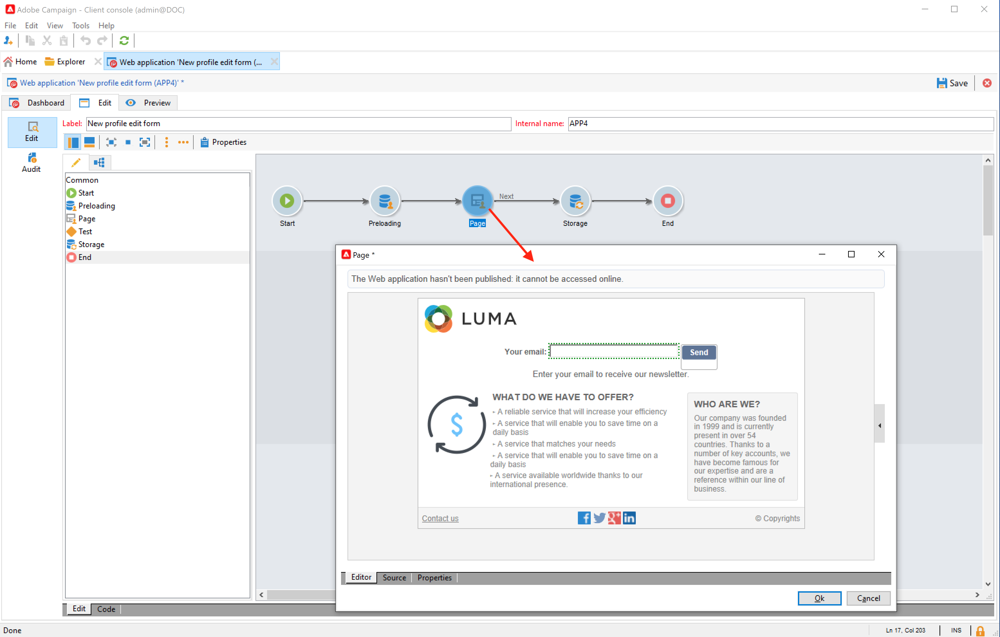

# 웹 양식으로 프로필 수집 및 업데이트

Campaign을 사용하여 웹 양식을 만들고 쉽고 효율적으로 프로필 데이터를 수집하고 관리할 수 있습니다. 연락 대상이 해당 정보를 쉽게 제공할 수 있도록 이 양식을 웹 사이트에 공유할 수 있습니다. 데이터는 프로필을 만들거나 업데이트하기 위해 Campaign으로 전송됩니다.

웹 양식을 만드는 방법은 [Campaign Classic v7 설명서](https://experienceleague.adobe.com/docs/campaign-classic/using/designing-content/web-forms/about-web-forms.html?lang=ko){target="_blank"}를 참조하세요.
