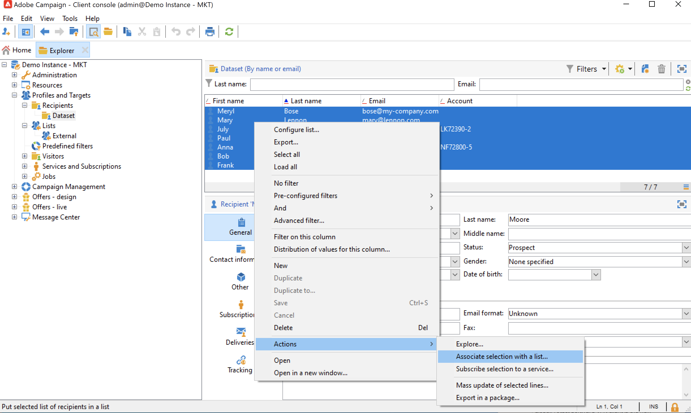

# 목록에서 대상 만들기{#create-segments}

캠페인 목록을 사용하여 대상자를 만들고 구성합니다.

목록은 게재 작업에서 타겟팅되거나 가져오기 또는 다른 워크플로우 작업 중에 업데이트될 수 있는 정적 연락처 세트입니다. 예를 들어 쿼리를 통해 데이터베이스에서 추출한 모집단은 목록으로 저장할 수 있습니다.

목록은 를 통해 만들고 관리됩니다 **[!UICONTROL Lists]** 링크 위치 **[!UICONTROL Profiles and targets]** 탭. 이 목록은 기본 Adobe Campaign 프로필 테이블(nms:recipient)을 기반으로 합니다. [자세히 알아보기](../dev/datamodel.md#ootb-profiles.md)

다음 아이콘을 사용하여 목록을 만들 수 있습니다 **목록 업데이트** 활동 을 만들 수 있습니다. 이 활동은 결과 모집단을 목록에 저장합니다. 새 목록을 만들거나 기존 목록을 업데이트하는 데 사용합니다. 기본 제공 프로필 테이블 이외의 다른 유형의 데이터가 포함된 목록을 만들려면 워크플로우를 실행해야 합니다. 예를 들어 방문자 테이블에서 쿼리를 사용한 다음 목록을 업데이트하여 방문자 목록을 만들 수 있습니다. [자세히 알아보기](#create-a-list-wf)

Adobe Campaign의 목록 관리에 대해 자세히 알려면 이 비디오를 시청하십시오.

>[!VIDEO](https://video.tv.adobe.com/v/334909?quality=12)

## 연락처 목록 만들기 {#create-a-list-of-contacts}

연락처 목록을 만들려면 아래 단계를 수행하십시오.

1. 을(를) 클릭합니다. **[!UICONTROL Create]** 단추를 누르고 선택합니다. **[!UICONTROL New list]**.

   

1. 에 정보를 입력합니다. **[!UICONTROL Edit]** 목록 작성 창의 탭입니다.

   

   * 에 목록 이름을 입력합니다. **[!UICONTROL Label]** 필드 및 필요한 경우 내부 이름을 변경합니다.
   * 이 목록에 대한 설명을 추가합니다.
   * 만료 날짜를 지정할 수 있습니다. 이 날짜에 도달하면 목록이 삭제되고 자동으로 삭제됩니다.

1. 에서 **[!UICONTROL Content]** 탭, **[!UICONTROL Add]** 목록에 속하는 프로필을 선택하려면 다음을 수행하십시오.

   

   새 프로필을 만들고 **[!UICONTROL Create]** 아이콘. 프로필이 데이터베이스에 추가됩니다.

1. 클릭 **[!UICONTROL Save]** 목록을 저장합니다. 그런 다음 목록 개요에 추가됩니다.

## 필터링된 연락처를 목록으로 변환 {#convert-data-to-a-list}

프로필을 선택하고 목록에 추가할 수 있습니다. 이렇게 하려면 아래 단계를 수행하십시오.

1. Campaign Explorer에서 프로필을 선택하고 마우스 오른쪽 단추를 클릭합니다.

   이러한 프로필을 특정 기준을 충족하도록 필터링할 수 있습니다.

1. **[!UICONTROL Actions > Associate selection with a list...]**&#x200B;을(를) 선택합니다.

   

1. 기존 목록을 선택하거나 새 목록을 만든 다음 **[!UICONTROL Next]**.

   

1. **[!UICONTROL Start]** 버튼을 클릭합니다.

   

을(를) 선택합니다 **[!UICONTROL Recreate the list]** 목록에서 기존 컨텐츠를 삭제하고 목록 만들기를 최적화하는 옵션(프로필이 이미 목록에 연결되어 있는지 여부를 확인하기 위해 쿼리가 필요 없음).

선택을 취소하고 **[!UICONTROL No trace of this job is saved in the database]** 옵션을 선택하면 이 프로세스에 연결된 정보가 저장되는 실행 폴더를 선택하거나 생성할 수 있습니다.

창의 위쪽 섹션에서 실행을 모니터링할 수 있습니다. 다음 **[!UICONTROL Stop]** 버튼을 사용하면 프로세스를 중지할 수 있습니다. 이미 처리된 연락처가 목록에 연결됩니다.

실행이 완료되면 **[!UICONTROL Profiles and Targets > Lists]** 메뉴를 클릭하고 목록을 선택합니다. a **[!UICONTROL Content]** 이 목록에 연결된 프로필이 탭에 표시됩니다.

## 워크플로우를 사용하여 목록 만들기  {#create-a-list-wf}

를 사용할 수 있습니다 **[!UICONTROL List update]** 활동을 통해 목록을 만들거나 수신자 목록에 모집단을 추가할 수 있습니다.

아래 예에서는 25와 40 사이의 모든 수신자 목록을 만듭니다.

1. 선택 **[!UICONTROL Profiles and targets]**, 및 **[!UICONTROL Targeting workflows]**&#x200B;를 만든 다음, **[!UICONTROL Create]** 버튼을 클릭합니다.
1. 이 워크플로에 대한 레이블을 입력합니다(예: &#39;25-40 연락처&#39;). 설명을 추가한 다음 **[!UICONTROL Next]**.

   

1. 삽입 **[!UICONTROL Query]** 활동을 통해 대상 모집단을 정의하고 쿼리를 편집합니다.

   

1. 다음과 같이 필터 조건을 정의합니다.

   

   의 워크플로우에서 쿼리를 만드는 방법을 알아봅니다 [Campaign Classic v7 설명서](https://experienceleague.adobe.com/docs/campaign-classic/using/automating-with-workflows/targeting-activities/query.html#creating-a-query){target=&quot;_blank&quot;}

1. 이 쿼리의 레이블을 추가하고 변경 사항을 저장합니다.
1. 추가 **[!UICONTROL List update]** 활동을 편집하고 편집합니다.

   

1. 활동의 레이블을 입력합니다.
1. 을(를) 선택합니다 **[!UICONTROL Create the list if necessary (Computed name)]** 옵션을 선택하면 첫 번째 워크플로우가 실행되면 목록이 만들어지고 다음 실행으로 업데이트됩니다.
1. 폴더를 선택하고 목록의 레이블을 입력합니다.
1. 을(를) 선택합니다 **[!UICONTROL Database of the targeting dimension]** 테이블 저장
1. 을(를) 종료하십시오. **[!UICONTROL Purge the list if it exists (otherwise add to the list)]** 타깃팅 기준과 일치하지 않는 수신자를 삭제하고 새 수신자를 목록에 삽입하는 옵션을 선택했습니다.
1. 또한 **[!UICONTROL Create or use a list with its own table]** 옵션을 선택했습니다.
1. 을(를) 종료하십시오. **[!UICONTROL Generate an outbound transition]** 옵션을 선택 취소합니다.
1. 클릭 **[!UICONTROL Ok]**, 그리고 워크플로우를 저장합니다.
1. 워크플로우를 시작합니다.

   그러면 일치하는 수신자 목록이 만들어집니다. 다음 위치에서 이 목록에 액세스할 수 있습니다 **[!UICONTROL Lists]** 홈 페이지의 항목입니다.

   

   워크플로우에 스케줄러를 추가하여 이 워크플로우를 재귀적으로 만들 수 있습니다. 자세한 내용은 [Campaign Classic v7 설명서](https://experienceleague.adobe.com/docs/campaign-classic/using/automating-with-workflows/flow-control-activities/scheduler.html)를 참조하십시오{target=&quot;_blank&quot;}.

## 목록에서 프로필 제거 {#remove-a-profile-from-a-list}

목록에서 프로파일을 제거하려면 목록을 편집하고 **[!UICONTROL Content]** 탭을 클릭한 다음 **[!UICONTROL Delete]** 아이콘.

## 프로필 목록 삭제 {#delete-a-list-of-profiles}

목록을 삭제하려면 Campaign Explorer에서 목록을 찾아 선택하고 마우스 오른쪽 단추를 클릭합니다. 선택 **[!UICONTROL Delete]**. 삭제 확인을 묻는 경고 메시지가 표시됩니다.

>[!NOTE]
>
>목록을 삭제하면 목록의 프로필이 영향을 받지 않지만, 해당 프로필의 데이터가 업데이트됩니다.
