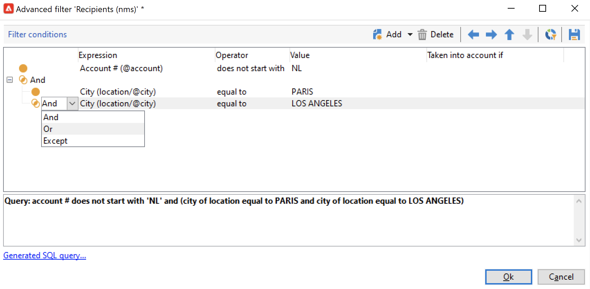
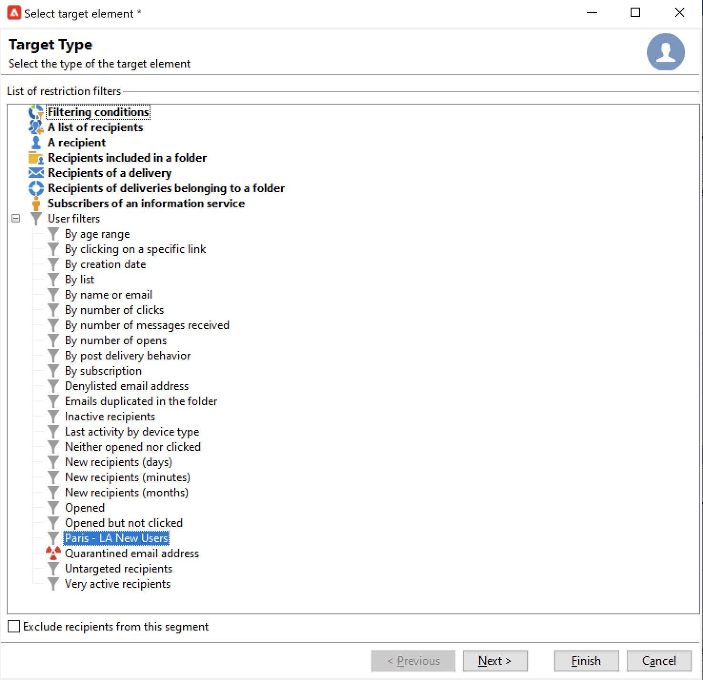

# 필터 만들기 및 관리{#create-filters}

데이터 필터링은 데이터 세트에서 작은 부분, 특정 기준과 일치하는 레코드만 선택하고 특정 작업(업데이트, 대상 만들기) 또는 분석에 해당 하위 집합을 사용하는 프로세스입니다.

**[!UICONTROL Explorer]**&#x200B;에서 Campaign을 검색할 때 데이터가 목록에 표시됩니다. 기존의 내장 필터를 사용하여 격리된 주소, 타겟팅되지 않은 수신자, 특정 연령 범위 또는 생성 날짜 등 이 데이터의 특정 하위 세트에 액세스할 수 있습니다.

나만의 필터를 만들거나, 나중에 사용하기 위해 저장하거나, 다른 Campaign 사용자와 공유할 수도 있습니다.

필터 구성을 통해 **[!UICONTROL dynamically]** 목록에서 데이터를 선택할 수 있습니다. 데이터가 수정되면 필터링된 데이터가 업데이트됩니다.

>[!NOTE]
>
>사용자 인터페이스 구성 설정은 장치 수준에서 로컬로 정의됩니다. 특히 데이터를 새로 고칠 때 문제가 발생하는 경우 이 데이터를 정리해야 하는 경우가 있습니다. 이렇게 하려면 **[!UICONTROL File > Clear the local cache]** 메뉴를 사용합니다.

Adobe Campaign에서는 다음 유형의 필터를 사용할 수 있습니다.

## 미리 정의된 필터{#predefined-filters}

미리 정의된 필터는 각 목록 위의 **필터** 단추에서 사용할 수 있습니다.

예를 들어 프로필의 경우 다음과 같은 내장 필터를 사용할 수 있습니다.

탐색기의 **[!UICONTROL Profiles and Targets > Pre-defined filters]** 노드에서 필터 세부 정보에 액세스할 수 있습니다.

>[!NOTE]
>
>다른 모든 데이터 목록의 경우 미리 정의된 필터가 **[!UICONTROL Administration > Configuration > Predefined filters]** 노드에 저장됩니다.

필터를 선택하여 해당 정의를 표시합니다.

마지막 탭을 사용하여 필터링된 데이터를 미리 봅니다.

+++  기본 제공 사전 정의된 필터

<table> 
 <tbody> 
  <tr> 
   <td> <strong>레이블</strong>  </td> 
   <td> <strong>쿼리</strong>  </td> 
  </tr> 
  <tr> 
   <td> 열림  </td> 
   <td> 게재를 연 수신자를 선택합니다.  </td> 
  </tr> 
  <tr> 
   <td> 열었지만 클릭하지 않았습니다.  </td> 
   <td> 게재를 열었지만 링크를 클릭하지 않은 수신자를 선택합니다.  </td> 
  </tr> 
  <tr> 
   <td> 비활성 수신자  </td> 
   <td> X개월 동안 게재를 열지 않은 수신자를 선택합니다.  </td> 
  </tr> 
  <tr> 
   <td> 장치 유형 별 마지막 활동 </td> 
   <td> 지난 Z일 동안 장치 X를 사용하여 배달 Y를 클릭하거나 연 수신자를 선택합니다.  </td> 
  </tr> 
  <tr> 
   <td> 장치 유형(추적)별 마지막 활동  </td> 
   <td> 지난 Z일 동안 장치 X를 사용하여 배달 Y를 클릭하거나 연 수신자를 선택합니다.  </td> 
  </tr> 
  <tr> 
   <td> 타겟팅되지 않은 받는 사람  </td> 
   <td> X개월 동안 채널 Y를 통해 타겟팅한 적이 없는 수신자를 선택합니다.  </td> 
  </tr> 
  <tr> 
   <td> 매우 활성 받는 사람  </td> 
   <td> 지난 Y개월 동안 게재를 X번 이상 클릭한 수신자를 선택합니다.  </td> 
  </tr> 
  <tr> 
 <td> 차단 목록에 추가된 전자 메일 주소  </td> 
    <td> 전자 메일 주소가 차단 목록에 있는 수신자를 선택합니다.  </td>
  </tr> 
  <tr> 
   <td> 격리된 전자 메일 주소  </td> 
   <td> 전자 메일 주소가 격리된 수신자를 선택합니다.  </td> 
  </tr> 
  <tr> 
   <td>   폴더에 중복된 전자 메일 주소 </td> 
   <td> 폴더에 전자 메일 주소가 중복되는 수신자를 선택합니다.  </td> 
  </tr> 
  <tr> 
   <td> 열지도 클릭하지도 않음  </td> 
   <td> 게재를 열지 않았거나 게재를 클릭한 수신자를 선택합니다.  </td> 
  </tr> 
  <tr> 
   <td> 새 수신자(일)  </td> 
   <td> 지난 X일 동안 만든 수신자를 선택합니다.  </td> 
  </tr> 
  <tr> 
   <td> 새 수신자(분)  </td> 
   <td> 지난 X분 동안 만든 수신자를 선택합니다.  </td> 
  </tr> 
  <tr> 
   <td> 새 수신자(개월)  </td> 
   <td> 지난 X개월 동안 만든 수신자를 선택합니다.  </td> 
  </tr> 
  <tr> 
   <td> 구독별  </td> 
   <td> 구독별로 수신자를 선택합니다.  </td> 
  </tr> 
  <tr> 
   <td> 특정 링크를 클릭하여  </td> 
   <td> 게재에서 특정 URL을 클릭한 수신자를 선택합니다.  </td> 
  </tr> 
  <tr> 
   <td> 게재 후 동작  </td> 
   <td> 게재를 받은 후 해당 동작에 따라 수신자를 선택합니다.  </td> 
  </tr> 
  <tr> 
   <td> 만든 날짜 까지 </td> 
   <td> X개월(현재 날짜에서 n개월을 뺀 숫자)에서 Y개월(현재 날짜에서 n개월을 뺀 숫자) 사이의 기간 동안 생성 날짜별로 수신자를 선택합니다.  </td> 
  </tr> 
  <tr> 
   <td>   목록별 </td> 
   <td> 목록을 기준으로 수신자를 선택합니다.  </td> 
  </tr> 
  <tr> 
   <td> 클릭 수  </td> 
   <td> 지난 X개월 동안 게재를 클릭한 수신자를 선택합니다.  </td> 
  </tr> 
  <tr> 
   <td> 받은 메시지 수 개 </td> 
   <td> 받은 메시지 수에 따라 수신자를 선택합니다.  </td> 
  </tr> 
  <tr> 
   <td> 열기 횟수별  </td> 
   <td> Z 시간 동안 X와 Y 게재 사이에 연 수신자를 선택합니다.  </td> 
  </tr> 
  <tr> 
   <td> 이름 또는 전자 메일로  </td> 
   <td> 이름 또는 전자 메일에 따라 수신자를 선택합니다.  </td> 
  </tr> 
  <tr> 
   <td> 연령 범위별  </td> 
   <td> 나이에 따라 수신자를 선택합니다.  </td> 
  </tr> 
 </tbody> 
</table>

+++

### 기본 필터{#default-filters}

각 목록 위의 필드를 사용하면 이 목록에 대해 **미리 정의된 기본 필터**&#x200B;를 사용할 수 있습니다. 수신자 목록의 경우 기본적으로 이름과 이메일 주소를 필터링할 수 있습니다.

>[!NOTE]
>
>**%** 문자는 문자열을 대체합니다. 예를 들어 이메일 필드에 `%@gmail.com`을(를) 입력하여 Gmail 주소가 있는 모든 프로필을 표시합니다. 성 필드에 `%@L`을(를) 입력하여 성에 L이 있는 모든 프로필을 표시합니다.

받는 사람 목록에 대한 기본 필터를 변경하려면 **[!UICONTROL Profiles and Targets > Predefined filters]** 노드로 이동하십시오.

다른 모든 데이터 형식의 경우 **[!UICONTROL Administration > Configuration > Predefined filters]** 노드를 통해 기본 필터를 구성하십시오.

다음 단계를 적용합니다.

1. 기본적으로 사용할 필터를 선택합니다.
1. **[!UICONTROL Parameters]** 탭을 클릭하고 **[!UICONTROL Default filter for the associated document type]**&#x200B;을(를) 선택합니다.

   

1. 현재 기본 사전 정의된 필터에 대해 동일한 옵션의 선택을 취소합니다.
1. 필터를 적용하려면 **[!UICONTROL Save]**&#x200B;을(를) 클릭하십시오.
1. 받는 사람 폴더로 이동하여 현재 필터의 오른쪽에 있는 **[!UICONTROL Remove this filter]** 아이콘을 클릭합니다. 새 기본 필터를 사용할 수 있습니다.
   

## 빠른 필터{#quick-filters}

**빠른 필터**&#x200B;를 사용 및 결합하여 특정 필드에 필터를 정의합니다.

추가되면 빠른 필터 필드가 데이터 목록 위에 차례로 표시됩니다. 이러한 파일은 서로 독립적으로 삭제할 수 있습니다.

빠른 필터는 각 연산자에 따라 다르며 연산자가 클라이언트 콘솔의 캐시를 지울 때마다 다시 초기화됩니다.

필터를 다시 사용해야 하는 경우 **고급 필터**&#x200B;를 만들어 저장합니다. [자세히 알아보기](#advanced-filters)

**빠른 필터**&#x200B;를 만들려면 다음 단계를 수행합니다.

1. 필터링할 필드를 마우스 오른쪽 단추로 클릭하고 **[!UICONTROL Filter on this field]**&#x200B;을(를) 선택합니다.

   

   기본 필터 필드가 목록 위에 표시됩니다.

   

1. 필터 옵션을 선택합니다.
1. 필요한 경우 필터 오른쪽에 있는 회색 아이콘을 사용하여 제거합니다.
1. 필터를 결합하여 필터를 구체화할 수 있습니다.

   

양식에서 사용할 수 없는 필드를 필터링해야 하는 경우 열에서 필터링하고 해당 열에서 필터링합니다. 이렇게 하려면,

1. **[!UICONTROL Configure list]** 아이콘을 클릭합니다.

   

1. 표시할 열(예: 받는 사람의 나이)을 선택하고 **확인**&#x200B;을 클릭합니다.

   

1. 받는 사람 목록에서 **나이** 열을 마우스 오른쪽 단추로 클릭하고 **[!UICONTROL Filter on this column]**&#x200B;을(를) 선택합니다.

   

   그런 다음 연령 필터링 옵션을 선택할 수 있습니다. 페이지에 다른 필터를 추가하여 범위를 정의합니다.

   

## 고급 필터{#advanced-filters}

**고급 필터**&#x200B;에서 복잡한 기준을 결합합니다. 이러한 필터를 사용하여 데이터에 대한 복잡한 쿼리 또는 쿼리 조합을 만들 수 있습니다. 이러한 필터는 저장하고 다른 Campaign 사용자와 공유할 수 있습니다.

### 고급 필터 만들기{#create-adv-filters}

**고급 필터**&#x200B;을(를) 만들려면 **[!UICONTROL Filters]** 단추를 클릭하고 **[!UICONTROL Advanced filter...]**&#x200B;을(를) 선택하십시오.

데이터 목록을 마우스 오른쪽 단추로 클릭하고 **[!UICONTROL Advanced filter...]**&#x200B;을(를) 선택할 수도 있습니다.

필터링 조건을 정의합니다. 아래 예에서는 계정 번호가 NL로 시작하지 않은 수신자 및 Paris 또는 Los Angeles에 사는 수신자를 필터링합니다.

1. **[!UICONTROL Edit expression]** 열의 **[!UICONTROL Expression]** 아이콘을 클릭합니다.

   

1. 필터링할 필드를 선택합니다.
1. 드롭다운 목록에서 적용할 연산자를 선택합니다.

   

1. **[!UICONTROL Value]** 열에서 예상 값을 선택하십시오. 여러 필터를 결합하여 쿼리를 구체화할 수 있습니다. 필터 조건을 추가하려면 **[!UICONTROL Add]**&#x200B;을(를) 클릭합니다.

   

   >[!NOTE]
   >
   >표현식에 계층을 지정하거나 도구 모음 화살표를 사용하여 쿼리 표현식의 순서를 변경할 수 있습니다.

1. 식을 결합하는 데 다음 세 가지 연산자를 사용할 수 있습니다. **And**, **Or**, **Except**. **Or**(으)로 전환하려면 화살표를 클릭하십시오.

   

1. **[!UICONTROL Ok]**&#x200B;을(를) 클릭하여 필터를 만들고 현재 목록에 적용합니다.

적용된 필터가 목록 위에 표시됩니다.

이 필터를 편집하거나 수정하려면 목록 위의 파란색으로 표시된 설명 링크를 클릭합니다.

### 고급 필터 저장{#save-adv-filters}

고급 필터를 [미리 정의된 필터](#predefined-filters)(으)로 저장하여 다시 사용하고 다른 Campaign 사용자와 공유할 수 있습니다.

고급 필터를 저장하려면 아래 단계를 수행합니다.

1. 편집하려면 필터 설명을 클릭합니다.
1. 창의 오른쪽 위에 있는 **[!UICONTROL Save as filter]** 아이콘을 클릭합니다.

   

1. 이 필터의 이름을 입력하고 저장합니다.

   

필터가 [미리 정의된 필터](#predefined-filters)에 추가됩니다. 이 노드에서 업데이트할 수 있습니다.

>[!NOTE]
>
>키보드에서 필터를 활성화하는 단축키를 추가할 수 있습니다.

이 필터는 수신자 목록의 사전 정의된 필터에서도 사용할 수 있습니다.

### 필터를 사용하여 세그먼트 정의 {#filter-as-segment}

필터를 사용하고 결합하여 대상 모집단 세그먼트를 만들 수 있습니다.

저장하면 **[!UICONTROL User filters]** 섹션에서 메시지의 대상 모집단을 선택할 때 고급 필터를 사용할 수 있습니다.

>[!NOTE]
>
>필터 조건과 일치하지 않는 연락처만 타깃팅하려면 **[!UICONTROL Exclude recipients from this segment]**&#x200B;을(를) 사용하십시오.

### 함수를 사용하여 고급 필터 빌드{#use-functions-adv-filters}

고급 필터링 기능을 수행하려면 함수를 사용하여 필터의 콘텐츠를 정의합니다. 고급 필터 편집기는 Campaign 쿼리 편집기의 모든 기능을 사용합니다.

이러한 통합 샘플에서 고급 쿼리를 작성하는 방법을 알아봅니다.

* [이 페이지](https://experienceleague.adobe.com/docs/campaign/automation/workflows/wf-activities/targeting-activities/query.html?lang=ko){target="_blank"}에서 간단한 받는 사람 특성을 타깃팅하는 방법에 대해 알아봅니다.
* [이 페이지](https://experienceleague.adobe.com/docs/campaign/automation/workflows/use-cases/designing-queries/query-many-to-many-relationship.html?lang=ko){target="_blank"}에서 지난 7일 동안 연락하지 않은 받는 사람을 필터링하는 방법을 알아보세요.
* [이 페이지](https://experienceleague.adobe.com/docs/campaign/automation/workflows/use-cases/designing-queries/create-a-filter.html?lang=ko){target="_blank"}에서 활성 계정으로 필터링할 수 있는 연산자 목록을 복구하는 방법을 알아봅니다.
* [이 페이지](https://experienceleague.adobe.com/docs/campaign/automation/workflows/use-cases/deliveries/send-a-birthday-email.html?lang=ko){target="_blank"}에서 생일 전자 메일 대상자를 만드는 방법을 알아보세요.

### 사전 정의된 필터의 고급 매개 변수 {#param-for-data-filters}

고급 매개 변수는 사전 정의된 필터에 사용할 수 있습니다. 액세스하려면 필터의 **[!UICONTROL Parameters]** 탭으로 이동하십시오.

* 이 문서 유형에 따라 모든 목록에 대한 필터를 기본적으로 표시하려면 **[!UICONTROL Default filter for the associated document type]** 옵션을 선택하십시오.

  예를 들어 **[!UICONTROL By name or login]** 필터가 연산자에 적용됩니다. 이 옵션이 선택되어 있으므로 필터는 항상 모든 연산자 목록에 표시됩니다.

* 모든 Campaign 연산자가 필터를 사용할 수 있도록 하려면 **[!UICONTROL Filter shared with other operators]** 옵션을 선택하십시오.

* 필터링 기준을 선택할 양식을 정의하려면 **[!UICONTROL Use parameter entry form]** 옵션을 선택합니다. **[!UICONTROL Form]** 탭에서 이 양식을 XML 형식으로 입력해야 합니다. 예를 들어 받는 사람 목록에서 사용할 수 있는 기본 제공 미리 정의된 필터 **[!UICONTROL Recipients who have opened]**&#x200B;에는 필터를 적용할 게재를 선택할 수 있는 필터 필드가 표시됩니다.

* **[!UICONTROL Advanced parameters]** 링크를 사용하여 추가 설정을 정의할 수 있습니다.

   * SQL 테이블을 필터와 연결하여 테이블을 공유하는 모든 편집자에게 공통되도록 할 수 있습니다.
   * 사용자가 필터를 오버라이드하지 못하도록 하려면 **[!UICONTROL Do not restrict the filter]** 옵션을 선택하십시오. 예를 들어 이 옵션은 게재 마법사에서 사용할 수 있는 &quot;게재 수신자&quot; 및 &quot;폴더에 속한 게재 수신자&quot; 필터에 대해 활성화됩니다. 이러한 필터는 오버로드할 수 없습니다.

### 연산자
