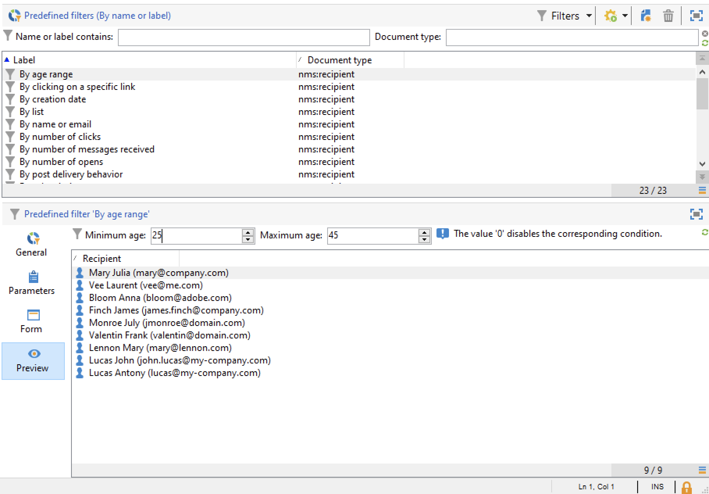
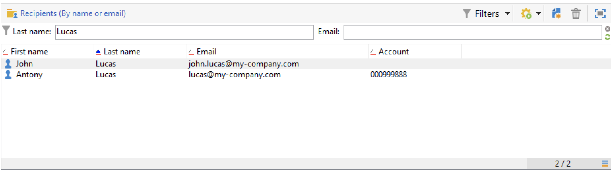
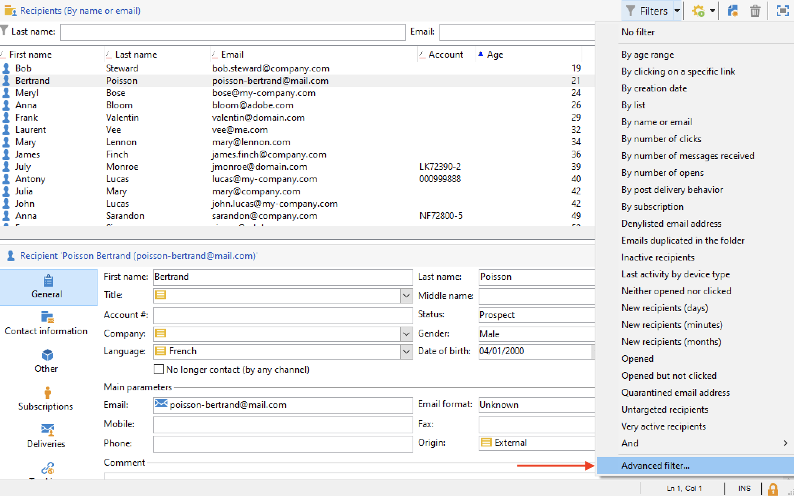

# 필터 만들기 및 관리{#create-filters}

데이터 필터링은 데이터 세트의 작은 부분을 선택하고 특정 기준과 일치하는 레코드만 선택하고 특정 작업(업데이트, 대상 만들기) 또는 분석에 해당 하위 집합을 사용하는 프로세스입니다.

에서 Campaign을 검색할 때 **[!UICONTROL Explorer]**&#x200B;로 설정되면 데이터가 목록에 표시됩니다. 기존 내장된 필터를 사용하여 이 데이터의 특정 하위 세트에 액세스할 수 있습니다. 격리된 주소, 타겟팅되지 않은 수신자, 특정 연령 범위 또는 생성 날짜 등을 예로 들 수 있습니다.

자신만의 필터를 만들거나, 나중에 사용할 수 있도록 저장하거나, 다른 Campaign 사용자와 공유할 수도 있습니다.

필터 구성을 사용하면 목록에서 데이터를 선택할 수 있습니다 **[!UICONTROL dynamically]**: 데이터가 수정되면 필터링된 데이터가 업데이트됩니다.

>[!NOTE]
>
>사용자 인터페이스 구성 설정은 장치 수준에서 로컬로 정의됩니다. 특히 데이터를 새로 고칠 때 문제가 발생하는 경우 이 데이터를 정리할 필요가 있는 경우가 있을 수 있습니다. 이렇게 하려면 **[!UICONTROL File > Clear the local cache]** 메뉴 아래의 제품에서 사용할 수 있습니다.

Adobe Campaign에서는 다음 유형의 필터를 사용할 수 있습니다.

## 사전 정의된 필터{#predefined-filters}

사전 정의된 필터는 **필터** 각 목록 위에 단추를 누릅니다.

예를 들어 프로필의 경우 다음과 같은 내장 필터를 사용할 수 있습니다.

에서 필터 세부 사항에 액세스할 수 있습니다 **[!UICONTROL Profiles and Targets > Pre-defined filters]** 노드 아래에 있는 노드 아래에 나열된 상태로 남아 있습니다.

>[!NOTE]
>
>기타 모든 데이터 목록의 경우, 사전 정의된 필터가  **[!UICONTROL Administration > Configuration > Predefined filters]** 노드 아래에 있어야 합니다.

정의를 표시할 필터를 선택합니다.

마지막 탭을 사용하여 필터링된 데이터를 미리 봅니다.

사전 정의된 필터:

<table> 
 <tbody> 
  <tr> 
   <td> <strong>레이블</strong>  </td> 
   <td> <strong>쿼리</strong>  </td> 
  </tr> 
  <tr> 
   <td> 열림  </td> 
   <td> 게재를 연 수신자를 선택합니다.  </td> 
  </tr> 
  <tr> 
   <td> 열었지만 클릭하지 않음  </td> 
   <td> 게재를 열었지만 링크를 클릭하지 않은 수신자를 선택합니다.  </td> 
  </tr> 
  <tr> 
   <td> 비활성 수신자  </td> 
   <td> X개월 내에 게재를 열지 않은 수신자를 선택합니다.  </td> 
  </tr> 
  <tr> 
   <td> 장치 유형별 마지막 활동  </td> 
   <td> 최근 Z일 동안 장치 X를 사용하여 게재를 클릭하거나 연 수신자를 선택합니다.  </td> 
  </tr> 
  <tr> 
   <td> 장치 유형별 마지막 활동(추적)  </td> 
   <td> 최근 Z일 동안 장치 X를 사용하여 게재를 클릭하거나 연 수신자를 선택합니다.  </td> 
  </tr> 
  <tr> 
   <td> 타겟팅되지 않은 수신자  </td> 
   <td> X개월 동안 채널 Y를 통해 타겟팅되지 않은 수신자를 선택합니다.  </td> 
  </tr> 
  <tr> 
   <td> 매우 활성 수신자  </td> 
   <td> 최근 Y개월 동안 게재를 최소 X 번 클릭한 수신자를 선택합니다.  </td> 
  </tr> 
  <tr> 
 <td> 차단 목록에 추가된 이메일 주소  </td> 
    <td> 전자 메일 주소가에 있는 수신자를 차단 목록 선택합니다.  </td>
  </tr> 
  <tr> 
   <td> 격리된 전자 메일 주소  </td> 
   <td> 전자 메일 주소가 격리된 수신자를 선택합니다.  </td> 
  </tr> 
  <tr> 
   <td> 폴더에 중복되는 이메일 주소  </td> 
   <td> 폴더에 이메일 주소가 중복되는 수신자를 선택합니다.  </td> 
  </tr> 
  <tr> 
   <td> 열지 또는 클릭하지 않음  </td> 
   <td> 게재를 열지 또는 게재를 클릭하지 않은 수신자를 선택합니다.  </td> 
  </tr> 
  <tr> 
   <td> 새 수신자(일)  </td> 
   <td> 최근 X일 동안 만든 수신자를 선택합니다.  </td> 
  </tr> 
  <tr> 
   <td> 새 수신자(분)  </td> 
   <td> 마지막 X 분 동안 만든 수신자를 선택합니다.  </td> 
  </tr> 
  <tr> 
   <td> 새 수신자(개월)  </td> 
   <td> 최근 X 월에 생성된 수신자를 선택합니다.  </td> 
  </tr> 
  <tr> 
   <td> 구독 기준  </td> 
   <td> 구독별로 수신자를 선택합니다.  </td> 
  </tr> 
  <tr> 
   <td> 특정 링크를 클릭하여  </td> 
   <td> 게재에서 특정 URL을 클릭한 수신자를 선택합니다.  </td> 
  </tr> 
  <tr> 
   <td> 게시 게재 동작별  </td> 
   <td> 게재를 받은 후 자신의 동작에 따라 수신자를 선택합니다.  </td> 
  </tr> 
  <tr> 
   <td> 생성 날짜별  </td> 
   <td> X개월(현재 날짜에서 n개월을 뺀 숫자)부터 Y개월(현재 날짜에서 n개월을 뺀 숫자)까지의 기간 동안 생성 날짜별로 수신자를 선택합니다.  </td> 
  </tr> 
  <tr> 
   <td> 목록별  </td> 
   <td> 목록을 기준으로 수신자를 선택합니다.  </td> 
  </tr> 
  <tr> 
   <td> 클릭 횟수별  </td> 
   <td> 최근 X 개월 동안 게재를 클릭한 수신자를 선택합니다.  </td> 
  </tr> 
  <tr> 
   <td> 받은 메시지 수 기준  </td> 
   <td> 수신한 메시지 수에 따라 수신자를 선택합니다.  </td> 
  </tr> 
  <tr> 
   <td> 열기 횟수 기준  </td> 
   <td> Z 시간 동안 X와 Y 게재 간에 연 수신자를 선택합니다.  </td> 
  </tr> 
  <tr> 
   <td> 이름 또는 이메일 기준  </td> 
   <td> 이름이나 전자 메일에 따라 수신자를 선택합니다.  </td> 
  </tr> 
  <tr> 
   <td> 연령 범위별  </td> 
   <td> 나이에 따라 수신자를 선택합니다.  </td> 
  </tr> 
 </tbody> 
</table>

### 기본 필터{#default-filters}

각 목록 위의 필드에서는 **사전 정의된 기본 필터** 참조하십시오. 수신자 목록의 경우 기본적으로 이름과 이메일 주소를 필터링할 수 있습니다.

>[!NOTE]
>
>다음 **%** 문자는 문자열을 대체합니다. 예를 들어, 을 입력합니다. `%@gmail.com` 전자 메일 필드에 Gmail 주소가 있는 모든 프로필을 표시합니다. Enter 키 `%@L` 성 필드에서 성을 사용하여 L을 사용하는 모든 프로필을 표시할 수 있습니다.

수신자 목록에 대한 기본 필터를 변경하려면 **[!UICONTROL Profiles and Targets > Predefined filters]** 노드 아래에 있어야 합니다.

다른 모든 유형의 데이터에 대해 **[!UICONTROL Administration > Configuration > Predefined filters]** 노드 아래에 있어야 합니다.

다음 단계를 적용합니다.

1. 기본적으로 사용할 필터를 선택합니다.
1. 을(를) 클릭합니다. **[!UICONTROL Parameters]** 탭을 선택하고 **[!UICONTROL Default filter for the associated document type]**.

   

1. 현재 사전 정의된 기본 필터에 대해 동일한 옵션을 선택 취소합니다.
1. 클릭 **[!UICONTROL Save]** 필터를 적용하려면
1. 수신자 폴더로 이동하여 **[!UICONTROL Remove this filter]** 현재 필터 오른쪽의 아이콘: 새 기본 필터를 사용할 수 있습니다.
   

## 빠른 필터{#quick-filters}

사용 및 결합 **빠른 필터** 을 눌러 특정 필드에 필터를 정의합니다.

추가한 후에는 빠른 필터 필드가 데이터 목록 위에 하나씩 표시됩니다. 서로 독립적으로 삭제할 수 있습니다.

빠른 필터는 각 연산자에 따라 다르며 연산자가 클라이언트 콘솔의 캐시를 지울 때마다 다시 초기화됩니다.

필터를 다시 사용해야 하는 경우 **고급 필터** 그리고 저장합니다. [자세히 알아보기](#advanced-filters)

을(를) 만들려면 **빠른 필터**, 다음 단계를 수행합니다.

1. 필터링할 필드를 마우스 오른쪽 단추로 클릭하고 을 선택합니다 **[!UICONTROL Filter on this field]**.

   

   기본 필터 필드가 목록 위에 표시됩니다.

   

1. 필터 옵션을 선택합니다.
1. 필요한 경우 필터 오른쪽의 회색 아이콘을 사용하여 제거합니다.
1. 필터를 결합하여 필터를 세분화할 수 있습니다.

   

양식에서 사용할 수 없는 필드를 필터링해야 하는 경우에는 열에서 필터링하고 해당 열에서 필터링합니다. 삭제 방법,

1. 을(를) 클릭합니다. **[!UICONTROL Configure list]** 아이콘.

   

1. 표시할 열(예: 수신자의 연령)을 선택하고 을 클릭합니다 **확인**.

   

1. 마우스 오른쪽 단추를 클릭합니다. **연령** 받는 사람 목록에서 열을 선택하고 **[!UICONTROL Filter on this column]**.

   

   그런 다음 나이 필터링 옵션을 선택할 수 있습니다. 페이지에 다른 필터를 추가하여 범위를 정의합니다.

   

## 고급 필터{#advanced-filters}

복잡한 기준 결합 **고급 필터**. 이 필터를 사용하여 데이터에 대한 복잡한 쿼리 또는 쿼리 조합을 만듭니다. 이러한 필터를 저장하고 다른 Campaign 사용자와 공유할 수 있습니다.

### 고급 필터 만들기{#create-adv-filters}

을(를) 만들려면 **고급 필터**&#x200B;를 클릭하고 **[!UICONTROL Filters]** 단추를 누르고 선택합니다. **[!UICONTROL Advanced filter...]**.

데이터 목록을 마우스 오른쪽 단추로 클릭하고 를 선택할 수도 있습니다 **[!UICONTROL Advanced filter...]**.

필터링 조건을 정의합니다. 아래 예에서는 계정 번호가 NL로 시작되지 않는 수신자 및 파리 또는 로스앤젤레스에 거주하는 수신자를 필터링합니다.

1. 을(를) 클릭합니다. **[!UICONTROL Edit expression]** 아이콘 **[!UICONTROL Expression]** 열.

   

1. 필터링할 필드를 선택합니다.
1. 드롭다운 목록에서 적용할 연산자를 선택합니다.

   

1. 에서 예상 값을 선택합니다 **[!UICONTROL Value]** 열. 여러 필터를 결합하여 쿼리를 세분화할 수 있습니다. 필터 조건을 추가하려면 **[!UICONTROL Add]**.

   

   >[!NOTE]
   >
   >도구 모음 화살표를 사용하여 표현식에 계층을 할당하거나 쿼리 표현식의 순서를 변경할 수 있습니다.

1. 다음 세 연산자를 사용하여 표현식을 결합할 수 있습니다.  **및**, **또는**, **제외**. 화살표를 클릭하여 **또는**.

   

1. 클릭 **[!UICONTROL Ok]** 필터를 만들어 현재 목록에 적용합니다.

적용된 필터가 목록 위에 표시됩니다.

이 필터를 편집하거나 수정하려면 목록 위의 파란색 설명 링크를 클릭합니다.

### 고급 필터 저장{#save-adv-filters}

고급 필터를  [사전 정의된 필터](#predefined-filters)다시 사용하고 다른 Campaign 사용자와 공유할 수 있습니다.

고급 필터를 저장하려면 아래 단계를 따르십시오.

1. 필터를 편집하려면 필터의 설명을 클릭합니다.
1. 을(를) 클릭합니다. **[!UICONTROL Save as filter]** 창의 오른쪽 위 섹션에 있는 아이콘입니다.

   

1. 이 필터의 이름을 입력하고 저장합니다.

   

필터가 [사전 정의된 필터](#predefined-filters). 이 노드에서 업데이트할 수 있습니다.

>[!NOTE]
>
>필터에 대한 바로 가기를 추가하여 키보드에서 활성화할 수 있습니다.

이 필터는 수신자 목록의 사전 정의된 필터에서도 사용할 수 있습니다.

### 필터를 사용하여 세그먼트 정의 {#filter-as-segment}

필터를 사용하고 결합하여 대상 모집단 세그먼트를 만들 수 있습니다.

저장한 후에는 메시지의 대상 모집단을 선택할 때 **[!UICONTROL User filters]** 섹션을 참조하십시오.

>[!NOTE]
>
>를 사용하십시오 **[!UICONTROL Exclude recipients from this segment]** 필터 기준과 일치하지 않는 연락처만 타깃팅하려면

### 함수를 사용하여 고급 필터 작성{#use-functions-adv-filters}

고급 필터링 기능을 수행하려면 함수를 사용하여 필터의 콘텐츠를 정의합니다. 고급 필터 편집기는 Campaign 쿼리 편집기의 모든 기능을 활용합니다.

Adobe Campaign Classic v7 설명서에서 고급 쿼리를 작성하는 방법을 알아봅니다. 예제:

* 에서 간단한 수신자 특성을 타깃팅하는 방법을 알아봅니다 [Adobe Campaign Classic v7 설명서](https://experienceleague.adobe.com/docs/campaign-classic/using/automating-with-workflows/targeting-activities/query.html?lang=en#example--targeting-on-simple-recipient-attributes){target=&quot;_blank&quot;}.
* 지난 7일 동안 연락하지 않은 수신자를 필터링하는 방법을 알아봅니다. [Adobe Campaign Classic v7 설명서](https://experienceleague.adobe.com/docs/campaign-classic/using/automating-with-workflows/use-cases/designing-queries/querying-using-many-to-many-relationship.html){target=&quot;_blank&quot;}.
* 운영자 목록을 복구하는 방법은 의 활성 계정으로 필터링합니다. [Adobe Campaign Classic v7 설명서](https://experienceleague.adobe.com/docs/campaign-classic/using/automating-with-workflows/use-cases/designing-queries/creating-a-filter.html){target=&quot;_blank&quot;}.
* 에서 생일 이메일 대상자를 만드는 방법을 알아봅니다  [Adobe Campaign Classic v7 설명서](https://experienceleague.adobe.com/docs/campaign-classic/using/automating-with-workflows/use-cases/deliveries/sending-a-birthday-email.html?lang=en#identifying-recipients-whose-birthday-it-is){target=&quot;_blank&quot;}.

### 사전 정의된 필터에 대한 고급 매개 변수 {#param-for-data-filters}

고급 매개 변수는 사전 정의된 필터에 사용할 수 있습니다. 액세스하려면 다음 위치로 이동하십시오. **[!UICONTROL Parameters]** 탭의 세그먼트를 표시합니다.

* 이 문서 유형을 기준으로 모든 목록에 대해 기본적으로 필터를 표시하려면 **[!UICONTROL Default filter for the associated document type]** 선택 사항입니다.

   예: **[!UICONTROL By name or login]** 필터가 연산자에 적용됨 이 옵션이 선택되어 있으므로 필터가 항상 모든 연산자 목록에 표시됩니다.

* 모든 Campaign 운영자가 필터를 사용할 수 있도록 하려면  **[!UICONTROL Filter shared with other operators]** 선택 사항입니다.

* 필터링 기준을 선택할 양식을 정의하려면  **[!UICONTROL Use parameter entry form]** 선택 사항입니다. 이 양식은 XML 형식으로 입력해야 합니다. **[!UICONTROL Form]** 탭. 예를 들어, 사전 정의된 필터 내장 **[!UICONTROL Recipients who have opened]**&#x200B;수신자 목록에서 사용할 수 있는 에는 필터가 적용되는 게재를 선택할 수 있는 필터 필드가 표시됩니다.

* 다음 **[!UICONTROL Advanced parameters]** 링크를 통해 추가 설정을 정의할 수 있습니다.

   * SQL 테이블을 필터와 연결하여 테이블을 공유하는 모든 편집자에게 일반화할 수 있습니다.
   * 사용자가 필터를 재정의하지 못하도록 하려면 **[!UICONTROL Do not restrict the filter]** 선택 사항입니다. 예를 들어 이 옵션은 게재 마법사에서 사용할 수 있는 &quot;게재 수신자&quot; 및 &quot;폴더에 속하는 게재 수신자&quot; 필터에 대해 활성화됩니다. 이러한 필터는 오버로드될 수 없습니다.
