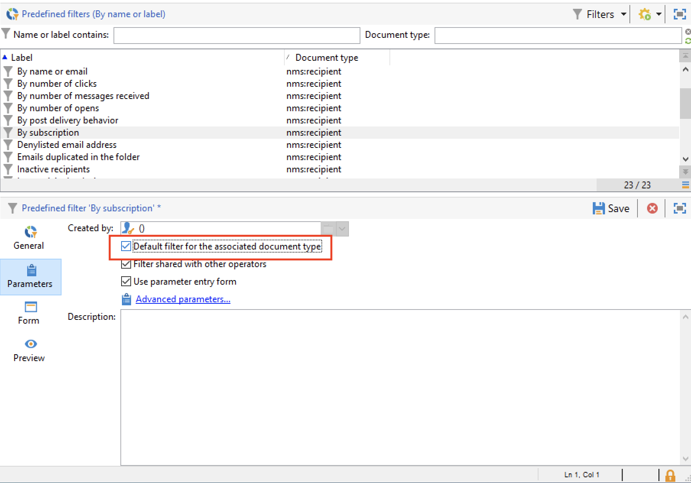
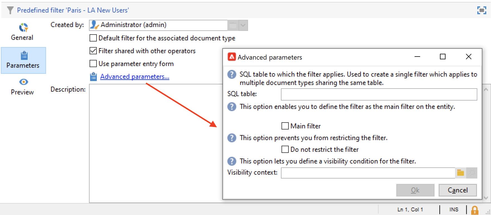

# 필터 만들기 및 관리{#create-filters}

데이터 필터링은 데이터 세트에서 작은 부분, 특정 기준과 일치하는 레코드만 선택하고 특정 작업(업데이트, 대상 만들기) 또는 분석에 해당 하위 집합을 사용하는 프로세스입니다.

에서 Campaign을 검색할 때 **[!UICONTROL Explorer]**: 데이터가 목록에 표시됩니다. 기존의 내장 필터를 사용하여 격리된 주소, 타겟팅되지 않은 수신자, 특정 연령 범위 또는 생성 날짜 등 이 데이터의 특정 하위 세트에 액세스할 수 있습니다.

나만의 필터를 만들거나, 나중에 사용하기 위해 저장하거나, 다른 Campaign 사용자와 공유할 수도 있습니다.

필터 구성을 통해 목록에서 데이터를 선택할 수 있습니다. **[!UICONTROL dynamically]**: 데이터가 수정되면 필터링된 데이터가 업데이트됩니다.

>[!NOTE]
>
>사용자 인터페이스 구성 설정은 장치 수준에서 로컬로 정의됩니다. 특히 데이터를 새로 고칠 때 문제가 발생하는 경우 이 데이터를 정리해야 하는 경우가 있습니다. 이렇게 하려면 다음을 사용합니다. **[!UICONTROL File > Clear the local cache]** 메뉴 아래의 제품에서 사용할 수 있습니다.

Adobe Campaign에서는 다음 유형의 필터를 사용할 수 있습니다.

## 사전 정의된 필터{#predefined-filters}

사전 정의된 필터는 다음 위치에서 사용할 수 있습니다. **필터** 각 목록 위에 있는 단추입니다.

예를 들어 프로필의 경우 다음과 같은 내장 필터를 사용할 수 있습니다.

에서 필터 세부 정보에 액세스할 수 있습니다. **[!UICONTROL Profiles and Targets > Pre-defined filters]** 탐색기의 노드입니다.

>[!NOTE]
>
>기타 모든 데이터 목록의 경우 사전 정의된 필터가  **[!UICONTROL Administration > Configuration > Predefined filters]** 노드.

필터를 선택하여 해당 정의를 표시합니다.

마지막 탭을 사용하여 필터링된 데이터를 미리 봅니다.

기본 제공 사전 정의된 필터는 다음과 같습니다.

<table> 
 <tbody> 
  <tr> 
   <td> <strong>레이블</strong>  </td> 
   <td> <strong>쿼리</strong>  </td> 
  </tr> 
  <tr> 
   <td> 열림  </td> 
   <td> 게재를 연 수신자를 선택합니다.  </td> 
  </tr> 
  <tr> 
   <td> 열었지만 클릭되지 않음  </td> 
   <td> 게재를 열었지만 링크를 클릭하지 않은 수신자를 선택합니다.  </td> 
  </tr> 
  <tr> 
   <td> 비활성 수신자  </td> 
   <td> X개월 동안 게재를 열지 않은 수신자를 선택합니다.  </td> 
  </tr> 
  <tr> 
   <td> 장치 유형별 마지막 활동  </td> 
   <td> 지난 Z일 동안 장치 X를 사용하여 게재를 클릭하거나 연 수신자를 선택합니다.  </td> 
  </tr> 
  <tr> 
   <td> 장치 유형별 마지막 활동(추적)  </td> 
   <td> 지난 Z일 동안 장치 X를 사용하여 게재를 클릭하거나 연 수신자를 선택합니다.  </td> 
  </tr> 
  <tr> 
   <td> 타겟팅되지 않은 수신자  </td> 
   <td> X개월 동안 채널 Y를 통해 타겟팅한 적이 없는 수신자를 선택합니다.  </td> 
  </tr> 
  <tr> 
   <td> 매우 활성화된 수신자  </td> 
   <td> 지난 Y개월 동안 게재를 X회 이상 클릭한 수신자를 선택합니다.  </td> 
  </tr> 
  <tr> 
 <td> 차단 목록에 추가된 이메일 주소  </td> 
    <td> 전자 메일 주소가 차단 목록에 있는 수신자를 선택합니다.  </td>
  </tr> 
  <tr> 
   <td> 격리된 이메일 주소  </td> 
   <td> 전자 메일 주소가 격리된 수신자를 선택합니다.  </td> 
  </tr> 
  <tr> 
   <td> 폴더에 중복된 이메일 주소  </td> 
   <td> 폴더에서 이메일 주소가 중복되는 수신자를 선택합니다.  </td> 
  </tr> 
  <tr> 
   <td> 열지도 클릭하지도 않음  </td> 
   <td> 게재를 열지 않았거나 게재를 클릭한 수신자를 선택합니다.  </td> 
  </tr> 
  <tr> 
   <td> 새 수신자(일)  </td> 
   <td> 지난 X일 동안 만든 수신자를 선택합니다.  </td> 
  </tr> 
  <tr> 
   <td> 새 수신자(분)  </td> 
   <td> 지난 X분 동안 만든 수신자를 선택합니다.  </td> 
  </tr> 
  <tr> 
   <td> 새 수신자(개월)  </td> 
   <td> 지난 X개월 동안 만든 수신자를 선택합니다.  </td> 
  </tr> 
  <tr> 
   <td> 구독별  </td> 
   <td> 가입별로 수신자를 선택합니다.  </td> 
  </tr> 
  <tr> 
   <td> 특정 링크를 클릭하여  </td> 
   <td> 게재에서 특정 URL을 클릭한 수신자를 선택합니다.  </td> 
  </tr> 
  <tr> 
   <td> 게재 후 행동별  </td> 
   <td> 게재를 받은 후 해당 비헤이비어에 따라 수신자를 선택합니다.  </td> 
  </tr> 
  <tr> 
   <td> 만든 날짜별  </td> 
   <td> X개월(현재 날짜에서 n개월을 뺀 숫자)에서 Y개월(현재 날짜에서 n개월을 뺀 숫자) 사이의 기간 동안 생성 날짜별로 수신자를 선택합니다.  </td> 
  </tr> 
  <tr> 
   <td> 목록별  </td> 
   <td> 목록으로 수신자를 선택합니다.  </td> 
  </tr> 
  <tr> 
   <td> 클릭 횟수별  </td> 
   <td> 지난 X개월 동안 게재를 클릭한 수신자를 선택합니다.  </td> 
  </tr> 
  <tr> 
   <td> 받은 메시지 수별  </td> 
   <td> 받은 메시지 수에 따라 수신자를 선택합니다.  </td> 
  </tr> 
  <tr> 
   <td> 열기 횟수별  </td> 
   <td> Z 시간 동안 X와 Y 게재 사이에 연 수신자를 선택합니다.  </td> 
  </tr> 
  <tr> 
   <td> 이름 또는 이메일별  </td> 
   <td> 이름 또는 이메일에 따라 수신자를 선택합니다.  </td> 
  </tr> 
  <tr> 
   <td> 연령 범위별  </td> 
   <td> 나이에 따라 수신자를 선택합니다.  </td> 
  </tr> 
 </tbody> 
</table>

### 기본 필터{#default-filters}

각 목록 위의 필드에서는 **사전 정의된 기본 필터** 이 목록에 대해 설명합니다. 수신자 목록의 경우 기본적으로 이름과 이메일 주소를 필터링할 수 있습니다.

>[!NOTE]
>
>다음 **%** 모든 문자열은 문자로 바뀝니다. 예를 들어 다음을 입력합니다. `%@gmail.com` 이메일 필드에 Gmail 주소가 있는 모든 프로필을 표시합니다. 입력 `%@L` 을 눌러 성에 L이 있는 모든 프로필을 표시합니다.

수신자 목록에 대한 기본 필터를 변경하려면 **[!UICONTROL Profiles and Targets > Predefined filters]** 노드.

다른 모든 데이터 유형의 경우 **[!UICONTROL Administration > Configuration > Predefined filters]** 노드.

다음 단계를 적용합니다.

1. 기본적으로 사용할 필터를 선택합니다.
1. 다음을 클릭합니다. **[!UICONTROL Parameters]** 탭하고 선택 **[!UICONTROL Default filter for the associated document type]**.

   

1. 현재 기본 사전 정의된 필터에 대해 동일한 옵션의 선택을 취소합니다.
1. 클릭 **[!UICONTROL Save]** 필터를 적용합니다.
1. 수신자 폴더로 이동하고 **[!UICONTROL Remove this filter]** 아이콘 현재 필터 오른쪽: 새 기본 필터를 사용할 수 있습니다.
   

## 빠른 필터{#quick-filters}

사용 및 결합 **빠른 필터** 특정 필드에 필터를 정의합니다.

추가되면 빠른 필터 필드가 데이터 목록 위에 차례로 표시됩니다. 이러한 파일은 서로 독립적으로 삭제할 수 있습니다.

빠른 필터는 각 연산자에 따라 다르며 연산자가 클라이언트 콘솔의 캐시를 지울 때마다 다시 초기화됩니다.

필터를 다시 사용해야 하는 경우 **고급 필터** 구해 [자세히 알아보기](#advanced-filters)

을(를) 만들려면 **빠른 필터**&#x200B;를 클릭하고 다음 단계를 수행합니다.

1. 필터링할 필드를 마우스 오른쪽 단추로 클릭하고 다음을 선택합니다 **[!UICONTROL Filter on this field]**.

   

   기본 필터 필드가 목록 위에 표시됩니다.

   

1. 필터 옵션을 선택합니다.
1. 필요한 경우 필터 오른쪽에 있는 회색 아이콘을 사용하여 제거합니다.
1. 필터를 결합하여 필터를 구체화할 수 있습니다.

   

양식에서 사용할 수 없는 필드를 필터링해야 하는 경우 열에서 필터링하고 해당 열에서 필터링합니다. 삭제 방법,

1. 다음을 클릭합니다. **[!UICONTROL Configure list]** 아이콘.

   

1. 표시할 열(예: 수신자 연령)을 선택하고 **확인**.

   

1. 마우스 오른쪽 단추 클릭 **나이** 받는 사람 목록의 열에서 **[!UICONTROL Filter on this column]**.

   

   그런 다음 연령 필터링 옵션을 선택할 수 있습니다. 페이지에 다른 필터를 추가하여 범위를 정의합니다.

   

## 고급 필터{#advanced-filters}

에서 복잡한 기준 결합 **고급 필터**. 이러한 필터를 사용하여 데이터에 대한 복잡한 쿼리 또는 쿼리 조합을 만들 수 있습니다. 이러한 필터는 저장하고 다른 Campaign 사용자와 공유할 수 있습니다.

### 고급 필터 만들기{#create-adv-filters}

을(를) 만들려면 **고급 필터**&#x200B;를 클릭하고 **[!UICONTROL Filters]** 단추 및 선택 **[!UICONTROL Advanced filter...]**.

데이터 목록을 마우스 오른쪽 단추로 클릭하고 를 선택할 수도 있습니다 **[!UICONTROL Advanced filter...]**.

필터링 조건을 정의합니다. 아래 예에서는 계정 번호가 NL로 시작하지 않은 수신자 및 Paris 또는 Los Angeles에 사는 수신자를 필터링합니다.

1. 다음을 클릭합니다. **[!UICONTROL Edit expression]** 아이콘 **[!UICONTROL Expression]** 열.

   

1. 필터링할 필드를 선택합니다.
1. 드롭다운 목록에서 적용할 연산자를 선택합니다.

   

1. 다음에서 예상 값 선택: **[!UICONTROL Value]** 열. 여러 필터를 결합하여 쿼리를 구체화할 수 있습니다. 필터 조건을 추가하려면 다음을 클릭하십시오. **[!UICONTROL Add]**.

   

   >[!NOTE]
   >
   >표현식에 계층을 지정하거나 도구 모음 화살표를 사용하여 쿼리 표현식의 순서를 변경할 수 있습니다.

1. 표현식을 결합하는 데에는 세 가지 연산자를 사용할 수 있습니다.  **및**, **또는**, **제외**. 전환하려면 화살표를 클릭하십시오. **또는**.

   

1. 클릭 **[!UICONTROL Ok]** 을 클릭하여 필터를 만들고 현재 목록에 적용합니다.

적용된 필터가 목록 위에 표시됩니다.

이 필터를 편집하거나 수정하려면 목록 위의 파란색으로 표시된 설명 링크를 클릭합니다.

### 고급 필터 저장{#save-adv-filters}

고급 필터를 다음으로 저장할 수 있습니다.  [미리 정의된 필터](#predefined-filters)을 클릭하여 재사용하고 다른 Campaign 사용자와 공유할 수 있습니다.

고급 필터를 저장하려면 아래 단계를 수행합니다.

1. 편집하려면 필터 설명을 클릭합니다.
1. 다음을 클릭합니다. **[!UICONTROL Save as filter]** 창의 오른쪽 위 섹션에 있는 아이콘.

   

1. 이 필터의 이름을 입력하고 저장합니다.

   

필터가 [사전 정의된 필터](#predefined-filters). 이 노드에서 업데이트할 수 있습니다.

>[!NOTE]
>
>키보드에서 필터를 활성화하는 단축키를 추가할 수 있습니다.

이 필터는 수신자 목록의 사전 정의된 필터에서도 사용할 수 있습니다.

### 필터를 사용하여 세그먼트 정의 {#filter-as-segment}

필터를 사용하고 결합하여 대상 모집단 세그먼트를 만들 수 있습니다.

저장하면 고급 필터가에서 메시지의 대상 모집단을 선택할 때 사용할 수 있습니다. **[!UICONTROL User filters]** 섹션.

>[!NOTE]
>
>사용 **[!UICONTROL Exclude recipients from this segment]** 필터 조건과 일치하지 않는 연락처만 타겟팅하려면 다음 작업을 수행하십시오.

### 함수를 사용하여 고급 필터 빌드{#use-functions-adv-filters}

고급 필터링 기능을 수행하려면 함수를 사용하여 필터의 콘텐츠를 정의합니다. 고급 필터 편집기는 Campaign 쿼리 편집기의 모든 기능을 사용합니다.

이러한 통합 샘플에서 고급 쿼리를 작성하는 방법을 알아봅니다.

* 에서 간단한 수신자 속성을 타깃팅하는 방법 알아보기 [이 페이지](https://experienceleague.adobe.com/docs/campaign/automation/workflows/wf-activities/targeting-activities/query.html).
* 지난 7일 동안 연락이 없는 수신자를 필터링하는 방법을 알아봅니다. [이 페이지](https://experienceleague.adobe.com/docs/campaign/automation/workflows/use-cases/designing-queries/query-many-to-many-relationship.html).
* 에서 활성 계정으로 필터링할 수 있는 연산자 목록을 복구하는 방법 알아보기 [이 페이지](https://experienceleague.adobe.com/docs/campaign/automation/workflows/use-cases/designing-queries/create-a-filter.html).
* 에서 생일 이메일 대상자를 작성하는 방법 알아보기  [이 페이지](https://experienceleague.adobe.com/docs/campaign/automation/workflows/use-cases/deliveries/send-a-birthday-email.html?lang=ko).

### 사전 정의된 필터의 고급 매개 변수 {#param-for-data-filters}

고급 매개 변수는 사전 정의된 필터에 사용할 수 있습니다. 액세스하려면 다음을 참조하십시오. **[!UICONTROL Parameters]** 필터 탭

* 이 문서 유형을 기반으로 하는 모든 목록에 대한 필터를 기본적으로 표시하려면 **[!UICONTROL Default filter for the associated document type]** 옵션을 선택합니다.

   예를 들어 **[!UICONTROL By name or login]** 필터가 연산자에 적용됩니다. 이 옵션이 선택되어 있으므로 필터는 항상 모든 연산자 목록에 표시됩니다.

* 모든 Campaign 연산자가 필터를 사용할 수 있도록 하려면 다음을 선택합니다.  **[!UICONTROL Filter shared with other operators]** 옵션을 선택합니다.

* 필터링 기준을 선택할 양식을 정의하려면  **[!UICONTROL Use parameter entry form]** 옵션을 선택합니다. 이 양식은 XML 형식으로 입력해야 합니다. **[!UICONTROL Form]** 탭. 예를 들어 내장된 사전 정의 필터 **[!UICONTROL Recipients who have opened]**&#x200B;수신자 목록에서 사용할 수 있는 에는 필터가 적용되는 게재를 선택할 수 있는 필터 필드가 표시됩니다.

* 다음 **[!UICONTROL Advanced parameters]** 링크를 사용하면 추가 설정을 정의할 수 있습니다.

   * SQL 테이블을 필터와 연결하여 테이블을 공유하는 모든 편집자에게 공통되도록 할 수 있습니다.
   * 사용자가 필터를 재정의하지 못하도록 하려면 **[!UICONTROL Do not restrict the filter]** 옵션을 선택합니다. 예를 들어 이 옵션은 게재 마법사에서 사용할 수 있는 &quot;게재 수신자&quot; 및 &quot;폴더에 속한 게재 수신자&quot; 필터에 대해 활성화됩니다. 이러한 필터는 오버로드할 수 없습니다.
