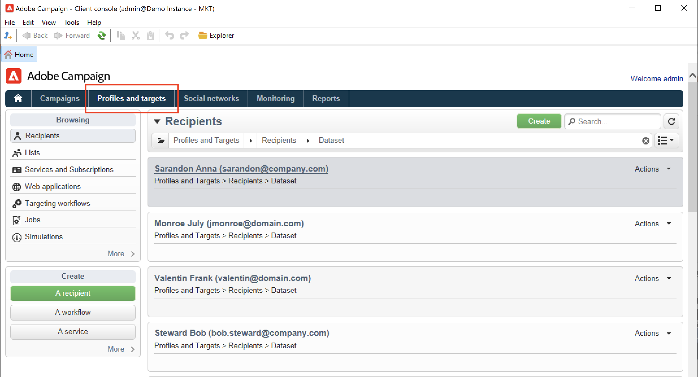

# 수동으로 프로필 만들기{#create-profiles-manual}

Campaign 데이터베이스를 채우려면 아래 설명된 대로 [프로필을 가져오거나](import-profiles.md)하거나 수동으로 추가할 수 있습니다.

수신자를 수동으로 생성하려면 아래 단계를 수행하십시오.

1. **[!UICONTROL Profiles and targets]** 탭으로 이동하여 **[!UICONTROL Recipients]** 범주를 선택합니다.

   

   기본적으로 수신자는 트리의 **[!UICONTROL Profiles and Targets > Recipients]** 노드에 저장됩니다. 이 보기에서 수신자를 만들 수도 있습니다.

1. **[!UICONTROL Create button]**&#x200B;을(를) 클릭합니다.
1. 프로필의 데이터를 입력합니다.

   

   [이 페이지](view-profiles.md#edit-a-profiles)에서 받는 사람의 기본 제공 양식에 대해 자세히 알아보세요.

1. **[!UICONTROL Save]**&#x200B;을(를) 클릭합니다. 프로필이 기본 받는 사람 폴더의 Campaign에 추가됩니다.
