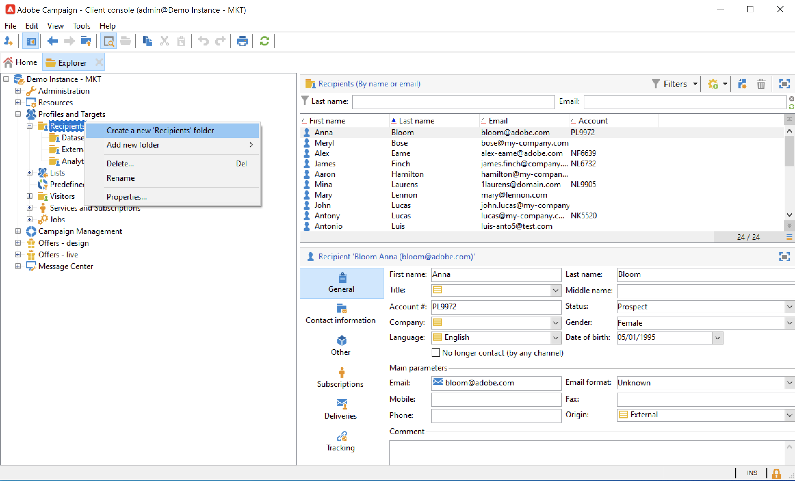

# 폴더 및 보기 관리 {#folders-and-views}

Campaign 폴더는 탐색기 트리의 노드입니다. 유형에 따라 특정 유형의 데이터가 포함됩니다.

뷰는 데이터를 포함하지 않지만 동일한 유형의 다른 폴더에 물리적으로 저장된 데이터를 표시하는 특정 폴더입니다. 예를 들어 게재 폴더를 보기로 전환하면 이 폴더에 모든 게재가 표시됩니다. 그런 다음 이 데이터를 필터링할 수 있습니다.

>[!NOTE]
>
>뷰를 표준 폴더와 구별하기 위해 해당 이름은 검정 대신 연한 파란색으로 표시됩니다.

폴더에 권한을 할당하여 특정 데이터에 대한 액세스를 제한할 수 있습니다. [자세히 알아보기](#restrict-access-to-a-folder)

## 폴더 작업 모범 사례{#best-practices-folders}

* **기본 제공 폴더 사용**&#x200B;을 통해 프로젝트에 참여하는 모든 사람이 응용 프로그램을 쉽게 사용하고 유지 관리하고 문제를 해결할 수 있습니다. 수신자, 목록, 게재 등에 대한 사용자 지정 폴더 구조를 만들지 말고 **관리**, **프로필 및 대상**, **캠페인 관리**&#x200B;와 같은 표준 폴더를 사용하십시오.

* **하위 폴더를 만듭니다**. 예를 들어 기술 워크플로를 기본 제공 폴더 **[!UICONTROL Administration > Production > Technical Workflows]** 아래에 저장하고 워크플로 유형별로 하위 폴더를 만듭니다.

* **명명 규칙을 정의하고 적용**&#x200B;합니다. 예를 들어 워크플로의 이름을 알파벳 순서로 지정하여 다음과 같이 실행 순서대로 정렬되도록 할 수 있습니다.

  A1 - 수신자 가져오기, 10:00에 시작;
A2 - 11:00에 시작하는 티켓 가져오기.

## 폴더 만들기{#create-a-folder}

폴더를 만들려면 기존 폴더를 마우스 오른쪽 단추로 클릭하고 상황별 메뉴를 사용합니다.

선택한 폴더와 동일한 유형의 폴더를 만들려면 상황별 메뉴에서 첫 번째 옵션을 선택합니다. 예를 들어 수신자 폴더에서 **[!UICONTROL Create a new 'Recipients' folder]**&#x200B;을(를) 선택합니다.

필요에 따라 새 폴더를 끌어다 놓아 Campaign 탐색기 트리를 구성할 수 있습니다.

다른 유형의 폴더를 만들려면 기존 폴더를 마우스 오른쪽 단추로 클릭하고 **[!UICONTROL Add new folder]**&#x200B;을(를) 선택합니다. 저장할 데이터에 따라 모든 유형의 폴더를 만들 수 있습니다.

>[!CAUTION]
>
>이러한 변경 사항은 모든 Campaign 사용자에게 적용됩니다.

## 폴더를 보기로 전환{#turn-a-folder-to-a-view}

뷰는 데이터를 포함하지 않지만 동일한 유형의 다른 폴더에 물리적으로 저장된 데이터를 표시하는 특정 폴더입니다.

모든 폴더를 보기로 전환할 수 있지만 폴더는 비어 있어야 합니다. 폴더에 저장된 모든 데이터는 폴더를 보기로 전환할 때 삭제됩니다.

>[!IMPORTANT]
>
>기본 제공 폴더는 보기로 변환해서는 안 됩니다.

>[!CAUTION]
>
>뷰는 데이터가 실제로 뷰 폴더에 저장되어 있지 않더라도 데이터를 표시하고 데이터에 대한 액세스를 제공합니다. 콘텐츠에 액세스하려면 운영자가 소스 폴더에 대해 최소한 읽기 액세스 권한이 있어야 합니다.
>
>소스 폴더에 대한 액세스 권한을 부여하지 않고 보기에 대한 액세스 권한을 부여하려면 소스 폴더의 상위 노드에 대한 읽기 액세스 권한을 부여하지 마십시오.

아래 예제에서는 내부 이름을 기반으로 미국 게재만 표시하는 새 폴더를 만들겠습니다.

1. **[!UICONTROL Deliveries]** 폴더를 만들고 이름을 **미국 게재**&#x200B;로 지정합니다.
1. 이 폴더를 마우스 오른쪽 단추로 클릭하고 **[!UICONTROL Properties...]**&#x200B;을(를) 선택합니다.
1. **[!UICONTROL Restriction]** 탭에서 **[!UICONTROL This folder is a view]**&#x200B;을(를) 선택합니다. 그러면 데이터베이스의 모든 게재가 표시됩니다.

   

1. 창의 중앙 섹션에 있는 쿼리 편집기에서 필터 기준을 정의합니다. 필터에 해당하는 게재만 폴더에 표시됩니다.

   

   >[!NOTE]
   >
   >[이 페이지](create-filters.md#advanced-filters)에서 쿼리를 디자인하는 방법을 알아보세요.

>[!CAUTION]
>
>[트랜잭션 메시지](../send/transactional.md) 이벤트를 관리할 때 권한 문제가 발생할 수 있으므로 **[!UICONTROL Real time events]** 또는 **[!UICONTROL Batch events]** 폴더를 실행 인스턴스의 보기로 설정하지 않아야 합니다.

## 폴더 구성{#organize-your-folders}

기본적으로 계층 구조의 맨 위에 새 폴더가 추가됩니다.

폴더 속성의 **하위 폴더** 탭을 검색하여 해당 하위 폴더를 구성하십시오.

오른쪽에 있는 화살표를 사용하여 폴더를 이동하거나 **[!UICONTROL Sort the sub-folders in alphabetical order]** 옵션을 선택하여 폴더를 자동으로 정렬할 수 있습니다.

## 폴더의 데이터 필터링{#filter-data-in-a-folder}

폴더에 저장된 데이터를 필터링하려면 폴더 속성에 액세스하여 제한 탭을 선택합니다.

예를 들어 아래 폴더에는 이메일 주소가 있는 연락처만 포함되며 해당 연락처의 출처가 &#39;외부&#39; 또는 비어 있는 것으로 플래그가 지정되지 않습니다.

## 폴더에 대한 액세스 제한{#restrict-access-to-a-folder}

폴더에 대한 권한을 사용하여 Campaign 데이터에 대한 액세스를 구성하고 제어합니다. [이 섹션](../start/folder-permissions.md)의 폴더에 대한 권한에 대해 자세히 알아보세요.
