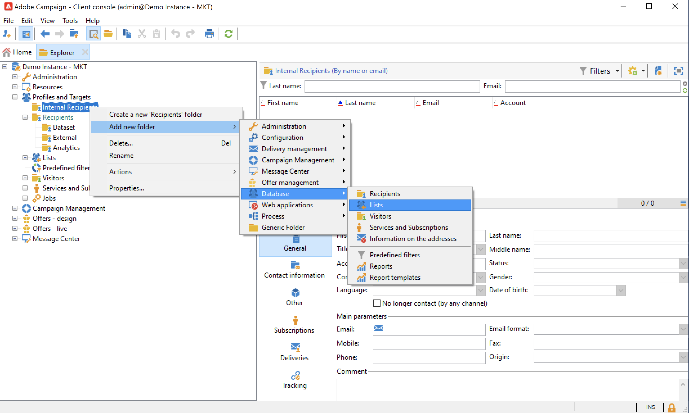

# 폴더 및 보기 관리 {#folders-and-views}

캠페인 폴더는 탐색기 트리의 노드입니다. 유형에 따라 특정 유형의 데이터가 포함됩니다.

보기는 데이터가 포함되지 않지만 동일한 유형의 다른 폴더에 물리적으로 저장된 데이터를 표시하는 특정 폴더입니다. 예를 들어 게재 폴더를 보기로 전환하면 이 폴더에 모든 게재가 표시됩니다. 그런 다음 이 데이터를 필터링할 수 있습니다.

>[!NOTE]
>뷰를 표준 폴더와 구분하기 위해 해당 이름은 검정 대신 연한 파란색으로 표시됩니다.

특정 데이터에 대한 액세스를 제한하는 권한을 폴더에 할당할 수 있습니다. [자세히 알아보기](#restrict-access-to-a-folder)

## 폴더 작업 시 모범 사례

* **기본 제공 폴더 사용** 를 사용하면 프로젝트에 참여하는 모든 사람이 애플리케이션을 보다 쉽게 사용, 유지 관리 및 해결할 수 있습니다. 수신자, 목록, 게재 등에 대한 사용자 지정 폴더 구조를 만들지 않지만 다음과 같은 표준 폴더를 사용합니다 **관리**, **프로필 및 Target**, **캠페인 관리**.

* **하위 폴더 만들기**&#x200B;예를 들어 내장된 폴더에 기술 워크플로우를 저장하는 경우가 있습니다. **[!UICONTROL Administration > Production > Technical Workflows]**, 및 워크플로우 유형별로 하위 폴더를 만듭니다.

* **이름 지정 규칙 정의 및 적용**&#x200B;예를 들어, 다음과 같이 실행 순서로 정렬되도록 워크플로우 이름을 알파벳 순서로 지정할 수 있습니다.

   A1 - 수신자 가져오기, 10:00부터 시작 A2 - 가져오기 티켓은 11시에 시작됩니다.

## 폴더 만들기{#create-a-folder}

폴더를 만들려면 기존 폴더를 마우스 오른쪽 단추로 클릭하고 상황별 메뉴를 사용합니다.

선택한 폴더와 동일한 유형의 폴더를 만들려면 컨텍스트 메뉴에서 첫 번째 옵션을 선택합니다. 예를 들어 수신자 폴더에서 을 선택합니다 **[!UICONTROL Create a new 'Recipients' folder]**.

새 폴더를 끌어다 놓아 필요에 따라 Campaign 탐색기 트리를 구성할 수 있습니다.

다른 유형의 폴더를 만들려면 기존 폴더를 마우스 오른쪽 단추로 클릭하고 를 선택합니다 **[!UICONTROL Add new folder]**. 저장할 데이터에 따라 모든 유형의 폴더를 만들 수 있습니다.

>[!CAUTION]
>이러한 변경 사항은 모든 Campaign 사용자에게 적용됩니다.

## 폴더를 보기로 이동{#turn-a-folder-to-a-view}

보기는 데이터가 포함되지 않지만 동일한 유형의 다른 폴더에 물리적으로 저장된 데이터를 표시하는 특정 폴더입니다.

모든 폴더를 보기로 변환할 수 있지만 폴더는 비어 있어야 합니다. 폴더를 보기로 전환하면 폴더에 저장된 모든 데이터가 삭제됩니다.

>[!CAUTION]
>
>뷰 폴더에는 데이터가 물리적으로 저장되지 않는 경우에도 뷰에 데이터가 표시되고 뷰에 액세스할 수 있습니다. 컨텐츠에 액세스하려면 연산자가 소스 폴더에서 적절한 권한을 가지고 있어야 하며 읽기 권한도 있어야 합니다.
>
>소스 폴더에 대한 액세스 권한을 부여하지 않고 뷰에 대한 액세스 권한을 부여하려면 소스 폴더의 상위 노드에 대한 읽기 액세스 권한을 부여하지 마십시오.

아래 예에서는 내부 이름을 기준으로 미국 게재만 표시하는 새 폴더를 만듭니다.

1. 만들기 **[!UICONTROL Deliveries]** 폴더를 만들고 이름을 지정합니다 **미국 게재**.
1. 이 폴더를 마우스 오른쪽 단추로 클릭하고 **[!UICONTROL Properties...]**.
1. **[!UICONTROL Restriction]** 탭에서 **[!UICONTROL This folder is a view]**&#x200B;를 선택합니다. 그러면 데이터베이스의 모든 게재가 표시됩니다.

   

1. 창의 중앙 섹션에 있는 쿼리 편집기에서 필터 기준을 정의합니다. 필터에 해당하는 게재만 폴더에 표시됩니다.

   

   >[!NOTE]
   >
   >에서 쿼리를 디자인하는 방법 알아보기 [이 페이지](create-filters.md#advanced-filters)

>[!CAUTION]
>
>관리 시 [트랜잭션 메시지](../send/transactional.md) events, **[!UICONTROL Real time events]** 또는 **[!UICONTROL Batch events]** 권한 문제가 발생할 수 있으므로 폴더를 실행 인스턴스의 보기로 설정하면 안 됩니다.

## 폴더 구성{#organize-your-folders}

기본적으로 계층 구조의 맨 위에 새 폴더가 추가됩니다.

찾아보기 **하위 폴더** 폴더 속성의 탭으로서 하위 폴더를 구성할 수 있습니다.

오른쪽에 화살표가 있는 폴더를 이동하거나 **[!UICONTROL Sort the sub-folders in alphabetical order]** 자동으로 정렬하는 옵션입니다.

## 폴더의 데이터 필터링{#filter-data-in-a-folder}

폴더에 저장된 데이터를 필터링하려면 폴더 속성에 액세스하여 제한 탭을 선택합니다.

예를 들어 아래 폴더에는 전자 메일 주소가 있고 원본이 &#39;외부&#39;로 플래그가 지정되지 않았거나 비어 있는 연락처만 포함됩니다.

## 폴더에 대한 액세스 제한{#restrict-access-to-a-folder}

폴더에 대한 권한을 사용하여 Campaign 데이터에 대한 액세스를 구성하고 제어할 수 있습니다.

특정 Campaign 폴더에 대한 권한을 편집하려면 아래 단계를 따르십시오.

1. 폴더를 마우스 오른쪽 단추로 클릭하고 를 선택합니다. **[!UICONTROL Properties...]**.
1. 다음 위치로 이동합니다. **[!UICONTROL Security]** 탭하여 이 폴더의 승인을 확인합니다.

   

* 종료 **그룹 또는 연산자 인증**&#x200B;를 클릭하고 **[!UICONTROL Add]** 버튼을 클릭하고 이 폴더에 대한 권한을 할당할 그룹 또는 연산자를 선택합니다.
* 종료 **그룹 또는 연산자 사용 금지**&#x200B;를 클릭합니다. **[!UICONTROL Delete]** 이 폴더에 대한 권한을 제거할 그룹 또는 연산자를 선택하십시오.
* 종료 **그룹 또는 연산자에 할당된 권한을 선택합니다**&#x200B;를 클릭하고 그룹 또는 연산자를 선택하고 부여할 액세스 권한을 선택한 다음 다른 권한을 선택 취소합니다.

### 권한 전파 {#propagate-permissions}

권한 및 액세스 권한을 전파하려면 **[!UICONTROL Propagate]** 옵션을 클릭합니다.

이 창에 정의된 권한은 현재 노드의 모든 하위 폴더에 적용됩니다. 각 하위 폴더에 대해 항상 이러한 권한을 오버로드할 수 있습니다.

>[!NOTE]
>
>확인 취소 **[!UICONTROL Propagate]** 폴더에 대한 옵션이 하위 폴더에 대해 지워지지 않습니다. 각 하위 폴더에 대해 명시적으로 지우십시오.

### 모든 연산자에 대한 액세스 권한 부여 {#grant-access-to-all-operators}

에서 **[!UICONTROL Security]** 탭에서 을 선택합니다 **[!UICONTROL System folder]** 권한에 관계없이 모든 연산자에 대한 액세스를 허용합니다.

이 옵션이 지워지면 액세스를 허용할 수 있도록 운영자(또는 그 그룹)를 권한 목록에 명시적으로 추가해야 합니다.
