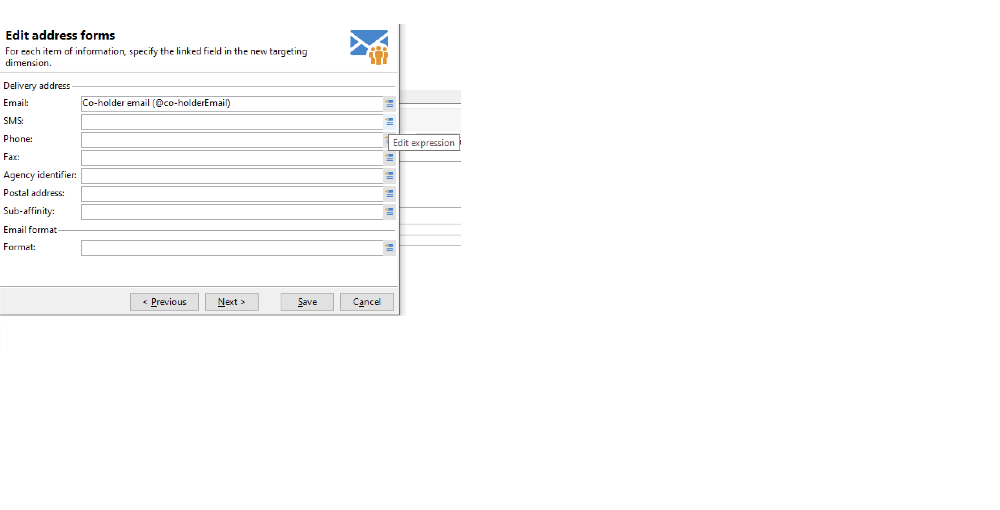

# 대상 매핑 작업{#gs-target-mappings}

기본적으로 게재 템플릿은 타겟팅합니다 **[!UICONTROL Recipients]**. 따라서 대상 매핑은 의 필드를 사용합니다 **nms:recipient** 테이블.

게재에 다른 타겟 매핑을 사용하거나 새 타겟 매핑을 만들 수 있습니다.

## 기본 제공 대상 매핑 {#ootb-mappings}

Adobe Campaign에는 다음과 같은 기본 제공 대상 매핑이 포함되어 있습니다.

| 이름 | 사용 대상 | 스키마 |
|---|---|---|
| 수신자 | 수신자에게 게재(기본 제공 수신자 테이블) | nms:recipient |
| 방문자 | 참조(바이럴 마케팅)를 통해 프로필이 수집된 방문자에게 제공합니다. | mns:visitor |
| 구독 | 뉴스레터 등 정보 서비스를 구독한 수신자에게 게재 | nms:subscription |
| 방문자 구독 | 정보 서비스를 구독한 방문자에게 게재 | nms:visitorSub |
| 연산자 | Adobe Campaign 운영자에게 게재 | nms:operator |
| 외부 파일 | 게재에 필요한 모든 정보가 포함된 파일을 통해 게재 | 연결된 스키마 없음, 입력된 대상 없음 |

## 대상 매핑 만들기 {#new-mapping}

대상 매핑을 생성할 수도 있습니다. 다음과 같은 경우 사용자 정의 대상 매핑을 추가해야 할 수 있습니다.

* 사용자 지정 수신자 테이블을 사용하면
* 대상 매핑 화면에서 기본 제공 타겟팅 차원과 다른 필터링 차원을 구성합니다.

에서 사용자 정의 수신자 테이블에 대해 자세히 알아보기 [이 페이지](../dev/custom-recipient.md).

Adobe Campaign 대상 매핑 생성 마법사는 사용자 지정 대상 매핑을 사용하는 데 필요한 모든 스키마를 만드는 데 도움이 됩니다.

1. 다음으로 이동 **[!UICONTROL Administration]** `>` **[!UICONTROL Campaign Management]** `>` **[!UICONTROL Target mappings]** Adobe Campaign 탐색기에서

1. 새 타겟 매핑을 만들고 사용자 지정 스키마를 타겟팅 차원으로 선택합니다.

   

1. 성, 이름, 이메일, 주소 등 프로필 정보가 저장된 필드를 나타냅니다.

   

1. 쉽게 식별할 수 있도록 확장 스키마의 접미사를 포함하여 정보 저장소에 대한 매개 변수를 지정합니다.

   

   제외를 저장할지 여부를 선택할 수 있습니다(**excludelog**), 메시지(**broadlog**) 또는 를 사용하여 메시지를 타깃팅할 수 있습니다.

   이 게재 매핑에 대한 추적을 관리할지 여부도 선택할 수 있습니다(**trackinglog**).

1. 그런 다음 고려할 확장을 선택합니다. 확장 유형은 Campaign 설정 및 추가 기능에 따라 다릅니다.

   

   다음을 클릭합니다. **[!UICONTROL Save]** 게재 매핑 생성을 시작하는 단추: 연결된 모든 테이블은 선택한 매개 변수를 기반으로 자동으로 생성됩니다.
