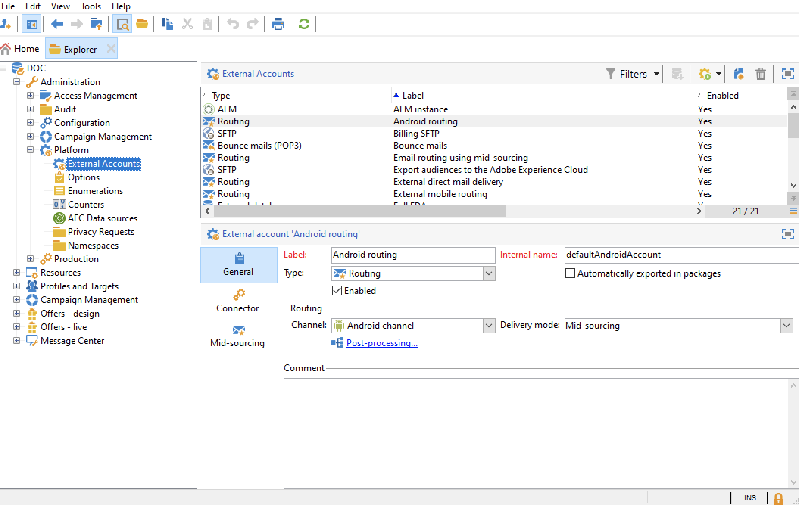

# 외부 계정 구성

Adobe Campaign에는 미리 정의된 외부 계정 집합이 포함되어 있습니다. 외부 시스템과의 연결을 설정하기 위해 새 외부 계정을 만들 수 있습니다.

외부 계정은 기술 워크플로우 또는 캠페인 워크플로우와 같은 기술 프로세스에서 사용됩니다. 예를 들어 워크플로우 또는 다른 애플리케이션(Adobe Target, Experience Manager 등)과 데이터 교환에서 파일 전송을 설정할 때는 외부 계정을 선택해야 합니다.

Adobe Campaign **[!UICONTROL Explorer]**&#x200B;에서 외부 계정에 액세스할 수 있습니다.**[!UICONTROL Administration]** `>` **[!UICONTROL Platform]** `>` **[!UICONTROL External accounts]**&#x200B;로 이동합니다.




>[!CAUTION]
>
>특정 **[!UICONTROL Full FDA]** (ffda) 외부 계정은 Campaign 로컬 데이터베이스와 Cloud 데이터베이스([!DNL Snowflake]) 간의 연결을 관리합니다.
>
>관리되는 Cloud Services 사용자로서, 이 외부 계정은 Adobe에 의해 인스턴스에 대해 구성됩니다. 수정해서는 안 됩니다.


## 캠페인 특정 외부 계정

다음 기술 계정은 Adobe Campaign에서 특정 프로세스를 활성화하고 실행하는 데 사용됩니다.

:speech_balon:관리 Cloud Services 사용자로 Campaign에서 제공하는 모든 외부 계정을 Adobe에서 구성합니다.

* **바운스 메일(POP3)**

   **바운스 메일** 외부 계정은 전자 메일 서비스에 연결하는 데 사용할 외부 POP3 계정을 지정합니다. POP3 액세스를 위해 구성된 모든 서버를 사용하여 반환 메일을 받을 수 있습니다.

   :arrow_upper_right:[Campaign Classic v7 설명서에서 인바운드 전자 메일에 대해 자세히 알아보기](https://experienceleague.adobe.com/docs/campaign-classic/using/automating-with-workflows/event-activities/inbound-emails.html)

* **라우팅**

   **[!UICONTROL Routing]** 외부 계정을 사용하면 설치된 패키지에 따라 Adobe Campaign에서 사용할 수 있는 각 채널을 구성할 수 있습니다.

   >[!CAUTION]
   >
   >**[!UICONTROL Internal email delivery routing]**(defaultEmailBulk) 외부 계정 **을(를) Adobe Campaign v8에서 활성화하지 않아야 합니다.**

* **실행 인스턴스**

   트랜잭션 메시지 컨텍스트에서 실행 인스턴스는 제어 인스턴스에 연결되고 연결됩니다. 트랜잭션 메시지 템플릿은 실행 인스턴스에 배포됩니다.

   :[이 페이지](../dev/architecture.md#transac-msg-archi)의 메시지 센터 아키텍처에 대해 자세히 알아보십시오.

## 외부 시스템 외부 계정에 대한 액세스

* **외부 데이터베이스(FDA)**

   FDA를 통해 외부 데이터베이스에 연결하려면 **외부 데이터베이스** 유형 외부 계정을 사용하십시오.

   Adobe Campaign v8과 호환되는 외부 데이터베이스는 [호환성 매트릭스](../start/compatibility-matrix.md)에 나열되어 있습니다.

   :[이 섹션](../connect/fda.md)의 FDA(Federated Data Access) 옵션에 대해 자세히 알아보십시오.

## Adobe 솔루션 통합 외부 계정

* **Adobe Experience Cloud**

   Adobe ID을 사용하여 Adobe Campaign 콘솔에 연결하려면 **[!UICONTROL Adobe Experience Cloud]** 외부 계정을 구성해야 합니다.

   :[이 섹션](../start/connect.md#connect-ims)에서 Identity Management 서비스(IMS)에 대해 자세히 알아보십시오.

   :speech_balon:관리 Cloud Services 사용자로서 [은(는) Adobe](../start/campaign-faq.md#support)에 문의하여 Campaign으로 Adobe IMS를 구현하십시오.

* **웹 분석**

   Adobe Analytics에서 Adobe Campaign으로 데이터 전송을 구성하려면 **[!UICONTROL Web Analytics (Adobe Analytics)]** 외부 계정을 사용하십시오.

   :[이 페이지](../connect/ac-aa.md)에서 Adobe Campaign - Adobe Analytics 통합에 대해 자세히 알아보십시오.

   :speech_balon:관리 Cloud Services 사용자로서 [Adobe](../start/campaign-faq.md#support)에 문의하여 Adobe Analytics을 Campaign과 통합하십시오.

   * **Adobe Experience Manager**
   **[!UICONTROL AEM]** 외부 계정을 사용하면 Adobe Experience Manager에서 직접 양식과 이메일 게재 콘텐츠를 관리할 수 있습니다.

   :[이 페이지](../connect/ac-aem.md)에서 Adobe Campaign - Adobe Analytics 통합에 대해 자세히 알아보십시오.

   :speech_balon:관리 Cloud Services 사용자로서 [Adobe](../start/campaign-faq.md#support)에 문의하여 Adobe Experience Manager을 Adobe Campaign과 통합하십시오.


## CRM 커넥터 외부 계정

* **Microsoft Dynamics CRM**

   **[!UICONTROL Microsoft Dynamics CRM]** 외부 계정을 사용하면 Microsoft Dynamics 데이터를 Adobe Campaign으로 가져오고 내보낼 수 있습니다.

   :Adobe Campaign에 대해 자세히 알아보기 - [이 페이지에서 Microsoft Dynamics CRM 통합에 대해 알아봅니다](../connect/crm.md).

   **[!UICONTROL Web API]** 배포 유형 및 **[!UICONTROL Password credentials]** 인증을 사용하여 다음 세부 정보를 제공해야 합니다.

   * **[!UICONTROL Account]**:Microsoft CRM에 로그인하는 데 사용되는 계정입니다.

   * **[!UICONTROL Server]**:Microsoft CRM 서버의 URL입니다.

   * **[!UICONTROL Client identifier]**:Microsoft Azure 관리 포털에서  **[!UICONTROL Update your code]** 카테고리, 필드의 클라이언트 ID입니다 **[!UICONTROL Client ID]** .

   * **[!UICONTROL CRM version]**:또는  **[!UICONTROL Dynamics CRM 2007]**&#x200B;간 CRM  **[!UICONTROL Dynamics CRM 2015]** 버전입니다.  **[!UICONTROL Dynamics CRM 2016]**
   **[!UICONTROL Web API]** 배포 유형 및 **[!UICONTROL Certificate]** 인증을 사용하여 다음 세부 정보를 제공해야 합니다.

   * **[!UICONTROL Server]**:Microsoft CRM 서버의 URL입니다.

   * **[!UICONTROL Private Key (Base64 encoded)]**:Base64로 인코딩된 개인 키

   * **[!UICONTROL Custom Key identifier]**

   * **[!UICONTROL Key ID]**

   * **[!UICONTROL Client identifier]**:Microsoft Azure 관리 포털에서  **[!UICONTROL Update your code]** 카테고리, 필드의 클라이언트 ID입니다 **[!UICONTROL Client ID]** .

   * **[!UICONTROL CRM version]**:또는  **[!UICONTROL Dynamics CRM 2007]**&#x200B;간 CRM  **[!UICONTROL Dynamics CRM 2015]** 버전입니다.  **[!UICONTROL Dynamics CRM 2016]**


* **Salesforce.com**

   **[!UICONTROL Salesforce CRM]** 외부 계정을 사용하면 Salesforce 데이터를 Adobe Campaign으로 가져오고 내보낼 수 있습니다.

   Adobe Campaign에서 작동하도록 Salesforce CRM 외부 계정을 구성하려면 다음 세부 정보를 제공해야 합니다.

   * **[!UICONTROL Account]**:Salesforce CRM에 로그인하는 데 사용되는 계정입니다.

   * **[!UICONTROL Password]**:Salesforce CRM에 로그인하는 데 사용되는 암호입니다.

   * **[!UICONTROL Client identifier]**: [이 페이지에서 클라이언트 ID를 찾는 방법을 알아봅니다](https://help.salesforce.com/articleView?id=000205876&amp;type=1).

   * **[!UICONTROL Security token]**: [이 페이지에서 보안 토큰을 찾는 방법을 알아봅니다](https://help.salesforce.com/articleView?id=000205876&amp;type=1).

   * **[!UICONTROL API version]**:API 버전을 선택합니다. 이 외부 계정의 경우 구성 마법사를 사용하여 Salesforce CRM을 구성해야 합니다.

## 데이터 외부 계정 전송

이러한 외부 계정은 **[!UICONTROL Transfer file]** 워크플로우 활동을 사용하여 데이터를 Adobe Campaign으로 가져오거나 내보내는 데 사용할 수 있습니다.

:arrow_upper_right:워크플로우의 파일 전송에 대해 자세히 알아보기 [Campaign Classic v7 설명서](https://experienceleague.adobe.com/docs/campaign-classic/using/automating-with-workflows/event-activities/file-transfer.html)

* **FTP 및 SFTP**

   **FTP** 외부 계정을 사용하면 Adobe Campaign 외부의 서버에 대한 액세스를 구성하고 테스트할 수 있습니다. 파일 전송에 사용되는 SFTP 또는 FTP 서버 898과 같은 외부 시스템과의 연결을 설정하기 위해 자체적인 외부 계정을 만들 수 있습니다.
이렇게 하려면 SFTP 또는 FTP 서버에 연결을 설정하는 데 사용되는 주소와 자격 증명을 이 외부 계정에 지정합니다.

* **Amazon Simple Storage Service (S3)**

   **AWS S3** 커넥터를 사용하여 **[!UICONTROL Transfer file]** 워크플로우 활동을 사용하여 데이터를 Adobe Campaign으로 가져오거나 내보낼 수 있습니다. 이 새 외부 계정을 설정할 때 다음 세부 사항을 제공해야 합니다.

   * **[!UICONTROL AWS S3 Account Server]**:다음과 같이 채워진 서버 URL:    ```<S3bucket name>.s3.amazonaws.com/<s3object path>```

   * **[!UICONTROL AWS access key ID]**: [Amazon 설명서](https://docs.aws.amazon.com/general/latest/gr/aws-sec-cred-types.html#access-keys-and-secret-access-keys) 에서 AWS 액세스 키 ID를 찾는 방법을 알아봅니다.

   * **[!UICONTROL Secret access key to AWS]**: [Amazon 설명서](https://aws.amazon.com/fr/blogs/security/wheres-my-secret-access-key/)에서 AWS에 대한 비밀 액세스 키를 찾는 방법을 알아봅니다.

   * **[!UICONTROL AWS Region]**: [Amazon 설명서](https://aws.amazon.com/about-aws/global-infrastructure/regions_az/)에서 AWS 리전에 대해 자세히 알아보십시오.

   * **[!UICONTROL Use server side encryption]** 확인란을 사용하여 파일을 S3 암호화 모드로 저장할 수 있습니다. [Amazon 설명서](https://docs.aws.amazon.com/general/latest/gr/aws-sec-cred-types.html#access-keys-and-secret-access-keys)에서 액세스 키 ID 및 암호 액세스 키를 찾는 방법을 알아봅니다.

* **Azure Blob 저장소**

   **Azure** 외부 계정을 사용하여 **[!UICONTROL Transfer file]** 워크플로우 활동을 사용하여 데이터를 Adobe Campaign으로 가져오거나 내보낼 수 있습니다. Adobe Campaign에서 작동하도록 **Azure** 외부 계정을 구성하려면 다음 세부 정보를 제공해야 합니다.

   * **[!UICONTROL Server]**:Azure Blob 저장소 서버의 URL입니다.

   * **[!UICONTROL Encryption]**:또는 간 암호화  **[!UICONTROL None]** 유형  **[!UICONTROL SSL]**.

   * **[!UICONTROL Access key]**: **[!UICONTROL Access key]** Microsoft 설명서 [에서 사용자](https://docs.microsoft.com/en-us/azure/storage/common/storage-account-keys-manage?tabs=azure-portal)를 찾는 방법을 알아봅니다.

