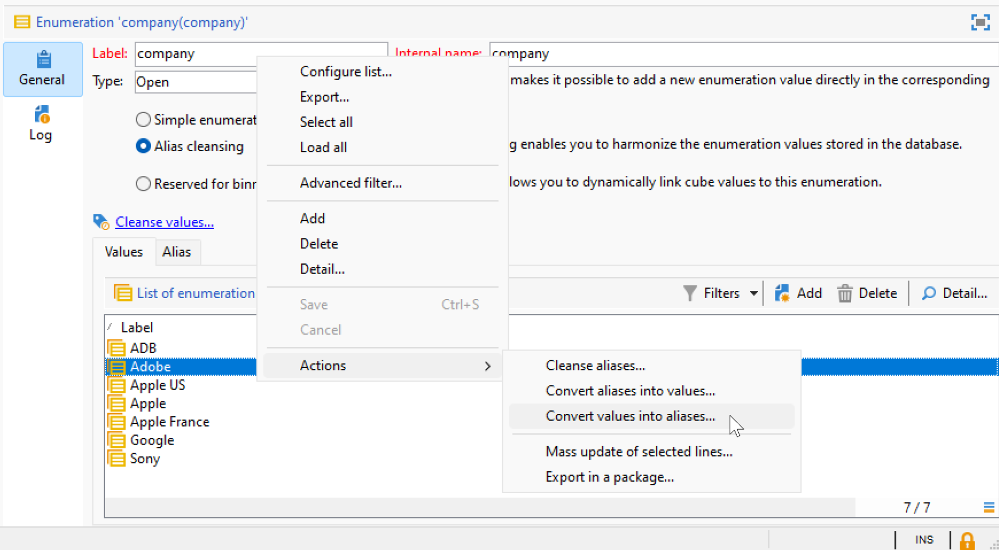

# Campaign 사용자 인터페이스 설정 {#ui-settings}

## 기본 단위 {#default-units}

Adobe Campaign에서 기간(예: 리소스의 유효 기간, 작업에 대한 승인 마감 등)을 나타내는 필드의 값은 다음과 같이 표현할 수 있습니다 **단위**:

* **[!UICONTROL s]** - 초
* **[!UICONTROL mn]** - 분
* **[!UICONTROL h]** - 시간
* **[!UICONTROL d]** - 일

## Campaign 탐색기 사용자 지정{#customize-explorer}

Campaign 탐색기에 폴더를 추가하고 보기를 만들고 권한을 할당할 수 있습니다.

에서 폴더 및 보기를 관리하는 방법 알아보기 [이 페이지](../audiences/folders-and-views.md)

## 목록 관리 및 사용자 지정{#customize-lists}

Campaign 클라이언트 콘솔에서 데이터가 목록에 표시됩니다. 이러한 목록을 필요에 맞게 조정할 수 있습니다. 예를 들어 열을 추가하고, 데이터를 필터링하고, 레코드를 카운트하고, 설정을 저장하고 공유할 수 있습니다.

또한 필터를 만들고 저장할 수 있습니다.  의 필터에 대해 자세히 알아보기 [이 페이지](../audiences/create-filters.md).

### 레코드 수 {#number-of-records}

기본적으로 Adobe Campaign은 목록의 처음 200개의 레코드를 로드합니다. 즉, 표시에서 보고 있는 테이블의 모든 레코드가 표시되지는 않습니다. 목록에 있는 레코드 수 개수를 실행하고 더 많은 레코드를 로드할 수 있습니다.

목록 화면의 오른쪽 하단에서 **카운터** 로드된 레코드 수와 데이터베이스에 있는 총 레코드 수를 표시합니다(필터를 적용한 후).

물음표가 오른쪽의 숫자 대신 표시되는 경우(예: ) `240/?`를 클릭하고 카운터를 클릭하여 계산을 시작합니다.

추가 레코드를 로드하고 표시하려면 다음을 클릭합니다. **[!UICONTROL Continue loading]**. 기본적으로 200개의 레코드가 로드됩니다. 로드할 기본 레코드 수를 변경하려면 **[!UICONTROL Configure list]** 목록의 오른쪽 하단 모서리에 있는 아이콘입니다. 목록 구성 창에서 **[!UICONTROL Advanced parameters]** (왼쪽 하단) 및 검색할 라인의 수를 변경합니다.

모든 레코드를 로드하려면 목록을 마우스 오른쪽 단추로 클릭하고 **[!UICONTROL Load all]**.

>[!CAUTION]
>
>목록에 많은 양의 레코드가 포함된 경우 전체 로드에 시간이 걸릴 수 있습니다.
>

### 열 추가 및 제거 {#add-columns}

각 목록에 대해 기본 제공 열 구성을 조정하여 더 많은 정보를 표시하거나 사용하지 않는 열을 숨길 수 있습니다.

레코드의 세부 정보에 데이터가 표시되면 필드를 마우스 오른쪽 단추로 클릭하고 **[!UICONTROL Add in the list]**.

열이 기존 열의 오른쪽에 추가됩니다.

목록 구성 화면을 사용하여 열을 추가하거나 제거할 수도 있습니다.

1. 레코드 목록에서 **[!UICONTROL Configure list]** 아이콘 을 클릭하여 제품에서 사용할 수 있습니다.
1. 에 추가할 필드를 두 번 클릭합니다. **[!UICONTROL Available fields]** list: 목록에 추가됩니다. **[!UICONTROL Output columns]** 목록을 표시합니다.

   

   >[!NOTE]
   >
   >기본적으로 고급 필드는 표시되지 않습니다. 이를 표시하려면 **고급 필드 표시** 아이콘: 사용 가능한 필드 목록의 오른쪽 아래 섹션에 있습니다.
   >
   >필드는 SQL 필드, 연결된 테이블, 계산된 필드 등의 특정 아이콘으로 식별됩니다. 선택한 각 필드에 대해 사용 가능한 필드 목록 아래에 설명이 표시됩니다.
   >

1. 위쪽/아래쪽 화살표를 사용하여 **표시 순서**.

1. 클릭 **[!UICONTROL OK]** 구성을 확인하고 결과를 표시합니다.

열을 제거해야 하는 경우 해당 열을 선택하고 **휴지통** 아이콘.

다음을 사용할 수 있습니다. **[!UICONTROL Distribution of values]** 아이콘 : 현재 폴더에서 선택한 필드에 대한 값 재분할을 봅니다.

### 새 열 만들기 {#create-a-new-column}

새 열을 만들어 목록에 추가 필드를 표시할 수 있습니다.

열을 만들려면 다음 단계를 수행합니다.

1. 레코드 목록에서 **[!UICONTROL Configure list]** 아이콘 을 클릭하여 제품에서 사용할 수 있습니다.
1. 다음을 클릭합니다. **[!UICONTROL Add]** 목록에 새 필드를 표시하는 아이콘.
1. 열에 추가할 필드를 구성합니다.

### 하위 폴더에 데이터 표시 {#display-sub-folders-records}

목록은 다음을 표시할 수 있습니다.

* 선택한 폴더에 포함된 모든 레코드(기본값)
* 선택한 폴더 및 해당 하위 폴더에 포함된 모든 레코드

한 디스플레이 모드에서 다른 디스플레이 모드로 전환하려면 **[!UICONTROL Display sub-levels]** 을 클릭합니다.

### 목록 구성 저장 {#saving-a-list-configuration}

목록 구성은 각 사용자에 대해 로컬로 정의됩니다. 로컬 캐시가 지워지면 로컬 구성이 비활성화됩니다.

기본적으로 설정 매개 변수는 해당 폴더 유형을 가진 모든 목록에 적용됩니다. 폴더에서 수신자 목록이 표시되는 방식을 수정하면 이 구성이 다른 모든 수신자 폴더에 적용됩니다.

동일한 유형의 다른 폴더에 적용할 구성을 두 개 이상 저장할 수 있습니다. 구성은 데이터가 포함된 폴더의 속성과 함께 저장되며 다시 적용할 수 있습니다.

목록 구성을 재사용할 수 있도록 저장하려면 아래 단계를 수행합니다.

1. 탐색기에서 표시된 데이터가 포함된 폴더를 마우스 오른쪽 단추로 클릭합니다.
1. **[!UICONTROL Properties]**&#x200B;을(를) 선택합니다.
1. 클릭 **[!UICONTROL Advanced settings]** 이름을 지정한 다음 **[!UICONTROL Configuration]** 필드.
1. 클릭 **[!UICONTROL OK]** 그런 다음 을 클릭합니다. **[!UICONTROL Save]**.

그런 다음 동일한 유형의 다른 폴더에 이 구성을 적용할 수 있습니다. 의 폴더에 대해 자세히 알아보기 [이 페이지](../audiences/folders-and-views.md).

### 목록 내보내기 {#exporting-a-list}

목록에서 데이터를 내보내려면 내보내기 마법사를 사용해야 합니다. 액세스하려면 목록에서 내보낼 요소를 선택하고 마우스 오른쪽 버튼을 클릭한 다음 를 선택합니다 **[!UICONTROL Export...]**.

<!--The use of the import and export functions is explained in [Generic imports and exports](../../platform/using/about-generic-imports-exports.md).-->

>[!CAUTION]
>
>목록의 요소는 복사/붙여넣기 기능을 사용하여 내보낼 수 없습니다.

### 목록 정렬 {#sorting-a-list}

목록에는 많은 양의 데이터가 포함될 수 있습니다. 이러한 데이터를 정렬하거나 단순 또는 고급 필터를 적용할 수 있습니다. 정렬을 사용하여 데이터를 오름차순 또는 내림차순으로 표시할 수 있습니다. 필터를 사용하면 기준을 정의하고 결합하여 선택한 데이터만 표시할 수 있습니다.

오름차순 또는 내림차순 정렬을 적용하거나 데이터 정렬을 취소하려면 열 헤더를 클릭합니다. 활성 정렬 상태 및 정렬 순서는 열 레이블 앞에 파란색 화살표로 표시됩니다. 열 레이블 앞에 빨간색 대시가 있으면 데이터베이스에서 인덱싱된 데이터에 정렬이 적용됨을 의미합니다. 이 정렬 방법은 정렬 작업을 최적화하는 데 사용됩니다.

정렬을 구성하거나 정렬 기준을 결합할 수도 있습니다. 이렇게 하려면 아래 단계를 수행합니다.

1. **[!UICONTROL Configure list]** 목록 아래와 오른쪽에 있습니다.
1. 목록 구성 창에서 **[!UICONTROL Sorting]** 탭.
1. 정렬할 필드와 정렬 방향(오름차순 또는 내림차순)을 선택합니다.
1. 정렬 우선순위는 정렬 열의 순서로 정의됩니다. 우선 순위를 변경하려면 해당 아이콘을 사용하여 열의 순서를 변경합니다.

   정렬 우선 순위는 목록의 열 표시에 영향을 주지 않습니다.

1. 클릭 **[!UICONTROL Ok]** 이 구성을 확인하고 결과를 목록에 표시합니다.

## 열거형을 사용한 작업 {#enumerations}

열거형(&#39;itemised list&#39;라고도 함)은 필드를 채우기 위해 시스템에서 제안하는 값 목록입니다. 열거형을 사용하여 이러한 필드의 값을 표준화하고 데이터 입력 또는 쿼리 내에서 사용합니다.

값 목록은 필드에 입력할 값을 선택할 수 있는 드롭다운 목록으로 나타납니다. 드롭다운 목록을 통해 예측 입력도 가능합니다. 첫 번째 문자를 입력하고 나머지 문자는 애플리케이션이 채웁니다.

이 유형의 필드에 대한 값이 정의되며 이러한 필드의 전체 관리(값 추가/삭제)는 **[!UICONTROL Administration > Platform > Enumerations]** 트리의 노드.

### 열거형 유형 {#types-of-enum}

열거형은에 저장됩니다 **[!UICONTROL Administration > Platform > Enumerations]** 탐색기의 폴더입니다.

열기, 시스템, 이모티콘 또는 닫힘 상태일 수 있습니다.

* An **열기** 열거형을 사용하면 이 열거형을 기반으로 필드에 직접 새 값을 추가할 수 있습니다.
* A **종료됨** 열거형에는 다음에서만 수정할 수 있는 고정 값 목록이 있습니다. **[!UICONTROL Administration > Platform > Enumerations]** 탐색기의 폴더입니다.
* An **이모티콘** 열거형은 이모티콘 목록을 업데이트하는 데 사용됩니다. 자세히 알아보기
* A **시스템** 열거형은 시스템 필드와 연결되어 있으며 내부 이름으로 제공됩니다.

대상 **열기** 및 **종료됨** 열거형, 특정 옵션을 사용할 수 있습니다.

* **단순 열거** 는 기본 표준 유형입니다.
* **별칭 정리** 열거형은 데이터베이스에 저장된 열거형 값을 조합하는 데 사용됩니다. [자세히 알아보기](#alias-cleansing)
* **빈용으로 예약됨** 은 큐브 값을 이 열거형에 연결할 수 있는 옵션입니다. [자세히 알아보기](../reporting/gs-cubes.md)

### 별칭 정리 {#alias-cleansing}

열거형 필드에서 값을 선택하거나 드롭다운 목록에서 사용할 수 없는 사용자 지정 값을 입력할 수 있습니다. 사용자 지정 값을 기존 열거형 값에 새 값으로 추가할 수 있습니다. 이 경우 **[!UICONTROL Open]** 옵션을 선택해야 합니다. 이러한 사용자 지정 값은 별칭 정리 기능을 사용하여 정리할 수 있습니다. 예를 들어 사용자가 을 입력하는 경우 `Adob` 대신 `Adobe`, 별칭 정리 프로세스는 자동으로 올바른 용어로 대체할 수 있습니다.

>[!CAUTION]
>
>데이터 정리는 데이터베이스의 데이터에 영향을 주는 중요한 프로세스입니다. Adobe Campaign은 대량 데이터 업데이트를 수행하여 일부 값이 삭제될 수 있습니다. 따라서 이 작업은 전문가 사용자용으로 예약되어 있습니다.

활성화 **[!UICONTROL Alias cleansing]** 열거형에 데이터 정리 기능을 사용하는 옵션입니다. 이 옵션을 선택하면 **[!UICONTROL Alias]** 창 하단에 탭이 표시됩니다.

사용자가 별칭 정리 열거에 없는 값을 입력하면 해당 값이 **값** 목록을 표시합니다. 다음을 수행할 수 있습니다. [이 값에서 별칭 만들기](#convert-to-alias), 또는 [새 별칭을 처음부터 만들기](#create-alias).

#### 별칭 만들기{#create-alias}

별칭을 만들려면 다음 단계를 수행하십시오.

1. 클릭 **[!UICONTROL Add]** 의 단추 **[!UICONTROL Alias]** 탭.
1. 변환할 별칭을 입력하고 드롭다운 목록에서 적용할 값을 선택합니다.

   

1. 클릭 **[!UICONTROL Ok]** 확인.

1. 변경 내용을 저장합니다. 값 교체는 **별칭 정리** 매일 밤 실행되는 워크플로우입니다. 을(를) 참조하십시오 [데이터 정리 실행](#running-data-cleansing).

이 열거형을 기반으로 하는 모든 필드의 경우 사용자가 값을 입력할 때 **Adobe** &quot;회사&quot; 필드(Adobe Campaign 클라이언트 콘솔의 웹 양식)에서는 값으로 자동 대체됩니다. **Adobe**.

#### 잘못된 값을 별칭으로 변환{#convert-to-alias}

기존 열거형 값을 별칭으로 변환할 수도 있습니다. 다음을 수행하십시오.

1. 열거형의 값 목록에서 마우스 오른쪽 단추를 클릭하고 **[!UICONTROL Actions... > Convert values into aliases...]**.

   

1. 별칭으로 변환할 값을 선택하고 **[!UICONTROL Next]**.
1. 클릭 **[!UICONTROL Start]** 변환을 실행합니다.

   실행이 완료되면 별칭이 목록의 **별칭** 탭. 올바른 값을 연결하여 잘못된 항목을 바꿀 수 있습니다. 다음을 수행하십시오.

1. 정리할 값을 선택합니다.
1. 다음을 클릭합니다. **세부 사항...** 단추를 클릭합니다.
1. 드롭다운 목록에서 새 값을 선택합니다.

   

>[!NOTE]
>
>에서 별칭의 발생 횟수를 추적할 수 있습니다. **[!UICONTROL Hits]** 열의 **[!UICONTROL Alias]** 하위 탭. 이 값이 입력된 횟수를 표시할 수 있습니다.  [자세히 알아보기](#calculate-entry-occurrences)

#### 데이터 정리 실행 {#running-data-cleansing}

데이터 정리는 **[!UICONTROL Alias cleansing]** 기술 워크플로우입니다. 기본적으로 매일 실행됩니다.

세척은 다음을 통해 트리거될 수도 있습니다. **[!UICONTROL Cleanse values...]** 링크를 클릭합니다.

다음 **[!UICONTROL Advanced parameters...]** 링크를 사용하면 수집된 값이 고려되는 시작 날짜를 설정할 수 있습니다.

다음을 클릭합니다. **[!UICONTROL Start]** 데이터 정리를 실행하는 단추입니다.

##### 발생 횟수 모니터링 {#calculate-entry-occurrences}

다음 **[!UICONTROL Alias]** 열거형의 하위 탭에는 입력된 모든 값 중에서 별칭이 발생한 횟수가 표시될 수 있습니다. 이 정보는 예상 값이며 **[!UICONTROL Hits]** 열.

>[!CAUTION]
>
>별칭 항목 발생 횟수를 계산하는 데 시간이 오래 걸릴 수 있습니다.
>

다음을 통해 히트 계산을 수동으로 실행할 수 있습니다. **[!UICONTROL Cleanse values...]** 링크를 클릭합니다. 이렇게 하려면 **[!UICONTROL Advanced parameters...]** 링크를 클릭하고 옵션을 선택합니다.

* **[!UICONTROL Update the number of alias hits]**: 입력한 날짜에 따라 이미 계산된 히트를 업데이트할 수 있습니다.
* **[!UICONTROL Recalculate the number of alias hits from the start]**: 전체 Adobe Campaign 플랫폼에서 계산을 실행할 수 있습니다.

예를 들어 일주일에 한 번, 주어진 기간 동안 자동으로 계산이 실행되도록 전용 워크플로우를 만들 수도 있습니다.

이렇게 하려면 **[!UICONTROL Alias cleansing]** 워크플로우에서 스케줄러를 변경하고 **[!UICONTROL Enumeration value cleansing]** 활동:

* **-updateHits** 별칭 히트 수를 업데이트하려면
* **-updateHits:full** 모든 별칭 히트를 다시 계산합니다.
