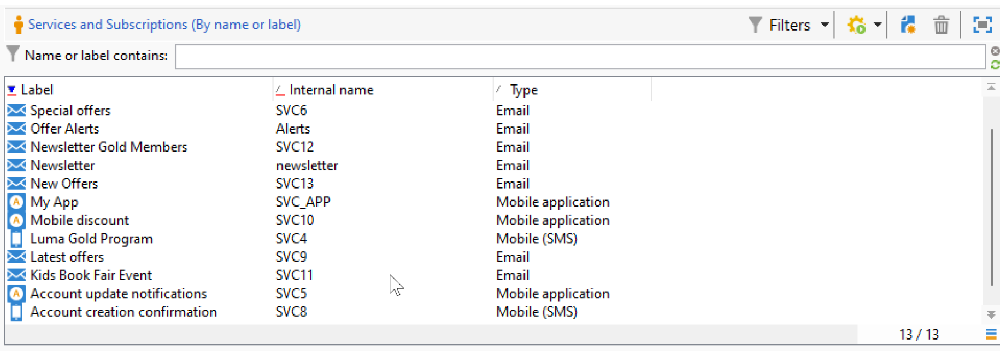

# Campaign 사용자 인터페이스 설정 {#ui-settings}

## 기본 단위 {#default-units}

Adobe Campaign에서 기간(예: 리소스의 유효 기간, 작업의 승인 마감 등)을 나타내는 필드의 경우, 값은 다음 **단위**&#x200B;로 표현할 수 있습니다.

* **[!UICONTROL s]**&#x200B;초
* **[!UICONTROL mn]**&#x200B;분
* **[!UICONTROL h]**(시간)
* **[!UICONTROL d]**&#x200B;일

## Campaign 탐색기 사용자 지정{#customize-explorer}

Campaign 탐색기에 폴더를 추가하고 보기를 만들고 권한을 할당할 수 있습니다.

[이 페이지](../audiences/folders-and-views.md)에서 폴더 및 보기를 관리하는 방법을 알아보세요.

## 목록 관리 및 사용자 지정 {#customize-lists}

Campaign 클라이언트 콘솔에서 데이터가 목록에 표시됩니다. 이러한 목록을 필요에 맞게 조정할 수 있습니다. 예를 들어 열을 추가하고, 데이터를 필터링하고, 레코드를 카운트하고, 설정을 저장하고 공유할 수 있습니다.

또한 필터를 만들고 저장할 수 있습니다.  [이 페이지](../audiences/create-filters.md)에서 필터에 대해 자세히 알아보세요.

### 레코드 수 {#number-of-records}

기본적으로 Adobe Campaign은 목록의 처음 200개의 레코드를 로드합니다. 즉, 표시에서 보고 있는 테이블의 모든 레코드가 표시되지는 않습니다. 목록에 있는 레코드 수 개수를 실행하고 더 많은 레코드를 로드할 수 있습니다.

목록 화면의 오른쪽 하단에서 **counter**&#x200B;은(는) 로드된 레코드 수와 데이터베이스의 총 레코드 수를 표시합니다(필터를 적용한 후).

`240/?`과(와) 같이 오른쪽에 있는 숫자 대신 물음표가 나타나면 카운터를 클릭하여 계산을 시작합니다.

추가 레코드를 로드하고 표시하려면 **[!UICONTROL Continue loading]**&#x200B;을(를) 클릭합니다. 기본적으로 200개의 레코드가 로드됩니다. 로드할 기본 레코드 수를 변경하려면 목록의 오른쪽 아래 모서리에 있는 **[!UICONTROL Configure list]** 아이콘을 사용하십시오. 목록 구성 창에서 **[!UICONTROL Advanced parameters]**(왼쪽 아래)을(를) 클릭하고 검색할 줄 수를 변경합니다.

모든 레코드를 로드하려면 목록을 마우스 오른쪽 단추로 클릭하고 **[!UICONTROL Load all]**&#x200B;을(를) 선택합니다.

>[!CAUTION]
>
>목록에 많은 양의 레코드가 포함된 경우 전체 로드에 시간이 걸릴 수 있습니다.
>

### 열 추가 및 제거 {#add-columns}

각 목록에 대해 기본 제공 열 구성을 조정하여 더 많은 정보를 표시하거나 사용하지 않는 열을 숨길 수 있습니다.

레코드의 세부 정보에 데이터가 표시되면 필드를 마우스 오른쪽 단추로 클릭하고 **[!UICONTROL Add in the list]**&#x200B;을(를) 선택합니다.

열이 기존 열의 오른쪽에 추가됩니다.

목록 구성 화면을 사용하여 열을 추가하거나 제거할 수도 있습니다.

1. 레코드 목록에서 오른쪽 아래의 **[!UICONTROL Configure list]** 아이콘을 클릭합니다.
1. **[!UICONTROL Available fields]** 목록에 추가할 필드를 두 번 클릭합니다. **[!UICONTROL Output columns]** 목록에 추가됩니다.

   

   >[!NOTE]
   >
   >기본적으로 고급 필드는 표시되지 않습니다. 이러한 필드를 표시하려면 사용 가능한 필드 목록의 오른쪽 아래 섹션에 있는 **고급 필드 표시** 아이콘을 클릭하십시오.
   >
   >필드는 SQL 필드, 연결된 테이블, 계산된 필드 등의 특정 아이콘으로 식별됩니다. 선택한 각 필드에 대해 사용 가능한 필드 목록 아래에 설명이 표시됩니다.
   >

1. 위쪽/아래쪽 화살표를 사용하여 **표시 순서**&#x200B;를 수정합니다.

1. 구성을 확인하고 결과를 표시하려면 **[!UICONTROL OK]**&#x200B;을(를) 클릭합니다.

열을 제거해야 하는 경우 열을 선택하고 **휴지통** 아이콘을 클릭합니다.

**[!UICONTROL Distribution of values]** 아이콘을 사용하여 현재 폴더에서 선택한 필드에 대한 값 재분할을 볼 수 있습니다.

### 새 열 만들기 {#create-a-new-column}

새 열을 만들어 목록에 추가 필드를 표시할 수 있습니다.

열을 만들려면 다음 단계를 수행합니다.

1. 레코드 목록에서 오른쪽 아래의 **[!UICONTROL Configure list]** 아이콘을 클릭합니다.
1. **[!UICONTROL Add]** 아이콘을 클릭하여 목록에 새 필드를 표시합니다.
1. 열에 추가할 필드를 구성합니다.

### 하위 폴더에 데이터 표시 {#display-sub-folders-records}

목록은 다음을 표시할 수 있습니다.

* 선택한 폴더에 포함된 모든 레코드(기본값)
* 선택한 폴더 및 해당 하위 폴더에 포함된 모든 레코드

한 표시 모드에서 다른 표시 모드로 전환하려면 Campaign 도구 모음에서 **[!UICONTROL Display sub-levels]**&#x200B;을(를) 클릭합니다.

### 목록 구성 저장 {#saving-a-list-configuration}

목록 구성은 각 사용자에 대해 로컬로 정의됩니다. 로컬 캐시가 지워지면 로컬 구성이 비활성화됩니다.

기본적으로 설정 매개 변수는 해당 폴더 유형을 가진 모든 목록에 적용됩니다. 폴더에서 수신자 목록이 표시되는 방식을 수정하면 이 구성이 다른 모든 수신자 폴더에 적용됩니다.

동일한 유형의 다른 폴더에 적용할 구성을 두 개 이상 저장할 수 있습니다. 구성은 데이터가 포함된 폴더의 속성과 함께 저장되며 다시 적용할 수 있습니다.

목록 구성을 재사용할 수 있도록 저장하려면 아래 단계를 수행합니다.

1. 탐색기에서 표시된 데이터가 포함된 폴더를 마우스 오른쪽 단추로 클릭합니다.
1. **[!UICONTROL Properties]**&#x200B;을(를) 선택합니다.
1. **[!UICONTROL Advanced settings]**&#x200B;을(를) 클릭한 다음 **[!UICONTROL Configuration]** 필드에 이름을 지정합니다.
1. **[!UICONTROL OK]**&#x200B;을(를) 클릭한 다음 **[!UICONTROL Save]**&#x200B;을(를) 클릭합니다.

그런 다음 동일한 유형의 다른 폴더에 이 구성을 적용할 수 있습니다. [이 페이지](../audiences/folders-and-views.md)의 폴더에 대해 자세히 알아보세요.

### 목록 내보내기 {#exporting-a-list}

목록에서 데이터를 내보내려면 내보내기 마법사를 사용해야 합니다. 액세스하려면 목록에서 내보낼 요소를 선택하고 마우스 오른쪽 단추를 클릭한 다음 **[!UICONTROL Export...]**&#x200B;을(를) 선택합니다.

<!--The use of the import and export functions is explained in [Generic imports and exports](../../platform/using/about-generic-imports-exports.md).-->

>[!CAUTION]
>
>목록의 요소는 복사/붙여넣기 기능을 사용하여 내보낼 수 없습니다.

### 목록 정렬 {#sorting-a-list}

목록에는 많은 양의 데이터가 포함될 수 있습니다. 이러한 데이터를 정렬하거나 단순 또는 고급 필터를 적용할 수 있습니다. 정렬을 사용하여 데이터를 오름차순 또는 내림차순으로 표시할 수 있습니다. 필터를 사용하면 기준을 정의하고 결합하여 선택한 데이터만 표시할 수 있습니다.

오름차순 또는 내림차순 정렬을 적용하거나 데이터 정렬을 취소하려면 열 헤더를 클릭합니다. 활성 정렬 상태 및 정렬 순서는 열 레이블 앞에 파란색 화살표로 표시됩니다. 열 레이블 앞에 빨간색 대시가 있으면 데이터베이스에서 인덱싱된 데이터에 정렬이 적용됨을 의미합니다. 이 정렬 방법은 정렬 작업을 최적화하는 데 사용됩니다.

정렬을 구성하거나 정렬 기준을 결합할 수도 있습니다. 이렇게 하려면 아래 단계를 수행합니다.

1. **[!UICONTROL Configure list]**(이)가 목록 아래 오른쪽에 있습니다.
1. 목록 구성 창에서 **[!UICONTROL Sorting]** 탭을 클릭합니다.
1. 정렬할 필드와 정렬 방향(오름차순 또는 내림차순)을 선택합니다.
1. 정렬 우선순위는 정렬 열의 순서로 정의됩니다. 우선 순위를 변경하려면 해당 아이콘을 사용하여 열의 순서를 변경합니다.

   정렬 우선 순위는 목록의 열 표시에 영향을 주지 않습니다.

1. **[!UICONTROL Ok]**&#x200B;을(를) 클릭하여 이 구성을 확인하고 결과를 목록에 표시합니다.

## 추가 리소스

* **[Campaign 사용자 인터페이스를 시작합니다](../start/campaign-ui.md)** - Adobe Campaign 인터페이스에 액세스하고 검색하는 방법을 알아봅니다.
* **[열거형으로 작업](../dev/enumerations.md)** - 더 빠르고 일관된 데이터 항목을 위해 필드 값을 미리 정의된 드롭다운 목록으로 표준화합니다.
