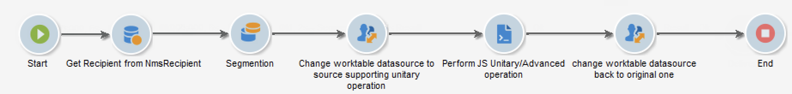

# 프로세스 관리 및 자동화

강력한 마케팅 캠페인 자동화 기능을 활용하도록 Campaign을 구성합니다.

다음을 설정할 수 있습니다.

* 워크플로우
* 반복 캠페인
* 종단 간 유효성 검사 주기
* 경고
* 자동 보고서 전송
* 트리거된 이벤트

## 워크플로우 디자인 및 사용{#gs-ac-wf}

Adobe Campaign 워크플로우를 사용하여 세그먼트 만들기 및 메시지 준비에서 게재에 이르기까지 마케팅 캠페인의 모든 측면에 대한 속도와 크기를 향상시킬 수 있습니다.

이러한 [엔드 투 엔드 사용 사례](#end-to-end-uc)에서 워크플로우를 디자인하는 방법을 배웁니다.

워크플로우 사용자 인터페이스 및 Campaign Classic v7 설명서의 실행에 대해 자세히 알아보십시오.

↗️ [워크플로우 시작](https://experienceleague.adobe.com/docs/campaign-classic/using/automating-with-workflows/introduction/about-workflows.html?lang=en#automating-with-workflows){target=&quot;_blank&quot;}

↗️ [워크플로우 우수 사례](https://experienceleague.adobe.com/docs/campaign-classic/using/automating-with-workflows/introduction/workflow-best-practices.html){target=&quot;_blank&quot;}

↗️ [기본 제공 기술 워크플로우](https://experienceleague.adobe.com/docs/campaign-classic/using/automating-with-workflows/advanced-management/about-technical-workflows.html){target=&quot;_blank&quot;}

↗️ [워크플로우 실행 모니터링](https://experienceleague.adobe.com/docs/campaign-classic/using/automating-with-workflows/monitoring-workflows/monitoring-workflow-execution.html){target=&quot;_blank&quot;}

↗️ [마케팅 캠페인 워크플로우에서 대상 작성](https://experienceleague.adobe.com/docs/campaign-classic/using/orchestrating-campaigns/orchestrate-campaigns/marketing-campaign-target.html?lang=en#building-the-main-target-in-a-workflow){target=&quot;_blank&quot;}

## 워크플로우 활동 {#wf-activities}

↗️ 사용 가능한 워크플로우 활동 [Campaign Classic v7 설명서](https://experienceleague.adobe.com/docs/campaign-classic/using/automating-with-workflows/introduction/about-activities.html){target=&quot;_blank&quot;}에 대해 자세히 알아보십시오

워크플로우 활동은 카테고리별로 그룹화됩니다. 네 가지 활동 카테고리를 사용할 수 있습니다.

* [타겟팅 활동](https://experienceleague.adobe.com/docs/campaign-classic/using/automating-with-workflows/targeting-activities/about-targeting-activities.html){target=&quot;_blank&quot;}: 쿼리, 읽기 목록, 데이터 보강, 결합 등
* [흐름 제어 활동](https://experienceleague.adobe.com/docs/campaign-classic/using/automating-with-workflows/flow-control-activities/about-flow-control-activities.html){target=&quot;_blank&quot;}: 스케줄러, 포크, 경고, 외부 신호 등
* [작업 활동](https://experienceleague.adobe.com/docs/campaign-classic/using/automating-with-workflows/action-activities/about-action-activities.html){target=&quot;_blank&quot;}: 크로스 채널 게재, Javascript 코드, CRM 활동, 업데이트 집계 등
* [이벤트 활동](https://experienceleague.adobe.com/docs/campaign-classic/using/automating-with-workflows/action-activities/about-action-activities.html){target=&quot;_blank&quot;}: 파일 전송, 웹 다운로드 등

### 데이터 소스 활동 변경 {#change-data-source-activity}

**[!UICONTROL Change data source]** 활동을 사용하면 워크플로우 **[!UICONTROL Working table]**&#x200B;의 데이터 소스를 변경할 수 있습니다. 이렇게 하면 FDA, FFDA 및 로컬 데이터베이스와 같은 다양한 데이터 소스에서 데이터를 관리할 수 있는 유연성이 높아집니다.

Adobe Campaign 워크플로우에서는 **[!UICONTROL Working table]**을(를) 통해 데이터를 처리하고 워크플로우 활동과 데이터를 공유할 수 있습니다.
기본적으로 **[!UICONTROL Working table]**&#x200B;은(는) 우리가 쿼리하는 데이터의 소스와 동일한 데이터베이스에 만들어집니다.

예를 들어 클라우드 데이터베이스에 저장된 **[!UICONTROL Profiles]** 테이블을 쿼리할 때 동일한 클라우드 데이터베이스에 **[!UICONTROL Working table]**을(를) 만듭니다.
이를 변경하려면 **[!UICONTROL Change Data Source]** 활동을 추가하여 **[!UICONTROL Working table]** 의 다른 데이터 소스를 선택할 수 있습니다.

**[!UICONTROL Change Data Source]** 활동을 사용할 때는 워크플로우 실행을 계속하려면 클라우드 데이터베이스로 다시 전환해야 합니다.

**[!UICONTROL Change Data Source]** 활동을 사용하려면

1. 워크플로우 만들기.

1. **[!UICONTROL Query]** 활동을 사용하여 타겟팅된 수신자를 쿼리합니다.

   **[!UICONTROL Query]** 활동에 대한 자세한 내용은 Campaign Classic V7 설명서의 [쿼리](https://experienceleague.adobe.com/docs/campaign-classic/using/automating-with-workflows/targeting-activities/query.html#creating-a-query) 페이지를 참조하십시오.

1. **[!UICONTROL Targeting]** 탭에서 **[!UICONTROL Change data source]** 활동을 추가하고 두 번 클릭하여 **[!UICONTROL Default data source]** 를 선택합니다.

   쿼리 결과가 포함된 작업 테이블이 기본 PostgreSQL 데이터베이스로 이동합니다.

1. **[!UICONTROL Actions]** 탭에서 **[!UICONTROL JavaScript code]** 활동을 끌어다 놓아 작업 테이블에서 단일 작업을 수행합니다.

   **[!UICONTROL JavaScript code]** 활동에 대한 자세한 내용은 Campaign Classic V7 설명서의 [JavaScript 코드 및 고급 JavaScript 코드](https://experienceleague.adobe.com/docs/campaign-classic/using/automating-with-workflows/action-activities/sql-code-and-javascript-code.html#javascript-code) 페이지를 참조하십시오.

1. 다른 **[!UICONTROL Change data source]** 활동을 추가하여 클라우드 데이터베이스로 다시 전환합니다.

   활동을 두 번 클릭하고 **[!UICONTROL Active FDA external account]** 을 선택한 다음 해당 외부 계정을 선택합니다.

1. 이제 워크플로우를 시작할 수 있습니다.

## 반복 캠페인 설정

반복 워크플로우를 디자인하고 워크플로우를 실행할 때마다 새 게재 인스턴스를 만듭니다. 예를 들어 워크플로우가 일주일에 한 번 실행되도록 디자인된 경우 1년 후 52개의 게재가 발생합니다. 즉, 로그는 각 게재 인스턴스별로 분리됩니다.

↗️ [Campaign Classic v7 설명서](https://experienceleague.adobe.com/docs/campaign-classic/using/orchestrating-campaigns/orchestrate-campaigns/setting-up-marketing-campaigns.html?lang=en#recurring-and-periodic-campaigns){target=&quot;_blank&quot;}에서 반복 캠페인을 만드는 방법을 알아봅니다

## 트리거 이벤트 활용

캠페인 트랜잭션 메시지를 사용하여 정보 시스템에서 트리거된 이벤트에서 생성된 메시지를 자동화합니다. 이러한 트랜잭션 메시지는 예를 들어 송장, 주문 확인, 배송 확인, 암호 변경, 제품 비가용성 알림, 계정 명세서 또는 웹 사이트 계정 생성일 수 있습니다. 이러한 메시지는 개별적으로 또는 이메일, SMS 또는 푸시 알림을 통해 일괄적으로 전송할 수 있습니다.

?? [이 섹션](../send/transactional.md)에서 트랜잭션 메시지 기능에 대해 자세히 알아보십시오.

Adobe Campaign 및 Adobe Analytics을 연결하여 사용자 작업을 검색하고 거의 실시간으로 개인화된 메시지를 전송할 수 있습니다.

?? [이 섹션에서 Campaign을 다른 솔루션과 통합하는 방법을 알아봅니다](../start/connect.md)

## 워크플로우 종단 간 사용 사례{#end-to-end-uc}

이 섹션에서는 Campaign 워크플로우 기능을 활용하는 다양한 사용 사례를 찾을 수 있습니다. 이러한 사용 사례는 Adobe Campaign Classic v7에 구축되었으며 Adobe Campaign v8에 적용됩니다.

### 게재 {#deliveries}

* [A/B 테스트](https://experienceleague.adobe.com/docs/campaign-classic/using/sending-messages/a-b-testing/use-case/a-b-testing-use-case.html){target=&quot;_blank&quot;}

   타겟팅 워크플로우를 통해 두 개의 이메일 게재 콘텐츠를 비교하는 방법을 알아봅니다. 메시지와 텍스트는 두 게재에서 동일합니다. 레이아웃만 변경됩니다. 타겟팅된 모집단은 다음 세 개로 나누어집니다. 두 개의 테스트 그룹과 나머지 모집단. 각 테스트 그룹에 다른 버전의 게재가 전송됩니다.

* [생일 전자 메일](https://experienceleague.adobe.com/docs/campaign-classic/using/automating-with-workflows/use-cases/deliveries/sending-a-birthday-email.html) 보내기{target=&quot;_blank&quot;}

   이 사용 사례에서는 생일 날짜의 수신자 목록에 반복 이메일을 전송하는 방법을 설명합니다.

* [게재 콘텐츠](https://experienceleague.adobe.com/docs/campaign-classic/using/automating-with-workflows/use-cases/deliveries/loading-delivery-content.html) 로드{target=&quot;_blank&quot;} 원격 서버에 있는 HTML 파일에서 게재 콘텐츠를 사용할 수 있는 경우 이 콘텐츠를 Adobe Campaign 게재에 쉽게 로드할 수 있습니다.

* [크로스 채널 게재 워크플로우](https://experienceleague.adobe.com/docs/campaign-classic/using/automating-with-workflows/use-cases/deliveries/cross-channel-delivery-workflow.html){target=&quot;_blank&quot;}

   크로스 채널 게재 워크플로우를 구축하는 방법을 알아봅니다. 목표는 데이터베이스의 수신자로부터 대상자를 다른 그룹으로 세분화하고 첫 번째 그룹에는 전자 메일을 보내고 다른 그룹에는 SMS를 보내는 것입니다.

* [사용자 지정 날짜 필드를 사용한 전자 메일 강화](https://experienceleague.adobe.com/docs/campaign-classic/using/automating-with-workflows/use-cases/deliveries/email-enrichment-with-custom-date-fields.html) {target=&quot;_blank&quot;}

   이번 달에 생일을 맞는 프로필에 사용자 정의 데이터 필드가 포함된 이메일을 보내는 방법을 알아봅니다. 이메일에는 생일 1주 전후에 유효한 쿠폰이 포함됩니다.

* [콘텐츠 만들기, 편집 및 게시](https://experienceleague.adobe.com/docs/campaign-classic/using/sending-messages/content-management/automating-via-workflows.html) 자동화{target=&quot;_blank&quot;}

   Campaign 콘텐츠 관리 추가 기능을 사용하여 콘텐츠 블록 만들기 및 전달을 자동화하는 방법을 알아봅니다.

### 모니터링 {#monitoring}

* [목록](https://experienceleague.adobe.com/docs/campaign-classic/using/automating-with-workflows/use-cases/monitoring/sending-a-report-to-a-list.html){target=&quot;_blank&quot;}에 보고서 보내기

   월별 기본 제공 추적 지표 보고서를 PDF 형식으로 생성하여 Campaign 운영자 목록으로 보내는 방법을 알아봅니다.

* [워크플로우](https://experienceleague.adobe.com/docs/campaign-classic/using/automating-with-workflows/use-cases/monitoring/supervising-workflows.html) 관리{target=&quot;_blank&quot;}

   &quot;일시 중지됨&quot;, &quot;중지됨&quot; 또는 &quot;오류 발생&quot;인 워크플로우 집합의 상태를 모니터링할 수 있는 워크플로우를 만드는 방법을 알아봅니다.

* [운영자에게 개인화된 경고](https://experienceleague.adobe.com/docs/campaign-classic/using/automating-with-workflows/use-cases/monitoring/sending-personalized-alerts-to-operators.html) 보내기{target=&quot;_blank&quot;}

   Newsletter를 열었지만 Newsletter에 포함된 링크를 클릭하지 않은 프로필의 이름을 포함하는 운영자에게 경고를 보내는 방법을 알아봅니다.

### 데이터 관리 {#management}

* [조정 데이터 업데이트](https://experienceleague.adobe.com/docs/campaign-classic/using/automating-with-workflows/use-cases/data-management/coordinating-data-updates.html){target=&quot;_blank&quot;}

   다른 업데이트 작업을 실행하기 전에 업데이트 프로세스가 종료되었는지 확인하는 방법을 알아봅니다. 이렇게 하려면 인스턴스 변수를 설정하고, 인스턴스가 실행 중인지 워크플로우 테스트를 통해 워크플로우 실행을 계속 진행할지 여부를 결정하고 업데이트를 수행합니다.

* [요약 목록](https://experienceleague.adobe.com/docs/campaign-classic/using/automating-with-workflows/use-cases/data-management/creating-a-summary-list.html) 만들기{target=&quot;_blank&quot;}

   파일을 수집한 후 여러 가지 추가 작업을 수행한 후 요약 목록을 만들 수 있는 워크플로우를 만드는 방법을 알아봅니다. 이 예제에서는 스토어에서 구입한 연락처 목록을 기반으로 합니다.

* [데이터](https://experienceleague.adobe.com/docs/campaign-classic/using/automating-with-workflows/use-cases/data-management/enriching-data.html) 보강{target=&quot;_blank&quot;}

   점수에 따라 최신 경쟁에 참여한 프로필에 개인화된 게재를 보내는 방법을 알아봅니다.

* [집계](https://experienceleague.adobe.com/docs/campaign-classic/using/automating-with-workflows/use-cases/data-management/using-aggregates.html) 사용{target=&quot;_blank&quot;}

   데이터베이스에 추가된 마지막 수신자를 식별하는 방법을 알아봅니다.

* [증분 쿼리](https://experienceleague.adobe.com/docs/campaign-classic/using/automating-with-workflows/use-cases/designing-queries/quarterly-list-update.html){target=&quot;_blank&quot;}를 사용한 분기별 목록 업데이트

   증분 쿼리를 사용하여 수신자 목록을 자동으로 업데이트하는 방법을 알아봅니다.

* [반복 가져오기 작업 과정](https://experienceleague.adobe.com/docs/campaign-classic/using/automating-with-workflows/use-cases/data-management/recurring-import-workflow.html) 설정{target=&quot;_blank&quot;}

   Adobe Campaign 데이터베이스의 CRM에 있는 프로필을 가져올 때 다시 사용할 수 있는 워크플로우를 디자인하는 방법을 알아봅니다.

###  타겟팅  {#designing-queries}

* [받는 사람 테이블](https://experienceleague.adobe.com/docs/campaign-classic/using/automating-with-workflows/use-cases/designing-queries/querying-recipient-table.html) {target=&quot;_blank&quot;} 쿼리

   이메일 도메인이 &quot;orange.co.uk&quot;이고 런던에 살지 않는 수신자의 이름과 이메일을 복구하는 방법을 알아봅니다.

* [쿼리 배달 정보](https://experienceleague.adobe.com/docs/campaign-classic/using/automating-with-workflows/use-cases/designing-queries/querying-delivery-information.html){target=&quot;_blank&quot;}

   프로필 동작을 검색하기 위해 게재 정보에 대한 쿼리를 정의하는 방법을 알아봅니다.

* [집계](https://experienceleague.adobe.com/docs/campaign-classic/using/automating-with-workflows/use-cases/designing-queries/performing-aggregate-computing.html){target=&quot;_blank&quot;} 계산

   성별에 따라 런던에 거주하는 프로필 수를 계산하는 방법을 알아봅니다.

* [다대다 관계를 사용하여 쿼리](https://experienceleague.adobe.com/docs/campaign-classic/using/automating-with-workflows/use-cases/designing-queries/querying-using-many-to-many-relationship.html){target=&quot;_blank&quot;}

   지난 7일 동안 연락하지 않은 프로필을 찾는 방법을 알아봅니다.

* [쿼리](https://experienceleague.adobe.com/docs/campaign-classic/using/automating-with-workflows/advanced-management/javascript-scripts-and-templates.html?lang=en#example){target=&quot;_blank&quot;}에서 인스턴스 변수를 호출합니다.

   인스턴스 변수를 사용하여 모집단에 적용할 분할 비율을 동적으로 계산하는 방법을 알아봅니다.

<!--
### Change data source activity {#data-source-uc}

The **[!UICONTROL Change data source]** activity allows you to change the data source of a workflow **[!UICONTROL Working table]**. 

In this use case, learn how to use the **[!UICONTROL Change data source]** activity to perform unitary operations to insert or update information to the recipient table.

1. Create a workflow and add a **[!UICONTROL Start]** activity.

1. Query your targeted recipients from the NmsRecipient table with a **[!UICONTROL Query]** activity. 

    For more information on the **[!UICONTROL Query]** activity, refer to the [Query](https://experienceleague.adobe.com/docs/campaign-classic/using/automating-with-workflows/targeting-activities/query.html#creating-a-query) page in Campaign Classic V7 documentation.

1. 

1. From the **[!UICONTROL Targeting]** tab, add a **[!UICONTROL Change data source]** activity and double-click it to select **[!UICONTROL Default data source]**.
    
    The working table, which contains the result of your query, is then moved to the default PostgreSQL database.

1. From the **[!UICONTROL Actions]** tab, drag and drop a **[!UICONTROL JavaScript code]** activity to perform unitary operations on the working table.

1. Add another **[!UICONTROL Change data source]** activity to revert back to the Cloud database. 
    
    Double-click your activity and select **[!UICONTROL Active FDA external account]** then the corresponding external account.

1. Add an **[!UICONTROL End]** activity and start your workflow.
-->

