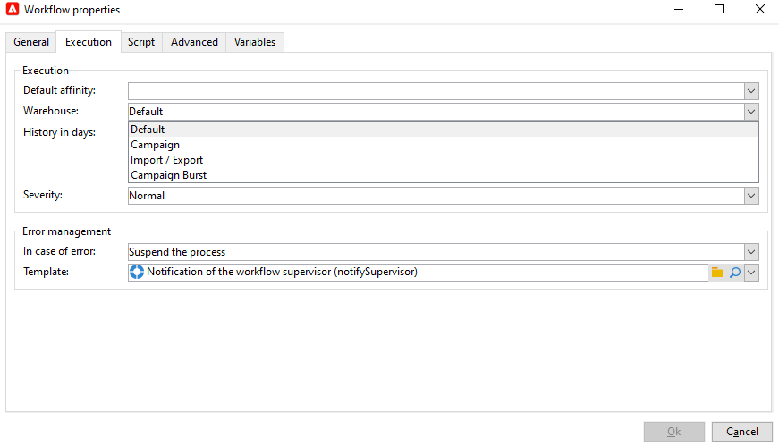

# 워크플로 시작{#gs-with-workflows}

강력한 마케팅 캠페인 자동화 기능을 활용하도록 Campaign을 구성합니다.

다음을 설정할 수 있습니다.

* 워크플로우
* 반복 캠페인
* 엔드 투 엔드 유효성 검사 주기
* 경고
* 자동 보고서 전송
* 트리거된 이벤트

## 워크플로 디자인 및 사용 {#gs-ac-wf}

Adobe Campaign 워크플로우를 사용하여 세그먼트 만들기, 메시지 준비에서 게재에 이르기까지 마케팅 캠페인의 모든 측면에 대한 속도와 규모를 개선합니다.

워크플로우를 디자인하는 방법 알아보기 [엔드 투 엔드 활용 사례](#end-to-end-uc).

다음 페이지에서 워크플로우 사용자 인터페이스 및 실행에 대해 자세히 알아보십시오.

* [워크플로우 시작](https://experienceleague.adobe.com/docs/campaign/automation/workflows/introduction/build-a-workflow.html?lang=ko)

* [워크플로우 모범 사례](https://experienceleague.adobe.com/docs/campaign/automation/workflows/introduction/workflow-best-practices.html)

* [기본 제공 기술 워크플로우](https://experienceleague.adobe.com/docs/campaign/automation/workflows/introduction/wf-type/technical-workflows.html)

* [워크플로우 실행 모니터링](https://experienceleague.adobe.com/docs/campaign/automation/workflows/monitoring-workflows/monitor-workflow-execution.html)

* [마케팅 캠페인 워크플로우에서 대상자 만들기](https://experienceleague.adobe.com/docs/campaign/automation/campaign-orchestration/marketing-campaign-target.html?lang=ko)

## 워크플로우 활동 {#wf-activities}

에서 사용 가능한 워크플로우 활동에 대해 자세히 알아보십시오. [이 섹션](https://experienceleague.adobe.com/docs/campaign/automation/workflows/wf-activities/activities.html?lang=ko)

워크플로우 활동은 범주별로 그룹화됩니다. 네 가지 활동 카테고리를 사용할 수 있습니다.

* [타겟팅 활동](https://experienceleague.adobe.com/docs/campaign/automation/workflows/wf-activities/targeting-activities/targeting-activities.html): 쿼리, 목록 읽기, 데이터 보강, 결합 등
* [흐름 제어 활동](https://experienceleague.adobe.com/docs/campaign/automation/workflows/wf-activities/flow-control-activities/flow-control-activities.html): 스케줄러, 포크, 경고, 외부 신호 등
* [작업 활동](https://experienceleague.adobe.com/docs/campaign/automation/workflows/wf-activities/action-activities/action-activities.html): 크로스 채널 게재, JavaScript 코드, CRM 활동, 업데이트 집계 등
* [이벤트 활동](https://experienceleague.adobe.com/docs/campaign/automation/workflows/wf-activities/event-activities/event-activities.html): 파일 전송, 웹 다운로드 등

### 데이터 소스 활동 변경 {#change-data-source-activity}

다음 **[!UICONTROL Change data source]** 활동을 사용하면 워크플로우의 데이터 소스를 변경할 수 있습니다 **[!UICONTROL Working table]**. 이렇게 하면 FDA, FFDA 및 로컬 데이터베이스와 같은 다양한 데이터 소스에서 데이터를 보다 유연하게 관리할 수 있습니다.

다음 **[!UICONTROL Working table]** Adobe Campaign 워크플로우에서 데이터를 처리하고 워크플로우 활동과 데이터를 공유할 수 있습니다.
기본적으로 **[!UICONTROL Working table]** 는 쿼리하는 데이터의 소스와 동일한 데이터베이스에 생성됩니다.

예를 들어 **[!UICONTROL Profiles]** 클라우드 데이터베이스에 저장된 테이블에는 **[!UICONTROL Working table]** 동일한 클라우드 데이터베이스에서.
이를 변경하려면 다음을 추가할 수 있습니다. **[!UICONTROL Change Data Source]** 활동에 대해 다른 데이터 소스 선택 **[!UICONTROL Working table]**.

를 사용할 때는 **[!UICONTROL Change Data Source]** 활동을 계속하려면 클라우드 데이터베이스로 다시 전환해야 합니다.

을(를) 사용하려면 **[!UICONTROL Change Data Source]** 활동:

1. 워크플로우를 만듭니다.

1. 을(를) 사용하여 타겟팅된 수신자 쿼리 **[!UICONTROL Query]** 활동.

   에 대한 자세한 내용은 **[!UICONTROL Query]** 활동. 참조: [이 페이지](https://experienceleague.adobe.com/docs/campaign/automation/workflows/wf-activities/targeting-activities/query.html).

1. 다음에서 **[!UICONTROL Targeting]** 탭, 추가 **[!UICONTROL Change data source]** 활동을 선택한 다음 두 번 클릭하여 선택합니다. **[!UICONTROL Default data source]**.

   그러면 쿼리 결과가 포함된 작업 테이블이 기본 PostgreSQL 데이터베이스로 이동됩니다.

1. 다음에서 **[!UICONTROL Actions]** 탭, 드래그 앤 드롭 **[!UICONTROL JavaScript code]** 작업 테이블에서 단일 작업을 수행하는 활동.

   에 대한 자세한 내용은 **[!UICONTROL JavaScript code]** 활동. 참조: [이 페이지](https://experienceleague.adobe.com/docs/campaign/automation/workflows/wf-activities/action-activities/sql-code-and-javascript-code.html).

1. 다른 항목 추가 **[!UICONTROL Change data source]** 활동을 클라우드 데이터베이스로 다시 전환합니다.

   활동을 두 번 클릭하고 다음을 선택합니다. **[!UICONTROL Active FDA external account]** 그런 다음 해당 외부 계정을 만듭니다.

1. 이제 워크플로우를 시작할 수 있습니다.

## 가상 웨어하우스 관리 {#warehouse}

워크플로우를 만든 후 다음을 사용하여 추가 옵션에 액세스할 수 있습니다. **[!UICONTROL Properties]** 추가 구성을 위한 단추

자세히 알아보기 **워크플로우 속성** 위치: [이 페이지](https://experienceleague.adobe.com/docs/campaign/automation/workflows/advanced-management/workflow-properties.html).

다음에서 **[!UICONTROL Execution]** 워크플로우 탭 **[!UICONTROL Properties]**, 워크플로우를 다른 웨어하우스에 연결하고 워크로드 관리를 최적화하도록 선택할 수 있습니다. 에 대한 자세한 내용 **웨어하우스**&#x200B;을(를) 참조하십시오. [Snowflake 설명서](https://docs.snowflake.com/en/user-guide/warehouses-overview.html){target="_blank"}.

워크플로우의 목적에 따라 다음 세 가지 웨어하우스 중에서 선택할 수 있습니다. **[!UICONTROL Warehouse]** 드롭다운:

* **[!UICONTROL Default]** / **[!UICONTROL Campaign]**: 새 워크플로우를 만들 때 기본적으로 설정됩니다.

* **[!UICONTROL Import / Export]**: 활동의 성능을 최적화하려면 가져오기 또는 내보내기 워크플로우로 설정해야 합니다.

* **[!UICONTROL Campaign Burst]**: 게재 처리 시간을 최적화하려면 캠페인 또는 게재 워크플로우로 설정해야 합니다.

>[!NOTE]
>
>다음 **[!UICONTROL System]** warehouse는 기본 제공 워크플로우에 대해서만 설정됩니다.

## 반복 캠페인 설정

워크플로우를 실행할 때마다 반복 워크플로우를 디자인하고 새 게재 인스턴스를 만듭니다. 예를 들어 워크플로우가 일주일에 한 번 실행되도록 디자인되면 1년 후 52회 게재가 됩니다. 즉, 로그가 각 게재 인스턴스에 의해 구분됩니다.

에서 반복 캠페인을 만드는 방법 알아보기 [이 페이지](https://experienceleague.adobe.com/docs/campaign/automation/campaign-orchestration/recurring-periodic-campaigns.html?lang=ko)

## 트리거 이벤트 활용

Campaign 트랜잭션 메시지를 사용하여 정보 시스템에서 트리거된 이벤트에서 생성된 메시지를 자동화합니다. 이러한 트랜잭션 메시지는 예를 들어 송장, 주문 확인, 배송 확인, 암호 변경, 제품 불가능 알림, 계정 명세서 또는 웹 사이트 계정 생성일 수 있습니다. 이러한 메시지는 이메일, SMS 또는 푸시 알림을 통해 개별적으로 또는 일괄적으로 전송할 수 있습니다.

에서 트랜잭션 메시지 기능에 대해 자세히 알아봅니다. [이 섹션](../send/transactional.md).

Adobe Campaign 및 Adobe Analytics을 연결하여 사용자 작업을 검색하고 거의 실시간으로 개인화된 메시지를 전송합니다.

에서 Campaign을 다른 솔루션과 통합하는 방법을 알아봅니다. [이 섹션](../start/connect.md)

## 워크플로 전체 사용 사례{#end-to-end-uc}

이 섹션에서는 Campaign 워크플로우 기능을 활용하는 다양한 사용 사례를 살펴볼 수 있습니다.

### 게재 {#deliveries}

* [생일 이메일 보내기](https://experienceleague.adobe.com/docs/campaign/automation/workflows/use-cases/deliveries/send-a-birthday-email.html?lang=ko)

  이 사용 사례에서는 생일 당일 수신자 목록에 반복 이메일 전송을 계획하는 방법을 제공합니다.

* [게재 콘텐츠 로드](https://experienceleague.adobe.com/docs/campaign/automation/workflows/use-cases/deliveries/load-delivery-content.html)
게재 콘텐츠를 원격 서버에 있는 HTML 파일에서 사용할 수 있으면 이 콘텐츠를 Adobe Campaign 게재에 쉽게 로드할 수 있습니다.

* [크로스 채널 게재 워크플로우](https://experienceleague.adobe.com/docs/campaign/automation/workflows/use-cases/deliveries/cross-channel-delivery-workflow.html)
크로스 채널 게재 워크플로우를 빌드하는 방법을 알아봅니다. 목표는 데이터베이스의 수신자로부터 대상을 다른 그룹으로 세분하고 첫 번째 그룹에는 전자 메일을 보내고 다른 그룹에는 SMS를 보내는 것입니다.

* [사용자 정의 날짜 필드를 사용한 전자 메일 강화](https://experienceleague.adobe.com/docs/campaign/automation/workflows/use-cases/deliveries/email-enrichment-with-custom-date-fields.html)
이번 달 생일을 축하하는 프로필에 사용자 정의 데이터 필드가 포함된 이메일을 보내는 방법을 알아봅니다. 이메일에는 생일 전후 1주일 동안 사용할 수 있는 쿠폰이 포함됩니다.

Campaign v7 설명서의 다음 페이지:

* [자동 콘텐츠 작성, 편집 및 게시](https://experienceleague.adobe.com/docs/campaign-classic/using/sending-messages/content-management/automating-via-workflows.html){target="_blank"}
Campaign 콘텐츠 관리 추가 기능을 사용하여 콘텐츠 블록 만들기 및 게재를 자동화하는 방법을 알아봅니다.

* [A/B 테스트](https://experienceleague.adobe.com/docs/campaign-classic/using/sending-messages/a-b-testing/use-case/a-b-testing-use-case.html){target="_blank"}
타겟팅 워크플로우를 통해 두 개의 이메일 게재 콘텐츠를 비교하는 방법을 알아봅니다. 메시지와 텍스트는 두 게재에서 동일합니다. 레이아웃만 변경됩니다. 대상 모집단은 두 개의 테스트 그룹과 나머지 모집단, 이렇게 세 개로 나뉩니다. 다른 버전의 게재가 각 테스트 그룹으로 전송됩니다.

### 모니터링 {#monitoring}

* [목록으로 보고서 보내기](https://experienceleague.adobe.com/docs/campaign/automation/workflows/use-cases/monitoring/send-a-report-to-a-list.html)
PDF 형식으로 월별 내장 추적 지표 보고서를 생성하여 Campaign 운영자 목록으로 보내는 방법을 알아봅니다.

* [워크플로우 관리](https://experienceleague.adobe.com/docs/campaign/automation/workflows/use-cases/monitoring/workflow-supervision.html)
&quot;일시 중지됨&quot;, &quot;중지됨&quot; 또는 &quot;오류 있음&quot;인 워크플로 세트의 상태를 모니터링할 수 있는 워크플로를 만드는 방법을 알아봅니다.

* [운영자에게 개인화된 경고 보내기](https://experienceleague.adobe.com/docs/campaign/automation/workflows/use-cases/monitoring/send-alerts-to-operators.html)
뉴스레터를 열었지만 포함된 링크를 클릭하지 않은 프로필의 이름이 포함된 운영자에게 경고를 보내는 방법을 알아봅니다.

### 데이터 관리 {#management}

* [데이터 업데이트 조정](https://experienceleague.adobe.com/docs/campaign/automation/workflows/use-cases/data-management/coordinate-data-updates.html)
다른 업데이트 작업을 실행하기 전에 업데이트 프로세스가 종료되었는지 확인하는 방법을 알아봅니다. 이를 위해 인스턴스 변수를 설정하고 인스턴스가 실행 중인 경우 워크플로우 테스트를 통해 워크플로우 실행을 계속하고 업데이트를 수행할지 여부를 결정합니다.

* [요약 목록 만들기](https://experienceleague.adobe.com/docs/campaign/automation/workflows/use-cases/data-management/create-a-summary-list.html)
파일을 수집하고 몇 가지 다양한 기능을 수행한 후 요약 목록을 만들 수 있는 워크플로우를 만드는 방법을 알아봅니다. 이 예제는 스토어에서 구입한 연락처 목록을 기반으로 합니다.

* [데이터 강화](https://experienceleague.adobe.com/docs/campaign/automation/workflows/use-cases/data-management/enrich-data.html?lang=ko)
점수에 따라 최신 대회에 참가한 프로필에 개인화된 게재를 보내는 방법을 알아봅니다.

* [집계 사용](https://experienceleague.adobe.com/docs/campaign/automation/workflows/use-cases/data-management/using-aggregates.html)
데이터베이스에 추가된 마지막 수신자를 식별하는 방법을 알아봅니다.

* [증분 쿼리를 사용한 분기별 목록 업데이트](https://experienceleague.adobe.com/docs/campaign/automation/workflows/use-cases/designing-queries/quarterly-list-update.html)
증분 쿼리를 사용하여 수신자 목록을 자동으로 업데이트하는 방법을 알아봅니다.

* [반복 가져오기 워크플로우 설정](https://experienceleague.adobe.com/docs/campaign/automation/workflows/use-cases/data-management/recurring-import-workflow.html)
Adobe Campaign 데이터베이스의 CRM에서 가져온 프로필을 가져오는 데 다시 사용할 수 있는 워크플로우를 디자인하는 방법을 알아봅니다.

### 타겟팅 {#designing-queries}

* [수신자 테이블 쿼리](https://experienceleague.adobe.com/docs/campaign/automation/workflows/use-cases/designing-queries/querying-recipient-table.html)
이메일 도메인이 &quot;orange.co.uk&quot;이고 London에 거주하지 않는 수신자의 이름과 이메일을 복구하는 방법을 알아봅니다.

* [쿼리 게재 정보](https://experienceleague.adobe.com/docs/campaign/automation/workflows/use-cases/designing-queries/query-delivery-info.html)
프로필 동작을 검색하기 위해 게재 정보에 대한 쿼리를 정의하는 방법을 알아봅니다.

* [집계 계산](https://experienceleague.adobe.com/docs/campaign/automation/workflows/use-cases/designing-queries/compute-aggregates.html)
런던에 거주하는 프로필 수를 성별에 따라 계산하는 방법을 알아봅니다.

* [다대다 관계를 사용하여 쿼리](https://experienceleague.adobe.com/docs/campaign/automation/workflows/use-cases/designing-queries/query-many-to-many-relationship.html)
지난 7일 동안 연락이 없는 프로필을 찾는 방법을 알아봅니다.

* [쿼리에서 인스턴스 변수 호출](https://experienceleague.adobe.com/docs/campaign/automation/workflows/advanced-management/javascript-scripts-and-templates.html)
인스턴스 변수를 사용하여 모집단에 적용할 분할 비율을 동적으로 계산하는 방법에 대해 알아봅니다.

<!--
### Change data source activity {#data-source-uc}

The **[!UICONTROL Change data source]** activity allows you to change the data source of a workflow **[!UICONTROL Working table]**. 

In this use case, learn how to use the **[!UICONTROL Change data source]** activity to perform unitary operations to insert or update information to the recipient table.

1. Create a workflow and add a **[!UICONTROL Start]** activity.

1. Query your targeted recipients from the NmsRecipient table with a **[!UICONTROL Query]** activity. 

    For more information on the **[!UICONTROL Query]** activity, refer to the [Query](https://experienceleague.adobe.com/docs/campaign-classic/using/automating-with-workflows/targeting-activities/query.html#creating-a-query) page in Campaign Classic V7 documentation.

1. 

1. From the **[!UICONTROL Targeting]** tab, add a **[!UICONTROL Change data source]** activity and double-click it to select **[!UICONTROL Default data source]**.
    
    The working table, which contains the result of your query, is then moved to the default PostgreSQL database.

1. From the **[!UICONTROL Actions]** tab, drag and drop a **[!UICONTROL JavaScript code]** activity to perform unitary operations on the working table.

1. Add another **[!UICONTROL Change data source]** activity to revert back to the Cloud database. 
    
    Double-click your activity and select **[!UICONTROL Active FDA external account]** then the corresponding external account.

1. Add an **[!UICONTROL End]** activity and start your workflow.
-->

